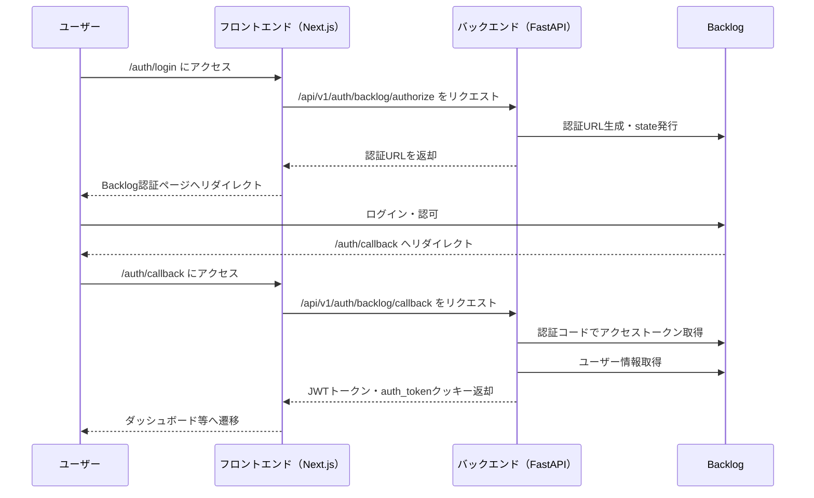

# 認証システムの実装詳細（ステップバイステップ解説）

## 概要

このドキュメントでは、Team Insight アプリケーションの認証システムについて、図表とともにステップバイステップで解説します。

---

## 認証フロー全体像

以下は、Backlog OAuth2.0 を利用した認証フローの全体像です。



---

## ステップバイステップ解説

### 1. ログイン開始

- ユーザーが`/auth/login`にアクセス
- フロントエンドがバックエンドの`/api/v1/auth/backlog/authorize`を呼び出す
- バックエンドは Backlog 認証 URL と CSRF 対策用の state を生成し、フロントエンドに返す
- フロントエンドはユーザーを Backlog の認証ページにリダイレクト

### 2. Backlog 認証・コールバック

- ユーザーが Backlog で認証・許可
- Backlog が`/auth/callback`にリダイレクト
- フロントエンドが`/api/v1/auth/backlog/callback`をバックエンドにリクエスト
- バックエンドは state を検証し、認証コードでアクセストークンを取得
- ユーザー情報を Backlog API から取得

### 3. JWT トークン発行・クッキーセット

- バックエンドが JWT トークンを生成
- レスポンスで`auth_token`クッキー（HttpOnly, SameSite=Lax）をセット
- フロントエンドは localStorage にも JWT を保存（必要に応じて）

### 4. サーバーサイド認証ガード

- Next.js の`middleware.ts`がリクエストごとに`auth_token`クッキーを検証
- 有効なトークンがなければ`/auth/login`にリダイレクト
- 有効な場合のみダッシュボード等の保護ページを表示

---

## 主要なポイント

- **CSRF 対策**: state パラメータを用いてリプレイ攻撃を防止
- **セキュリティ**: JWT は HttpOnly クッキーで管理し、XSS リスクを低減
- **サーバーサイドガード**: middleware でクッキーを検証し、未認証アクセスを遮断

---

## エラーパターン例

| シナリオ                     | 原因例                    | 対応策                     |
| ---------------------------- | ------------------------- | -------------------------- |
| ログイン後リダイレクトループ | クッキー未セット/期限切れ | クッキー設定・有効期限確認 |
| 401 Unauthorized             | JWT 不正/期限切れ         | 再ログイン・トークン再発行 |
| 400 Bad Request              | state 不一致              | 認証フロー最初からやり直し |

---

## 参考：カラーパレット例（Backlog グリーン）

```css
:root {
  --primary: 92 49% 54%; /* #7AC143 */
  --primary-foreground: 0 0% 100%;
  --secondary: 92 30% 90%;
  --secondary-foreground: 92 49% 54%;
  --accent: 92 49% 54%;
  --accent-foreground: 0 0% 100%;
}
```

---

## 補足

- 環境変数やセキュリティ設定の詳細は`README.md`や`.env.example`を参照してください。
- 実装例や詳細な API 仕様はリポジトリ内の該当ファイルを参照してください。
