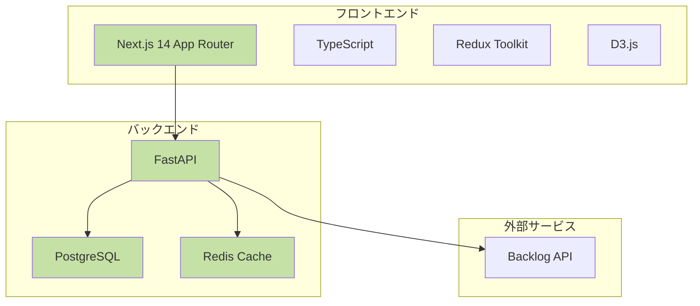
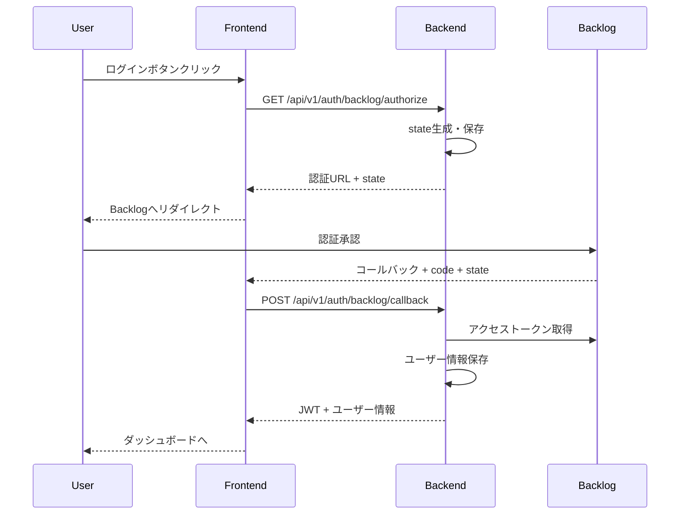
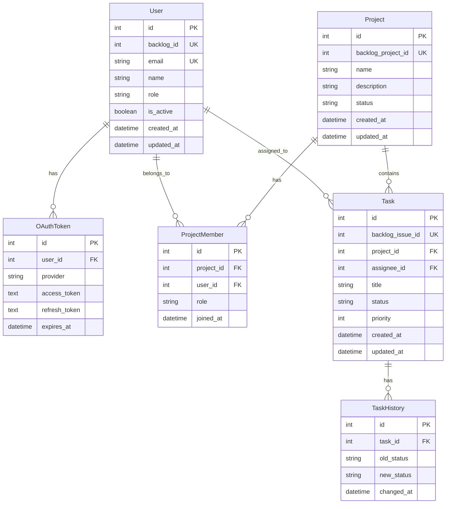

# Team Insight 実装ガイド

## 目次

1. [システム概要とアーキテクチャ](#1-システム概要とアーキテクチャ)
2. [開発環境構築](#2-開発環境構築)
3. [認証システムの実装](#3-認証システムの実装)
4. [キャッシュシステムの実装](#4-キャッシュシステムの実装)
5. [フロントエンド実装](#5-フロントエンド実装)
6. [バックエンド実装](#6-バックエンド実装)
7. [データベース設計と実装](#7-データベース設計と実装)
8. [API 設計と実装](#8-api設計と実装)
9. [ダッシュボード機能の実装](#9-ダッシュボード機能の実装)
10. [テストとデプロイ](#10-テストとデプロイ)

---

## 1. システム概要とアーキテクチャ

### 1.1 Team Insight とは

Team Insight は、Backlog を利用する開発チームの生産性を可視化するプラットフォームです。チームの作業効率を測定・分析し、ボトルネックを特定して改善を促進します。

### 1.2 なぜこのアーキテクチャなのか



**技術選定の理由：**

- **Next.js 14**: サーバーサイドレンダリングと SEO 対応、App Router による直感的なルーティング
- **FastAPI**: 高速で型安全、自動 API ドキュメント生成
- **PostgreSQL**: リレーショナルデータの複雑な分析に適している
- **Redis**: 高速なキャッシュで Backlog API の負荷を軽減

### 1.3 プロジェクト構造

```
team-insight/
├── backend/                 # バックエンドアプリケーション
│   ├── app/
│   │   ├── api/v1/         # APIエンドポイント
│   │   ├── core/           # コア機能（認証、キャッシュ、設定）
│   │   ├── models/         # データベースモデル
│   │   ├── schemas/        # Pydanticスキーマ
│   │   └── services/       # ビジネスロジック
│   └── migrations/         # データベースマイグレーション
├── frontend/               # フロントエンドアプリケーション
│   └── src/
│       ├── app/            # Next.js App Router
│       ├── components/     # Reactコンポーネント
│       ├── hooks/          # カスタムフック
│       └── services/       # APIクライアント
└── infrastructure/         # Docker設定
```

---

## 2. 開発環境構築

### 2.1 必要なツール

- Docker & Docker Compose (必須)
- Git
- VSCode (推奨)

### 2.2 ステップ 1: リポジトリのクローンと環境変数設定

```bash
# リポジトリをクローン
git clone https://github.com/your-org/team-insight.git
cd team-insight

# バックエンド環境変数を作成
cat > backend/.env << EOF
# データベース設定
DATABASE_URL=postgresql://postgres:postgres@db:5432/team_insight
DATABASE_HOST=db
DATABASE_PORT=5432
DATABASE_USER=postgres
DATABASE_PASSWORD=postgres
DATABASE_NAME=team_insight

# Redis設定
REDIS_URL=redis://redis:6379/0
CACHE_DEFAULT_EXPIRE=300

# セキュリティ設定
SECRET_KEY=your-secret-key-here-change-in-production
ALGORITHM=HS256
ACCESS_TOKEN_EXPIRE_MINUTES=30

# Backlog OAuth設定（Backlogの開発者設定から取得）
BACKLOG_CLIENT_ID=your-backlog-client-id
BACKLOG_CLIENT_SECRET=your-backlog-client-secret
BACKLOG_REDIRECT_URI=http://localhost:3000/auth/callback
BACKLOG_SPACE_KEY=your-space-key

# CORS設定
ALLOWED_ORIGINS=["http://localhost:3000"]

# 開発環境設定
DEBUG=True
ENVIRONMENT=development
EOF

# フロントエンド環境変数を作成
cat > frontend/.env.local << EOF
# API設定
NEXT_PUBLIC_API_URL=http://localhost:8000/api/v1
NEXT_PUBLIC_APP_URL=http://localhost:3000

# 認証設定
NEXT_PUBLIC_AUTH_COOKIE_NAME=team-insight-token
EOF
```

### 2.3 ステップ 2: Docker 環境の起動

```bash
# Docker Composeで全サービスを起動
docker-compose up -d

# ログを確認
docker-compose logs -f

# データベースマイグレーションを実行
docker-compose exec backend alembic upgrade head
```

### 2.4 ステップ 3: 動作確認

以下の URL にアクセスして動作を確認：

- フロントエンド: http://localhost:3000
- バックエンド API: http://localhost:8000
- API ドキュメント: http://localhost:8000/docs

---

## 3. 認証システムの実装

### 3.1 認証フローの概要

Team Insight は Backlog OAuth 2.0 を使用したシングルサインオン（SSO）を実装しています。



### 3.2 バックエンド実装

#### 認証エンドポイント（`backend/app/api/v1/auth.py`）

```python
from fastapi import APIRouter, Depends, HTTPException, Response
from sqlalchemy.orm import Session
from app.db.session import get_db
from app.services.backlog_oauth import BacklogOAuthService
from app.core.security import create_access_token
from app.models.user import User
from app.models.auth import OAuthState
import secrets
from datetime import datetime, timedelta

router = APIRouter()

@router.get("/backlog/authorize")
async def authorize(db: Session = Depends(get_db)):
    """
    Backlog OAuth認証を開始する

    なぜこの実装？
    - stateパラメータでCSRF攻撃を防止
    - stateをDBに保存して後で検証
    - 有効期限を設定してセキュリティを強化
    """
    # ランダムなstateを生成（CSRF対策）
    state = secrets.token_urlsafe(32)

    # stateをDBに保存
    oauth_state = OAuthState(
        state=state,
        expires_at=datetime.utcnow() + timedelta(minutes=10)
    )
    db.add(oauth_state)
    db.commit()

    # Backlog認証URLを生成
    oauth_service = BacklogOAuthService()
    auth_url = oauth_service.get_authorization_url(state)

    return {
        "authorization_url": auth_url,
        "state": state
    }

@router.post("/backlog/callback")
async def callback(
    code: str,
    state: str,
    response: Response,
    db: Session = Depends(get_db)
):
    """
    Backlog OAuth認証のコールバック処理

    なぜこの実装？
    - state検証でCSRF攻撃を防止
    - ユーザー情報を取得してDBに保存
    - JWTトークンを生成してCookieに設定
    """
    # state検証
    oauth_state = db.query(OAuthState).filter(
        OAuthState.state == state,
        OAuthState.expires_at > datetime.utcnow()
    ).first()

    if not oauth_state:
        raise HTTPException(status_code=400, detail="Invalid or expired state")

    # 認証コードをアクセストークンに交換
    oauth_service = BacklogOAuthService()
    token_data = await oauth_service.exchange_code_for_token(code)

    # ユーザー情報を取得
    user_info = await oauth_service.get_user_info(token_data.access_token)

    # ユーザーをDBに保存/更新
    user = db.query(User).filter(User.backlog_id == user_info.id).first()
    if not user:
        user = User(
            backlog_id=user_info.id,
            email=user_info.email,
            name=user_info.name,
            role="member"  # デフォルトロール
        )
        db.add(user)
    else:
        user.name = user_info.name
        user.email = user_info.email
        user.updated_at = datetime.utcnow()

    db.commit()

    # JWTトークンを生成
    access_token = create_access_token(data={"sub": str(user.id)})

    # Cookieに設定（HttpOnly, Secure）
    response.set_cookie(
        key="access_token",
        value=access_token,
        httponly=True,
        secure=False,  # 本番環境ではTrue
        samesite="lax",
        max_age=1800  # 30分
    )

    # stateを削除
    db.delete(oauth_state)
    db.commit()

    return {
        "access_token": access_token,
        "user": {
            "id": user.id,
            "email": user.email,
            "name": user.name,
            "role": user.role
        }
    }
```

#### Backlog OAuth サービス（`backend/app/services/backlog_oauth.py`）

```python
import aiohttp
from app.core.config import settings

class BacklogOAuthService:
    """Backlog OAuth 2.0の処理を担当"""

    def __init__(self):
        self.client_id = settings.BACKLOG_CLIENT_ID
        self.client_secret = settings.BACKLOG_CLIENT_SECRET
        self.redirect_uri = settings.BACKLOG_REDIRECT_URI
        self.space_key = settings.BACKLOG_SPACE_KEY
        self.base_url = f"https://{self.space_key}.backlog.com"

    def get_authorization_url(self, state: str) -> str:
        """認証URLを生成"""
        params = {
            "response_type": "code",
            "client_id": self.client_id,
            "redirect_uri": self.redirect_uri,
            "state": state,
            "scope": "read write"
        }
        query_string = "&".join([f"{k}={v}" for k, v in params.items()])
        return f"{self.base_url}/OAuth2AccessRequest.action?{query_string}"

    async def exchange_code_for_token(self, code: str):
        """認証コードをアクセストークンに交換"""
        async with aiohttp.ClientSession() as session:
            data = {
                "grant_type": "authorization_code",
                "code": code,
                "client_id": self.client_id,
                "client_secret": self.client_secret,
                "redirect_uri": self.redirect_uri
            }

            async with session.post(
                f"{self.base_url}/api/v2/oauth2/token",
                data=data
            ) as response:
                if response.status != 200:
                    raise Exception("Failed to exchange code for token")

                return await response.json()

    async def get_user_info(self, access_token: str):
        """ユーザー情報を取得"""
        async with aiohttp.ClientSession() as session:
            headers = {"Authorization": f"Bearer {access_token}"}

            async with session.get(
                f"{self.base_url}/api/v2/users/myself",
                headers=headers
            ) as response:
                if response.status != 200:
                    raise Exception("Failed to get user info")

                return await response.json()
```

### 3.3 フロントエンド実装

#### 認証フック（`frontend/src/hooks/useAuth.ts`）

```typescript
import { useEffect } from "react";
import { useDispatch, useSelector } from "react-redux";
import { useRouter } from "next/navigation";
import { RootState } from "@/store";
import { setUser, clearUser } from "@/store/slices/authSlice";
import { authService } from "@/services/auth.service";

export const useAuth = () => {
  const dispatch = useDispatch();
  const router = useRouter();
  const { user, isAuthenticated } = useSelector(
    (state: RootState) => state.auth
  );

  const login = async () => {
    try {
      // 認証URLを取得
      const { authorization_url } = await authService.getAuthorizationUrl();
      // Backlogへリダイレクト
      window.location.href = authorization_url;
    } catch (error) {
      console.error("Login failed:", error);
      throw error;
    }
  };

  const handleCallback = async (code: string, state: string) => {
    try {
      // コールバック処理
      const response = await authService.handleCallback(code, state);
      // ユーザー情報を保存
      dispatch(setUser(response.user));
      // ダッシュボードへリダイレクト
      router.push("/dashboard");
      return response;
    } catch (error) {
      console.error("Callback handling failed:", error);
      router.push("/auth/login?error=callback_failed");
      throw error;
    }
  };

  const logout = async () => {
    try {
      await authService.logout();
      dispatch(clearUser());
      router.push("/");
    } catch (error) {
      console.error("Logout failed:", error);
    }
  };

  return {
    user,
    isAuthenticated,
    login,
    logout,
    handleCallback,
  };
};
```

#### 認証コールバックページ（`frontend/src/app/auth/callback/page.tsx`）

```typescript
"use client";

import { useEffect, useState } from "react";
import { useSearchParams } from "next/navigation";
import { useAuth } from "@/hooks/useAuth";
import { LoadingSpinner } from "@/components/ui/loading-spinner";
import { Alert } from "@/components/ui/alert";

export default function AuthCallbackPage() {
  const searchParams = useSearchParams();
  const { handleCallback } = useAuth();
  const [error, setError] = useState<string | null>(null);

  useEffect(() => {
    const processCallback = async () => {
      const code = searchParams.get("code");
      const state = searchParams.get("state");
      const error = searchParams.get("error");

      if (error) {
        setError("認証がキャンセルされました");
        return;
      }

      if (!code || !state) {
        setError("認証パラメータが不足しています");
        return;
      }

      try {
        await handleCallback(code, state);
      } catch (err) {
        setError("認証処理中にエラーが発生しました");
      }
    };

    processCallback();
  }, [searchParams, handleCallback]);

  if (error) {
    return (
      <div className="flex items-center justify-center min-h-screen">
        <Alert variant="destructive">
          <h2 className="text-lg font-semibold">認証エラー</h2>
          <p>{error}</p>
          <a href="/auth/login" className="underline mt-2 inline-block">
            ログインページに戻る
          </a>
        </Alert>
      </div>
    );
  }

  return (
    <div className="flex items-center justify-center min-h-screen">
      <div className="text-center">
        <LoadingSpinner className="mx-auto mb-4" />
        <p className="text-lg">認証処理中...</p>
      </div>
    </div>
  );
}
```

---

## 4. キャッシュシステムの実装

### 4.1 なぜキャッシュが必要か

- Backlog API の呼び出し回数を削減（レート制限対策）
- レスポンス時間を 85-99%短縮
- データベース負荷の軽減

### 4.2 キャッシュデコレータの実装

#### Redis クライアント（`backend/app/core/redis_client.py`）

```python
import redis
from typing import Optional
from app.core.config import settings

class RedisClient:
    """Redisクライアントのシングルトン実装"""

    def __init__(self):
        self._redis: Optional[redis.Redis] = None
        self._pool: Optional[redis.ConnectionPool] = None

    async def connect(self) -> None:
        """Redis接続を初期化"""
        if not self._redis:
            self._pool = redis.ConnectionPool.from_url(
                settings.REDIS_URL,
                max_connections=20,
                decode_responses=True
            )
            self._redis = redis.Redis(connection_pool=self._pool)

    async def disconnect(self) -> None:
        """Redis接続をクリーンアップ"""
        if self._pool:
            self._pool.disconnect()

    async def get(self, key: str) -> Optional[str]:
        """キャッシュから値を取得"""
        if not self._redis:
            await self.connect()
        return self._redis.get(key)

    async def set(self, key: str, value: str, expire: int = 300) -> None:
        """キャッシュに値を設定"""
        if not self._redis:
            await self.connect()
        self._redis.setex(key, expire, value)

    async def delete(self, pattern: str) -> int:
        """パターンに一致するキーを削除"""
        if not self._redis:
            await self.connect()

        keys = self._redis.keys(pattern)
        if keys:
            return self._redis.delete(*keys)
        return 0

# シングルトンインスタンス
redis_client = RedisClient()
```

#### キャッシュデコレータ（`backend/app/core/cache.py`）

```python
import json
import functools
from typing import Optional, Callable
from app.core.redis_client import redis_client

def cache(
    key_prefix: str,
    expire: int = 300,
    key_builder: Optional[Callable] = None
):
    """
    APIレスポンスをキャッシュするデコレータ

    使用例:
    @cache(key_prefix="projects", expire=600)
    async def get_projects(user_id: int):
        return fetch_projects_from_db(user_id)
    """
    def decorator(func):
        @functools.wraps(func)
        async def wrapper(*args, **kwargs):
            # キャッシュキーを生成
            if key_builder:
                cache_key = key_builder(*args, **kwargs)
            else:
                # デフォルトのキー生成
                cache_key = f"{key_prefix}:{':'.join(map(str, args))}"
                if kwargs:
                    cache_key += f":{':'.join(f'{k}={v}' for k, v in sorted(kwargs.items()))}"

            # キャッシュから取得を試行
            cached_value = await redis_client.get(cache_key)
            if cached_value:
                return json.loads(cached_value)

            # キャッシュミスの場合は関数を実行
            result = await func(*args, **kwargs)

            # 結果をキャッシュに保存
            await redis_client.set(
                cache_key,
                json.dumps(result, default=str),
                expire
            )

            return result

        # キャッシュ無効化メソッドを追加
        async def invalidate(pattern: str):
            """指定パターンのキャッシュを無効化"""
            await redis_client.delete(f"{key_prefix}:{pattern}")

        wrapper.invalidate = invalidate
        return wrapper

    return decorator
```

### 4.3 キャッシュの使用例

```python
# backend/app/api/v1/projects.py
from app.core.cache import cache

@router.get("/")
@cache(key_prefix="projects:list", expire=300)
async def get_projects(
    skip: int = 0,
    limit: int = 10,
    current_user: User = Depends(get_current_user),
    db: Session = Depends(get_db)
):
    """プロジェクト一覧を取得（キャッシュ付き）"""
    # この処理は自動的にキャッシュされる
    projects = db.query(Project).offset(skip).limit(limit).all()
    return {"projects": projects, "total": len(projects)}

@router.post("/")
async def create_project(
    project: ProjectCreate,
    current_user: User = Depends(get_current_user),
    db: Session = Depends(get_db)
):
    """プロジェクトを作成"""
    # プロジェクト作成処理...

    # キャッシュを無効化
    await get_projects.invalidate("*")

    return new_project
```

---

## 5. フロントエンド実装

### 5.1 Next.js App Router の基本構造

```
frontend/src/app/
├── layout.tsx              # ルートレイアウト
├── page.tsx               # ホームページ
├── auth/
│   ├── login/
│   │   └── page.tsx       # ログインページ
│   └── callback/
│       └── page.tsx       # 認証コールバック
├── dashboard/
│   ├── layout.tsx         # ダッシュボード共通レイアウト
│   ├── page.tsx           # ダッシュボードホーム
│   ├── personal/
│   │   └── page.tsx       # 個人ダッシュボード
│   └── project/
│       └── [id]/
│           └── page.tsx   # プロジェクト詳細
└── api/                   # API設定
```

### 5.2 ルートレイアウトの実装

```typescript
// app/layout.tsx
import { Inter } from "next/font/google";
import { Providers } from "./providers";
import "./globals.css";

const inter = Inter({ subsets: ["latin"] });

export const metadata = {
  title: "Team Insight",
  description: "チームの生産性を可視化",
};

export default function RootLayout({
  children,
}: {
  children: React.ReactNode;
}) {
  return (
    <html lang="ja">
      <body className={inter.className}>
        <Providers>{children}</Providers>
      </body>
    </html>
  );
}
```

### 5.3 Providers の実装

```typescript
// app/providers.tsx
"use client";

import { Provider } from "react-redux";
import { store } from "@/store";
import { ErrorBoundary } from "@/components/ErrorBoundary";

export function Providers({ children }: { children: React.ReactNode }) {
  return (
    <Provider store={store}>
      <ErrorBoundary>{children}</ErrorBoundary>
    </Provider>
  );
}
```

### 5.4 コンポーネント実装例

#### KPI サマリーカード

```typescript
// components/dashboard/KpiSummary.tsx
import { Card, CardContent, CardHeader, CardTitle } from "@/components/ui/card";
import { ArrowUpIcon, ArrowDownIcon } from "@radix-ui/react-icons";

interface KpiCardProps {
  title: string;
  value: string | number;
  change: number;
  changeLabel: string;
}

export function KpiCard({ title, value, change, changeLabel }: KpiCardProps) {
  const isPositive = change >= 0;

  return (
    <Card className="hover:shadow-lg transition-shadow">
      <CardHeader className="flex flex-row items-center justify-between space-y-0 pb-2">
        <CardTitle className="text-sm font-medium">{title}</CardTitle>
      </CardHeader>
      <CardContent>
        <div className="text-2xl font-bold">{value}</div>
        <p className="text-xs text-muted-foreground flex items-center gap-1 mt-1">
          {isPositive ? (
            <ArrowUpIcon className="h-3 w-3 text-green-500" />
          ) : (
            <ArrowDownIcon className="h-3 w-3 text-red-500" />
          )}
          <span className={isPositive ? "text-green-500" : "text-red-500"}>
            {Math.abs(change)}%
          </span>
          <span>{changeLabel}</span>
        </p>
      </CardContent>
    </Card>
  );
}

// 使用例
export function KpiSummary({ data }) {
  return (
    <div className="grid gap-4 md:grid-cols-2 lg:grid-cols-4">
      <KpiCard
        title="完了タスク"
        value={data.completedTasks}
        change={data.completedTasksChange}
        changeLabel="前週比"
      />
      <KpiCard
        title="平均リードタイム"
        value={`${data.avgLeadTime}日`}
        change={data.leadTimeChange}
        changeLabel="前週比"
      />
      <KpiCard
        title="進行中タスク"
        value={data.inProgressTasks}
        change={data.inProgressChange}
        changeLabel="変化なし"
      />
      <KpiCard
        title="ブロック中"
        value={data.blockedTasks}
        change={data.blockedChange}
        changeLabel="前週比"
      />
    </div>
  );
}
```

### 5.5 D3.js チャートコンポーネント

```typescript
// components/dashboard/BottleneckChart.tsx
import { useEffect, useRef } from "react";
import * as d3 from "d3";

interface BottleneckData {
  status: string;
  avgDays: number;
  taskCount: number;
}

export function BottleneckChart({ data }: { data: BottleneckData[] }) {
  const svgRef = useRef<SVGSVGElement>(null);

  useEffect(() => {
    if (!svgRef.current || !data.length) return;

    const margin = { top: 20, right: 30, bottom: 40, left: 90 };
    const width = 600 - margin.left - margin.right;
    const height = 400 - margin.top - margin.bottom;

    // 既存のチャートをクリア
    d3.select(svgRef.current).selectAll("*").remove();

    const svg = d3
      .select(svgRef.current)
      .attr("width", width + margin.left + margin.right)
      .attr("height", height + margin.top + margin.bottom);

    const g = svg
      .append("g")
      .attr("transform", `translate(${margin.left},${margin.top})`);

    // スケールの設定
    const x = d3
      .scaleLinear()
      .domain([0, d3.max(data, (d) => d.avgDays) || 0])
      .range([0, width]);

    const y = d3
      .scaleBand()
      .domain(data.map((d) => d.status))
      .range([0, height])
      .padding(0.1);

    // カラースケール（ボトルネックは赤）
    const color = d3
      .scaleSequential()
      .domain([0, d3.max(data, (d) => d.avgDays) || 0])
      .interpolator(d3.interpolateReds);

    // バーの描画
    const bars = g
      .selectAll(".bar")
      .data(data)
      .enter()
      .append("rect")
      .attr("class", "bar")
      .attr("x", 0)
      .attr("y", (d) => y(d.status) || 0)
      .attr("width", 0)
      .attr("height", y.bandwidth())
      .attr("fill", (d) => color(d.avgDays));

    // アニメーション
    bars
      .transition()
      .duration(750)
      .attr("width", (d) => x(d.avgDays));

    // ツールチップ
    const tooltip = d3
      .select("body")
      .append("div")
      .attr("class", "tooltip")
      .style("opacity", 0)
      .style("position", "absolute")
      .style("background", "rgba(0, 0, 0, 0.8)")
      .style("color", "white")
      .style("padding", "8px")
      .style("border-radius", "4px")
      .style("font-size", "12px");

    bars
      .on("mouseover", function (event, d) {
        tooltip.transition().duration(200).style("opacity", 0.9);

        tooltip
          .html(
            `
        <strong>${d.status}</strong><br/>
        平均滞留時間: ${d.avgDays}日<br/>
        タスク数: ${d.taskCount}
      `
          )
          .style("left", event.pageX + 10 + "px")
          .style("top", event.pageY - 28 + "px");
      })
      .on("mouseout", function () {
        tooltip.transition().duration(500).style("opacity", 0);
      });

    // 軸の追加
    g.append("g")
      .attr("transform", `translate(0,${height})`)
      .call(d3.axisBottom(x))
      .append("text")
      .attr("x", width / 2)
      .attr("y", 35)
      .attr("fill", "#000")
      .style("text-anchor", "middle")
      .text("平均滞留時間（日）");

    g.append("g").call(d3.axisLeft(y));

    // クリーンアップ
    return () => {
      d3.select("body").selectAll(".tooltip").remove();
    };
  }, [data]);

  return (
    <div className="w-full overflow-x-auto">
      <svg ref={svgRef}></svg>
    </div>
  );
}
```

---

## 6. バックエンド実装

### 6.1 FastAPI アプリケーションの構成

```python
# backend/app/main.py
from fastapi import FastAPI, Request
from fastapi.middleware.cors import CORSMiddleware
from contextlib import asynccontextmanager
import time
import logging

from app.core.config import settings
from app.api.v1 import auth, projects, cache
from app.core.redis_client import redis_client

# ログ設定
logging.basicConfig(level=logging.INFO)
logger = logging.getLogger(__name__)

@asynccontextmanager
async def lifespan(app: FastAPI):
    """アプリケーションのライフサイクル管理"""
    # 起動時
    logger.info("Starting up Team Insight API...")
    await redis_client.connect()

    yield

    # シャットダウン時
    logger.info("Shutting down Team Insight API...")
    await redis_client.disconnect()

# FastAPIアプリケーションの作成
app = FastAPI(
    title="Team Insight API",
    description="チームの生産性を可視化するAPI",
    version="1.0.0",
    lifespan=lifespan
)

# CORS設定
app.add_middleware(
    CORSMiddleware,
    allow_origins=settings.ALLOWED_ORIGINS,
    allow_credentials=True,
    allow_methods=["*"],
    allow_headers=["*"],
)

# リクエスト処理時間の計測
@app.middleware("http")
async def add_process_time_header(request: Request, call_next):
    start_time = time.time()
    response = await call_next(request)
    process_time = time.time() - start_time
    response.headers["X-Processing-Time"] = str(process_time)
    return response

# APIルーターの登録
app.include_router(auth.router, prefix="/api/v1/auth", tags=["認証"])
app.include_router(projects.router, prefix="/api/v1/projects", tags=["プロジェクト"])
app.include_router(cache.router, prefix="/api/v1/cache", tags=["キャッシュ"])

# ヘルスチェック
@app.get("/health")
async def health_check():
    return {"status": "healthy", "timestamp": time.time()}
```

### 6.2 依存性注入の実装

```python
# backend/app/core/dependencies.py
from fastapi import Depends, HTTPException, status
from fastapi.security import HTTPBearer, HTTPAuthorizationCredentials
from jose import JWTError, jwt
from sqlalchemy.orm import Session

from app.db.session import SessionLocal
from app.core.config import settings
from app.models.user import User

security = HTTPBearer()

def get_db():
    """データベースセッションを取得"""
    db = SessionLocal()
    try:
        yield db
    finally:
        db.close()

async def get_current_user(
    credentials: HTTPAuthorizationCredentials = Depends(security),
    db: Session = Depends(get_db)
) -> User:
    """現在のユーザーを取得"""
    token = credentials.credentials

    try:
        payload = jwt.decode(
            token,
            settings.SECRET_KEY,
            algorithms=[settings.ALGORITHM]
        )
        user_id: str = payload.get("sub")
        if user_id is None:
            raise HTTPException(
                status_code=status.HTTP_401_UNAUTHORIZED,
                detail="Invalid authentication credentials"
            )
    except JWTError:
        raise HTTPException(
            status_code=status.HTTP_401_UNAUTHORIZED,
            detail="Invalid authentication credentials"
        )

    user = db.query(User).filter(User.id == int(user_id)).first()
    if user is None:
        raise HTTPException(
            status_code=status.HTTP_404_NOT_FOUND,
            detail="User not found"
        )

    return user

def require_admin(current_user: User = Depends(get_current_user)) -> User:
    """管理者権限を要求"""
    if not current_user.is_admin:
        raise HTTPException(
            status_code=status.HTTP_403_FORBIDDEN,
            detail="Admin access required"
        )
    return current_user
```

---

## 7. データベース設計と実装

### 7.1 ERD（Entity Relationship Diagram）



### 7.2 マイグレーションの実装

```python
# migrations/versions/001_create_initial_tables.py
from alembic import op
import sqlalchemy as sa

def upgrade():
    # team_insightスキーマを作成
    op.execute("CREATE SCHEMA IF NOT EXISTS team_insight")

    # usersテーブル
    op.create_table(
        'users',
        sa.Column('id', sa.Integer(), nullable=False),
        sa.Column('backlog_id', sa.Integer(), nullable=False),
        sa.Column('email', sa.String(255), nullable=False),
        sa.Column('name', sa.String(100), nullable=False),
        sa.Column('role', sa.Enum('admin', 'manager', 'member', 'viewer', name='userrole'), nullable=False),
        sa.Column('is_active', sa.Boolean(), nullable=False, server_default='true'),
        sa.Column('created_at', sa.DateTime(), nullable=False, server_default=sa.func.now()),
        sa.Column('updated_at', sa.DateTime(), nullable=False, server_default=sa.func.now()),
        sa.PrimaryKeyConstraint('id'),
        sa.UniqueConstraint('backlog_id'),
        sa.UniqueConstraint('email'),
        schema='team_insight'
    )

    # oauth_tokensテーブル
    op.create_table(
        'oauth_tokens',
        sa.Column('id', sa.Integer(), nullable=False),
        sa.Column('user_id', sa.Integer(), nullable=False),
        sa.Column('provider', sa.String(50), nullable=False),
        sa.Column('access_token', sa.Text(), nullable=False),
        sa.Column('refresh_token', sa.Text(), nullable=True),
        sa.Column('expires_at', sa.DateTime(), nullable=True),
        sa.Column('created_at', sa.DateTime(), nullable=False, server_default=sa.func.now()),
        sa.Column('updated_at', sa.DateTime(), nullable=False, server_default=sa.func.now()),
        sa.ForeignKeyConstraint(['user_id'], ['team_insight.users.id'], ondelete='CASCADE'),
        sa.PrimaryKeyConstraint('id'),
        schema='team_insight'
    )

    # インデックスの作成
    op.create_index('ix_users_email', 'users', ['email'], schema='team_insight')
    op.create_index('ix_users_backlog_id', 'users', ['backlog_id'], schema='team_insight')

def downgrade():
    op.drop_table('oauth_tokens', schema='team_insight')
    op.drop_table('users', schema='team_insight')
    op.execute("DROP SCHEMA IF EXISTS team_insight CASCADE")
```

---

## 8. API 設計と実装

### 8.1 RESTful API 設計原則

Team Insight の API は以下の原則に従います：

- リソースベースの URL 設計
- 適切な HTTP メソッドの使用
- 一貫性のあるレスポンス形式
- ページネーション対応
- エラーハンドリングの統一

### 8.2 プロジェクト API 実装例

```python
# backend/app/api/v1/projects.py
from fastapi import APIRouter, Depends, Query, HTTPException
from sqlalchemy.orm import Session
from typing import List, Optional

from app.db.session import get_db
from app.core.dependencies import get_current_user
from app.models.user import User
from app.models.project import Project
from app.schemas.project import ProjectResponse, ProjectListResponse
from app.core.cache import cache

router = APIRouter()

@router.get("/", response_model=ProjectListResponse)
@cache(key_prefix="projects:list", expire=300)
async def get_projects(
    skip: int = Query(0, ge=0, description="スキップする件数"),
    limit: int = Query(10, ge=1, le=100, description="取得件数"),
    search: Optional[str] = Query(None, description="検索キーワード"),
    status: Optional[str] = Query(None, description="プロジェクトステータス"),
    sort_by: str = Query("created_at", description="ソート項目"),
    sort_order: str = Query("desc", regex="^(asc|desc)$", description="ソート順"),
    current_user: User = Depends(get_current_user),
    db: Session = Depends(get_db)
):
    """
    プロジェクト一覧を取得

    - **skip**: スキップする件数（ページネーション用）
    - **limit**: 取得件数（最大100）
    - **search**: プロジェクト名または説明での検索
    - **status**: プロジェクトステータスでのフィルタリング
    - **sort_by**: ソート項目（created_at, updated_at, name）
    - **sort_order**: ソート順（asc: 昇順, desc: 降順）
    """
    try:
        service = ProjectService(db)
        projects, total = await service.get_projects(
            user_id=current_user.id,
            skip=skip,
            limit=limit,
            search=search,
            status=status,
            sort_by=sort_by,
            sort_order=sort_order
        )

        return ProjectListResponse(
            projects=projects,
            total=total,
            page=skip // limit + 1,
            size=limit,
            pages=(total + limit - 1) // limit
        )
    except Exception as e:
        logger.error(f"Error fetching projects: {e}")
        raise HTTPException(status_code=500, detail="プロジェクトの取得に失敗しました")

@router.post("/", response_model=ProjectResponse, status_code=201)
@cache_invalidate(pattern="projects:*")
async def create_project(
    project: ProjectCreate,
    current_user: User = Depends(get_current_user),
    db: Session = Depends(get_db)
):
    """
    新規プロジェクトを作成

    権限要件: マネージャー以上
    """
    if not current_user.is_manager:
        raise HTTPException(status_code=403, detail="プロジェクト作成権限がありません")

    service = ProjectService(db)
    created_project = await service.create_project(
        project_data=project,
        created_by=current_user.id
    )

    return created_project

@router.get("/{project_id}", response_model=ProjectResponse)
@cache_response(expire=600)  # 10分間キャッシュ
async def get_project(
    project_id: int = Path(..., description="プロジェクトID", ge=1),
    current_user: User = Depends(get_current_user),
    db: Session = Depends(get_db)
):
    """プロジェクト詳細を取得"""
    service = ProjectService(db)
    project = await service.get_project(
        project_id=project_id,
        user_id=current_user.id
    )

    if not project:
        raise HTTPException(status_code=404, detail="プロジェクトが見つかりません")

    if not current_user.can_access_project(project_id):
        raise HTTPException(status_code=403, detail="アクセス権限がありません")

    return project

@router.put("/{project_id}", response_model=ProjectResponse)
@cache_invalidate(pattern="projects:*")
@cache_invalidate(pattern="project:{project_id}:*")
async def update_project(
    project_id: int = Path(..., description="プロジェクトID", ge=1),
    project: ProjectUpdate,
    current_user: User = Depends(get_current_user),
    db: Session = Depends(get_db)
):
    """プロジェクトを更新"""
    if not current_user.is_manager:
        raise HTTPException(status_code=403, detail="プロジェクト更新権限がありません")

    service = ProjectService(db)
    updated_project = await service.update_project(
        project_id=project_id,
        project_data=project,
        updated_by=current_user.id
    )

    if not updated_project:
        raise HTTPException(status_code=404, detail="プロジェクトが見つかりません")

    return updated_project

@router.delete("/{project_id}", status_code=204)
@cache_invalidate(pattern="projects:*")
@cache_invalidate(pattern="project:{project_id}:*")
async def delete_project(
    project_id: int = Path(..., description="プロジェクトID", ge=1),
    current_user: User = Depends(get_current_user),
    db: Session = Depends(get_db)
):
    """
    プロジェクトを削除

    権限要件: 管理者のみ
    """
    if not current_user.is_admin:
        raise HTTPException(status_code=403, detail="プロジェクト削除権限がありません")

    service = ProjectService(db)
    success = await service.delete_project(
        project_id=project_id,
        deleted_by=current_user.id
    )

    if not success:
        raise HTTPException(status_code=404, detail="プロジェクトが見つかりません")
```

### 8.3 エラーレスポンスの統一

```python
# backend/app/core/exceptions.py
from fastapi import HTTPException, Request
from fastapi.responses import JSONResponse
from pydantic import BaseModel
from typing import Optional, Dict, Any
from datetime import datetime
import uuid

class ErrorResponse(BaseModel):
    """標準エラーレスポンス"""
    error: str
    message: str
    details: Optional[Dict[str, Any]] = None
    timestamp: datetime = Field(default_factory=datetime.utcnow)
    request_id: Optional[str] = None
    path: Optional[str] = None

class BusinessLogicError(Exception):
    """ビジネスロジックエラーの基底クラス"""
    def __init__(self, message: str, error_code: str = "BUSINESS_ERROR"):
        self.message = message
        self.error_code = error_code
        super().__init__(self.message)

class ResourceNotFoundError(BusinessLogicError):
    """リソースが見つからないエラー"""
    def __init__(self, resource: str, identifier: Any):
        super().__init__(
            f"{resource} with identifier {identifier} not found",
            "RESOURCE_NOT_FOUND"
        )
        self.resource = resource
        self.identifier = identifier

class InsufficientPermissionsError(BusinessLogicError):
    """権限不足エラー"""
    def __init__(self, action: str, resource: str):
        super().__init__(
            f"Insufficient permissions to {action} {resource}",
            "INSUFFICIENT_PERMISSIONS"
        )
        self.action = action
        self.resource = resource

class ValidationError(BusinessLogicError):
    """バリデーションエラー"""
    def __init__(self, field: str, message: str):
        super().__init__(
            f"Validation error for field '{field}': {message}",
            "VALIDATION_ERROR"
        )
        self.field = field

# グローバルエラーハンドラー
async def business_logic_error_handler(request: Request, exc: BusinessLogicError):
    """ビジネスロジックエラーのハンドラー"""
    request_id = request.headers.get("X-Request-ID", str(uuid.uuid4()))

    return JSONResponse(
        status_code=400,
        content=ErrorResponse(
            error=exc.error_code,
            message=exc.message,
            request_id=request_id,
            path=str(request.url.path)
        ).dict()
    )

async def resource_not_found_error_handler(request: Request, exc: ResourceNotFoundError):
    """リソース未発見エラーのハンドラー"""
    request_id = request.headers.get("X-Request-ID", str(uuid.uuid4()))

    return JSONResponse(
        status_code=404,
        content=ErrorResponse(
            error=exc.error_code,
            message=exc.message,
            details={
                "resource": exc.resource,
                "identifier": exc.identifier
            },
            request_id=request_id,
            path=str(request.url.path)
        ).dict()
    )

async def insufficient_permissions_error_handler(request: Request, exc: InsufficientPermissionsError):
    """権限不足エラーのハンドラー"""
    request_id = request.headers.get("X-Request-ID", str(uuid.uuid4()))

    return JSONResponse(
        status_code=403,
        content=ErrorResponse(
            error=exc.error_code,
            message=exc.message,
            details={
                "action": exc.action,
                "resource": exc.resource
            },
            request_id=request_id,
            path=str(request.url.path)
        ).dict()
    )

# main.pyでの登録
app.add_exception_handler(BusinessLogicError, business_logic_error_handler)
app.add_exception_handler(ResourceNotFoundError, resource_not_found_error_handler)
app.add_exception_handler(InsufficientPermissionsError, insufficient_permissions_error_handler)
```

#### API バージョニング戦略

```python
# backend/app/api/__init__.py
from fastapi import APIRouter
from app.api.v1 import auth, projects, users, dashboard, cache

# バージョン1のルーター
v1_router = APIRouter(prefix="/v1")
v1_router.include_router(auth.router, prefix="/auth", tags=["認証"])
v1_router.include_router(projects.router, prefix="/projects", tags=["プロジェクト"])
v1_router.include_router(users.router, prefix="/users", tags=["ユーザー"])
v1_router.include_router(dashboard.router, prefix="/dashboard", tags=["ダッシュボード"])
v1_router.include_router(cache.router, prefix="/cache", tags=["キャッシュ"])

# 将来のバージョン2用（例）
# from app.api.v2 import projects as projects_v2
# v2_router = APIRouter(prefix="/v2")
# v2_router.include_router(projects_v2.router, prefix="/projects", tags=["プロジェクトv2"])

# main.pyでの使用
# app.include_router(v1_router, prefix="/api")
# app.include_router(v2_router, prefix="/api")  # 将来追加
```

#### OpenAPI スキーマのカスタマイズ

```python
# backend/app/core/openapi.py
from fastapi import FastAPI
from fastapi.openapi.utils import get_openapi

def custom_openapi(app: FastAPI):
    """カスタマイズされたOpenAPIスキーマを生成"""
    if app.openapi_schema:
        return app.openapi_schema

    openapi_schema = get_openapi(
        title="Team Insight API",
        version="1.0.0",
        description="""
        Team Insightは、開発チームの生産性を可視化するプラットフォームです。

        ## 主な機能

        * **認証**: Backlog OAuth 2.0による安全な認証
        * **プロジェクト管理**: プロジェクトの作成、更新、削除
        * **ダッシュボード**: 個人、プロジェクト、組織レベルの分析
        * **キャッシュ**: 高速なレスポンスのためのRedisキャッシュ

        ## 認証

        APIを使用するには、有効なJWTトークンが必要です。
        トークンは`Authorization: Bearer <token>`ヘッダーで送信してください。
        """,
        routes=app.routes,
        tags=[
            {
                "name": "認証",
                "description": "Backlog OAuth認証とトークン管理"
            },
            {
                "name": "プロジェクト",
                "description": "プロジェクトの作成、読み取り、更新、削除"
            },
            {
                "name": "ダッシュボード",
                "description": "分析データとメトリクスの取得"
            }
        ]
    )

    # セキュリティスキーマを追加
    openapi_schema["components"]["securitySchemes"] = {
        "BearerAuth": {
            "type": "http",
            "scheme": "bearer",
            "bearerFormat": "JWT"
        }
    }

    # グローバルセキュリティ要件を追加
    openapi_schema["security"] = [{"BearerAuth": []}]

    app.openapi_schema = openapi_schema
    return app.openapi_schema
```

#### レート制限の実装

```python
# backend/app/core/rate_limit.py
from fastapi import HTTPException, Request
from app.core.redis_client import redis_client
import time
from typing import Optional

class RateLimiter:
    """APIレート制限の実装"""

    def __init__(
        self,
        requests: int = 100,
        window: int = 60,
        key_prefix: str = "rate_limit"
    ):
        self.requests = requests
        self.window = window
        self.key_prefix = key_prefix

    async def check_rate_limit(
        self,
        request: Request,
        identifier: Optional[str] = None
    ) -> None:
        """レート制限をチェック"""
        # 識別子の決定（IPアドレスまたはユーザーID）
        if not identifier:
            identifier = request.client.host if request.client else "unknown"

        # Redisキーの生成
        key = f"{self.key_prefix}:{identifier}:{request.url.path}"

        # 現在の時刻（秒）
        now = int(time.time())
        window_start = now - self.window

        # Redisパイプラインで効率的に処理
        pipe = redis_client._redis.pipeline()

        # 古いエントリを削除
        pipe.zremrangebyscore(key, 0, window_start)

        # 現在のリクエストを追加
        pipe.zadd(key, {str(now): now})

        # ウィンドウ内のリクエスト数を取得
        pipe.zcard(key)

        # TTLを設定
        pipe.expire(key, self.window)

        results = await pipe.execute()
        request_count = results[2]

        # レート制限チェック
        if request_count > self.requests:
            raise HTTPException(
                status_code=429,
                detail=f"Rate limit exceeded: {self.requests} requests per {self.window} seconds",
                headers={
                    "X-RateLimit-Limit": str(self.requests),
                    "X-RateLimit-Remaining": "0",
                    "X-RateLimit-Reset": str(now + self.window)
                }
            )

        # レート制限情報をレスポンスヘッダーに追加
        request.state.rate_limit_headers = {
            "X-RateLimit-Limit": str(self.requests),
            "X-RateLimit-Remaining": str(self.requests - request_count),
            "X-RateLimit-Reset": str(now + self.window)
        }

# 使用例
rate_limiter = RateLimiter(requests=100, window=60)

@router.get("/resource")
async def get_resource(request: Request):
    await rate_limiter.check_rate_limit(request)
    # 処理を続行
```

---

## 9. ダッシュボード機能の実装

### 9.1 個人ダッシュボードの実装

```typescript
// app/dashboard/personal/page.tsx
"use client";

import { useEffect } from "react";
import { useDispatch, useSelector } from "react-redux";
import { AppDispatch, RootState } from "@/store";
import { fetchPersonalDashboard } from "@/store/slices/dashboardSlice";
import { KpiSummary } from "@/components/dashboard/KpiSummary";
import { BottleneckChart } from "@/components/dashboard/BottleneckChart";
import { ThroughputChart } from "@/components/dashboard/ThroughputChart";
import { FilterBar } from "@/components/dashboard/FilterBar";
import { LoadingSpinner } from "@/components/ui/loading-spinner";

export default function PersonalDashboardPage() {
  const dispatch = useDispatch<AppDispatch>();
  const { data, loading, error, filters } = useSelector(
    (state: RootState) => state.dashboard
  );

  useEffect(() => {
    // ダッシュボードデータを取得
    dispatch(fetchPersonalDashboard(filters));
  }, [dispatch, filters]);

  if (loading) {
    return (
      <div className="flex items-center justify-center h-full">
        <LoadingSpinner />
      </div>
    );
  }

  if (error) {
    return (
      <div className="text-center text-red-500">
        エラーが発生しました: {error}
      </div>
    );
  }

  return (
    <div className="space-y-6">
      <div className="flex justify-between items-center">
        <h1 className="text-3xl font-bold">個人ダッシュボード</h1>
        <FilterBar />
      </div>

      {/* KPIサマリー */}
      <KpiSummary data={data?.kpiSummary} />

      <div className="grid gap-6 md:grid-cols-2">
        {/* ボトルネック分析 */}
        <div className="bg-white p-6 rounded-lg shadow">
          <h2 className="text-xl font-semibold mb-4">ボトルネック分析</h2>
          <BottleneckChart data={data?.bottleneckData || []} />
        </div>

        {/* スループット推移 */}
        <div className="bg-white p-6 rounded-lg shadow">
          <h2 className="text-xl font-semibold mb-4">スループット推移</h2>
          <ThroughputChart data={data?.throughputData || []} />
        </div>
      </div>
    </div>
  );
}
```

### 9.2 ダッシュボードの Redux Slice

```typescript
// store/slices/dashboardSlice.ts
import { createSlice, createAsyncThunk } from "@reduxjs/toolkit";
import { dashboardService } from "@/services/dashboard.service";

interface DashboardState {
  data: any | null;
  loading: boolean;
  error: string | null;
  filters: {
    period: string;
    projectId?: string;
  };
}

const initialState: DashboardState = {
  data: null,
  loading: false,
  error: null,
  filters: {
    period: "week",
  },
};

// 非同期アクション
export const fetchPersonalDashboard = createAsyncThunk(
  "dashboard/fetchPersonal",
  async (filters: DashboardState["filters"]) => {
    const response = await dashboardService.getPersonalDashboard(filters);
    return response.data;
  }
);

const dashboardSlice = createSlice({
  name: "dashboard",
  initialState,
  reducers: {
    setFilters: (state, action) => {
      state.filters = { ...state.filters, ...action.payload };
    },
    clearError: (state) => {
      state.error = null;
    },
  },
  extraReducers: (builder) => {
    builder
      .addCase(fetchPersonalDashboard.pending, (state) => {
        state.loading = true;
        state.error = null;
      })
      .addCase(fetchPersonalDashboard.fulfilled, (state, action) => {
        state.loading = false;
        state.data = action.payload;
      })
      .addCase(fetchPersonalDashboard.rejected, (state, action) => {
        state.loading = false;
        state.error = action.error.message || "データの取得に失敗しました";
      });
  },
});

export const { setFilters, clearError } = dashboardSlice.actions;
export default dashboardSlice.reducer;
```

### 9.3 ダッシュボード API サービス

```python
# backend/app/api/v1/dashboard.py
from fastapi import APIRouter, Depends, Query
from sqlalchemy.orm import Session
from datetime import datetime, timedelta
from typing import Optional

from app.db.session import get_db
from app.core.dependencies import get_current_user
from app.models.user import User
from app.core.cache import cache

router = APIRouter()

@router.get("/personal")
@cache(key_prefix="dashboard:personal", expire=300)
async def get_personal_dashboard(
    period: str = Query("week", description="期間: day, week, month"),
    project_id: Optional[int] = Query(None, description="プロジェクトID"),
    current_user: User = Depends(get_current_user),
    db: Session = Depends(get_db)
):
    """個人ダッシュボードのデータを取得"""

    # 期間の計算
    end_date = datetime.utcnow()
    if period == "day":
        start_date = end_date - timedelta(days=1)
    elif period == "week":
        start_date = end_date - timedelta(weeks=1)
    elif period == "month":
        start_date = end_date - timedelta(days=30)
    else:
        start_date = end_date - timedelta(weeks=1)

    # KPIサマリーの計算
    kpi_summary = calculate_kpi_summary(
        db, current_user.id, start_date, end_date, project_id
    )

    # ボトルネックデータの取得
    bottleneck_data = get_bottleneck_data(
        db, current_user.id, start_date, end_date, project_id
    )

    # スループットデータの取得
    throughput_data = get_throughput_data(
        db, current_user.id, start_date, end_date, project_id
    )

    return {
        "kpiSummary": kpi_summary,
        "bottleneckData": bottleneck_data,
        "throughputData": throughput_data,
        "period": period,
        "projectId": project_id
    }

def calculate_kpi_summary(db, user_id, start_date, end_date, project_id):
    """KPIサマリーを計算"""
    # TODO: 実際のデータベースクエリを実装
    return {
        "completedTasks": 24,
        "completedTasksChange": 12,
        "avgLeadTime": 3.2,
        "leadTimeChange": -8,
        "inProgressTasks": 8,
        "inProgressChange": 0,
        "blockedTasks": 2,
        "blockedChange": 100
    }

def get_bottleneck_data(db, user_id, start_date, end_date, project_id):
    """ボトルネックデータを取得"""
    # TODO: 実際のデータベースクエリを実装
    return [
        {"status": "要件定義", "avgDays": 2.0, "taskCount": 5},
        {"status": "設計", "avgDays": 1.5, "taskCount": 8},
        {"status": "実装", "avgDays": 3.0, "taskCount": 12},
        {"status": "コードレビュー", "avgDays": 4.5, "taskCount": 6},
        {"status": "テスト", "avgDays": 1.0, "taskCount": 10},
    ]

def get_throughput_data(db, user_id, start_date, end_date, project_id):
    """スループットデータを取得"""
    # TODO: 実際のデータベースクエリを実装
    return [
        {"date": "2024-01-01", "completed": 5},
        {"date": "2024-01-02", "completed": 3},
        {"date": "2024-01-03", "completed": 7},
        {"date": "2024-01-04", "completed": 4},
        {"date": "2024-01-05", "completed": 6},
        {"date": "2024-01-06", "completed": 2},
        {"date": "2024-01-07", "completed": 8},
    ]
```

---

## 10. テストとデプロイ

### 10.1 バックエンドテスト

```python
# backend/tests/test_auth.py
import pytest
from fastapi.testclient import TestClient
from app.main import app

client = TestClient(app)

def test_get_authorization_url():
    """認証URL取得のテスト"""
    response = client.get("/api/v1/auth/backlog/authorize")
    assert response.status_code == 200
    assert "authorization_url" in response.json()
    assert "state" in response.json()

@pytest.mark.asyncio
async def test_callback_with_invalid_state():
    """無効なstateでのコールバックテスト"""
    response = client.post(
        "/api/v1/auth/backlog/callback",
        json={"code": "test_code", "state": "invalid_state"}
    )
    assert response.status_code == 400
    assert "Invalid or expired state" in response.json()["error"]["message"]
```

### 10.2 フロントエンドテスト

```typescript
// frontend/src/__tests__/components/Layout.test.tsx
import { render, screen } from "@testing-library/react";
import { Layout } from "@/components/Layout";

describe("Layout", () => {
  it("renders children correctly", () => {
    render(
      <Layout>
        <div>Test Content</div>
      </Layout>
    );

    expect(screen.getByText("Test Content")).toBeInTheDocument();
  });

  it("displays navigation menu", () => {
    render(<Layout>Content</Layout>);

    expect(screen.getByText("Team Insight")).toBeInTheDocument();
  });
});
```

### 10.3 E2E テスト

```typescript
// frontend/e2e/auth.spec.ts
import { test, expect } from "@playwright/test";

test.describe("認証フロー", () => {
  test("ログインからダッシュボードまでの流れ", async ({ page }) => {
    // ホームページにアクセス
    await page.goto("/");

    // ログインボタンをクリック
    await page.click("text=ログイン");

    // ログインページに遷移
    await expect(page).toHaveURL("/auth/login");

    // Backlogでログインボタンをクリック
    await page.click("text=Backlogでログイン");

    // Backlogの認証ページにリダイレクト（モック）
    // 実際のテストではBacklogをモックする

    // コールバックページに戻る
    await page.goto("/auth/callback?code=test_code&state=test_state");

    // ダッシュボードにリダイレクト
    await expect(page).toHaveURL("/dashboard");
    await expect(page.locator("h1")).toContainText("ダッシュボード");
  });
});
```

### 10.4 デプロイメント設定

#### Docker Compose（本番環境）

```yaml
# docker-compose.prod.yml
version: "3.8"

services:
  backend:
    build:
      context: ./backend
      dockerfile: Dockerfile
    environment:
      - ENVIRONMENT=production
      - DATABASE_URL=postgresql://postgres:${DB_PASSWORD}@db:5432/team_insight
    depends_on:
      - db
      - redis
    restart: always

  frontend:
    build:
      context: ./frontend
      dockerfile: Dockerfile
    environment:
      - NODE_ENV=production
    restart: always

  nginx:
    image: nginx:alpine
    ports:
      - "80:80"
      - "443:443"
    volumes:
      - ./infrastructure/nginx/nginx.conf:/etc/nginx/nginx.conf
      - ./certbot/conf:/etc/letsencrypt
      - ./certbot/www:/var/www/certbot
    depends_on:
      - backend
      - frontend
    restart: always

  db:
    image: postgres:15
    environment:
      - POSTGRES_PASSWORD=${DB_PASSWORD}
      - POSTGRES_DB=team_insight
    volumes:
      - postgres_data:/var/lib/postgresql/data
    restart: always

  redis:
    image: redis:7-alpine
    command: redis-server /usr/local/etc/redis/redis.conf
    volumes:
      - ./infrastructure/docker/redis/redis.conf:/usr/local/etc/redis/redis.conf:ro
      - redis_data:/data
    restart: always

  certbot:
    image: certbot/certbot
    volumes:
      - ./certbot/conf:/etc/letsencrypt
      - ./certbot/www:/var/www/certbot
    entrypoint: "/bin/sh -c 'trap exit TERM; while :; do certbot renew; sleep 12h & wait $${!}; done;'"

volumes:
  postgres_data:
  redis_data:

networks:
  app-network:
    driver: bridge
```

#### GitHub Actions CI/CD

```yaml
# .github/workflows/deploy.yml
name: Deploy to Production

on:
  push:
    branches: [main]

jobs:
  test:
    runs-on: ubuntu-latest
    steps:
      - uses: actions/checkout@v3

      - name: Set up Python
        uses: actions/setup-python@v4
        with:
          python-version: "3.11"

      - name: Install dependencies
        run: |
          cd backend
          pip install -r requirements.txt
          pip install pytest

      - name: Run tests
        run: |
          cd backend
          pytest

  deploy:
    needs: test
    runs-on: ubuntu-latest
    steps:
      - uses: actions/checkout@v3

      - name: Deploy to server
        uses: appleboy/ssh-action@v0.1.5
        with:
          host: ${{ secrets.HOST }}
          username: ${{ secrets.USERNAME }}
          key: ${{ secrets.SSH_KEY }}
          script: |
            cd /opt/team-insight
            git pull
            docker-compose -f docker-compose.prod.yml down
            docker-compose -f docker-compose.prod.yml up -d --build
```

---

## まとめ

このガイドでは、Team Insight の実装について以下の内容を解説しました：

1. **システムアーキテクチャ**: なぜこの技術スタックを選択したか
2. **開発環境構築**: ステップバイステップでの環境構築方法
3. **認証システム**: Backlog OAuth 2.0 の実装詳細
4. **キャッシュシステム**: Redis を使用した高速化の実装
5. **フロントエンド**: Next.js App Router とコンポーネント設計
6. **バックエンド**: FastAPI による API 実装
7. **データベース**: PostgreSQL のスキーマ設計
8. **ダッシュボード**: データビジュアライゼーションの実装
9. **テストとデプロイ**: 品質保証とデプロイメントプロセス

各セクションには具体的な実装コードと、なぜその実装方法を選択したかの理由を含めています。このガイドを参考に、Team Insight の開発を進めてください。

Happy Coding! 🚀
