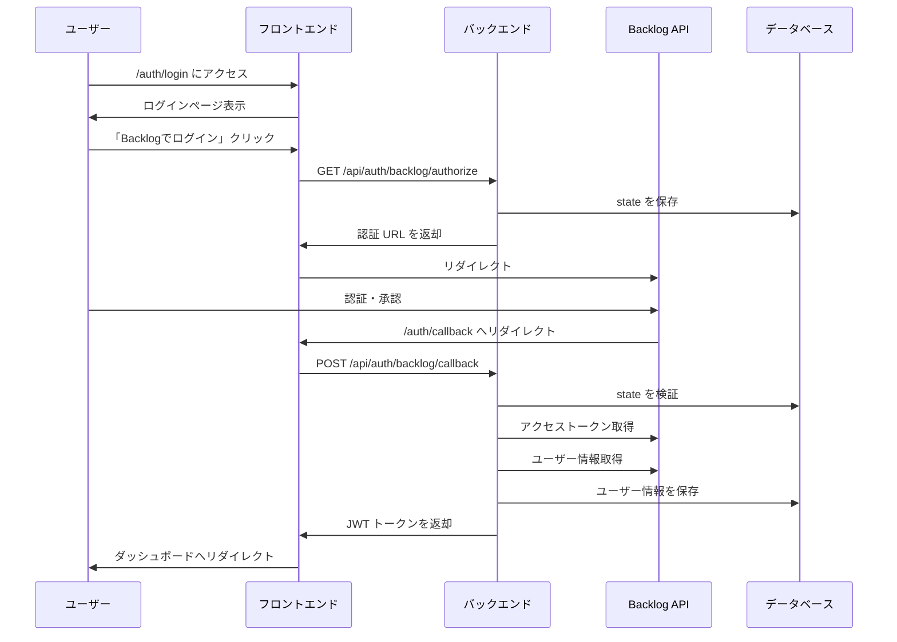

# Team Insight 実装ガイド

このドキュメントでは、Team Insight の実装について、実際のコードを交えながら詳細に解説します。フロントエンドからバックエンドまで、各コンポーネントの役割と実装を理解できるように構成しています。

## 目次

1. [プロジェクト構造](#プロジェクト構造)
2. [環境構築](#環境構築)
3. [認証システムの詳細実装](#認証システムの詳細実装)
4. [フロントエンドの詳細実装](#フロントエンドの詳細実装)
5. [バックエンドの詳細実装](#バックエンドの詳細実装)
6. [データベースの詳細実装](#データベースの詳細実装)
7. [テストの実装](#テストの実装)
8. [デプロイメント](#デプロイメント)
9. [トラブルシューティング](#トラブルシューティング)

## プロジェクト構造

```
team-insight/
├── frontend/                 # Next.js フロントエンド
│   ├── src/
│   │   ├── app/             # App Router のページ
│   │   ├── components/      # 共通コンポーネント
│   │   ├── hooks/           # カスタムフック
│   │   ├── services/        # API クライアント
│   │   └── store/           # Redux ストア
│   ├── public/              # 静的ファイル
│   └── package.json         # 依存関係
├── backend/                  # FastAPI バックエンド
│   ├── app/
│   │   ├── api/             # API エンドポイント
│   │   ├── core/            # コア機能（設定、セキュリティ）
│   │   ├── models/          # SQLAlchemy モデル
│   │   ├── schemas/         # Pydantic スキーマ
│   │   └── services/        # ビジネスロジック
│   ├── migrations/          # Alembic マイグレーション
│   └── requirements.txt     # 依存関係
├── infrastructure/          # インフラ設定
│   └── docker/             # Docker 設定
├── doc/                    # ドキュメント
└── docker-compose.yml      # Docker Compose 設定
```

## 環境構築

### 1. リポジトリのクローンと初期設定

```bash
# リポジトリのクローン
git clone https://github.com/your-username/team-insight.git
cd team-insight

# 設定スクリプトの実行
chmod +x setup.sh
./setup.sh
```

`setup.sh` の内容：

```bash
#!/bin/bash
# 環境変数ファイルのコピー
cp frontend/.env.example frontend/.env
cp backend/.env.example backend/.env

# Docker イメージのビルド
docker-compose build

# データベースの初期化
docker-compose run --rm backend alembic upgrade head
```

### 2. 環境変数の設定

#### フロントエンド（`frontend/.env`）

```env
# API のベース URL
NEXT_PUBLIC_API_URL=http://localhost:8000

# アプリケーションの URL
NEXT_PUBLIC_APP_URL=http://localhost:3000
```

#### バックエンド（`backend/.env`）

```env
# データベース設定
DATABASE_URL=postgresql://postgres:password@db:5432/team_insight

# JWT 設定
SECRET_KEY=your-secret-key-here
ALGORITHM=HS256
ACCESS_TOKEN_EXPIRE_MINUTES=10080  # 7日間

# Backlog OAuth 設定
BACKLOG_CLIENT_ID=your-client-id
BACKLOG_CLIENT_SECRET=your-client-secret
BACKLOG_REDIRECT_URI=http://localhost:3000/auth/callback
BACKLOG_SPACE_KEY=your-space-key

# CORS 設定
BACKEND_CORS_ORIGINS=["http://localhost:3000"]
```

### 3. 開発環境の起動

```bash
# すべてのサービスを起動
docker-compose up -d

# ログの確認
docker-compose logs -f

# 個別のサービスのログ確認
docker-compose logs -f frontend
docker-compose logs -f backend
docker-compose logs -f db
```

## 認証システムの詳細実装

### 認証フローの概要



### フロントエンド側の認証実装

#### 1. ログインページ（`frontend/src/app/auth/login/page.tsx`）

```typescript
"use client";

import { LoginContent } from "./LoginContent";

export default function LoginPage() {
  return <LoginContent />;
}
```

#### 2. ログインコンテンツ（`frontend/src/app/auth/login/LoginContent.tsx`）

```typescript
"use client";

import { useAuth } from "@/hooks/useAuth";
import { Button } from "@/components/ui/button";
import {
  Card,
  CardContent,
  CardDescription,
  CardHeader,
  CardTitle,
} from "@/components/ui/card";
import { useRouter } from "next/navigation";
import { useEffect, useState } from "react";

export function LoginContent() {
  const { login, isAuthenticated, isInitialized } = useAuth();
  const router = useRouter();
  const [isLoading, setIsLoading] = useState(false);
  const [error, setError] = useState<string | null>(null);

  useEffect(() => {
    // 既にログイン済みの場合はダッシュボードにリダイレクト
    if (isInitialized && isAuthenticated) {
      router.push("/dashboard");
    }
  }, [isAuthenticated, isInitialized, router]);

  const handleLogin = async () => {
    setIsLoading(true);
    setError(null);

    try {
      await login();
    } catch (err) {
      setError("ログインに失敗しました。もう一度お試しください。");
      setIsLoading(false);
    }
  };

  return (
    <div className="flex min-h-screen items-center justify-center">
      <Card className="w-full max-w-md">
        <CardHeader>
          <CardTitle>Team Insight にログイン</CardTitle>
          <CardDescription>
            Backlog アカウントでログインしてください
          </CardDescription>
        </CardHeader>
        <CardContent>
          <Button onClick={handleLogin} disabled={isLoading} className="w-full">
            {isLoading ? "ログイン中..." : "Backlog でログイン"}
          </Button>
          {error && <p className="mt-4 text-sm text-red-600">{error}</p>}
        </CardContent>
      </Card>
    </div>
  );
}
```

#### 3. 認証フック（`frontend/src/hooks/useAuth.ts`）

```typescript
import { useEffect, useState } from "react";
import { useRouter } from "next/navigation";
import { authService } from "@/services/auth.service";

interface User {
  id: number;
  name: string;
  email: string;
  backlog_id: string;
}

export function useAuth() {
  const [user, setUser] = useState<User | null>(null);
  const [isAuthenticated, setIsAuthenticated] = useState(false);
  const [isInitialized, setIsInitialized] = useState(false);
  const router = useRouter();

  useEffect(() => {
    // 初期化時にユーザー情報を取得
    const initAuth = async () => {
      try {
        const currentUser = await authService.getCurrentUser();
        if (currentUser) {
          setUser(currentUser);
          setIsAuthenticated(true);
        }
      } catch (error) {
        // 認証エラーの場合は何もしない
        console.error("Auth initialization error:", error);
      } finally {
        setIsInitialized(true);
      }
    };

    initAuth();
  }, []);

  const login = async () => {
    try {
      // 認証 URL を取得してリダイレクト
      const { authorization_url } = await authService.getAuthorizationUrl();
      window.location.href = authorization_url;
    } catch (error) {
      console.error("Login error:", error);
      throw error;
    }
  };

  const logout = async () => {
    try {
      await authService.logout();
      setUser(null);
      setIsAuthenticated(false);
      router.push("/");
    } catch (error) {
      console.error("Logout error:", error);
    }
  };

  const handleCallback = async (code: string, state: string) => {
    try {
      const response = await authService.handleCallback(code, state);
      setUser(response.user);
      setIsAuthenticated(true);
      return response;
    } catch (error) {
      console.error("Callback error:", error);
      throw error;
    }
  };

  return {
    user,
    isAuthenticated,
    isInitialized,
    login,
    logout,
    handleCallback,
  };
}
```

#### 4. 認証サービス（`frontend/src/services/auth.service.ts`）

```typescript
import axios from "axios";

const API_BASE_URL = process.env.NEXT_PUBLIC_API_URL || "http://localhost:8000";

interface AuthorizationResponse {
  authorization_url: string;
  state: string;
}

interface CallbackResponse {
  access_token: string;
  token_type: string;
  user: {
    id: number;
    name: string;
    email: string;
    backlog_id: string;
  };
}

class AuthService {
  async getAuthorizationUrl(): Promise<AuthorizationResponse> {
    const response = await axios.get(
      `${API_BASE_URL}/api/v1/auth/backlog/authorize`
    );
    return response.data;
  }

  async handleCallback(code: string, state: string): Promise<CallbackResponse> {
    const response = await axios.post(
      `${API_BASE_URL}/api/v1/auth/backlog/callback`,
      {
        code,
        state,
      }
    );
    return response.data;
  }

  async getCurrentUser() {
    try {
      const response = await axios.get(`${API_BASE_URL}/api/v1/auth/me`, {
        withCredentials: true,
      });
      return response.data;
    } catch (error) {
      return null;
    }
  }

  async logout() {
    await axios.post(
      `${API_BASE_URL}/api/v1/auth/logout`,
      {},
      {
        withCredentials: true,
      }
    );
  }
}

export const authService = new AuthService();
```

### バックエンド側の認証実装

#### 1. 認証エンドポイント（`backend/app/api/v1/auth.py`）

```python
from fastapi import APIRouter, Depends, HTTPException, Query
from fastapi.responses import JSONResponse
from sqlalchemy.orm import Session
from datetime import datetime, timedelta
import logging

from app.db.session import get_db
from app.services.backlog_oauth import backlog_oauth_service
from app.models.auth import OAuthState
from app.schemas.auth import (
    AuthorizationResponse,
    TokenResponse,
    CallbackRequest,
    UserInfoResponse
)
from app.core.security import get_current_user, create_access_token
from app.models.user import User

router = APIRouter(prefix="/auth", tags=["authentication"])
logger = logging.getLogger(__name__)

@router.get("/backlog/authorize", response_model=AuthorizationResponse)
async def get_authorization_url(db: Session = Depends(get_db)):
    """
    Backlog OAuth2.0 認証 URL を生成します
    """
    try:
        # 認証 URL と state を生成
        auth_url, state = backlog_oauth_service.get_authorization_url()

        # state をデータベースに保存（10分間有効）
        oauth_state = OAuthState(
            state=state,
            expires_at=datetime.utcnow() + timedelta(minutes=10)
        )
        db.add(oauth_state)
        db.commit()

        return AuthorizationResponse(
            authorization_url=auth_url,
            state=state
        )
    except Exception as e:
        logger.error(f"認証 URL の生成に失敗: {str(e)}")
        raise HTTPException(status_code=500, detail="認証 URL の生成に失敗しました")

@router.post("/backlog/callback", response_model=TokenResponse)
async def handle_callback(request: CallbackRequest, db: Session = Depends(get_db)):
    """
    Backlog OAuth2.0 認証のコールバックを処理します
    """
    # state の検証
    oauth_state = db.query(OAuthState).filter(
        OAuthState.state == request.state
    ).first()

    if not oauth_state:
        raise HTTPException(status_code=400, detail="無効な state パラメータです")

    if oauth_state.is_expired():
        db.delete(oauth_state)
        db.commit()
        raise HTTPException(status_code=400, detail="state パラメータの有効期限が切れています")

    try:
        # 認証コードをアクセストークンに交換
        token_data = await backlog_oauth_service.exchange_code_for_token(request.code)

        # ユーザー情報を取得
        user_info = await backlog_oauth_service.get_user_info(token_data["access_token"])

        # ユーザーの作成または更新
        user = db.query(User).filter(User.backlog_id == user_info["id"]).first()
        if not user:
            user = User(
                backlog_id=user_info["id"],
                email=user_info.get("mailAddress"),
                name=user_info["name"],
                user_id=user_info["userId"]
            )
            db.add(user)
            db.commit()
            db.refresh(user)

        # トークンを保存
        backlog_oauth_service.save_token(db, user.id, token_data)

        # 使用済みの state を削除
        db.delete(oauth_state)
        db.commit()

        # JWT トークンを生成
        access_token = create_access_token(data={"sub": str(user.id)})

        # レスポンスを作成
        response = TokenResponse(
            access_token=access_token,
            token_type="bearer",
            user=UserInfoResponse(
                id=user.id,
                backlog_id=user.backlog_id,
                email=user.email,
                name=user.name,
                user_id=user.user_id
            )
        )

        # Cookie を設定
        return JSONResponse(
            content=response.model_dump(),
            headers={
                "Set-Cookie": f"auth_token={access_token}; Path=/; HttpOnly; SameSite=Lax; Max-Age=604800"
            }
        )

    except Exception as e:
        logger.error(f"認証処理エラー: {str(e)}")
        db.delete(oauth_state)
        db.commit()
        raise HTTPException(status_code=500, detail="認証処理に失敗しました")

@router.get("/me", response_model=UserInfoResponse)
async def get_current_user_info(current_user: User = Depends(get_current_user)):
    """
    現在ログイン中のユーザー情報を取得します
    """
    return UserInfoResponse(
        id=current_user.id,
        backlog_id=current_user.backlog_id,
        email=current_user.email,
        name=current_user.name,
        user_id=current_user.user_id
    )
```

#### 2. Backlog OAuth サービス（`backend/app/services/backlog_oauth.py`）

```python
import os
import secrets
import httpx
from typing import Dict, Optional
from sqlalchemy.orm import Session
from datetime import datetime, timedelta

from app.models.auth import OAuthToken
from app.core.config import settings

class BacklogOAuthService:
    def __init__(self):
        self.client_id = settings.BACKLOG_CLIENT_ID
        self.client_secret = settings.BACKLOG_CLIENT_SECRET
        self.redirect_uri = settings.BACKLOG_REDIRECT_URI
        self.space_key = settings.BACKLOG_SPACE_KEY
        self.base_url = f"https://{self.space_key}.backlog.jp"

    def get_authorization_url(self) -> tuple[str, str]:
        """
        認証 URL と state を生成します
        """
        state = secrets.token_urlsafe(32)
        auth_url = (
            f"{self.base_url}/OAuth2AccessRequest.action"
            f"?response_type=code"
            f"&client_id={self.client_id}"
            f"&redirect_uri={self.redirect_uri}"
            f"&state={state}"
        )
        return auth_url, state

    async def exchange_code_for_token(self, code: str) -> Dict:
        """
        認証コードをアクセストークンに交換します
        """
        async with httpx.AsyncClient() as client:
            response = await client.post(
                f"{self.base_url}/api/v2/oauth2/token",
                data={
                    "grant_type": "authorization_code",
                    "code": code,
                    "client_id": self.client_id,
                    "client_secret": self.client_secret,
                    "redirect_uri": self.redirect_uri,
                }
            )
            response.raise_for_status()
            return response.json()

    async def get_user_info(self, access_token: str) -> Dict:
        """
        アクセストークンを使用してユーザー情報を取得します
        """
        async with httpx.AsyncClient() as client:
            response = await client.get(
                f"{self.base_url}/api/v2/users/myself",
                headers={"Authorization": f"Bearer {access_token}"}
            )
            response.raise_for_status()
            return response.json()

    def save_token(self, db: Session, user_id: int, token_data: Dict):
        """
        アクセストークンをデータベースに保存します
        """
        # 既存のトークンを削除
        db.query(OAuthToken).filter(
            OAuthToken.user_id == user_id,
            OAuthToken.provider == "backlog"
        ).delete()

        # 新しいトークンを保存
        oauth_token = OAuthToken(
            user_id=user_id,
            provider="backlog",
            access_token=token_data["access_token"],
            refresh_token=token_data.get("refresh_token"),
            expires_at=datetime.utcnow() + timedelta(seconds=token_data.get("expires_in", 3600))
        )
        db.add(oauth_token)
        db.commit()

backlog_oauth_service = BacklogOAuthService()
```

#### 3. セキュリティ設定（`backend/app/core/security.py`）

```python
from datetime import datetime, timedelta
from typing import Optional
from jose import JWTError, jwt
from passlib.context import CryptContext
from fastapi import Depends, HTTPException, status
from fastapi.security import HTTPBearer, HTTPAuthorizationCredentials
from sqlalchemy.orm import Session

from app.core.config import settings
from app.db.session import get_db
from app.models.user import User

pwd_context = CryptContext(schemes=["bcrypt"], deprecated="auto")
security = HTTPBearer()

def create_access_token(data: dict, expires_delta: Optional[timedelta] = None):
    """
    JWT アクセストークンを生成します
    """
    to_encode = data.copy()
    if expires_delta:
        expire = datetime.utcnow() + expires_delta
    else:
        expire = datetime.utcnow() + timedelta(minutes=settings.ACCESS_TOKEN_EXPIRE_MINUTES)
    to_encode.update({"exp": expire})
    encoded_jwt = jwt.encode(to_encode, settings.SECRET_KEY, algorithm=settings.ALGORITHM)
    return encoded_jwt

def verify_token(token: str) -> Optional[str]:
    """
    JWT トークンを検証してユーザー ID を返します
    """
    try:
        payload = jwt.decode(token, settings.SECRET_KEY, algorithms=[settings.ALGORITHM])
        user_id: str = payload.get("sub")
        if user_id is None:
            return None
        return user_id
    except JWTError:
        return None

async def get_current_user(
    credentials: HTTPAuthorizationCredentials = Depends(security),
    db: Session = Depends(get_db)
) -> Optional[User]:
    """
    現在のユーザーを取得します
    """
    token = credentials.credentials
    user_id = verify_token(token)
    if user_id is None:
        raise HTTPException(
            status_code=status.HTTP_401_UNAUTHORIZED,
            detail="認証情報が無効です",
            headers={"WWW-Authenticate": "Bearer"},
        )
    user = db.query(User).filter(User.id == int(user_id)).first()
    if user is None:
        raise HTTPException(
            status_code=status.HTTP_404_NOT_FOUND,
            detail="ユーザーが見つかりません"
        )
    return user

async def get_current_active_user(
    current_user: User = Depends(get_current_user)
) -> User:
    """
    アクティブなユーザーのみを取得します
    """
    if not current_user.is_active:
        raise HTTPException(status_code=400, detail="無効なユーザー")
    return current_user
```

## データベースの詳細実装

### 1. データベースモデル

#### ユーザーモデル（`backend/app/models/user.py`）

```python
from sqlalchemy import Column, Integer, String, Boolean, DateTime
from sqlalchemy.sql import func
from app.db.base_class import Base

class User(Base):
    __tablename__ = "users"

    id = Column(Integer, primary_key=True, index=True)
    backlog_id = Column(String, unique=True, index=True, nullable=False)
    user_id = Column(String, unique=True, index=True, nullable=False)
    email = Column(String, unique=True, index=True)
    name = Column(String, nullable=False)
    is_active = Column(Boolean, default=True)
    is_superuser = Column(Boolean, default=False)
    created_at = Column(DateTime(timezone=True), server_default=func.now())
    updated_at = Column(DateTime(timezone=True), onupdate=func.now())
```

#### 認証関連モデル（`backend/app/models/auth.py`）

```python
from sqlalchemy import Column, Integer, String, DateTime, ForeignKey, Text
from sqlalchemy.orm import relationship
from datetime import datetime
from app.db.base_class import Base

class OAuthState(Base):
    __tablename__ = "oauth_states"

    id = Column(Integer, primary_key=True, index=True)
    state = Column(String, unique=True, index=True, nullable=False)
    user_id = Column(Integer, ForeignKey("users.id"), nullable=True)
    expires_at = Column(DateTime, nullable=False)
    created_at = Column(DateTime, default=datetime.utcnow)

    user = relationship("User", backref="oauth_states")

    def is_expired(self) -> bool:
        return datetime.utcnow() > self.expires_at

class OAuthToken(Base):
    __tablename__ = "oauth_tokens"

    id = Column(Integer, primary_key=True, index=True)
    user_id = Column(Integer, ForeignKey("users.id"), nullable=False)
    provider = Column(String, nullable=False)
    access_token = Column(Text, nullable=False)
    refresh_token = Column(Text, nullable=True)
    expires_at = Column(DateTime, nullable=True)
    created_at = Column(DateTime, default=datetime.utcnow)
    updated_at = Column(DateTime, default=datetime.utcnow, onupdate=datetime.utcnow)

    user = relationship("User", backref="oauth_tokens")
```

### 2. マイグレーション

#### 初期マイグレーション（`backend/migrations/versions/001_initial_migration.py`）

```python
"""初期マイグレーション

Revision ID: 001
Revises:
Create Date: 2024-01-01 00:00:00.000000

"""
from alembic import op
import sqlalchemy as sa

# revision identifiers
revision = '001'
down_revision = None
branch_labels = None
depends_on = None

def upgrade():
    # users テーブル
    op.create_table('users',
        sa.Column('id', sa.Integer(), nullable=False),
        sa.Column('backlog_id', sa.String(), nullable=False),
        sa.Column('user_id', sa.String(), nullable=False),
        sa.Column('email', sa.String(), nullable=True),
        sa.Column('name', sa.String(), nullable=False),
        sa.Column('is_active', sa.Boolean(), nullable=True),
        sa.Column('is_superuser', sa.Boolean(), nullable=True),
        sa.Column('created_at', sa.DateTime(timezone=True), server_default=sa.text('now()'), nullable=True),
        sa.Column('updated_at', sa.DateTime(timezone=True), nullable=True),
        sa.PrimaryKeyConstraint('id')
    )
    op.create_index(op.f('ix_users_backlog_id'), 'users', ['backlog_id'], unique=True)
    op.create_index(op.f('ix_users_email'), 'users', ['email'], unique=True)
    op.create_index(op.f('ix_users_id'), 'users', ['id'], unique=False)
    op.create_index(op.f('ix_users_user_id'), 'users', ['user_id'], unique=True)

    # oauth_states テーブル
    op.create_table('oauth_states',
        sa.Column('id', sa.Integer(), nullable=False),
        sa.Column('state', sa.String(), nullable=False),
        sa.Column('user_id', sa.Integer(), nullable=True),
        sa.Column('expires_at', sa.DateTime(), nullable=False),
        sa.Column('created_at', sa.DateTime(), nullable=True),
        sa.ForeignKeyConstraint(['user_id'], ['users.id'], ),
        sa.PrimaryKeyConstraint('id')
    )
    op.create_index(op.f('ix_oauth_states_id'), 'oauth_states', ['id'], unique=False)
    op.create_index(op.f('ix_oauth_states_state'), 'oauth_states', ['state'], unique=True)

    # oauth_tokens テーブル
    op.create_table('oauth_tokens',
        sa.Column('id', sa.Integer(), nullable=False),
        sa.Column('user_id', sa.Integer(), nullable=False),
        sa.Column('provider', sa.String(), nullable=False),
        sa.Column('access_token', sa.Text(), nullable=False),
        sa.Column('refresh_token', sa.Text(), nullable=True),
        sa.Column('expires_at', sa.DateTime(), nullable=True),
        sa.Column('created_at', sa.DateTime(), nullable=True),
        sa.Column('updated_at', sa.DateTime(), nullable=True),
        sa.ForeignKeyConstraint(['user_id'], ['users.id'], ),
        sa.PrimaryKeyConstraint('id')
    )
    op.create_index(op.f('ix_oauth_tokens_id'), 'oauth_tokens', ['id'], unique=False)

def downgrade():
    op.drop_index(op.f('ix_oauth_tokens_id'), table_name='oauth_tokens')
    op.drop_table('oauth_tokens')
    op.drop_index(op.f('ix_oauth_states_state'), table_name='oauth_states')
    op.drop_index(op.f('ix_oauth_states_id'), table_name='oauth_states')
    op.drop_table('oauth_states')
    op.drop_index(op.f('ix_users_user_id'), table_name='users')
    op.drop_index(op.f('ix_users_id'), table_name='users')
    op.drop_index(op.f('ix_users_email'), table_name='users')
    op.drop_index(op.f('ix_users_backlog_id'), table_name='users')
    op.drop_table('users')
```

### 3. データベース操作

```bash
# マイグレーションの作成
docker-compose exec backend alembic revision -m "Add new table"

# マイグレーションの実行
docker-compose exec backend alembic upgrade head

# マイグレーションの履歴確認
docker-compose exec backend alembic history

# マイグレーションのロールバック
docker-compose exec backend alembic downgrade -1

# データベースに接続
docker-compose exec db psql -U postgres -d team_insight

# SQL クエリの実行例
SELECT * FROM users;
SELECT * FROM oauth_tokens WHERE user_id = 1;
```

## テストの実装

### 1. フロントエンドのテスト

#### 認証フックのテスト（`frontend/src/hooks/__tests__/useAuth.test.ts`）

```typescript
import { renderHook, act } from "@testing-library/react";
import { useAuth } from "../useAuth";
import { authService } from "@/services/auth.service";

jest.mock("@/services/auth.service");

describe("useAuth", () => {
  beforeEach(() => {
    jest.clearAllMocks();
  });

  it("初期状態では認証されていない", () => {
    const { result } = renderHook(() => useAuth());

    expect(result.current.isAuthenticated).toBe(false);
    expect(result.current.user).toBeNull();
  });

  it("ログイン処理が正しく動作する", async () => {
    const mockAuthUrl = "https://example.backlog.jp/OAuth2AccessRequest.action";
    (authService.getAuthorizationUrl as jest.Mock).mockResolvedValue({
      authorization_url: mockAuthUrl,
      state: "test-state",
    });

    const { result } = renderHook(() => useAuth());

    await act(async () => {
      await result.current.login();
    });

    expect(authService.getAuthorizationUrl).toHaveBeenCalled();
  });

  it("コールバック処理が正しく動作する", async () => {
    const mockUser = {
      id: 1,
      name: "Test User",
      email: "test@example.com",
      backlog_id: "test-backlog-id",
    };

    (authService.handleCallback as jest.Mock).mockResolvedValue({
      access_token: "test-token",
      token_type: "bearer",
      user: mockUser,
    });

    const { result } = renderHook(() => useAuth());

    await act(async () => {
      await result.current.handleCallback("test-code", "test-state");
    });

    expect(result.current.isAuthenticated).toBe(true);
    expect(result.current.user).toEqual(mockUser);
  });
});
```

#### コンポーネントのテスト（`frontend/src/app/auth/login/__tests__/LoginContent.test.tsx`）

```typescript
import { render, screen, fireEvent, waitFor } from "@testing-library/react";
import { LoginContent } from "../LoginContent";
import { useAuth } from "@/hooks/useAuth";
import { useRouter } from "next/navigation";

jest.mock("@/hooks/useAuth");
jest.mock("next/navigation");

describe("LoginContent", () => {
  const mockLogin = jest.fn();
  const mockPush = jest.fn();

  beforeEach(() => {
    (useAuth as jest.Mock).mockReturnValue({
      login: mockLogin,
      isAuthenticated: false,
      isInitialized: true,
    });
    (useRouter as jest.Mock).mockReturnValue({
      push: mockPush,
    });
  });

  it("ログインボタンが表示される", () => {
    render(<LoginContent />);

    expect(screen.getByText("Backlog でログイン")).toBeInTheDocument();
  });

  it("ログインボタンクリックでログイン処理が実行される", async () => {
    render(<LoginContent />);

    const loginButton = screen.getByText("Backlog でログイン");
    fireEvent.click(loginButton);

    await waitFor(() => {
      expect(mockLogin).toHaveBeenCalled();
    });
  });

  it("認証済みの場合はダッシュボードにリダイレクトされる", () => {
    (useAuth as jest.Mock).mockReturnValue({
      login: mockLogin,
      isAuthenticated: true,
      isInitialized: true,
    });

    render(<LoginContent />);

    expect(mockPush).toHaveBeenCalledWith("/dashboard");
  });
});
```

### 2. バックエンドのテスト

#### 認証エンドポイントのテスト（`backend/tests/api/test_auth.py`）

```python
import pytest
from fastapi.testclient import TestClient
from sqlalchemy.orm import Session
from datetime import datetime, timedelta

from app.main import app
from app.models.auth import OAuthState
from app.models.user import User

client = TestClient(app)

class TestAuth:
    def test_get_authorization_url(self, db: Session):
        """認証 URL の生成をテスト"""
        response = client.get("/api/v1/auth/backlog/authorize")

        assert response.status_code == 200
        data = response.json()
        assert "authorization_url" in data
        assert "state" in data

        # state がデータベースに保存されているか確認
        state = db.query(OAuthState).filter(
            OAuthState.state == data["state"]
        ).first()
        assert state is not None
        assert state.expires_at > datetime.utcnow()

    def test_handle_callback_success(self, db: Session, mocker):
        """コールバック処理の成功をテスト"""
        # state を事前に作成
        state = OAuthState(
            state="test-state",
            expires_at=datetime.utcnow() + timedelta(minutes=10)
        )
        db.add(state)
        db.commit()

        # Backlog API のモック
        mocker.patch(
            "app.services.backlog_oauth.backlog_oauth_service.exchange_code_for_token",
            return_value={
                "access_token": "test-access-token",
                "refresh_token": "test-refresh-token",
                "expires_in": 3600
            }
        )
        mocker.patch(
            "app.services.backlog_oauth.backlog_oauth_service.get_user_info",
            return_value={
                "id": "backlog-user-id",
                "userId": "test-user",
                "name": "Test User",
                "mailAddress": "test@example.com"
            }
        )

        response = client.post("/api/v1/auth/backlog/callback", json={
            "code": "test-code",
            "state": "test-state"
        })

        assert response.status_code == 200
        data = response.json()
        assert "access_token" in data
        assert "user" in data

        # ユーザーが作成されているか確認
        user = db.query(User).filter(
            User.backlog_id == "backlog-user-id"
        ).first()
        assert user is not None
        assert user.name == "Test User"

    def test_handle_callback_invalid_state(self, db: Session):
        """無効な state でのコールバック処理をテスト"""
        response = client.post("/api/v1/auth/backlog/callback", json={
            "code": "test-code",
            "state": "invalid-state"
        })

        assert response.status_code == 400
        assert "無効な state パラメータ" in response.json()["detail"]

    def test_get_current_user(self, db: Session, auth_headers):
        """現在のユーザー情報取得をテスト"""
        response = client.get("/api/v1/auth/me", headers=auth_headers)

        assert response.status_code == 200
        data = response.json()
        assert "id" in data
        assert "name" in data
        assert "email" in data
```

#### サービスのテスト（`backend/tests/services/test_backlog_oauth.py`）

```python
import pytest
from unittest.mock import AsyncMock, patch
from app.services.backlog_oauth import backlog_oauth_service

class TestBacklogOAuthService:
    def test_get_authorization_url(self):
        """認証 URL の生成をテスト"""
        auth_url, state = backlog_oauth_service.get_authorization_url()

        assert auth_url.startswith("https://")
        assert "OAuth2AccessRequest.action" in auth_url
        assert "client_id=" in auth_url
        assert "state=" in auth_url
        assert len(state) > 20

    @pytest.mark.asyncio
    async def test_exchange_code_for_token(self, mocker):
        """トークン交換をテスト"""
        mock_response = AsyncMock()
        mock_response.json.return_value = {
            "access_token": "test-token",
            "refresh_token": "refresh-token",
            "expires_in": 3600
        }
        mock_response.raise_for_status = AsyncMock()

        with patch("httpx.AsyncClient.post", return_value=mock_response):
            result = await backlog_oauth_service.exchange_code_for_token("test-code")

            assert result["access_token"] == "test-token"
            assert result["refresh_token"] == "refresh-token"

    @pytest.mark.asyncio
    async def test_get_user_info(self, mocker):
        """ユーザー情報取得をテスト"""
        mock_response = AsyncMock()
        mock_response.json.return_value = {
            "id": "user-id",
            "userId": "test-user",
            "name": "Test User",
            "mailAddress": "test@example.com"
        }
        mock_response.raise_for_status = AsyncMock()

        with patch("httpx.AsyncClient.get", return_value=mock_response):
            result = await backlog_oauth_service.get_user_info("test-token")

            assert result["id"] == "user-id"
            assert result["name"] == "Test User"
```

### 3. テストの実行

```bash
# フロントエンドのテスト実行
cd frontend
npm test
npm test -- --coverage  # カバレッジレポート付き

# バックエンドのテスト実行
cd backend
pytest
pytest --cov=app  # カバレッジレポート付き
pytest -v  # 詳細な出力

# Docker 環境でのテスト実行
docker-compose exec backend pytest
docker-compose exec frontend npm test
```

## デプロイメント

### 1. 本番環境の設定

#### Docker Compose 本番設定（`docker-compose.prod.yml`）

```yaml
version: "3.8"

services:
  frontend:
    build:
      context: ./frontend
      dockerfile: Dockerfile.prod
    environment:
      - NODE_ENV=production
    ports:
      - "3000:3000"
    depends_on:
      - backend

  backend:
    build:
      context: ./backend
      dockerfile: Dockerfile.prod
    environment:
      - DATABASE_URL=${DATABASE_URL}
      - SECRET_KEY=${SECRET_KEY}
    ports:
      - "8000:8000"
    depends_on:
      - db

  db:
    image: postgres:15
    environment:
      - POSTGRES_DB=${POSTGRES_DB}
      - POSTGRES_USER=${POSTGRES_USER}
      - POSTGRES_PASSWORD=${POSTGRES_PASSWORD}
    volumes:
      - postgres_data:/var/lib/postgresql/data

  nginx:
    image: nginx:alpine
    ports:
      - "80:80"
      - "443:443"
    volumes:
      - ./infrastructure/nginx/nginx.prod.conf:/etc/nginx/nginx.conf
      - ./infrastructure/nginx/ssl:/etc/nginx/ssl
    depends_on:
      - frontend
      - backend

volumes:
  postgres_data:
```

### 2. CI/CD パイプライン

#### GitHub Actions（`.github/workflows/deploy.yml`）

```yaml
name: Deploy

on:
  push:
    branches: [main]

jobs:
  test:
    runs-on: ubuntu-latest
    steps:
      - uses: actions/checkout@v3

      - name: Setup Node.js
        uses: actions/setup-node@v3
        with:
          node-version: "20"

      - name: Install frontend dependencies
        run: |
          cd frontend
          npm ci

      - name: Run frontend tests
        run: |
          cd frontend
          npm test

      - name: Setup Python
        uses: actions/setup-python@v4
        with:
          python-version: "3.11"

      - name: Install backend dependencies
        run: |
          cd backend
          pip install -r requirements.txt

      - name: Run backend tests
        run: |
          cd backend
          pytest

  deploy:
    needs: test
    runs-on: ubuntu-latest
    steps:
      - uses: actions/checkout@v3

      - name: Deploy to server
        uses: appleboy/ssh-action@v0.1.5
        with:
          host: ${{ secrets.HOST }}
          username: ${{ secrets.USERNAME }}
          key: ${{ secrets.SSH_KEY }}
          script: |
            cd /opt/team-insight
            git pull origin main
            docker-compose -f docker-compose.prod.yml down
            docker-compose -f docker-compose.prod.yml up -d --build
            docker-compose -f docker-compose.prod.yml exec backend alembic upgrade head
```

## トラブルシューティング

### 1. 認証関連の問題

#### 問題: ログイン後にリダイレクトループが発生する

```bash
# Cookie の確認
# ブラウザの開発者ツールで Application > Cookies を確認

# バックエンドのログ確認
docker-compose logs backend | grep "auth"

# JWT トークンのデコード（デバッグ用）
python -c "import jwt; print(jwt.decode('your-token-here', options={'verify_signature': False}))"
```

解決策:

1. Cookie の SameSite 属性を確認
2. CORS 設定を確認
3. フロントエンドとバックエンドの URL が一致しているか確認

#### 問題: 401 Unauthorized エラー

```bash
# トークンの有効期限確認
docker-compose exec backend python -c "
from app.core.security import verify_token
print(verify_token('your-token-here'))
"

# データベースのユーザー確認
docker-compose exec db psql -U postgres -d team_insight -c "SELECT * FROM users;"
```

### 2. データベース関連の問題

#### 問題: マイグレーションが失敗する

```bash
# マイグレーションの状態確認
docker-compose exec backend alembic current

# マイグレーションの履歴確認
docker-compose exec backend alembic history

# データベースを初期状態に戻す
docker-compose exec backend alembic downgrade base

# 再度マイグレーション実行
docker-compose exec backend alembic upgrade head
```

### 3. パフォーマンスの問題

#### 問題: API レスポンスが遅い

```bash
# スロークエリの確認
docker-compose exec db psql -U postgres -d team_insight -c "
SELECT query, calls, total_time, mean_time
FROM pg_stat_statements
ORDER BY mean_time DESC
LIMIT 10;
"

# インデックスの確認
docker-compose exec db psql -U postgres -d team_insight -c "\di"
```

解決策:

1. 適切なインデックスを追加
2. N+1 問題を解決（eager loading を使用）
3. キャッシュの実装

## まとめ

このガイドでは、Team Insight の実装について詳細に解説しました。主なポイント：

1. **認証システム**: Backlog OAuth2.0 を使用した安全な認証フロー
2. **フロントエンド**: Next.js と TypeScript による型安全な実装
3. **バックエンド**: FastAPI による高速な API 実装
4. **データベース**: PostgreSQL と SQLAlchemy による堅牢なデータ管理
5. **テスト**: フロントエンドとバックエンドの包括的なテスト
6. **デプロイ**: Docker を使用した簡単なデプロイメント

このガイドを参考に、Team Insight の開発を進めてください。
