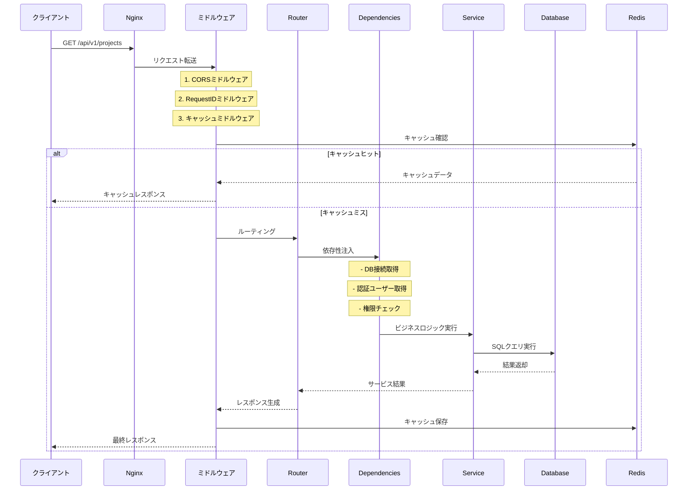

# FastAPIバックエンドの基本

**このガイドで学べること**：
- PythonとFastAPIの基本概念から実装まで
- APIエンドポイントの作成方法（ステップバイステップ）
- Pydanticによるデータ検証の仕組み
- 実際のコード例を通じた実装方法
- Team Insightでの実装パターンと設計思想
- セキュリティとパフォーマンスの考慮点

## 📚 はじめに：なぜFastAPIなのか？

### Webフレームワークとは？
Webフレームワークは、Webアプリケーションを作るための「道具箱」です。以下のような機能を提供します：
- HTTPリクエストの受け取り
- URLルーティング（どのURLでどの処理を実行するか）
- レスポンスの返却
- セキュリティ機能

### 主要なPython Webフレームワーク比較

| フレームワーク | 特徴 | 向いている用途 |
|------------|------|-------------|
| Django | フルスタック、管理画面付き | 大規模なWebサイト |
| Flask | 軽量、柔軟 | 小〜中規模のAPI |
| FastAPI | 高速、型安全、自動ドキュメント | モダンなAPI開発 |

### FastAPIの強み

1. **型安全**: Pythonの型ヒントによる自動バリデーション
   ```python
   # 型を指定するだけで自動的にチェック
   def get_user(user_id: int):  # user_idは必ず整数
       return {"id": user_id}
   ```

2. **高速**: NodeJS並みのパフォーマンス
   - Starlette（非同期処理）+ Pydantic（データ検証）がベース

3. **自動ドキュメント**: コードから自動的にAPIドキュメントを生成
   - Swagger UI: インタラクティブなAPIドキュメント
   - ReDoc: 見やすいAPIリファレンス

4. **非同期対応**: 並行処理で高いパフォーマンス
   ```python
   async def fetch_data():  # 非同期関数
       await asyncio.sleep(1)  # 他の処理をブロックしない
   ```

## 📦 Team Insightで使用している主要ライブラリ

### バックエンドの主要ライブラリ詳細

#### 1. FastAPI (0.109.2)
**公式ドキュメント**: https://fastapi.tiangolo.com/

FastAPIは、Python 3.8+の型ヒント機能を活用した最新のWebフレームワークです。

**主な特徴**：
- **自動的なリクエスト/レスポンス検証**: Pydanticとの統合
- **非同期処理のサポート**: `async`/`await`を使った高速処理
- **自動APIドキュメント生成**: OpenAPI (Swagger) 準拠
- **依存性注入システム**: 再利用可能なコンポーネント設計

**Team Insightでの使用例**：
```python
# main.pyでの初期化
app = FastAPI(
    title=settings.APP_NAME,
    openapi_url=f"{settings.API_V1_STR}/openapi.json",
    lifespan=lifespan,  # 起動・終了時の処理
    debug=settings.DEBUG
)
```

#### 2. SQLAlchemy (2.0.27)
**公式ドキュメント**: https://www.sqlalchemy.org/

SQLAlchemyは、PythonのORM（Object-Relational Mapping）ライブラリで、データベース操作を簡潔に行えます。

**なぜSQLAlchemy 2.0を選んだか**：
- **型安全性の向上**: Python型ヒントとの統合が改善
- **パフォーマンス最適化**: より効率的なクエリ生成
- **非同期対応**: `asyncio`との統合

**Team Insightでの実装パターン**：
```python
# models/user.py
class User(BaseModel):
    __tablename__ = "users"
    __table_args__ = {"schema": "team_insight"}  # スキーマ指定
    
    email = Column(String, unique=True, index=True)
    backlog_id = Column(Integer, unique=True, index=True)
    
    # リレーション定義
    user_roles = relationship(
        "UserRole", back_populates="user", cascade="all, delete-orphan"
    )
```

#### 3. Pydantic (2.6.1)
**公式ドキュメント**: https://docs.pydantic.dev/

Pydanticは、Pythonの型アノテーションを使用したデータ検証ライブラリです。

**主な用途**：
- **リクエストボディの検証**: 自動的な型変換とバリデーション
- **レスポンスのシリアライズ**: DBモデルからJSONへの変換
- **設定管理**: 環境変数の型安全な読み込み

**Team Insightでの活用**：
```python
# schemas/project.py
class ProjectBase(BaseModel):
    name: str = Field(..., min_length=1, max_length=100)
    description: Optional[str] = Field(None, max_length=1000)
    
    @validator('name')
    def name_must_not_be_empty(cls, v):
        if v and v.strip() == '':
            raise ValueError('プロジェクト名は空白のみにできません')
        return v.strip()
```

#### 4. Alembic (1.13.1)
**公式ドキュメント**: https://alembic.sqlalchemy.org/

Alembicは、SQLAlchemy用のデータベースマイグレーションツールです。

**使用理由**：
- **バージョン管理**: データベーススキーマの変更履歴を管理
- **チーム開発**: 複数人での開発時にスキーマを同期
- **ロールバック機能**: 問題発生時に以前の状態に戻せる

**実際の使用方法**：
```bash
# マイグレーション作成
alembic revision --autogenerate -m "add teams table"

# マイグレーション適用
alembic upgrade head

# ロールバック
alembic downgrade -1
```

#### 5. Redis (5.0.1) & redis-py
**公式ドキュメント**: https://redis-py.readthedocs.io/

Redisは高速なインメモリデータストアで、キャッシュとセッション管理に使用します。

**Team Insightでの活用**：
- **APIレスポンスのキャッシュ**: 頻繁にアクセスされるデータの高速化
- **セッション管理**: ユーザーのログイン状態を保持
- **レート制限**: API利用制限の実装

```python
# core/cache.py での実装
class CacheMiddleware:
    async def __call__(self, request: Request, call_next):
        cache_key = self._generate_cache_key(request)
        cached = await redis_client.get(cache_key)
        
        if cached:
            return JSONResponse(content=json.loads(cached))
        
        response = await call_next(request)
        await redis_client.setex(cache_key, 300, response.body)
        return response
```

#### 6. python-jose[cryptography] (3.3.0)
**公式ドキュメント**: https://python-jose.readthedocs.io/

JWTトークンの生成と検証に使用します。

**なぜjoseを選んだか**：
- **複数のアルゴリズム対応**: HS256, RS256など
- **暗号化オプション**: cryptographyバックエンドで安全性向上
- **使いやすいAPI**: シンプルなencode/decode関数

#### 7. APScheduler (3.10.4)
**公式ドキュメント**: https://apscheduler.readthedocs.io/

バックグラウンドタスクのスケジューリングに使用します。

**Team Insightでの使用**：
- **定期的なデータ同期**: Backlogからのデータ取得
- **レポート配信**: 日次・週次・月次レポートの自動送信
- **キャッシュクリア**: 期限切れデータの削除

```python
# services/sync_scheduler.py
scheduler.add_job(
    sync_all_projects,
    'interval',
    hours=6,
    id='sync_projects',
    name='プロジェクトデータ同期'
)
```

#### 8. httpx (0.26.0)
**公式ドキュメント**: https://www.python-httpx.org/

非同期HTTPクライアントライブラリで、外部API通信に使用します。

**requestsより優れている点**：
- **非同期対応**: `async`/`await`をサポート
- **HTTP/2サポート**: より効率的な通信
- **コネクションプーリング**: パフォーマンス向上

```python
# Backlog API通信の例
async with httpx.AsyncClient() as client:
    response = await client.get(
        f"https://{space_key}.backlog.com/api/v2/projects",
        headers={"Authorization": f"Bearer {token}"}
    )
```

## 🏗️ プロジェクト構造

```
backend/
├── app/
│   ├── main.py              # アプリケーションエントリーポイント
│   ├── api/
│   │   ├── deps.py          # 共通の依存性注入
│   │   └── v1/
│   │       ├── __init__.py  # APIルーター統合
│   │       ├── auth.py      # 認証エンドポイント
│   │       ├── users.py     # ユーザー管理
│   │       ├── projects.py  # プロジェクト管理
│   │       ├── tasks.py     # タスク管理
│   │       ├── teams.py     # チーム管理
│   │       ├── analytics.py # 分析エンドポイント
│   │       ├── sync.py      # 同期エンドポイント
│   │       ├── reports.py   # レポート管理
│   │       └── cache.py     # キャッシュ管理
│   ├── core/
│   │   ├── config.py        # 設定管理
│   │   ├── security.py      # セキュリティ関連
│   │   ├── permissions.py   # 権限チェック
│   │   ├── auth_base.py     # 認証基底クラス
│   │   ├── error_response.py # エラーレスポンス
│   │   ├── exceptions.py    # カスタム例外
│   │   ├── logging_config.py # ログ設定
│   │   ├── constants.py     # 定数定義
│   │   ├── utils.py         # ユーティリティ
│   │   ├── query_optimizer.py # クエリ最適化
│   │   ├── response_builder.py # レスポンス構築
│   │   ├── deps.py          # 依存性注入
│   │   └── cache.py         # キャッシュ管理
│   ├── db/
│   │   ├── base.py          # データベース基底クラス
│   │   ├── base_class.py    # モデル基底クラス
│   │   ├── session.py       # セッション管理
│   │   └── init_db.py       # DB初期化
│   ├── models/              # SQLAlchemyモデル
│   │   ├── __init__.py
│   │   ├── user.py          # ユーザーモデル
│   │   ├── project.py       # プロジェクトモデル
│   │   ├── task.py          # タスクモデル
│   │   ├── team.py          # チームモデル
│   │   ├── auth.py          # 認証関連モデル
│   │   ├── rbac.py          # RBAC関連モデル
│   │   ├── settings.py      # 設定関連モデル
│   │   └── sync_history.py  # 同期履歴モデル
│   ├── schemas/             # Pydanticスキーマ
│   │   ├── __init__.py
│   │   ├── response.py      # 共通レスポンス
│   │   ├── user.py          # ユーザースキーマ
│   │   ├── project.py       # プロジェクトスキーマ
│   │   ├── task.py          # タスクスキーマ
│   │   ├── team.py          # チームスキーマ
│   │   └── auth.py          # 認証スキーマ
│   ├── services/            # ビジネスロジック
│   │   ├── __init__.py
│   │   ├── base_service.py  # サービス基底クラス
│   │   ├── auth_service.py  # 認証サービス
│   │   ├── backlog_service.py # Backlog連携
│   │   ├── analytics_service.py # 分析サービス
│   │   ├── report_service.py # レポートサービス
│   │   └── sync_service.py  # 同期サービス
│   ├── middleware/          # カスタムミドルウェア
│   │   ├── __init__.py
│   │   ├── request_id.py    # リクエストID
│   │   ├── cache.py         # キャッシュ
│   │   └── logging.py       # ログ記録
│   └── tasks/               # バックグラウンドタスク
│       ├── __init__.py
│       ├── sync_tasks.py    # 同期タスク
│       └── report_tasks.py  # レポートタスク
├── migrations/              # Alembicマイグレーション
│   ├── alembic.ini
│   ├── env.py
│   └── versions/            # マイグレーションファイル
├── scripts/                 # 管理スクリプト
│   ├── init_rbac.py         # RBAC初期化
│   ├── init_admin.py        # 管理者初期化
│   └── manage_roles.py      # ロール管理
├── tests/                   # テストコード
│   ├── unit/                # ユニットテスト
│   ├── integration/         # 統合テスト
│   └── conftest.py          # テスト設定
├── requirements.txt         # 依存パッケージ
├── .env.example             # 環境変数テンプレート
└── Dockerfile               # Dockerイメージ定義
```

### 各ディレクトリの役割（詳細）

#### 📁 `app/api/v1/` - APIエンドポイント層
ここには実際のAPIエンドポイントが定義されています。各ファイルは特定のリソースに対応しています。

- **役割**: HTTPリクエストの受付、レスポンスの返却
- **責任**: ルーティング、リクエスト/レスポンスの変換、認証・権限チェック
- **設計方針**: 薄いコントローラー層として、ビジネスロジックはサービス層に委譲

#### 📁 `app/core/` - コア機能層
アプリケーション全体で使用される共通機能を提供します。

- **config.py**: 環境変数と設定の管理
- **security.py**: JWT認証、トークン生成
- **permissions.py**: RBAC権限チェックロジック
- **error_response.py**: 統一的なエラーレスポンス
- **query_optimizer.py**: N+1問題の解決、クエリ最適化

#### 📁 `app/models/` - データモデル層
SQLAlchemyを使用したデータベースモデルの定義です。

- **設計方針**: ドメインモデルとして、ビジネスルールを含む
- **リレーション**: 適切な関連を定義し、eager loadingで最適化
- **継承**: BaseModelを継承し、共通フィールド（id, created_at等）を統一

#### 📁 `app/schemas/` - データ検証層
Pydanticを使用した入出力データの検証とシリアライズを行います。

- **命名規則**: 
  - `*Base`: 基本フィールド定義
  - `*Create`: 作成時の入力
  - `*Update`: 更新時の入力
  - `*InDB`: DB保存形式
  - `*Response`: APIレスポンス

#### 📁 `app/services/` - ビジネスロジック層
実際のビジネスロジックを実装する層です。

- **設計方針**: 単一責任の原則、テスタブルな設計
- **トランザクション**: サービス層でトランザクション境界を管理
- **外部API連携**: Backlog APIとの通信もここで処理

## 🚀 FastAPIアプリケーションの基本構造

### ゼロから始めるFastAPI

#### 最小限のアプリケーション
```python
# main.py - 最もシンプルな例
from fastapi import FastAPI

# FastAPIインスタンスを作成
app = FastAPI()

# ルート（エンドポイント）を定義
@app.get("/")
def read_root():
    return {"Hello": "World"}

# 実行方法：
# uvicorn main:app --reload
# ブラウザで http://localhost:8000 にアクセス
```

**解説**：
- `app = FastAPI()`: アプリケーションのインスタンス作成
- `@app.get("/")`: デコレータでHTTPメソッドとパスを指定
- `return {"Hello": "World"}`: 自動的にJSONに変換される

### アプリケーションの起動フロー - 詳細

#### 1. main.py - エントリーポイント（Team Insightの実装）

```python
# backend/app/main.py
from fastapi import FastAPI
from contextlib import asynccontextmanager
import logging

# ロガーの設定
logger = logging.getLogger(__name__)

@asynccontextmanager
async def lifespan(app: FastAPI):
    """
    アプリケーションのライフサイクル管理
    
    このコンテキストマネージャーは：
    1. アプリ起動時に必要な初期化処理を実行
    2. アプリ実行中は yield で処理を渡す
    3. アプリ終了時にクリーンアップ処理を実行
    """
    # === 起動時の処理 ===
    logger.info("アプリケーションを起動しています...")
    
    # Redis接続の初期化
    # Redisはキャッシュとセッション管理に使用
    await redis_client.get_connection()
    logger.info("Redisに接続しました")
    
    # 定期実行スケジューラーの起動
    # レポート配信とデータ同期を定期的に実行
    report_scheduler.start()
    sync_scheduler.start()
    logger.info("スケジューラーを起動しました")
    
    # ここでアプリケーションに制御を渡す
    yield
    
    # === シャットダウン時の処理 ===
    logger.info("アプリケーションをシャットダウンしています...")
    
    # スケジューラーを停止
    sync_scheduler.stop()
    report_scheduler.stop()
    
    # Redis接続をクローズ
    await redis_client.close()
    logger.info("クリーンアップが完了しました")

# FastAPIアプリケーションのインスタンスを作成
app = FastAPI(
    title=settings.APP_NAME,                      # API名（Swagger UIに表示）
    openapi_url=f"{settings.API_V1_STR}/openapi.json",  # OpenAPIスキーマのURL
    lifespan=lifespan,                           # ライフサイクル管理
    debug=settings.DEBUG,                        # デバッグモード
    description="Team Insight API - Backlogデータ分析プラットフォーム",
    version="1.0.0"
)
```

**重要な概念の説明**：

1. **ライフサイクル管理（lifespan）**
   - アプリの起動/終了時に実行する処理を定義
   - データベース接続、キャッシュ初期化などに使用
   - `yield`の前が起動時、後が終了時の処理

2. **非同期処理（async/await）**
   ```python
   # 同期処理（1つずつ実行）
   def sync_function():
       result1 = slow_operation1()  # 完了まで待つ
       result2 = slow_operation2()  # result1の後に実行
   
   # 非同期処理（並行実行可能）
   async def async_function():
       result1 = await slow_operation1()  # 他の処理に譲る
       result2 = await slow_operation2()  # 効率的に実行
   ```

3. **設定管理（settings）**
   ```python
   # backend/app/core/config.py
   from pydantic_settings import BaseSettings
   
   class Settings(BaseSettings):
       APP_NAME: str = "Team Insight"
       DEBUG: bool = False
       DATABASE_URL: str
       
       class Config:
           env_file = ".env"  # .envファイルから読み込み
   
   settings = Settings()
   ```

### 2. ミドルウェアの設定 - 詳細解説

**ミドルウェアとは？**
ミドルウェアは、リクエストとレスポンスの間に入って処理を行うコンポーネントです。

```
リクエストの流れ：
ブラウザ → ミドルウェア1 → ミドルウェア2 → エンドポイント
         ←              ←              ←
```

#### 主要なミドルウェアの実装

```python
# backend/app/main.py

# 1. CORS（Cross-Origin Resource Sharing）ミドルウェア
from fastapi.middleware.cors import CORSMiddleware

# 許可するオリジン（フロントエンドのURL）
allowed_origins = [
    "http://localhost",      # Nginx経由
    "http://localhost:3000", # 開発時の直接アクセス
]

app.add_middleware(
    CORSMiddleware,
    allow_origins=allowed_origins,    # どのURLからのアクセスを許可するか
    allow_credentials=True,           # Cookieの送信を許可（認証に必要）
    allow_methods=["*"],              # すべてのHTTPメソッドを許可
    allow_headers=["*"],              # すべてのヘッダーを許可
)

# CORSの必要性：
# ブラウザは異なるドメインへのリクエストをブロックする（同一オリジンポリシー）
# 例：localhost:3000（フロントエンド）→ localhost:8000（API）はブロックされる
# CORSミドルウェアでこれを許可する

# 2. リクエストIDミドルウェア - デバッグとトレーシング用
from app.middleware.request_id import RequestIDMiddleware

app.add_middleware(RequestIDMiddleware)

# リクエストIDミドルウェアの実装例：
class RequestIDMiddleware:
    async def __call__(self, request: Request, call_next):
        # リクエストごとにユニークなIDを生成
        request_id = str(uuid.uuid4())
        
        # リクエストヘッダーにIDを追加
        request.state.request_id = request_id
        
        # 次の処理を実行
        response = await call_next(request)
        
        # レスポンスヘッダーにもIDを追加
        response.headers["X-Request-ID"] = request_id
        
        return response

# 3. キャッシュミドルウェア - パフォーマンス向上
from app.middleware.cache import CacheMiddleware

app.add_middleware(
    CacheMiddleware,
    default_expire=300,  # デフォルト5分間キャッシュ
    cacheable_paths=[    # キャッシュするパス
        "/api/v1/projects",
        "/api/v1/teams"
    ],
    exclude_paths=[      # キャッシュしないパス（認証関連）
        "/api/v1/auth"
    ]
)

# 4. ログミドルウェア - アクセスログ記録
import time
from app.core.logging_config import get_logger

logger = get_logger(__name__)

@app.middleware("http")
async def log_requests(request: Request, call_next):
    """すべてのHTTPリクエストをログに記録"""
    start_time = time.time()
    
    # リクエスト情報をログ
    logger.info(f"Request: {request.method} {request.url.path}")
    
    # 実際の処理を実行
    response = await call_next(request)
    
    # 処理時間を計算
    process_time = time.time() - start_time
    
    # レスポンス情報をログ
    logger.info(
        f"Response: {response.status_code} "
        f"Process time: {process_time:.3f}s"
    )
    
    return response

# 5. エラーハンドリングミドルウェア
@app.middleware("http")
async def catch_exceptions(request: Request, call_next):
    """予期しないエラーをキャッチして適切なレスポンスを返す"""
    try:
        return await call_next(request)
    except Exception as e:
        logger.error(f"Unhandled exception: {str(e)}", exc_info=True)
        return JSONResponse(
            status_code=500,
            content={
                "detail": "Internal server error",
                "request_id": getattr(request.state, "request_id", None)
            }
        )
```

**ミドルウェアの実行順序**：
```
リクエスト時: 1 → 2 → 3 → 4 → 5 → エンドポイント
レスポンス時: エンドポイント → 5 → 4 → 3 → 2 → 1
```

重要：ミドルウェアは追加した順序と逆の順序で実行されます！

## 📝 APIエンドポイントの作成 - ステップバイステップ

### HTTPメソッドの基本

APIでは、HTTPメソッドを使って操作の種類を表現します：

| メソッド | 用途 | 例 |
|---------|------|-----|
| GET | データ取得 | ユーザー情報を取得 |
| POST | データ作成 | 新規ユーザー登録 |
| PUT | データ更新（全体） | ユーザー情報を更新 |
| PATCH | データ更新（一部） | パスワードのみ変更 |
| DELETE | データ削除 | ユーザーを削除 |

### ステップ1: 最も簡単なエンドポイント

```python
from fastapi import APIRouter

# ルーターを作成（エンドポイントをグループ化）
router = APIRouter()

# GETメソッドでプロジェクト一覧を返す
@router.get("/projects")
def get_projects():
    return [
        {"id": 1, "name": "プロジェクトA"},
        {"id": 2, "name": "プロジェクトB"}
    ]
```

### ステップ2: パラメータを受け取る

```python
# パスパラメータ（URLの一部）
@router.get("/projects/{project_id}")
def get_project(project_id: int):  # 自動的に整数に変換
    return {"id": project_id, "name": f"プロジェクト{project_id}"}

# クエリパラメータ（?の後の部分）
@router.get("/projects")
def get_projects(skip: int = 0, limit: int = 10):
    # /projects?skip=20&limit=5 のように使用
    return {
        "skip": skip,
        "limit": limit,
        "projects": [...]
    }
```

### ステップ3: リクエストボディを受け取る

```python
from pydantic import BaseModel

# リクエストボディの型を定義
class ProjectCreate(BaseModel):
    name: str
    description: str | None = None  # オプション（Python 3.10以降）
    # または: Optional[str] = None

@router.post("/projects")
def create_project(project: ProjectCreate):
    # projectは自動的にProjectCreate型に変換される
    return {
        "id": 123,
        "name": project.name,
        "description": project.description
    }
```

### Team Insightの実装例 - 詳細解説

```python
# backend/app/api/v1/projects.py
from fastapi import APIRouter, Depends, HTTPException, Query
from sqlalchemy.orm import Session
from typing import List, Optional

from app.api import deps
from app.models.project import Project, ProjectMember
from app.models.user import User
from app.schemas.project import ProjectResponse, ProjectCreate

# APIRouterでエンドポイントをグループ化
router = APIRouter(
    prefix="/projects",  # すべてのエンドポイントに /projects を付ける
    tags=["projects"]    # Swagger UIでグループ化
)

@router.get("/", response_model=List[ProjectResponse])
async def get_projects(
    # 依存性注入（Dependency Injection）で必要なものを取得
    db: Session = Depends(deps.get_db),                    # データベース接続
    current_user: User = Depends(deps.get_current_user),   # 認証済みユーザー
    # クエリパラメータ（ページネーション用）
    skip: int = Query(0, ge=0),      # 0以上の整数
    limit: int = Query(100, le=1000)  # 最大1000まで
):
    """
    プロジェクト一覧を取得
    
    - **skip**: 何件スキップするか（ページネーション）
    - **limit**: 最大何件取得するか
    
    認証が必要です。ユーザーが参加しているプロジェクトのみ返します。
    """
    # SQLAlchemyでクエリを構築
    projects = (
        db.query(Project)  # Projectテーブルから
        .join(             # ProjectMemberテーブルと結合
            ProjectMember,
            Project.id == ProjectMember.project_id
        )
        .filter(           # 現在のユーザーが参加している
            ProjectMember.user_id == current_user.id
        )
        .offset(skip)      # ページネーション: スキップ
        .limit(limit)      # ページネーション: 制限
        .all()            # 結果を取得
    )
    
    return projects  # 自動的にProjectResponseの形式に変換

@router.post("/", response_model=ProjectResponse, status_code=201)
async def create_project(
    project_in: ProjectCreate,  # リクエストボディ
    db: Session = Depends(deps.get_db),
    current_user: User = Depends(deps.get_current_user),
    # 権限チェック: PROJECT_LEADER以上のロールが必要
    _: None = Depends(deps.require_role("PROJECT_LEADER"))
):
    """
    新規プロジェクトを作成
    
    PROJECT_LEADER以上の権限が必要です。
    """
    # Projectインスタンスを作成
    project = Project(
        **project_in.dict(),     # Pydanticモデルを辞書に変換
        created_by=current_user.id
    )
    
    # データベースに保存
    db.add(project)
    db.commit()      # コミット（実際に保存）
    db.refresh(project)  # IDなどの自動生成値を取得
    
    # 作成者を自動的にメンバーに追加
    member = ProjectMember(
        project_id=project.id,
        user_id=current_user.id,
        role="LEADER"
    )
    db.add(member)
    db.commit()
    
    return project  # 201 Created とともに返す

@router.get("/{project_id}", response_model=ProjectResponse)
async def get_project_detail(
    project_id: int,  # パスパラメータ
    db: Session = Depends(deps.get_db),
    current_user: User = Depends(deps.get_current_user)
):
    """特定のプロジェクト詳細を取得"""
    # プロジェクトを取得
    project = db.query(Project).filter(Project.id == project_id).first()
    
    # 存在チェック
    if not project:
        raise HTTPException(
            status_code=404,
            detail="プロジェクトが見つかりません"
        )
    
    # アクセス権限チェック
    is_member = db.query(ProjectMember).filter(
        ProjectMember.project_id == project_id,
        ProjectMember.user_id == current_user.id
    ).first()
    
    if not is_member:
        raise HTTPException(
            status_code=403,
            detail="このプロジェクトへのアクセス権限がありません"
        )
    
    return project
```

**重要な概念**：

1. **依存性注入（Depends）**
   - 必要なオブジェクトを自動的に用意
   - テストしやすい設計
   - 再利用可能なコンポーネント

2. **型アノテーション**
   - 自動的な型変換とバリデーション
   - エディタの補完が効く
   - 自動ドキュメント生成

3. **レスポンスモデル**
   - 返すデータの形式を定義
   - 不要なフィールドを除外
   - 型安全性の保証

### Pydanticスキーマ - 詳細解説

**Pydanticとは？**
Pydanticは、Pythonのデータバリデーションライブラリです。型ヒントを使って、データの検証と変換を自動化します。

**なぜPydanticを使うのか？**
1. **自動バリデーション**: 型が違えばエラー
2. **自動変換**: 文字列 "123" → 整数 123
3. **エディタ補完**: 型情報でコード補完が効く
4. **自動ドキュメント**: OpenAPIスキーマ生成

#### 基本的な使い方

```python
from pydantic import BaseModel, Field, validator
from typing import Optional
from datetime import datetime

# 1. シンプルなモデル
class User(BaseModel):
    name: str
    age: int
    email: str

# 使用例
user_data = {"name": "田中", "age": "25", "email": "tanaka@example.com"}
user = User(**user_data)  # ageは自動的に整数に変換
print(user.age)  # 25 (int型)

# 2. バリデーション付きモデル
class UserWithValidation(BaseModel):
    name: str = Field(
        ...,  # 必須フィールド
        min_length=1,
        max_length=50,
        description="ユーザーの名前"
    )
    age: int = Field(
        ...,
        ge=0,  # 0以上
        le=150,  # 150以下
        description="ユーザーの年齢"
    )
    email: str = Field(
        ...,
        regex=r'^[\w\.-]+@[\w\.-]+\.\w+$',  # メール形式
        description="メールアドレス"
    )

    # カスタムバリデーション
    @validator('email')
    def email_must_be_company_domain(cls, v):
        if not v.endswith('@company.com'):
            raise ValueError('会社のメールアドレスを使用してください')
        return v
```

#### Team Insightでの実装例 - 詳細

```python
# backend/app/schemas/project.py
from pydantic import BaseModel, Field, validator
from typing import Optional, List
from datetime import datetime
from uuid import UUID
from enum import Enum

# プロジェクトのステータス定義
class ProjectStatus(str, Enum):
    ACTIVE = "active"
    ARCHIVED = "archived"
    PENDING = "pending"

# 基本的な考え方：継承を使って重複を避ける
class ProjectBase(BaseModel):
    """
    プロジェクトの基本スキーマ
    作成・更新で共通のフィールドを定義
    """
    name: str = Field(
        ...,  # 必須（省略不可）
        min_length=1,
        max_length=100,
        description="プロジェクト名",
        example="新商品開発プロジェクト"
    )
    description: Optional[str] = Field(
        None,  # デフォルト値
        max_length=1000,
        description="プロジェクトの説明",
        example="2024年春の新商品開発"
    )
    backlog_project_key: Optional[str] = Field(
        None,
        regex=r'^[A-Z][A-Z0-9_]*$',  # 大文字英数字とアンダースコア
        description="BacklogのプロジェクトキーKey",
        example="PROJ123"
    )
    status: ProjectStatus = Field(
        ProjectStatus.ACTIVE,
        description="プロジェクトのステータス"
    )

    # バリデーション例
    @validator('name')
    def name_must_not_be_empty(cls, v):
        if v and v.strip() == '':
            raise ValueError('プロジェクト名は空白のみにできません')
        return v.strip()  # 前後の空白を削除

class ProjectCreate(ProjectBase):
    """
    プロジェクト作成時のスキーマ
    基本フィールドのみ（IDや作成日時は自動生成）
    """
    pass  # ProjectBaseをそのまま使用

class ProjectUpdate(ProjectBase):
    """
    プロジェクト更新時のスキーマ
    すべてのフィールドをオプショナルに
    """
    name: Optional[str] = Field(None, min_length=1, max_length=100)
    description: Optional[str] = None
    backlog_project_key: Optional[str] = None
    status: Optional[ProjectStatus] = None

class ProjectInDB(ProjectBase):
    """
    データベースに保存されるプロジェクト
    自動生成されるフィールドを含む
    """
    id: UUID
    created_at: datetime
    updated_at: datetime
    created_by: UUID  # 作成者のユーザーID

    class Config:
        orm_mode = True  # SQLAlchemyモデルからの変換を許可

class ProjectResponse(ProjectInDB):
    """
    APIレスポンス用のスキーマ
    クライアントに返す情報
    """
    member_count: int = Field(0, description="プロジェクトメンバー数")
    task_count: int = Field(0, description="タスク数")
    is_member: bool = Field(False, description="現在のユーザーがメンバーか")
    
    # リレーションデータ（オプション）
    members: Optional[List['UserSummary']] = None
    recent_tasks: Optional[List['TaskSummary']] = None

    class Config:
        orm_mode = True
        # JSONエンコード時の設定
        json_encoders = {
            datetime: lambda v: v.isoformat(),  # ISO形式で出力
            UUID: lambda v: str(v)  # 文字列として出力
        }

# 関連するスキーマ
class UserSummary(BaseModel):
    """ユーザーの要約情報（プロジェクトメンバー表示用）"""
    id: UUID
    name: str
    email: str
    avatar_url: Optional[str] = None

    class Config:
        orm_mode = True

class ProjectListResponse(BaseModel):
    """プロジェクト一覧のレスポンス"""
    projects: List[ProjectResponse]
    total: int = Field(..., description="総プロジェクト数")
    page: int = Field(..., description="現在のページ")
    per_page: int = Field(..., description="1ページあたりの件数")
    
    @validator('page')
    def page_must_be_positive(cls, v):
        if v < 1:
            raise ValueError('ページ番号は1以上である必要があります')
        return v
```

**Pydanticスキーマ設計のベストプラクティス**：

1. **継承を活用**
   ```python
   # 基本スキーマ → 作成用 → 更新用 → レスポンス用
   ProjectBase → ProjectCreate → ProjectUpdate → ProjectResponse
   ```

2. **明確な役割分担**
   - `*Base`: 共通フィールド
   - `*Create`: 作成時の入力
   - `*Update`: 更新時の入力（部分更新対応）
   - `*Response`: APIレスポンス
   - `*InDB`: データベース保存形式

3. **バリデーションの活用**
   ```python
   # Fieldでの基本バリデーション
   name: str = Field(..., min_length=1, max_length=100)
   
   # カスタムバリデーション
   @validator('field_name')
   def custom_validation(cls, v):
       # 複雑な検証ロジック
       return v
   ```

4. **ドキュメント化**
   - `description`: フィールドの説明
   - `example`: 使用例
   - これらは自動的にSwagger UIに表示される

## 🔌 依存性注入（Dependency Injection）- 詳細解説

### 依存性注入とは？

**概念の説明**：
依存性注入（DI）は、必要なオブジェクト（依存性）を外部から渡す設計パターンです。

**従来の方法（依存性注入なし）**：
```python
def get_user_projects():
    # 関数内で直接オブジェクトを作成
    db = create_database_connection()  # ここで作成
    user = get_current_user()          # ここで取得
    
    projects = db.query(Project).filter(...)
    return projects
```

**依存性注入を使った方法**：
```python
def get_user_projects(
    db: Session,  # 外部から渡される
    user: User    # 外部から渡される
):
    projects = db.query(Project).filter(...)
    return projects
```

**メリット**：
1. **テストが簡単**: モックオブジェクトを渡せる
2. **再利用可能**: 同じ依存性を複数の場所で使える
3. **関心の分離**: 各関数は本来の処理に集中できる

### FastAPIでの依存性注入

#### 基本的な使い方

```python
from fastapi import Depends

# 依存性を返す関数を定義
def get_current_time():
    return datetime.now()

# エンドポイントで使用
@app.get("/time")
def read_time(current_time: datetime = Depends(get_current_time)):
    return {"time": current_time}
```

### Team Insightでの実装例

#### 1. データベースセッション管理

```python
# backend/app/api/deps.py
from app.db.session import SessionLocal
from sqlalchemy.orm import Session

def get_db() -> Generator[Session, None, None]:
    """
    データベースセッションを取得し、使用後は自動的にクローズ
    
    Generatorを使うことで：
    1. yield前: セッションを作成
    2. yield: セッションを渡す
    3. yield後: セッションをクローズ（finally節で確実に実行）
    """
    db = SessionLocal()
    try:
        yield db  # ここでセッションを提供
    finally:
        db.close()  # 処理が終わったら必ずクローズ

# 使用例
@router.get("/users")
def get_users(db: Session = Depends(get_db)):
    """
    dbパラメータに自動的にデータベースセッションが注入される
    関数終了時に自動的にセッションがクローズされる
    """
    users = db.query(User).all()
    return users
```

**なぜGeneratorを使うのか？**
```python
# 通常の関数だと...
def get_db_bad():
    db = SessionLocal()
    return db  # クローズされない！メモリリーク！

# Generatorを使うと...
def get_db_good():
    db = SessionLocal()
    try:
        yield db  # ここで一時停止
    finally:
        db.close()  # 必ず実行される
```

#### 2. 認証済みユーザーの取得 - 詳細解説

```python
# backend/app/api/deps.py
from fastapi import Depends, HTTPException, status
from fastapi.security import OAuth2PasswordBearer
from jose import jwt, JWTError
from sqlalchemy.orm import Session

# OAuth2スキームの定義（トークンの取得方法）
oauth2_scheme = OAuth2PasswordBearer(tokenUrl="/api/v1/auth/token")

async def get_current_user(
    db: Session = Depends(get_db),
    token: str = Depends(oauth2_scheme)  # Authorizationヘッダーから自動取得
) -> User:
    """
    現在の認証済みユーザーを取得
    
    処理の流れ：
    1. Authorizationヘッダーからトークンを取得
    2. JWTトークンをデコード
    3. ユーザーIDを抽出
    4. データベースからユーザー情報を取得
    """
    # 認証エラー時の例外を準備
    credentials_exception = HTTPException(
        status_code=status.HTTP_401_UNAUTHORIZED,
        detail="認証情報を検証できませんでした",
        headers={"WWW-Authenticate": "Bearer"},  # ブラウザに認証方法を伝える
    )
    
    try:
        # JWTトークンをデコード
        payload = jwt.decode(
            token,                    # トークン文字列
            settings.SECRET_KEY,      # 署名検証用の秘密鍵
            algorithms=[ALGORITHM]    # 使用アルゴリズム（HS256など）
        )
        
        # ペイロードからユーザーIDを取得
        # "sub" (subject) はJWTの標準的なクレーム
        user_id: str = payload.get("sub")
        if user_id is None:
            raise credentials_exception
            
    except JWTError as e:
        # トークンが無効（期限切れ、改ざんなど）
        logger.error(f"JWT decode error: {str(e)}")
        raise credentials_exception
    
    # データベースからユーザー情報を取得
    user = db.query(User).filter(User.id == user_id).first()
    
    # ユーザーが存在しない場合
    if user is None:
        raise credentials_exception
    
    # ユーザーがアクティブでない場合
    if not user.is_active:
        raise HTTPException(
            status_code=status.HTTP_403_FORBIDDEN,
            detail="このアカウントは無効化されています"
        )
    
    return user

# 使用例
@router.get("/me")
def read_current_user(
    current_user: User = Depends(get_current_user)
):
    """現在のユーザー情報を返す"""
    return current_user
```

#### 3. 権限チェック（RBAC）- 詳細解説

```python
from typing import Union, List

def require_role(required_roles: Union[str, List[str]]):
    """
    特定のロールを要求する依存性を作成
    
    使用例：
    - require_role("ADMIN")  # ADMINロールが必要
    - require_role(["ADMIN", "PROJECT_LEADER"])  # どちらかのロール
    """
    # 文字列の場合はリストに変換
    if isinstance(required_roles, str):
        required_roles = [required_roles]
    
    async def role_checker(
        current_user: User = Depends(get_current_user),
        db: Session = Depends(get_db)
    ):
        """実際の権限チェックを行う関数"""
        # ユーザーのロールを取得
        user_roles = [
            ur.role.name 
            for ur in current_user.user_roles
            if ur.role.is_active  # アクティブなロールのみ
        ]
        
        # 必要なロールを持っているかチェック
        if not any(role in user_roles for role in required_roles):
            raise HTTPException(
                status_code=status.HTTP_403_FORBIDDEN,
                detail=f"この操作には{', '.join(required_roles)}の権限が必要です"
            )
        
        # 権限チェックOK（何も返さない）
        return None
    
    return role_checker

# 使用例
@router.post("/admin/users/{user_id}/role")
async def update_user_role(
    user_id: UUID,
    new_role: str,
    db: Session = Depends(get_db),
    current_user: User = Depends(get_current_user),
    _: None = Depends(require_role("ADMIN"))  # ADMIN権限が必要
):
    """ユーザーのロールを更新（管理者のみ）"""
    # ここに到達した時点で権限チェックは完了
    user = db.query(User).filter(User.id == user_id).first()
    # ロール更新処理...
```

#### 4. 複合的な依存性注入の例

```python
# プロジェクトへのアクセス権限チェック
class ProjectAccessChecker:
    """プロジェクトアクセス権限の依存性"""
    
    def __init__(self, project_id: int):
        self.project_id = project_id
    
    async def __call__(
        self,
        db: Session = Depends(get_db),
        current_user: User = Depends(get_current_user)
    ) -> Project:
        """プロジェクトへのアクセス権限をチェック"""
        # プロジェクトを取得
        project = db.query(Project).filter(
            Project.id == self.project_id
        ).first()
        
        if not project:
            raise HTTPException(
                status_code=404,
                detail="プロジェクトが見つかりません"
            )
        
        # メンバーチェック
        is_member = db.query(ProjectMember).filter(
            ProjectMember.project_id == self.project_id,
            ProjectMember.user_id == current_user.id
        ).first()
        
        if not is_member and "ADMIN" not in [r.name for r in current_user.roles]:
            raise HTTPException(
                status_code=403,
                detail="このプロジェクトへのアクセス権限がありません"
            )
        
        return project

# 使用例
@router.get("/projects/{project_id}/tasks")
async def get_project_tasks(
    project: Project = Depends(ProjectAccessChecker(project_id)),
    db: Session = Depends(get_db),
    skip: int = 0,
    limit: int = 100
):
    """プロジェクトのタスク一覧を取得"""
    # projectは既に権限チェック済み
    tasks = db.query(Task).filter(
        Task.project_id == project.id
    ).offset(skip).limit(limit).all()
    return tasks
```

**依存性注入のベストプラクティス**：

1. **単一責任の原則**
   - 各依存性は1つの責任を持つ
   - 例：認証、DB接続、権限チェックは別々に

2. **再利用性**
   - 共通の依存性は`deps.py`に集約
   - プロジェクト固有のものは各モジュールに

3. **テストしやすさ**
   ```python
   # テスト時は依存性を上書き
   app.dependency_overrides[get_current_user] = lambda: test_user
   ```

4. **エラーハンドリング**
   - 適切なHTTPステータスコード
   - 明確なエラーメッセージ

## 🏛️ アーキテクチャパターンとデザインパターン

### Team Insightのアーキテクチャ設計思想

Team Insightでは、**クリーンアーキテクチャ**の原則を参考にした、レイヤードアーキテクチャを採用しています。

#### レイヤー構造の詳細

```
┌─────────────────────────────────────────────────┐
│           プレゼンテーション層                    │
│  (FastAPI Routes / API Endpoints)               │
├─────────────────────────────────────────────────┤
│              アプリケーション層                   │
│     (Services / Business Logic)                 │
├─────────────────────────────────────────────────┤
│                ドメイン層                        │
│    (Models / Entities / Value Objects)          │
├─────────────────────────────────────────────────┤
│            インフラストラクチャ層                 │
│  (Database / External APIs / Cache)             │
└─────────────────────────────────────────────────┘
```

**各層の責任**：

1. **プレゼンテーション層** (`api/v1/`)
   - HTTPリクエスト/レスポンスの処理
   - 入力値の検証（Pydanticスキーマ）
   - 認証・認可のチェック
   - ビジネスロジックは含まない

2. **アプリケーション層** (`services/`)
   - ビジネスロジックの実装
   - トランザクション管理
   - 複数のドメインモデルの協調
   - 外部サービスとの連携調整

3. **ドメイン層** (`models/`)
   - ビジネスエンティティの定義
   - ビジネスルールの実装
   - 値オブジェクトの定義

4. **インフラストラクチャ層** (`db/`, `core/`)
   - データベースアクセス
   - 外部API通信
   - キャッシュ管理
   - 技術的な実装詳細

### 実装されているデザインパターン

#### 1. Repository パターン（簡易版）

```python
# services/base_service.py
class BaseService(Generic[ModelType, CreateSchemaType, UpdateSchemaType]):
    """
    汎用的なCRUD操作を提供する基底サービスクラス
    Repositoryパターンの簡易実装
    """
    def __init__(self, model: Type[ModelType], db: Session):
        self.model = model
        self.db = db
    
    def get(self, id: UUID) -> Optional[ModelType]:
        return self.db.query(self.model).filter(
            self.model.id == id
        ).first()
    
    def create(self, obj_in: CreateSchemaType) -> ModelType:
        db_obj = self.model(**obj_in.dict())
        self.db.add(db_obj)
        self.db.commit()
        self.db.refresh(db_obj)
        return db_obj
```

**なぜRepositoryパターンを使うのか**：
- **データアクセスロジックの抽象化**: SQLAlchemyの詳細を隠蔽
- **テスタビリティ**: モックしやすい設計
- **DRY原則**: 共通のCRUD操作を一箇所に集約

#### 2. Dependency Injection（依存性注入）パターン

```python
# api/deps.py
def get_db() -> Generator[Session, None, None]:
    """データベースセッションの依存性注入"""
    db = SessionLocal()
    try:
        yield db
    finally:
        db.close()

# 使用例
@router.get("/projects")
def get_projects(
    db: Session = Depends(get_db),  # 依存性注入
    current_user: User = Depends(get_current_user)  # 依存性注入
):
    # dbとcurrent_userは自動的に注入される
    pass
```

**依存性注入のメリット**：
- **疎結合**: コンポーネント間の依存関係を明確化
- **テスト容易性**: モックオブジェクトの注入が簡単
- **再利用性**: 同じ依存性を複数のエンドポイントで使用

#### 3. Factory パターン

```python
# core/auth_base.py
class AuthResponseBuilder:
    """認証レスポンスの統一的な構築（Factoryパターン）"""
    @staticmethod
    def build_success_response(
        user: User,
        access_token: str,
        refresh_token: Optional[str] = None
    ) -> Dict[str, Any]:
        """成功レスポンスの構築"""
        return {
            "user": UserInfoResponse.from_orm(user),
            "access_token": access_token,
            "refresh_token": refresh_token,
            "token_type": "bearer"
        }
```

#### 4. Strategy パターン（クエリ最適化）

```python
# core/query_optimizer.py
class QueryOptimizer:
    """クエリ最適化のストラテジー"""
    
    def optimize_user_query(self, query: Query) -> Query:
        """ユーザークエリの最適化（N+1問題対策）"""
        return query.options(
            joinedload(User.user_roles).joinedload(UserRole.role),
            joinedload(User.team_memberships),
            joinedload(User.preferences)
        )
    
    def optimize_project_query(self, query: Query) -> Query:
        """プロジェクトクエリの最適化"""
        return query.options(
            joinedload(Project.members),
            selectinload(Project.tasks)  # 大量データの場合
        )
```

### SOLID原則の適用例

#### 1. 単一責任の原則（SRP）

```python
# 各クラスは1つの責任のみを持つ

# ❌ 悪い例：複数の責任を持つクラス
class UserService:
    def create_user(self): pass
    def send_email(self): pass  # メール送信は別の責任
    def generate_report(self): pass  # レポート生成も別の責任

# ✅ 良い例：責任を分離
class UserService:
    def create_user(self): pass
    
class EmailService:
    def send_email(self): pass
    
class ReportService:
    def generate_report(self): pass
```

#### 2. オープン・クローズドの原則（OCP）

```python
# 拡張に対して開き、修正に対して閉じている

# 基底クラス（修正に対して閉じている）
class BaseService:
    def get(self, id): pass
    def create(self, data): pass

# 拡張クラス（拡張に対して開いている）
class TeamService(BaseService):
    def add_member(self, team_id, user_id):
        # 新しい機能を追加（基底クラスは変更しない）
        pass
```

#### 3. リスコフの置換原則（LSP）

```python
# 派生クラスは基底クラスと置換可能でなければならない

class AuthService(ABC):
    @abstractmethod
    def authenticate(self, credentials): pass

class BacklogAuthService(AuthService):
    def authenticate(self, credentials):
        # Backlog固有の認証処理
        # 基底クラスの契約を守る
        return user

# どちらのクラスも同じように使える
def login(auth_service: AuthService, credentials):
    return auth_service.authenticate(credentials)
```

### エラーハンドリングのベストプラクティス

#### カスタム例外の階層構造

```python
# core/exceptions.py
class TeamInsightException(Exception):
    """アプリケーション基底例外"""
    status_code: int = 500
    detail: str = "内部エラーが発生しました"
    
class AuthenticationException(TeamInsightException):
    """認証関連の例外"""
    status_code = 401
    detail = "認証が必要です"
    
class AuthorizationException(TeamInsightException):
    """認可関連の例外"""
    status_code = 403
    detail = "権限がありません"
    
class ValidationException(TeamInsightException):
    """バリデーション例外"""
    status_code = 400
    detail = "入力値が不正です"
```

#### グローバルエラーハンドラー

```python
# core/error_handler.py
def register_error_handlers(app: FastAPI):
    """グローバルエラーハンドラーの登録"""
    
    @app.exception_handler(TeamInsightException)
    async def team_insight_exception_handler(
        request: Request,
        exc: TeamInsightException
    ):
        return JSONResponse(
            status_code=exc.status_code,
            content={
                "detail": exc.detail,
                "type": exc.__class__.__name__,
                "request_id": getattr(request.state, "request_id", None)
            }
        )
    
    @app.exception_handler(ValidationError)
    async def validation_exception_handler(
        request: Request,
        exc: ValidationError
    ):
        return JSONResponse(
            status_code=422,
            content={
                "detail": exc.errors(),
                "type": "ValidationError"
            }
        )
```

## 🚨 エラーハンドリング

### 統一されたエラーレスポンス

```python
# backend/app/core/error_response.py
from fastapi import HTTPException
from typing import Any, Optional

class StandardErrorResponses:
    """標準的なエラーレスポンス"""
    
    @staticmethod
    def not_found(detail: str = "リソースが見つかりません") -> HTTPException:
        return HTTPException(status_code=404, detail=detail)
    
    @staticmethod
    def unauthorized(detail: str = "認証が必要です") -> HTTPException:
        return HTTPException(status_code=401, detail=detail)
    
    @staticmethod
    def forbidden(detail: str = "権限が不足しています") -> HTTPException:
        return HTTPException(status_code=403, detail=detail)
    
    @staticmethod
    def bad_request(detail: str = "不正なリクエストです") -> HTTPException:
        return HTTPException(status_code=400, detail=detail)
```

### エラーハンドラーの登録

```python
# backend/app/main.py
from app.core.error_handler import register_error_handlers

# カスタムエラーハンドラーを登録
register_error_handlers(app)

# 使用例
@app.exception_handler(ValueError)
async def value_error_handler(request: Request, exc: ValueError):
    return JSONResponse(
        status_code=400,
        content={
            "detail": str(exc),
            "type": "value_error"
        }
    )
```

## 📊 データフローとリクエスト処理の流れ

### 典型的なAPIリクエストの処理フロー

以下は、ユーザーがプロジェクト一覧を取得する際の詳細なデータフローです：



### 各層での処理内容

#### 1. **ミドルウェア層での処理**

```python
# リクエストが最初に通過する層

# RequestIDミドルウェア
async def dispatch(request: Request, call_next):
    request_id = str(uuid.uuid4())
    request.state.request_id = request_id
    
    # ログにリクエストIDを含める
    logger.info(f"[{request_id}] {request.method} {request.url.path}")
    
    response = await call_next(request)
    response.headers["X-Request-ID"] = request_id
    return response
```

#### 2. **ルーティング層での処理**

```python
# APIエンドポイントの定義

@router.get(
    "/projects",
    response_model=List[ProjectResponse],
    summary="プロジェクト一覧取得",
    dependencies=[Depends(require_permissions("projects.read"))]
)
async def get_projects(
    # 依存性注入でパラメータを受け取る
    db: Session = Depends(get_db),
    current_user: User = Depends(get_current_user),
    skip: int = Query(0, ge=0),
    limit: int = Query(100, le=1000)
):
    """プロジェクト一覧を取得"""
    # サービス層に処理を委譲
    service = ProjectService(db)
    return service.get_user_projects(current_user.id, skip, limit)
```

#### 3. **サービス層での処理**

```python
# ビジネスロジックの実装

class ProjectService:
    def get_user_projects(
        self, 
        user_id: int, 
        skip: int = 0, 
        limit: int = 100
    ) -> List[Project]:
        """
        ユーザーのプロジェクト一覧を取得
        
        処理の流れ：
        1. クエリ構築
        2. 最適化（N+1問題対策）
        3. ページネーション適用
        4. 結果返却
        """
        # ベースクエリの構築
        query = self.db.query(Project).join(
            ProjectMember,
            Project.id == ProjectMember.project_id
        ).filter(
            ProjectMember.user_id == user_id
        )
        
        # クエリ最適化
        query = self._optimize_query(query)
        
        # ページネーション
        return query.offset(skip).limit(limit).all()
    
    def _optimize_query(self, query: Query) -> Query:
        """N+1問題を防ぐための最適化"""
        return query.options(
            joinedload(Project.members).joinedload(ProjectMember.user),
            selectinload(Project.tasks)  # 大量データ対策
        )
```

### エラー処理のフロー

エラーが発生した場合の処理フローを以下に示します：

```
エラー発生箇所による処理の違い：

1. バリデーションエラー（Pydantic）
   → 422 Unprocessable Entity
   → 詳細なエラー情報を返却

2. 認証エラー（Dependencies）
   → 401 Unauthorized
   → WWW-Authenticateヘッダー付き

3. 権限エラー（Dependencies/Service）
   → 403 Forbidden
   → 必要な権限情報を返却

4. ビジネスロジックエラー（Service）
   → 400 Bad Request
   → ユーザー向けメッセージ

5. システムエラー（予期しないエラー）
   → 500 Internal Server Error
   → エラーIDとともに汎用メッセージ
```

### パフォーマンス最適化の実装

#### 1. **データベースクエリの最適化**

```python
# N+1問題の解決例

# ❌ 悪い例：N+1問題が発生
projects = db.query(Project).all()
for project in projects:
    # 各プロジェクトごとにクエリが発生
    members = project.members  # SELECT * FROM members WHERE project_id = ?
    
# ✅ 良い例：joinedloadで一度に取得
projects = db.query(Project).options(
    joinedload(Project.members)
).all()
# 1つのクエリで全データを取得
```

#### 2. **キャッシュ戦略**

```python
# キャッシュキーの設計
def generate_cache_key(
    endpoint: str,
    user_id: int,
    params: dict
) -> str:
    """
    キャッシュキーの生成
    
    例: "api:v1:projects:user:123:skip:0:limit:100"
    """
    param_str = ":".join(f"{k}:{v}" for k, v in sorted(params.items()))
    return f"api:v1:{endpoint}:user:{user_id}:{param_str}"

# キャッシュの無効化
async def invalidate_project_cache(user_id: int):
    """プロジェクト関連のキャッシュを無効化"""
    pattern = f"api:v1:projects:user:{user_id}:*"
    keys = await redis_client.keys(pattern)
    if keys:
        await redis_client.delete(*keys)
```

#### 3. **非同期処理の活用**

```python
# 複数の外部APIを並行で呼び出す例

async def sync_user_data(user_id: int):
    """ユーザーデータの同期（非同期並行処理）"""
    async with httpx.AsyncClient() as client:
        # 並行で複数のAPIを呼び出す
        tasks = [
            client.get(f"/api/v2/users/{user_id}"),
            client.get(f"/api/v2/users/{user_id}/projects"),
            client.get(f"/api/v2/users/{user_id}/tasks")
        ]
        
        # すべての結果を待つ
        results = await asyncio.gather(*tasks)
        
        user_data, projects_data, tasks_data = [r.json() for r in results]
        
        # データベースに保存
        await save_sync_data(user_data, projects_data, tasks_data)
```

## 🛠️ 実践的な開発のヒント

### 1. 自動ドキュメントの活用

FastAPIは自動的にAPIドキュメントを生成します：
- **Swagger UI**: http://localhost/api/v1/docs
- **ReDoc**: http://localhost/api/v1/redoc

```python
@router.post(
    "/",
    response_model=ProjectResponse,
    summary="新規プロジェクトを作成",
    description="プロジェクトリーダー以上の権限が必要です",
    responses={
        201: {"description": "プロジェクトが正常に作成されました"},
        403: {"description": "権限が不足しています"},
        400: {"description": "入力データが不正です"}
    }
)
```


### 2. 非同期処理の活用

```python
# 非同期でBacklog APIを呼び出す例
import httpx

@router.post("/sync")
async def sync_from_backlog(
    current_user: User = Depends(deps.get_current_user),
    db: Session = Depends(deps.get_db)
):
    """Backlogからデータを同期"""
    async with httpx.AsyncClient() as client:
        # 非同期でAPIを呼び出し
        response = await client.get(
            f"https://api.backlog.com/v2/projects",
            headers={"Authorization": f"Bearer {token}"}
        )
        
        projects = response.json()
        
        # DBへの保存処理
        for project_data in projects:
            project = Project(
                name=project_data["name"],
                backlog_project_id=project_data["id"]
            )
            db.add(project)
        
        db.commit()
        
    return {"synced": len(projects)}
```

### 3. バックグラウンドタスク

```python
from fastapi import BackgroundTasks

@router.post("/reports/send")
async def send_report(
    background_tasks: BackgroundTasks,
    current_user: User = Depends(deps.get_current_user)
):
    """レポート送信（バックグラウンド実行）"""
    
    # 即座にレスポンスを返す
    background_tasks.add_task(
        send_email_report,
        user_email=current_user.email,
        report_type="daily"
    )
    
    return {"message": "レポート送信を開始しました"}

async def send_email_report(user_email: str, report_type: str):
    """実際のレポート送信処理"""
    # 時間のかかる処理をバックグラウンドで実行
    await asyncio.sleep(10)  # 仮の重い処理
    # メール送信処理...
```

## 📂 サービスレイヤーパターン

ビジネスロジックはサービスレイヤーに分離することで、テストしやすく保守性の高いコードになります。

### 基本的なサービスパターン

```python
# backend/app/services/project_service.py
from typing import List, Optional
from sqlalchemy.orm import Session, joinedload
from uuid import UUID
import logging

from app.models.project import Project, ProjectMember
from app.models.user import User
from app.schemas.project import ProjectCreate, ProjectUpdate
from app.core.exceptions import NotFoundException, ForbiddenException

logger = logging.getLogger(__name__)

class ProjectService:
    """
    プロジェクト関連のビジネスロジックを扱うサービス
    
    設計方針:
    - トランザクション管理はサービス層で行う
    - 複雑なビジネスロジックをカプセル化
    - 例外処理を適切に行い、意味のあるエラーを返す
    """
    
    def __init__(self, db: Session):
        self.db = db
    
    def get_user_projects(self, user_id: UUID) -> List[Project]:
        """
        ユーザーが参加しているプロジェクトを取得
        
        パフォーマンス最適化:
        - joinedload()でN+1問題を回避
        - 必要な関連データを事前にロード
        """
        return self.db.query(Project).join(
            ProjectMember
        ).filter(
            ProjectMember.user_id == user_id
        ).options(
            # 関連データを事前にロード（N+1問題対策）
            joinedload(Project.members),
            joinedload(Project.tasks)
        ).all()
    
    def create_project(
        self, 
        project_data: ProjectCreate,
        created_by: UUID
    ) -> Project:
        """
        プロジェクトを作成し、作成者をメンバーに追加
        
        トランザクション管理:
        - with文でトランザクション境界を明確に
        - エラー時は自動的にロールバック
        """
        with self.db.begin():
            # プロジェクト作成
            project = Project(
                **project_data.dict(),
                created_by=created_by
            )
            self.db.add(project)
            self.db.flush()  # IDを生成
            
            # 作成者をリーダーとして追加
            member = ProjectMember(
                project_id=project.id,
                user_id=created_by,
                role="LEADER"
            )
            self.db.add(member)
            
            # アクティビティログを記録
            self._log_activity(
                user_id=created_by,
                action="PROJECT_CREATED",
                target_id=project.id
            )
            
        # リレーションを含めて返す
        self.db.refresh(project)
        return project
    
    def update_project(
        self,
        project_id: UUID,
        project_data: ProjectUpdate,
        user_id: UUID
    ) -> Project:
        """プロジェクトを更新"""
        project = self._get_project_with_permission_check(
            project_id, user_id, required_role="LEADER"
        )
        
        # 更新処理
        update_data = project_data.dict(exclude_unset=True)
        for field, value in update_data.items():
            setattr(project, field, value)
        
        self.db.commit()
        self.db.refresh(project)
        return project
    
    def _get_project_with_permission_check(
        self,
        project_id: UUID,
        user_id: UUID,
        required_role: Optional[str] = None
    ) -> Project:
        """プロジェクトの存在確認と権限チェック"""
        # プロジェクト取得
        project = self.db.query(Project).filter(
            Project.id == project_id
        ).first()
        
        if not project:
            raise NotFoundException("プロジェクトが見つかりません")
        
        # メンバーシップ確認
        member = self.db.query(ProjectMember).filter(
            ProjectMember.project_id == project_id,
            ProjectMember.user_id == user_id
        ).first()
        
        if not member:
            raise ForbiddenException("このプロジェクトへのアクセス権限がありません")
        
        # ロール確認
        if required_role and member.role != required_role:
            raise ForbiddenException(f"{required_role}権限が必要です")
        
        return project
    
    def _log_activity(self, user_id: UUID, action: str, target_id: UUID):
        """アクティビティログを記録"""
        from app.models.settings import ActivityLog
        
        log = ActivityLog(
            user_id=user_id,
            action=action,
            target_type="PROJECT",
            target_id=str(target_id)
        )
        self.db.add(log)
```

### 高度なサービスパターン - 基底クラスの活用

```python
# backend/app/services/base_service.py
from typing import TypeVar, Generic, Type, Optional, List
from sqlalchemy.orm import Session
from uuid import UUID

from app.db.base_class import BaseModel
from app.core.exceptions import NotFoundException

ModelType = TypeVar("ModelType", bound=BaseModel)
CreateSchemaType = TypeVar("CreateSchemaType")
UpdateSchemaType = TypeVar("UpdateSchemaType")

class BaseService(Generic[ModelType, CreateSchemaType, UpdateSchemaType]):
    """
    汎用的なCRUD操作を提供する基底サービスクラス
    
    このクラスを継承することで、基本的なCRUD操作を簡単に実装できます
    """
    
    def __init__(self, model: Type[ModelType], db: Session):
        self.model = model
        self.db = db
    
    def get(self, id: UUID) -> Optional[ModelType]:
        """IDでエンティティを取得"""
        return self.db.query(self.model).filter(
            self.model.id == id
        ).first()
    
    def get_or_404(self, id: UUID) -> ModelType:
        """IDでエンティティを取得（存在しない場合は例外）"""
        obj = self.get(id)
        if not obj:
            raise NotFoundException(
                f"{self.model.__name__}が見つかりません"
            )
        return obj
    
    def get_multi(
        self,
        skip: int = 0,
        limit: int = 100,
        filters: Optional[dict] = None
    ) -> List[ModelType]:
        """複数のエンティティを取得"""
        query = self.db.query(self.model)
        
        # フィルター適用
        if filters:
            for key, value in filters.items():
                if hasattr(self.model, key):
                    query = query.filter(
                        getattr(self.model, key) == value
                    )
        
        return query.offset(skip).limit(limit).all()
    
    def create(self, obj_in: CreateSchemaType) -> ModelType:
        """エンティティを作成"""
        db_obj = self.model(**obj_in.dict())
        self.db.add(db_obj)
        self.db.commit()
        self.db.refresh(db_obj)
        return db_obj
    
    def update(
        self,
        db_obj: ModelType,
        obj_in: UpdateSchemaType
    ) -> ModelType:
        """エンティティを更新"""
        update_data = obj_in.dict(exclude_unset=True)
        for field, value in update_data.items():
            setattr(db_obj, field, value)
        
        self.db.commit()
        self.db.refresh(db_obj)
        return db_obj
    
    def delete(self, id: UUID) -> bool:
        """エンティティを削除"""
        obj = self.get(id)
        if obj:
            self.db.delete(obj)
            self.db.commit()
            return True
        return False

# 使用例：チームサービス
class TeamService(BaseService[Team, TeamCreate, TeamUpdate]):
    """チームサービス（基底クラスを継承）"""
    
    def __init__(self, db: Session):
        super().__init__(Team, db)
    
    def add_member(
        self,
        team_id: UUID,
        user_id: UUID,
        role: str = "MEMBER"
    ) -> TeamMember:
        """チームにメンバーを追加（カスタムメソッド）"""
        team = self.get_or_404(team_id)
        
        # 既存メンバーチェック
        existing = self.db.query(TeamMember).filter(
            TeamMember.team_id == team_id,
            TeamMember.user_id == user_id
        ).first()
        
        if existing:
            raise AlreadyExistsException("既にメンバーです")
        
        # メンバー追加
        member = TeamMember(
            team_id=team_id,
            user_id=user_id,
            role=role
        )
        self.db.add(member)
        self.db.commit()
        
        return member
```

### APIエンドポイントでのサービス使用

```python
# backend/app/api/v1/projects.py
from fastapi import APIRouter, Depends
from typing import List

from app.api import deps
from app.services.project_service import ProjectService
from app.schemas.project import ProjectResponse, ProjectCreate

router = APIRouter()

@router.get("/", response_model=List[ProjectResponse])
async def get_projects(
    db: Session = Depends(deps.get_db),
    current_user: User = Depends(deps.get_current_user),
    skip: int = Query(0, ge=0),
    limit: int = Query(100, le=1000)
):
    """
    プロジェクト一覧を取得
    
    サービス層を使うことで：
    - コントローラーは薄く保たれる
    - ビジネスロジックが再利用可能
    - テストが書きやすい
    """
    service = ProjectService(db)
    projects = service.get_user_projects(current_user.id)
    
    # ページネーション
    return projects[skip:skip + limit]

@router.post("/", response_model=ProjectResponse, status_code=201)
async def create_project(
    project_in: ProjectCreate,
    db: Session = Depends(deps.get_db),
    current_user: User = Depends(deps.get_current_user),
    _: None = Depends(deps.require_role("PROJECT_LEADER"))
):
    """新規プロジェクトを作成"""
    service = ProjectService(db)
    project = service.create_project(
        project_data=project_in,
        created_by=current_user.id
    )
    return project
```

## 🔍 デバッグのコツ

1. **ログを活用**

   ```python
   from app.core.logging_config import get_logger
   
   logger = get_logger(__name__)
   
   @router.get("/debug")
   async def debug_endpoint():
       logger.debug("デバッグ情報")
       logger.info("通常の情報")
       logger.warning("警告")
       logger.error("エラー")
   ```

2. **SQLAlchemyのクエリログ**

   ```python
   # 開発環境でSQLログを有効化
   engine = create_engine(
       settings.DATABASE_URL,
       echo=True  # SQLログを出力
   )
   ```

3. **Pydanticのバリデーションエラー**

   ```python
   try:
       project = ProjectCreate(**data)
   except ValidationError as e:
       print(e.json())  # エラー詳細をJSON形式で出力
   ```

---

次は[Next.jsフロントエンドの基本](04-frontend-basics.md)で、フロントエンドの実装を学びましょう！
