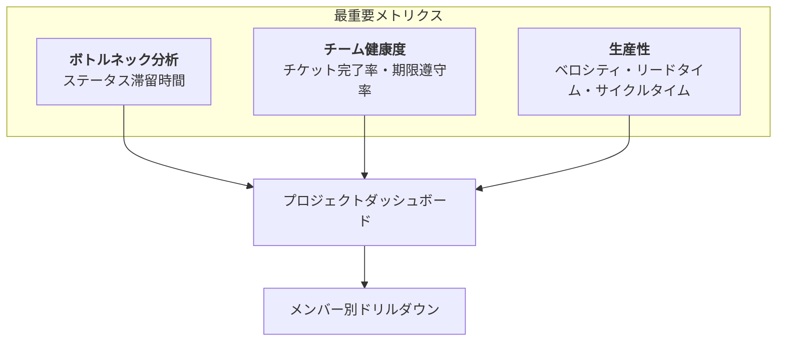
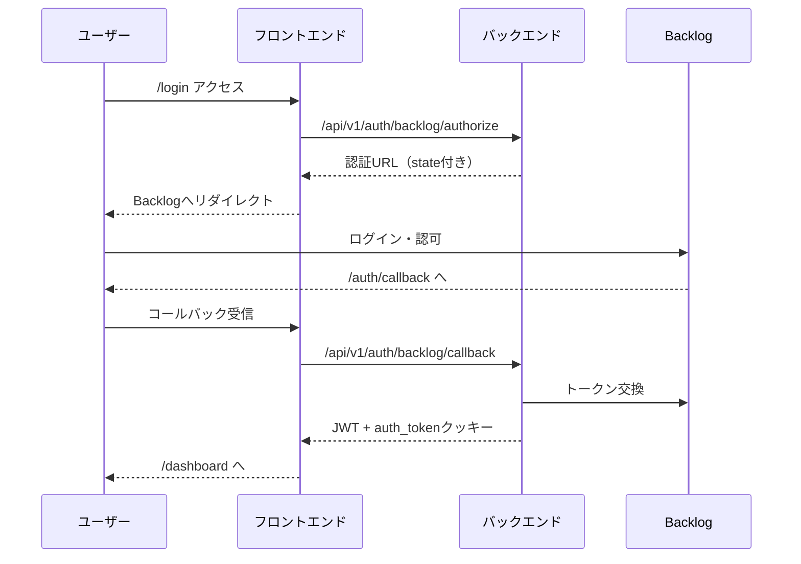

# Team Insight MVP 仕様書（統合版）

## 1. プロダクト概要

### 1.1 プロダクトの目的 (Why)

このツールは、プロジェクト管理に Backlog を利用している開発チーム全体を対象とします。開発マネージャーやチームリーダーが直面する「チームの状況が感覚的にしか分からない」「どのプロセスに問題があるか特定できない」といった課題を解決すると同時に、**チームメンバー個人も自身のパフォーマンスを把握できる**環境を提供します。階層的な権限管理により、役割に応じた適切な情報アクセスを実現し、**データに基づいた意思決定**を組織全体で支援します。

### 1.2 MVP のゴール (What)

MVP（Minimum Viable Product）のゴールは、**「個人・プロジェクト・組織の各レベルで生産性とボトルネックを可視化する」**というコア価値を、1.5〜2 ヶ月でユーザーに提供することです。権限管理システムを含めた基本機能を実装し、セキュアで拡張性のあるプラットフォームの基盤を構築します。

### 1.3 ユーザーロールと提供価値

| ロール                   | 主な利用者                     | 提供価値                                               |
| ------------------------ | ------------------------------ | ------------------------------------------------------ |
| **メンバー**             | 開発者、デザイナー等           | 自身の作業効率を把握し、個人の成長を促進               |
| **プロジェクトリーダー** | チームリード、スクラムマスター | チームの健康状態を監視し、ボトルネックを早期発見       |
| **管理者**               | 開発マネージャー、CTO          | 組織全体のパフォーマンスを分析し、リソース配分を最適化 |

---

## 2. 現在の実装状況

### ✅ 実装済み機能

- **Backlog OAuth 2.0 認証**: 完全動作する OAuth 認証フロー
- **JWT トークン認証**: HttpOnly クッキーによるセキュアなセッション管理
- **基本的なプロジェクト構造**: Docker 環境、FastAPI + Next.js 14 の基盤
- **データベース基盤**: PostgreSQL + Redis 環境構築済み

### 🚧 実装中/未実装機能

- **権限管理システム**: データベース設計済み、実装待ち
- **ダッシュボード機能**: 設計済み、実装待ち
- **データ同期機能**: Backlog からのデータ取得・同期
- **可視化機能**: D3.js によるチャート実装

---

## 3. URL 構成

権限管理を考慮した、シンプルで分かりやすい URL 構成を定義します。LP とアプリケーションを明確に分離した設計です。

| URL                              | 画面/機能                      | アクセス可能者           | 実装状況 | 説明                                               |
| :------------------------------- | :----------------------------- | :----------------------- | :------- | :------------------------------------------------- |
| `/`                              | **ランディングページ（LP）**   | 全員                     | ✅       | Team Insight の紹介、機能説明、ログイン CTA        |
| `/login`                         | ログインページ                 | 未ログインユーザー       | ✅       | Backlog アカウントでのログインを開始するページ     |
| `/auth/callback`                 | 認証コールバック               | （システム用）           | ✅       | Backlog OAuth 2.0 の認証後にリダイレクトされる URL |
| `/dashboard`                     | **ダッシュボードホーム**       | 全員（要ログイン）       | 🚧       | ログイン後のホーム画面。ロールに応じた導線を表示   |
| `/dashboard/personal`            | **個人ダッシュボード**         | 全員（要ログイン）       | 📋       | 自分の作業状況とパフォーマンスを表示               |
| `/projects`                      | プロジェクト一覧               | 全員（要ログイン）       | 📋       | アクセス可能なプロジェクトの一覧を表示             |
| `/dashboard/project/{projectId}` | **プロジェクトダッシュボード** | プロジェクトリーダー以上 | 📋       | 指定されたプロジェクトの分析結果を表示             |
| `/dashboard/organization`        | **組織ダッシュボード**         | 管理者のみ               | 📋       | 組織全体の分析結果を表示                           |
| `/admin/users`                   | ユーザー管理                   | 管理者のみ               | 📋       | ユーザーのロール設定と管理                         |
| `/admin/settings`                | システム設定                   | 管理者のみ               | 📋       | システム全体の設定管理                             |
| `/403`                           | アクセス拒否                   | 全員                     | 📋       | 権限不足時のエラーページ                           |
| `/api/v1/...`                    | バックエンド API               | （JWT 認証）             | 🚧       | フロントエンドがデータを取得するための API 群      |

**凡例**: ✅ 実装済み / 🚧 実装中 / 📋 未実装

---

## 4. Phase 1: 強化版 MVP の実装内容

このフェーズで、ユーザーが最初の価値を感じられる「リリース可能なプロダクト」を目指します。D3.js の導入を前提とし、初期から高品質な可視化基盤を構築します。

### 4.1 基盤機能（優先度: 高）

#### ✅ 実装済み

- **Backlog OAuth 2.0 認証**: 安全なログインと API アクセス権限の管理
- **JWT 認証基盤**: セキュアなセッション管理

#### 🚧 実装予定

- **権限管理システム**: 3 つのロール（メンバー、プロジェクトリーダー、管理者）による階層的アクセス制御
- **データ同期**: Backlog のチケットと Git 情報を定期的に同期するバッチ処理（1 時間ごと）
- **プロジェクト選択 UI**: 複数プロジェクトから分析対象を選択できる直感的なインターフェース

### 4.2 ダッシュボード機能（優先度: 高）

#### 個人ダッシュボード（全メンバー向け）

- **個人 KPI サマリー**: 完了タスク数、平均処理時間、進行中タスク、レビュー待ち
- **個人の作業フロー分析**: 自分のタスクがどのステータスで時間がかかっているか
- **個人の生産性トレンド**: 完了タスク数と処理時間の推移

#### プロジェクトダッシュボード（プロジェクトリーダー以上）

##### コアメトリクス



##### 主要機能

- **ボトルネック分析 (D3.js)**

  - 各ステータスでの平均滞留時間を横棒グラフで可視化
  - 異常に長い滞留時間は赤色で強調表示
  - ホバー時：詳細情報をツールチップ表示
  - クリック時：該当課題一覧をモーダル表示

- **チーム健康度指標**

  - チケット完了率、期限遵守率の表示
  - 前期間比較での改善/悪化を色分け表示

- **生産性トレンド (D3.js)**
  - リードタイムと完了チケット数の時系列推移
  - ベロシティチャートによるスプリント比較

#### 組織ダッシュボード（管理者のみ）

- **組織 KPI サマリー**: 総ベロシティ、平均リードタイム、アクティブプロジェクト数
- **プロジェクト比較分析**: 各プロジェクトのパフォーマンス比較
- **リソース配分と効率性**: プロジェクト別のメンバー配置と生産性の相関

### 4.3 ユーザビリティ強化機能（優先度: 中-高）

#### エラーハンドリングの強化

- **ユーザーフレンドリーなエラーメッセージ**: 技術的なエラーを分かりやすい言葉で説明
- **リトライ機能**: ネットワークエラー時の自動/手動リトライ
- **フォールバック表示**: データ取得失敗時も最低限の情報を表示
- **エラーログ収集**: Sentry による問題の早期発見と改善

#### リアルタイム更新機能

- **自動更新**: ダッシュボードのデータを定期的に最新化（設定可能）
- **更新通知**: 新しいデータが利用可能になったときの視覚的な通知
- **手動更新ボタン**: ユーザーが任意のタイミングでデータを更新
- **更新インジケーター**: データ同期中であることを示すローディング表示

### 4.4 管理機能（優先度: 中）

#### ユーザー管理

- **ユーザー一覧**: ロール、最終ログイン日時の表示
- **ロール設定**: 管理者によるロールの追加・削除
- **監査ログ**: 権限変更の履歴追跡
- **Backlog 同期**: ユーザー情報の手動同期機能

---

## 5. 実装優先度マトリックス

| 機能                                   | 重要度 | 実装難易度 | 実装状況  | 推奨実装順 | 実装期間 |
| :------------------------------------- | :----- | :--------- | :-------- | :--------- | :------- |
| Backlog 認証・データ取得               | **高** | 中         | ✅ 完了   | -          | -        |
| JWT トークン認証                       | **高** | 中         | ✅ 完了   | -          | -        |
| 権限管理システム（DB・API）            | **高** | 中         | 🚧 設計済 | **1**      | 3-4 日   |
| プロジェクト選択 UI                    | **高** | 低         | 📋        | **2**      | 1-2 日   |
| 個人ダッシュボード                     | **高** | 中         | 📋        | **3**      | 3-4 日   |
| **チームボトルネック分析**             | **高** | **高**     | 📋        | **4**      | 4-5 日   |
| チーム健康度・生産性                   | **高** | 低         | 📋        | **5**      | 2-3 日   |
| **基本ビジュアライゼーション (D3.js)** | **高** | **高**     | 📋        | **6**      | 3-4 日   |
| エラーハンドリング強化                 | 中     | 中         | 📋        | **7**      | 2-3 日   |
| リアルタイム更新機能                   | 中     | 中         | 📋        | **8**      | 3-4 日   |
| ユーザー管理画面                       | 中     | 低         | 📋        | **9**      | 2-3 日   |
| 組織ダッシュボード                     | 低     | 中         | 📋        | **10**     | 3-4 日   |

**Phase 1 完了目標**: 4-5 週間

---

## 6. 技術スタック（強化版）

```yaml
backend:
  基盤:
    - FastAPI (REST API + WebSocket対応) ✅
    - PostgreSQL (メインDB) ✅
    - Redis (キャッシュ + セッション管理) ✅
    - SQLAlchemy (ORM) ✅
  認証・セキュリティ:
    - Backlog OAuth 2.0 ✅
    - JWT (PyJWT) ✅
    - bcrypt (パスワードハッシュ) ✅
  新機能対応:
    - WebSocket (リアルタイム更新用)
    - Celery (非同期タスク処理・定期同期)
    - Sentry (エラートラッキング)

frontend:
  基盤:
    - Next.js 14 (App Router) ✅
    - TypeScript (型安全性) ✅
    - Tailwind CSS + shadcn/ui ✅
  状態管理:
    - Redux Toolkit ✅
    - React Query (データ同期・キャッシュ)
  可視化:
    - D3.js (メイン可視化ライブラリ)
    - Recharts (シンプルなグラフ用)
    - Framer Motion (アニメーション)
  新機能対応:
    - Socket.io-client (WebSocket通信)
    - React Error Boundary (エラーハンドリング)

infrastructure:
  開発環境:
    - Docker Compose ✅
    - Hot Reload対応 ✅
    - Nginx (リバースプロキシ) ✅
  本番環境:
    - AWS ECS Fargate
    - CloudFront (CDN)
    - RDS (PostgreSQL)
    - ElastiCache (Redis)
  監視・運用:
    - CloudWatch (ログ・メトリクス)
    - Sentry (エラー監視)
    - GitHub Actions (CI/CD)
```

---

## 7. 実装ロードマップ

### Week 1-2: 権限管理基盤

- [ ] 権限管理テーブルの実装（roles, user_roles, projects）
- [ ] 権限チェックミドルウェア・デコレータの実装
- [ ] ユーザー管理 API エンドポイント
- [ ] フロントエンド権限制御（PrivateRoute 改修）
- [ ] プロジェクト選択 UI の実装

### Week 3-4: ダッシュボード実装

- [ ] Backlog データ同期サービスの実装
- [ ] 個人ダッシュボードの実装
- [ ] プロジェクトダッシュボード（基本機能）
- [ ] KPI サマリーコンポーネント
- [ ] 基本的なグラフ実装（Recharts）

### Week 5: 高度な可視化と UX

- [ ] D3.js によるボトルネック分析チャート
- [ ] インタラクティブな機能（ドリルダウン等）
- [ ] エラーハンドリングの強化
- [ ] リアルタイム更新機能（基本）

### Week 6: 最適化とリリース準備

- [ ] パフォーマンス最適化
- [ ] セキュリティテスト
- [ ] ユーザビリティテスト
- [ ] ドキュメント整備
- [ ] 本番環境デプロイ準備

---

## 8. 差別化ポイント

### 1. **Backlog 完全特化**

- チケット情報から、他のツールでは見えない**「ステータス滞留時間」**を可視化
- Backlog 特有のワークフローに最適化された分析
- マルチプロジェクト対応で大規模チームにも対応

### 2. **高品質なビジュアライゼーション**

- **D3.js**を活用し、インタラクティブで美しいデータ表現
- レスポンシブ対応でどのデバイスでも快適に利用可能
- リアルタイム更新でダイナミックな体験を提供

### 3. **階層的な価値提供**

- メンバー：個人の成長をサポート
- リーダー：チームの健康状態を可視化
- 管理者：組織全体を俯瞰して最適化

### 4. **即座に価値を提供**

- インストール後すぐに分析結果が見られる
- 直感的な UI で学習コストがほぼゼロ
- 問題が起きても分かりやすいメッセージでユーザーをサポート

---

## 9. 成功指標

### 技術的指標

- API 応答時間: 95%tile < 200ms
- ダッシュボード読み込み時間: < 3 秒
- システム稼働率: > 99.5%
- データ同期成功率: > 99.5%

### ビジネス指標

- 導入チーム数: 初月で 10 チーム、3 ヶ月で 50 チーム
- 週次アクティブユーザー率: > 60%
- ユーザー満足度スコア: > 4.0/5.0
- データに基づく改善施策の実施数

### セキュリティ指標

- 不正アクセス試行の検知率: 100%
- 権限エラーの適切な処理率: 100%
- 監査ログの完全性: 100%

---

## 10. 今後の拡張（Phase 2 以降）

### Phase 2: 分析能力の拡張（3-4 ヶ月目）

- **Four Keys 指標**: デプロイ頻度、変更のリードタイム、変更失敗率、MTTR
- **貢献度分析**: Git データを活用した個人の開発アクティビティ可視化
- **高度な D3.js 可視化**: ヒートマップ、サンキーダイアグラム、ネットワークグラフ

### Phase 3: エンタープライズ機能（5-6 ヶ月目）

- **AI 分析機能**: 機械学習によるボトルネック予測
- **カスタムメトリクス**: ユーザー定義の分析指標
- **Slack/Teams 連携**: 重要な指標の自動通知
- **詳細な権限制御**: 特定のメトリクスへのアクセス制御
- **マルチテナント対応**: 複数組織での利用

---

## 付録: 認証システムの実装詳細

### 認証フロー（実装済み）



### セキュリティ実装

- **CSRF 対策**: state パラメータによる検証
- **XSS 対策**: HttpOnly クッキー使用
- **JWT 有効期限**: 30 分（設定可能）
- **ミドルウェア**: Next.js でのルート保護実装済み
