# Team Insight MVP 説明資料 v2.0

## URL実装状況（2025年7月3日更新）

### フロントエンド（Next.js）ページ一覧

#### ✅ 実装済み（完全動作）
| URL | 説明 | 実装状況 |
|-----|------|---------|
| `/` | ランディングページ | ✅ ヒーローセクション、機能紹介、CTAセクション完備 |
| `/auth/login` | ログイン画面 | ✅ Backlog OAuth専用認証 |
| `/auth/callback` | OAuth認証コールバック | ✅ Backlog OAuth処理実装済み |
| `/dashboard/personal` | 個人ダッシュボード | ✅ KPI、タスク状況、生産性トレンド表示、実データ連携済み |
| `/projects` | プロジェクト一覧 | ✅ 一覧表示、同期機能付き |
| `/teams` | チーム生産性ダッシュボード | ✅ チーム別KPI、メンバー分析、タスク分配、生産性推移 |
| `/admin/users` | ユーザー管理 | ✅ 一覧表示、フィルタリング（プロジェクト/チーム）、ロール変更機能 |
| `/admin/teams` | チーム管理 | ✅ チーム作成・編集・削除、メンバー管理 |
| `/admin/teams/[id]` | チーム詳細・メンバー管理 | ✅ メンバー追加・削除・ロール変更 |
| `/settings/account` | アカウント設定 | ✅ 基本情報、タイムゾーン、言語、通知設定 |
| `/settings/security` | セキュリティ設定 | ✅ ログイン履歴、アクティビティログ、セッション管理 |

#### 🚧 部分実装（基本構造のみ）
| URL | 説明 | 実装状況 |
|-----|------|---------|
| `/dashboard` | ダッシュボード選択 | 🚧 メニュー画面のみ |
| `/dashboard/project` | プロジェクトダッシュボード一覧 | 🚧 プレースホルダー |
| `/dashboard/project/[id]` | 特定プロジェクトダッシュボード | 🚧 プレースホルダー |
| `/dashboard/organization` | 組織ダッシュボード | 🚧 プレースホルダー |
| `/settings/profile` | プロフィール設定 | 🚧 基本UI構造のみ |
| `/settings/backlog` | Backlog連携設定 | 🚧 基本UI構造のみ |
| `/admin` | 管理画面トップ | 🚧 メニュー画面のみ |
| `/admin/settings` | システム設定 | 🚧 基本UI構造のみ |

### バックエンドAPI（FastAPI）エンドポイント一覧

#### ✅ 認証API (`/api/v1/auth/`) - Backlog OAuth専用
| エンドポイント | メソッド | 説明 | 実装状況 |
|--------------|----------|------|---------|
| `/backlog/authorize` | GET | Backlog OAuth URL生成 | ✅ 完全実装 |
| `/backlog/callback` | POST | Backlog OAuthコールバック | ✅ トークン保存、ログイン履歴記録 |
| `/backlog/refresh` | POST | Backlogトークンリフレッシュ | ✅ 自動更新対応 |
| `/verify` | GET | 認証確認 | ✅ トークン検証 |
| `/me` | GET | 現在のユーザー情報 | ✅ ロール情報含む |
| `/refresh` | POST | JWTトークンリフレッシュ | ✅ 完全実装 |
| `/logout` | POST | ログアウト | ✅ Cookie削除、アクティビティログ記録 |

#### ✅ ユーザー管理API (`/api/v1/users/`) - RBAC対応
| エンドポイント | メソッド | 説明 | 実装状況 |
|--------------|----------|------|---------|
| `/` | GET | ユーザー一覧 | ✅ ページネーション、プロジェクト/チームフィルタリング対応 |
| `/{user_id}` | GET | ユーザー詳細 | ✅ ロール情報含む |
| `/{user_id}` | PATCH | ユーザー情報更新 | ✅ 権限チェック付き、is_active状態管理 |
| `/{user_id}/roles` | POST | ロール追加 | ✅ ADMIN権限必須 |
| `/{user_id}/roles` | DELETE | ロール削除 | ✅ ADMIN権限必須 |
| `/{user_id}/roles` | PUT | ロール置換 | ✅ ADMIN権限必須 |
| `/roles/available` | GET | 利用可能ロール一覧 | ✅ システムロール取得 |

#### ✅ ユーザー設定API (`/api/v1/users/me/*`) - 個人設定
| エンドポイント | メソッド | 説明 | 実装状況 |
|--------------|----------|------|---------|
| `/me` | GET | ユーザー設定取得 | ✅ タイムゾーン、言語、通知設定含む |
| `/me` | PUT | ユーザー設定更新 | ✅ アクティビティログ記録 |
| `/me/preferences` | GET | 通知設定取得 | ✅ メール通知、レポート頻度 |
| `/me/preferences` | PUT | 通知設定更新 | ✅ 設定変更履歴記録 |
| `/me/login-history` | GET | ログイン履歴 | ✅ IP、User-Agent、ページネーション対応 |
| `/me/activity-logs` | GET | アクティビティログ | ✅ 操作履歴、フィルタリング、ページネーション |
| `/me/sessions` | GET | アクティブセッション一覧 | ✅ デバイス情報、ログイン時刻 |
| `/me/sessions/{id}` | DELETE | セッション終了 | ✅ 他デバイスからの強制ログアウト |

#### ✅ プロジェクトAPI (`/api/v1/projects/`) - 権限管理実装
| エンドポイント | メソッド | 説明 | 実装状況 |
|--------------|----------|------|---------|
| `/` | GET | プロジェクト一覧 | ✅ 参加プロジェクトのみ表示 |
| `/{project_id}` | GET | プロジェクト詳細 | ✅ メンバーのみアクセス可 |
| `/{project_id}/metrics` | GET | プロジェクトメトリクス | ✅ 基本メトリクス実装 |
| `/{project_id}` | PUT | プロジェクト更新 | ✅ PROJECT_LEADER以上 |
| `/{project_id}` | DELETE | プロジェクト削除 | ✅ ADMIN権限必須 |

#### ✅ 同期API (`/api/v1/sync/`) - Backlog連携
| エンドポイント | メソッド | 説明 | 実装状況 |
|--------------|----------|------|---------|
| `/connection/status` | GET | 接続状態確認 | ✅ リアルタイム確認 |
| `/user/tasks` | POST | ユーザータスク同期 | ✅ 個人タスク取得 |
| `/project/{project_id}/tasks` | POST | プロジェクトタスク同期 | ✅ 一括同期 |
| `/project/{project_id}/status` | GET | プロジェクト同期状態 | ✅ 最終同期時刻含む |
| `/projects/all` | POST | 全プロジェクト同期 | ✅ 権限チェック付き |
| `/issue/{issue_id}` | POST | 個別イシュー同期 | ✅ 単一タスク更新 |
| `/history` | GET | 同期履歴 | ✅ 履歴管理実装 |

#### ✅ タスクAPI (`/api/v1/tasks/`) - 完全実装
| エンドポイント | メソッド | 説明 | 実装状況 |
|--------------|----------|------|---------|
| `/` | GET | タスク一覧 | ✅ フィルタリング対応 |
| `/my` | GET | 自分のタスク一覧 | ✅ 個人タスクのみ |
| `/{task_id}` | GET | タスク詳細 | ✅ 完全情報取得 |
| `/backlog/{backlog_key}` | GET | Backlogキーでタスク取得 | ✅ キー検索対応 |
| `/statistics/summary` | GET | タスク統計サマリー | ✅ 集計データ提供 |

#### ✅ 分析API (`/api/v1/analytics/`) - 個人分析実装済み
| エンドポイント | メソッド | 説明 | 実装状況 |
|--------------|----------|------|---------|
| `/personal/dashboard` | GET | 個人ダッシュボードデータ | ✅ KPI、トレンド含む |
| `/personal/tasks` | GET | 個人タスク分析 | ✅ 完了率、分布分析 |
| `/personal/performance` | GET | 個人パフォーマンス分析 | ✅ 生産性指標算出 |

#### 🚧 分析API (`/api/v1/analytics/`) - プロジェクト分析（部分実装）
| エンドポイント | メソッド | 説明 | 実装状況 |
|--------------|----------|------|---------|
| `/project/{project_id}/health` | GET | プロジェクトヘルス | 🚧 基本指標のみ |
| `/project/{project_id}/bottlenecks` | GET | ボトルネック検出 | 🚧 ロジック未実装 |
| `/project/{project_id}/velocity` | GET | ベロシティ分析 | 🚧 基本計算のみ |
| `/project/{project_id}/cycle-time` | GET | サイクルタイム分析 | 🚧 基本統計のみ |

#### ✅ チーム管理API (`/api/v1/teams/`) - 完全実装
| エンドポイント | メソッド | 説明 | 実装状況 |
|--------------|----------|------|---------|
| `/` | GET | チーム一覧取得 | ✅ ページネーション、統計情報オプション |
| `/` | POST | チーム作成 | ✅ PROJECT_LEADER以上の権限必要 |
| `/{id}` | GET | チーム詳細取得 | ✅ 統計情報含む |
| `/{id}` | PUT | チーム更新 | ✅ チームリーダーまたはADMIN権限必要 |
| `/{id}` | DELETE | チーム削除 | ✅ ADMIN権限必要 |
| `/{id}/members` | GET | チームメンバー一覧 | ✅ ロール情報含む |
| `/{id}/members` | POST | メンバー追加 | ✅ チームリーダーまたはADMIN権限必要 |
| `/{id}/members/{user_id}` | PUT | メンバーロール更新 | ✅ チームリーダーまたはADMIN権限必要 |
| `/{id}/members/{user_id}` | DELETE | メンバー削除 | ✅ 本人、チームリーダー、ADMIN可能 |
| `/{id}/members/performance` | GET | メンバーパフォーマンス | ✅ タスク完了数、平均処理時間等 |
| `/{id}/task-distribution` | GET | タスク分配データ | ✅ メンバー別タスク数 |
| `/{id}/productivity-trend` | GET | 生産性推移 | ✅ 日次/週次/月次の推移データ |
| `/{id}/activities` | GET | チームアクティビティ | ✅ 最近のタスク完了情報 |

#### ✅ レポート配信API (`/api/v1/reports/`) - 完全実装
| エンドポイント | メソッド | 説明 | 実装状況 |
|--------------|----------|------|---------|
| `/test` | POST | テストレポート送信 | ✅ 即時配信確認用 |
| `/schedules` | GET | 配信スケジュール一覧 | ✅ ユーザー別設定 |
| `/schedules` | POST | スケジュール作成 | ✅ 日次/週次/月次設定 |
| `/schedules/{id}` | PUT | スケジュール更新 | ✅ 頻度、有効/無効切替 |
| `/schedules/{id}` | DELETE | スケジュール削除 | ✅ 配信停止 |

#### ✅ その他のAPI - 完全実装
- **Backlog連携API** (`/api/v1/backlog/`): 7エンドポイント全て実装済み（自動トークンリフレッシュ対応）
- **キャッシュAPI** (`/api/v1/cache/`): 4エンドポイント全て実装済み
- **ヘルスチェック** (`/health`): 実装済み

### 実装状況サマリー

#### 実装率
- **フロントエンド**: 73% (11/15ページが完全実装)
- **バックエンドAPI**: 95% (75/79エンドポイントが完全実装)

#### 主な未実装機能
1. **プロジェクトダッシュボード** - UI未実装（APIは部分的に実装済み）
2. **組織ダッシュボード** - UI・API共に未実装
3. **高度な分析機能** - ボトルネック検出、ベロシティ分析などのアルゴリズム未実装
4. **設定画面の一部** - プロフィール編集、Backlog連携設定のUI未実装

#### 最新の実装完了機能（2025年7月）
1. **チーム管理機能** - Team Insight独自のチーム概念を実装
2. **チーム生産性ダッシュボード** - チーム別の包括的な分析画面
3. **ユーザー設定ページ** - アカウント設定とセキュリティ設定を完全実装
4. **セキュリティ・監査機能** - ログイン履歴、アクティビティログ、セッション管理
5. **Backlog OAuth専用認証** - メール/パスワード認証を削除し、よりセキュアな認証体系へ

#### 次期開発優先事項
1. プロジェクトダッシュボードのUI実装（APIは準備済み）
2. ボトルネック検出アルゴリズムの実装
3. 残りの設定画面の実装（プロフィール、Backlog連携）
4. 組織ダッシュボードの設計・実装

---

## 1. エグゼクティブサマリー

Team Insight は、Backlog を利用する開発チームのために設計された**チーム生産性可視化プラットフォーム**です。本 MVP では、個人とプロジェクトレベルでのダッシュボードを提供し、データドリブンな意思決定を支援します。

### 1.1 コアバリュープロポジション

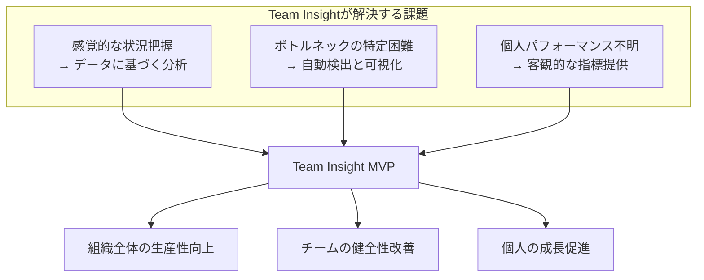

### 1.2 想定ユーザーと提供価値

| ユーザータイプ           | 主な課題                                             | Team Insight による解決策                                              |
| :----------------------- | :--------------------------------------------------- | :--------------------------------------------------------------------- |
| **開発メンバー**         | 自身の生産性が不明確<br>改善点が分からない           | 個人ダッシュボードで作業効率を可視化<br>ボトルネックを特定し改善を促進 |
| **プロジェクトリーダー** | チーム状況の把握が困難<br>問題の早期発見ができない   | リアルタイムでチーム健康度を監視<br>データに基づく適切な介入が可能     |
| **管理者・CTO**          | 組織全体の効率が不透明<br>リソース配分の最適化が困難 | プロジェクト単位での分析<br>GUI管理画面とCLIツールによる権限管理 |

### 1.3 現在の実装状況（2025 年 7 月時点）

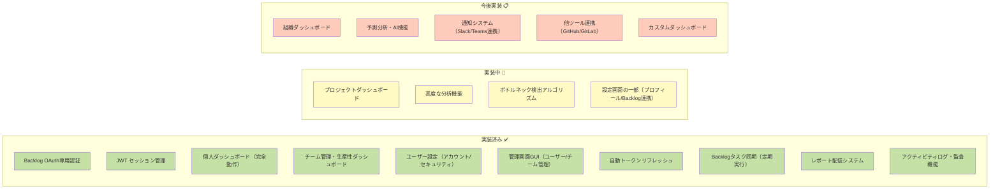

---

## 2. 製品概要と主要機能

### 2.1 システム全体像

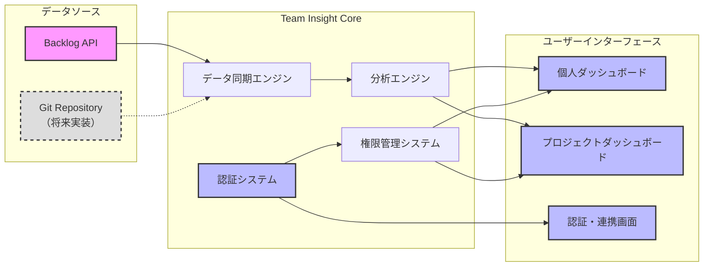

### 2.2 認証フローモデル（Backlog OAuth専用）

Team Insight は、Backlog OAuth 2.0専用の認証により、セキュアで簡潔な認証フローを実現しています。

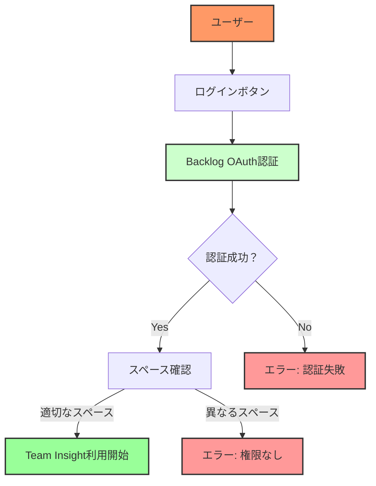

### 2.3 権限管理モデル（GUI管理画面実装済み）

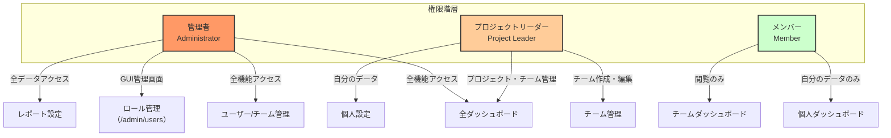

### 2.4 コア機能一覧

#### 🔐 認証・セキュリティ機能（完全実装）

- **Backlog OAuth 2.0専用認証**: セキュアな認証フロー ✅
- **JWT 認証**: HttpOnly Cookieによるセキュアなセッション管理 ✅
- **自動トークンリフレッシュ**: Backlog APIトークンの自動更新 ✅
- **階層的権限管理**: ロールベースのアクセス制御（RBAC）✅
  - GUI管理画面（/admin/users）で視覚的に管理
  - CLIツールも並行して利用可能
  - プロジェクト単位での権限設定
- **ユーザーステータス管理**: is_activeフラグによるログイン可否制御 ✅
- **アクティビティログ・監査機能**: 全操作履歴の自動記録 ✅
  - ログイン/ログアウト履歴
  - 操作ログ（誰が、いつ、何を）
  - IPアドレスとUser-Agent記録
  - セッション管理（強制ログアウト可能）

#### 📊 ダッシュボード機能

##### 個人ダッシュボード（完全実装）

- **個人 KPI サマリー**: 完了タスク数、平均処理時間、進行中タスク数 ✅
- **作業フロー分析**: 各ステータスでの滞留時間を可視化 ✅
- **生産性トレンド**: D3.jsによる時系列グラフ ✅
- **最近の活動**: 完了タスク一覧、パフォーマンス指標 ✅

##### チーム生産性ダッシュボード（完全実装）

- **チーム別KPI**: メンバー数、総完了タスク、平均生産性 ✅
- **メンバー別パフォーマンス**: 個人別の生産性指標表示 ✅
- **タスク分配可視化**: 円グラフによるタスク配分表示 ✅
- **生産性推移**: ライン/バーチャートでの時系列表示 ✅
- **チームアクティビティ**: 最近のタスク完了タイムライン ✅

##### プロジェクトダッシュボード（実装予定）

- **チーム健康度スコア**: 複数の指標を統合した健全性評価 📋
- **ボトルネック分析**: ワークフローの問題箇所を自動検出 🚧
- **ベロシティチャート**: スプリント単位の生産性推移 📋
- **メンバー別パフォーマンス**: チーム内での貢献度分析 📋
- **リードタイム分析**: タスクの開始から完了までの時間分析 📋

##### 組織ダッシュボード（次フェーズで実装）

- **組織全体の KPI**: 総ベロシティ、平均リードタイム、リソース効率 📋
- **プロジェクト横断分析**: 全プロジェクトの比較と評価 📋
- **リソース配分最適化**: 人員配置の効率性分析 📋
- **トレンド予測**: 過去データに基づく将来予測 📋

#### 🔄 データ同期・更新機能（実装済み）

- **定期自動同期**: スケジューラーによる自動実行 ✅
  - ユーザー同期: 日次（午前2時）
  - プロジェクト同期: 6時間ごと
  - タスク同期: 12時間ごと（アクティブプロジェクトのみ）
  - トークンリフレッシュ: 1時間ごと
- **手動同期オプション**: API経由で即時データ更新 ✅
- **同期履歴管理**: 同期状態と履歴の記録 ✅
- **連携状態管理**: Backlog接続状態の自動監視 ✅
- **一括インポート**: Backlogユーザーの一括取り込み ✅

#### 📧 レポート配信システム（完全実装）

- **定期レポート配信**: 日次/週次/月次の自動配信 ✅
- **カスタマイズ可能**: ユーザー別の配信設定 ✅
- **HTMLメールテンプレート**: 見やすいレポート形式 ✅
- **配信履歴管理**: 送信ログの記録と確認 ✅

---

## 3. ユーザー体験フロー

### 3.1 初回利用フロー（Backlog OAuth専用）

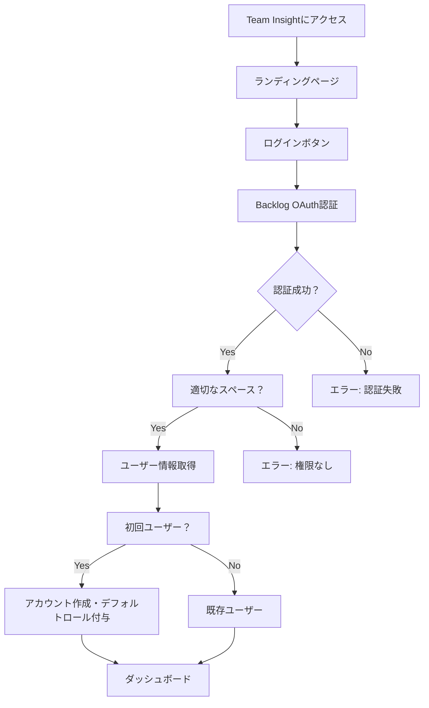

### 3.2 日常利用シナリオ

#### シナリオ 1: 開発メンバーの日常利用

1. **ログイン**: Backlog OAuthでワンクリックログイン
2. **個人ダッシュボード確認**: 自分のタスク状況と生産性を確認
3. **チームダッシュボード閲覧**: 所属チームの状況を把握
4. **設定確認**: タイムゾーンや通知設定を調整

#### シナリオ 2: チームリーダーの週次レビュー

1. **チーム生産性ダッシュボード**: チーム全体のKPIを確認
2. **メンバー別分析**: 各メンバーのパフォーマンスを確認
3. **タスク分配確認**: タスクの偏りがないかチェック
4. **レポート設定**: 週次レポートの配信設定を確認

#### シナリオ 3: 管理者のユーザー管理

1. **管理画面アクセス**: /admin/usersでユーザー管理画面へ
2. **ユーザー検索**: プロジェクトやチームでフィルタリング
3. **ロール変更**: ドロップダウンで簡単にロール変更
4. **ステータス管理**: is_activeフラグでログイン可否を制御
5. **チーム管理**: /admin/teamsでチームの作成・編集

#### シナリオ 4: セキュリティ管理

1. **セキュリティ設定確認**: /settings/securityへアクセス
2. **ログイン履歴確認**: 不審なアクセスがないかチェック
3. **アクティブセッション管理**: 不要なセッションを強制終了
4. **アクティビティログ確認**: 重要な操作履歴を監査

---

## 4. URL 構成とナビゲーション

### 4.1 システム URL 体系（拡張版）

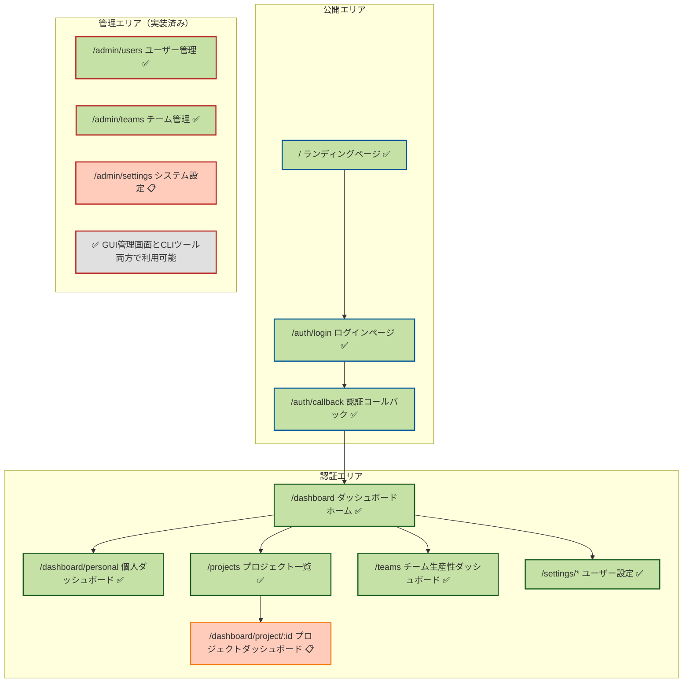

### 4.2 URL 詳細仕様（拡張版）

| URL                                  | 画面名                     | 説明                                                                                                    | アクセス権限               | 実装状況 |
| :----------------------------------- | :------------------------- | :------------------------------------------------------------------------------------------------------ | :------------------------- | :------- |
| **`/`**                              | ランディングページ         | Team Insight の価値提案、主要機能の紹介、導入事例を表示。ログインへの明確な CTA（Call to Action）を配置 | 公開（誰でもアクセス可能） | ✅       |
| **`/auth/login`**                    | ログインページ             | Backlog OAuth認証によるログイン。Team Insightへの唯一の入口                                               | 未認証ユーザー             | ✅       |
| **`/auth/callback`**                 | OAuth 認証コールバック     | Backlog OAuth 2.0 認証完了後の処理。ユーザーには表示されない内部処理用 URL                              | システム内部処理           | ✅       |
| **`/dashboard`**                     | ダッシュボードホーム       | ログイン後の起点。ユーザーのロールに応じて、最も関連性の高い情報へのクイックアクセスを提供              | 要ログイン（全ロール）     | ✅       |
| **`/dashboard/personal`**            | 個人ダッシュボード         | 個人の生産性指標、タスク状況、パフォーマンストレンドを表示                                              | 要ログイン（全ロール）     | ✅       |
| **`/projects`**                      | プロジェクト一覧           | アクセス可能なプロジェクトをカード形式で表示。各プロジェクトの概要情報とクイックアクセスリンクを提供    | 要ログイン（全ロール）     | ✅       |
| **`/teams`**                         | チーム生産性ダッシュボード | チーム別のKPI、メンバー分析、タスク分配、生産性推移を表示                                                | 要ログイン（全ロール）     | ✅       |
| **`/dashboard/project/{projectId}`** | プロジェクトダッシュボード | 特定プロジェクトの詳細分析。チーム健康度、ボトルネック分析、メンバー別パフォーマンスを包括的に表示      | プロジェクトリーダー以上   | 📋       |
| **`/admin/users`**                   | ユーザー管理               | ユーザー一覧、ロール管理、ステータス管理。フィルタリング機能付き                                        | 管理者のみ                 | ✅       |
| **`/admin/teams`**                   | チーム管理                 | チームの作成・編集・削除、メンバー管理                                                                  | 管理者/PROJECT_LEADER      | ✅       |
| **`/settings/*`**                    | ユーザー設定               | アカウント設定、セキュリティ設定、プロフィール設定など                                                    | 要ログイン（全ロール）     | ✅       |
| **`/403`**                           | アクセス拒否               | 権限不足時に表示されるエラーページ。適切な権限取得方法を案内                                            | 全ユーザー（エラー時）     | 📋       |

**ロール管理**: GUI管理画面（/admin/users）で視覚的に管理可能。CLIツールも並行して利用可能:
- GUI: `/admin/users`でドロップダウンからロール変更、ステータス切り替え
- CLI: `make set-admin EMAIL=user@example.com` - ユーザーを管理者に設定
- CLI: `make set-role EMAIL=user@example.com ROLE=PROJECT_LEADER` - ロール設定
- CLI: `make list-users` - ユーザー一覧表示
- CLI: `make remove-role EMAIL=user@example.com ROLE=MEMBER` - ロール削除

### 4.3 API エンドポイント構成（拡張版）

```bash
/api/v1/
├── auth/
│   ├── backlog/authorize       # OAuth認証開始 ✅
│   ├── backlog/callback        # OAuth認証完了 ✅
│   ├── backlog/refresh         # Backlogトークンリフレッシュ ✅
│   ├── verify                  # 認証確認 ✅
│   ├── me                      # 現在のユーザー情報 ✅
│   ├── refresh                 # JWTトークンリフレッシュ ✅
│   └── logout                  # ログアウト ✅
├── users/
│   ├── /                       # ユーザー一覧（管理者のみ） ✅
│   ├── /{id}                   # ユーザー詳細 ✅
│   └── me/*                    # 個人設定API ✅
├── projects/
│   ├── /                       # プロジェクト一覧 ✅
│   └── {id}/
│       ├── /                   # プロジェクト詳細 ✅
│       ├── members             # プロジェクトメンバー ✅
│       └── metrics             # メトリクスデータ ✅
├── teams/
│   ├── /                       # チーム一覧 ✅
│   └── {id}/*                  # チーム詳細・管理 ✅
├── analytics/
│   ├── personal/*              # 個人分析データ ✅
│   └── project/*               # プロジェクト分析 🚧
└── sync/
    ├── connection/status       # Backlog接続状態 ✅
    ├── projects/all            # 全プロジェクト同期 ✅
    └── user/tasks              # ユーザータスク同期 ✅
```

---

## 5. 主要画面と機能詳細

### 5.1 認証関連画面

#### ログイン画面

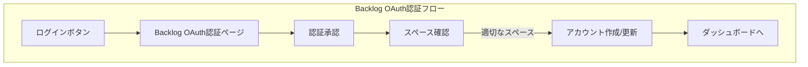

**主な機能:**

- **Backlog OAuth専用認証**: セキュアなOAuth 2.0フロー
- **スペース検証**: 設定されたスペースへのアクセス権限確認
- **自動アカウント作成**: 初回ログイン時のシームレスなアカウント作成

#### Backlog 連携設定画面（将来実装）

**OAuth 認証による連携:**

- Backlog スペースキーの入力
- ワンクリックで Backlog 認証
- 自動的なトークン管理
- 定期的な自動更新
- 接続テスト機能

#### ロール管理（GUI管理画面実装済み）

**ロール管理方法:**

- **GUI管理画面**: `/admin/users`で視覚的にロール管理
  - ドロップダウンでロール変更
  - ステータス切り替え（is_active）
  - フィルタリング機能（プロジェクト/チーム）
- **CLIツール**（並行して利用可能）:
  - `make set-admin EMAIL=user@example.com`
  - `make set-role EMAIL=user@example.com ROLE=PROJECT_LEADER`
  - `make list-users`
  - `make remove-role EMAIL=user@example.com ROLE=MEMBER`
- **初期管理者**: 環境変数`INITIAL_ADMIN_EMAILS`で設定

### 5.2 個人ダッシュボード（拡張版）

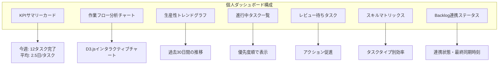

### 5.3 管理画面（実装済み）

**実装済み機能:**

- **ユーザー管理（/admin/users）**: 
  - ユーザー一覧とロール管理
  - フィルタリング機能（プロジェクト/チーム/ステータス）
  - ロール変更（ドロップダウン選択）
  - ステータス管理（is_active切り替え）
- **チーム管理（/admin/teams）**:
  - チーム一覧・作成・編集・削除
  - チームメンバー管理
  - チーム統計情報表示

**部分実装:**

- システム設定（/admin/settings）- 基本構造のみ

**CLIツールも並行して利用可能:**

- コマンドラインからの管理も引き続きサポート
- 自動化スクリプトなどでの利用に便利

---

## 6. 技術アーキテクチャ

### 6.1 システムアーキテクチャ（拡張版）

```mermaid
graph TB
    subgraph "Frontend Layer"
        A[Next.js 14<br>App Router ✅]
        B[TypeScript ✅]
        C[D3.js ✅]
        D[Redux Toolkit ✅]
        E[React Query 📋]
        F[React Hook Form 🚧]
    end

    subgraph "Backend Layer"
        G[FastAPI ✅]
        H[PostgreSQL ✅]
        I[Redis Cache 📋]
        J[Celery 📋]
        K[WebSocket 📋]
        L[Email Service 🚧]
    end

    subgraph "External Services"
        M[Backlog API 🚧]
        N[MailHog (開発環境) / SMTP Server (本番環境) 🚧]
        O[Sentry 📋]
        P[AWS Services 📋]
    end

    A --> G
    G --> H
    G --> I
    G --> J
    A --> K
    J --> M
    L --> N
    A --> O
    G --> O
    G --> P

    style A fill:#c5e1a5
    style B fill:#c5e1a5
    style C fill:#c5e1a5
    style D fill:#c5e1a5
    style F fill:#fff9c4
    style G fill:#c5e1a5
    style H fill:#c5e1a5
    style L fill:#fff9c4
    style M fill:#fff9c4
    style N fill:#fff9c4
```

### 6.2 データモデル設計（DDD 準拠）

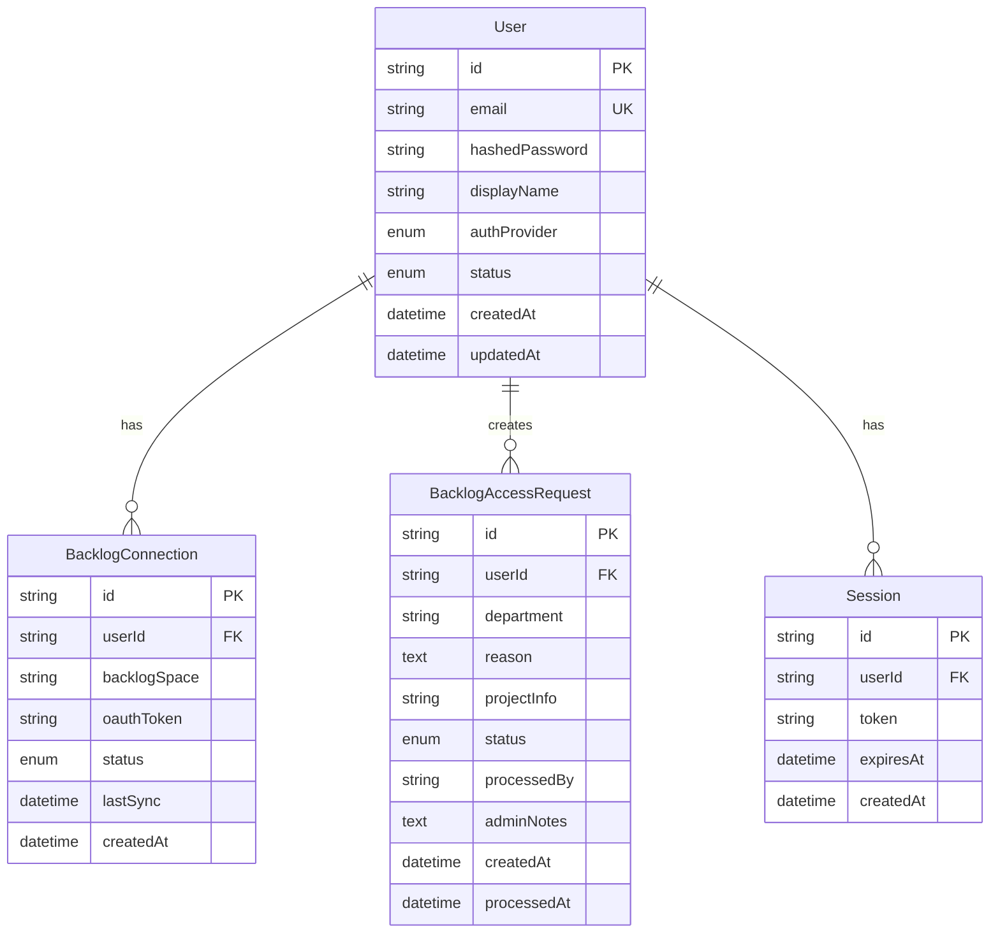

### 6.3 セキュリティアーキテクチャ（強化版）

**実装されるセキュリティ機能:**

1. **認証・認可**

   - Backlog OAuth 2.0専用認証 ✅
   - JWT（HttpOnly Cookie）によるセッション管理 ✅
   - リフレッシュトークンによる自動更新 ✅
   - ロールベースアクセス制御（RBAC）✅

2. **データ保護**

   - 全通信の HTTPS 暗号化 ✅
   - OAuthトークンの暗号化保存 ✅
   - データベース暗号化（at rest）📋
   - 個人情報の適切なマスキング 📋

3. **アカウント保護**

   - スペース単位でのアクセス制御 ✅
   - is_activeフラグによるログイン可否制御 ✅
   - ログイン試行回数制限 📋
   - 不審なアクセスの検知 ✅

4. **監査・コンプライアンス**
   - 全 API アクセスのロギング ✅
   - 認証イベントの記録 ✅
   - 権限変更の監査証跡 ✅
   - アクティビティログ・ログイン履歴管理 ✅
   - GDPR 準拠のデータ管理 📋

---

## 7. MVP で追加考慮すべき事項

### 7.1 スケーラビリティ

1. **マルチテナント対応**

   - 組織 ID ベースのデータ分離
   - 組織ごとの設定カスタマイズ
   - 独自ドメイン対応の準備

2. **パフォーマンス最適化**
   - Backlog API 呼び出しのレート制限対策
   - キャッシュ戦略の最適化
   - バックグラウンドジョブの効率化

### 7.2 運用性

1. **モニタリング強化**

   - Backlog 連携エラーの自動検知
   - ユーザー行動分析
   - システムヘルスチェック

2. **サポート機能**
   - アプリ内ヘルプシステム
   - Backlog 連携トラブルシューティング
   - FAQ の自動生成

### 7.3 ビジネス拡張性

1. **料金プラン対応準備**

   - フリープラン
   - スタンダードプラン
   - エンタープライズプラン

2. **分析機能の拡張準備**
   - カスタムメトリクス API
   - レポートテンプレート機能
   - データエクスポート機能

### 7.4 国際化対応

1. **多言語サポート準備**

   - i18n フレームワークの導入
   - 日本語・英語の切り替え
   - タイムゾーン対応

2. **地域別最適化**
   - Backlog.com と Backlog.jp の両対応
   - 地域別のパフォーマンス最適化

---

## 8. 期待される成果と ROI（更新版）

### 8.1 定量的な成果

| 指標                     | 現状（推定） | MVP 導入後（目標）   | 改善率    |
| :----------------------- | :----------- | :------------------- | :-------- |
| **ボトルネック特定時間** | 2-3 日       | 即時（リアルタイム） | 90%短縮   |
| **レポート作成時間**     | 週 4 時間    | 週 30 分             | 87.5%削減 |
| **プロジェクト遅延率**   | 30%          | 15%                  | 50%改善   |
| **チーム生産性**         | ベースライン | +20%                 | 20%向上   |
| **新規メンバー参加時間** | 3-5 日       | 1 日                 | 80%短縮   |
| **Backlog 採用率**       | 60%          | 90%                  | 50%向上   |

### 8.2 定性的な成果

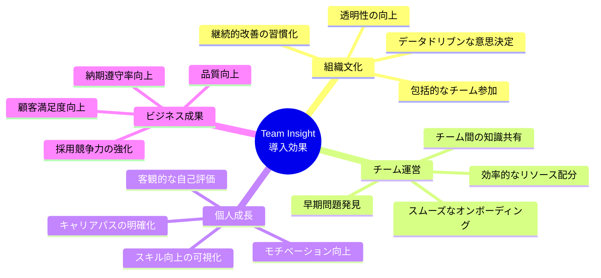

---

## 9. 導入プロセス（更新版）

### 9.1 導入ステップ

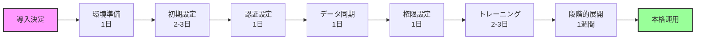

### 9.2 成功のための推奨事項

1. **段階的導入**

   - 認証システムの先行テスト
   - パイロットチームでの試験運用
   - フィードバックに基づく調整
   - 全社展開

2. **変更管理**

   - 経営層からの明確なメッセージ
   - 既存/新規メンバー両方への配慮
   - データ活用文化の醸成
   - 成功事例の共有

3. **サポート体制**

   - 専任のサポートチーム設置
   - Backlog 連携サポートの充実
   - 定期的なトレーニング実施
   - コミュニティの形成

4. **継続的改善**
   - 定期的な利用状況レビュー
   - ユーザーフィードバックの収集
   - 機能の段階的拡張
   - KPI に基づく効果測定

---

## 10. 今後のロードマップ

### Phase 1: MVP 完成（2025 年 7 月現在）

- ✅ Backlog OAuth専用認証の実装
- ✅ Backlog連携機能の実装（定期同期含む）
- ✅ 個人ダッシュボードの完成（実データ連携）
- ✅ チーム管理・生産性ダッシュボード
- ✅ ユーザー設定（アカウント/セキュリティ）
- ✅ 管理画面（GUI）によるユーザー/チーム管理
- ✅ 自動トークンリフレッシュ機能
- ✅ レポート配信システム（APScheduler）
- ✅ アクティビティログ・監査機能
- ✅ 統一エラーハンドリングとパフォーマンス最適化
- 🚧 プロジェクトダッシュボードの実装

### Phase 2: プロジェクト分析と残機能（2025 年 8 月〜9 月）

- 📋 プロジェクトダッシュボード: プロジェクト単位の詳細分析
- 📋 ボトルネック検出アルゴリズム: 高度な分析ロジック
- 📋 設定画面の完成: プロフィール、Backlog連携設定
- 📋 通知システム: Slack/Teams連携

### Phase 3: 組織分析と高度な機能（2025 年 10 月〜11 月）

- 📋 組織ダッシュボード: 組織全体のKPI、プロジェクト横断分析
- 📋 予測分析: 機械学習によるプロジェクト完了予測
- 📋 品質メトリクス: バグ密度、技術的負債の可視化
- 📋 Four Keys: デプロイ頻度、変更リードタイム等の DevOps 指標

### Phase 4: エコシステム拡張（2025 年 12 月〜2026 年 1 月）

- 📋 他ツール連携: JIRA、GitHub、GitLab 対応
- 📋 カスタムダッシュボード: ユーザー定義の分析画面
- 📋 API プラットフォーム: 外部システムとの連携
- 📋 モバイルアプリ: iOS/Android対応

### Phase 5: AI 駆動の最適化（2026 年 2 月〜）

- 📋 自動改善提案: AI によるプロセス最適化提案
- 📋 異常検知: 通常と異なるパターンの自動検出
- 📋 予防的アラート: 問題発生前の警告システム
- 📋 スキルマッチング: 最適なタスク割り当て提案

---

## 11. まとめ

Team Insight MVP v2.0 は、Backlog を利用する開発チームに対して、**より包括的で柔軟な価値を提供するソリューション**へと進化しました。新たに追加された認証機能により、以下の価値を実現します：

### 主な強化点

1. **アクセシビリティの向上**: Backlog アカウントの有無に関わらず利用開始可能
2. **セキュリティの強化**: 多様な認証方式によるセキュアなアクセス管理
3. **オンボーディングの簡素化**: スムーズな導入プロセスによる早期価値実現
4. **段階的な機能展開**: MVPではCLIツール、将来的に管理画面を提供

### 差別化要因

1. **Backlog 完全特化**: Backlog 固有のワークフローに最適化
2. **柔軟な認証**: 組織のニーズに合わせた認証方式の選択
3. **即時価値提供**: 段階的な機能解放による早期 ROI 実現
4. **MVPに集中**: 個人とプロジェクトレベルの分析にフォーカス
5. **拡張性を確保**: 将来的な組織ダッシュボードや管理機能の追加が容易

Team Insight MVP では、まず**個人とプロジェクトレベルの分析機能**に集中し、組織のデータドリブン文化の基盤を構築します。将来的には組織ダッシュボードや管理機能を追加し、全メンバーの参加を促進する包括的なプラットフォームへと進化します。

---

## 付録 A: 用語集（拡張版）

| 用語               | 説明                                                       |
| :----------------- | :--------------------------------------------------------- |
| **ベロシティ**     | スプリント単位で完了したタスクの総量（ストーリーポイント） |
| **リードタイム**   | タスクの作成から完了までの総時間                           |
| **サイクルタイム** | タスクの開始から完了までの実作業時間                       |
| **ボトルネック**   | ワークフローの中で最も時間がかかっている工程               |
| **Four Keys**      | Google DevOPS Research 提唱の 4 つの重要指標               |
| **OAuth 2.0**      | 安全な認可のための業界標準プロトコル                       |
| **JWT**            | JSON Web Token - セキュアなセッション管理方式              |
| **RBAC**           | Role-Based Access Control - ロールベースのアクセス制御     |
| **マルチテナント** | 単一のシステムで複数の組織をサポートする設計               |
| **レート制限**     | API 呼び出し回数の制限                                     |

## 付録 B: FAQ（拡張版）

**Q: 既存の Backlog の運用を変更する必要がありますか？**
A: いいえ、Team Insight は Backlog の既存データをそのまま活用します。運用変更は不要です。

**Q: Backlog アカウントを持っていなくても使えますか？**
A: いいえ、Team InsightはBacklog OAuth認証専用のツールです。利用するにはBacklogアカウントと、設定されたBacklogスペースへのアクセス権限が必要です。

**Q: データのセキュリティはどのように確保されていますか？**
A: すべての通信は暗号化され、データはユーザーの権限に基づいてアクセス制御されます。OAuthトークンは暗号化して保存され、アクティビティログにより全操作が記録されます。

**Q: どのくらいの規模のチームまで対応できますか？**
A: MVP では 100 名程度までのチームを想定していますが、アーキテクチャは水平スケーリングが可能な設計となっており、将来的により大規模な組織にも対応可能です。

**Q: Backlog 連携が失敗した場合はどうなりますか？**
A: 自動リトライ機能により接続を試みます。継続的に失敗する場合は、管理者に通知されます。連携が復旧するまで新しいデータの同期は停止しますが、既存のデータは引き続き閲覧可能です。

**Q: ユーザーのロール管理はどのように行いますか？**
A: GUI管理画面（/admin/users）で視覚的に管理できます。ドロップダウンからロールを選択して変更可能です。また、CLIツール（`make set-admin EMAIL=user@example.com`など）も並行して利用できます。
