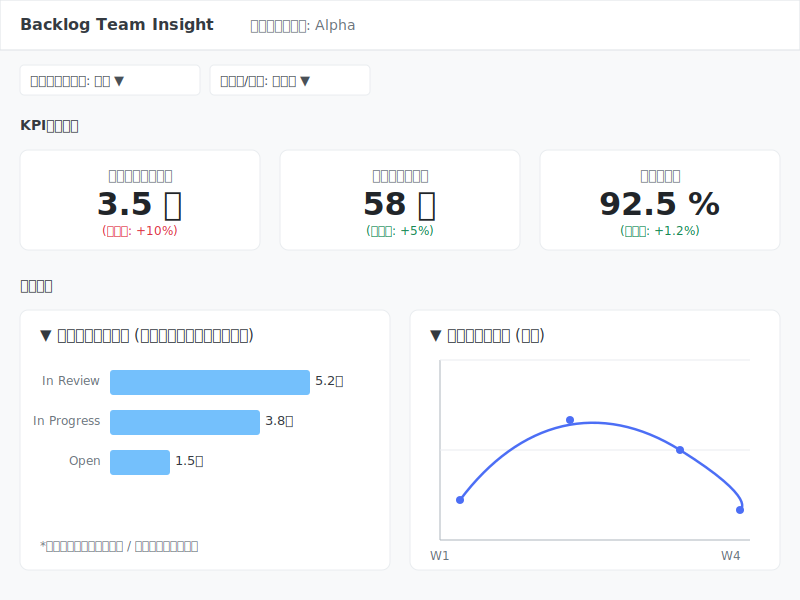

## 1. プロダクト概要

### 1.1 プロダクトの目的 (Why)

このツールは、プロジェクト管理にBacklogを利用している開発マネージャーやチームリーダーを対象とします。彼らが直面する「チームの状況が感覚的にしか分からない」「どのプロセスに問題があるか特定できない」といった課題を解決するため、**データに基づいた意思決定**を支援するWebダッシュボードを提供します。

### 1.2 MVPのゴール (What)

MVP（Minimum Viable Product）のゴールは、**「チームの生産性とボトルネックを可視化する」**というコア価値を、1.5〜2ヶ月でユーザーに提供することです。完璧を目指すのではなく、最速で価値を届け、フィードバックを得ることを最優先とします。

---

## 2. URL構成案

シンプルで分かりやすいURL構成を定義します。

| URL | 画面/機能 | 説明 |
| :--- | :--- | :--- |
| `/login` | ログインページ | Backlogアカウントでのログインを開始するページ。 |
| `/auth/callback` | 認証コールバック | Backlog OAuth 2.0の認証後にリダイレクトされるURL。 |
| `/projects` | プロジェクト選択 | ユーザーが所属するプロジェクトの一覧を表示し、分析対象を選択させる。 |
| `/dashboard/{projectId}` | **メインダッシュボード** | 指定されたプロジェクトIDの分析結果を表示するメイン画面。 |
| `/api/v1/...` | バックエンドAPI | フロントエンドがデータを取得するためのAPI群。 |

---

## 3. ワイヤーフレーム（メインダッシュボード）

メインとなる `/dashboard/{projectId}` 画面のレイアウト構成案です。

---

## 4. 画面コンポーネント詳細

ワイヤーフレームに示した各要素の役割と仕様です。

#### **A. ヘッダー**

* **役割:** 現在分析中のプロジェクト名を表示し、ユーザーがコンテキストを把握できるようにします。
* **仕様:** 選択中のプロジェクト名が表示されます。将来的にはプロジェクトを切り替えるドロップダウンを設置することも考えられます。

#### **B. フィルターバー**

* **役割:** ユーザーが分析したい条件を指定できるようにします。
* **仕様:**
  * **期間フィルター:** 「今月」「先月」「過去3ヶ月」などのプリセットと、カスタム期間を指定できるカレンダーUIを設置します。選択された期間は、ページ全体の分析対象となります。
  * **チーム/個人フィルター:** MVPでは「チーム」表示をデフォルトとします。将来的には、ここで特定の個人を選択できるように拡張します。

#### **C. KPIサマリー**

* **役割:** チームの健康状態を示す最重要指標（KPI）を一目で把握できるようにします。
* **仕様:**
  * 期間フィルターの変更に応じて、数値が動的に更新されます。
  * 各カードには、主要な数値と、比較期間（例: 前月比）の増減を表示し、変化に気づきやすくします。
  * **取得API:** `GET /api/v1/metrics/summary?projectId=...&from=...&to=...`

#### **D. ボトルネック分析チャート (D3.js)**

* **役割:** プロセスのどこで時間がかかっているのかを視覚的に特定し、具体的な改善アクションのきっかけを提供します。MVPにおける最も価値の高い機能です。
* **仕様:**
  * **データ:** チケットのステータス変更履歴から、各ステータスでの平均滞在時間を計算します。
  * **可視化:** D3.jsでインタラクティブな横棒グラフを実装します。滞留時間が長いステータスほどバーが長くなります。
  * **インタラクション:**
    * **ホバー:** 各バーにマウスカーソルを合わせると、正確な平均日数や対象チケット数がツールチップで表示されます。
    * **クリック（ドリルダウン）:** バーをクリックすると、そのステータスに滞留している（または過去に滞留した）チケットの一覧がシンプルなモーダルウィンドウで表示されます。
  * **取得API:** `GET /api/v1/analysis/bottlenecks?projectId=...&from=...&to=...`

#### **E. 生産性トレンドチャート (D3.js)**

* **役割:** チームの生産性が向上しているのか、あるいは低下しているのか、その傾向を時系列で追跡します。
* **仕様:**
  * **データ:** 期間内のリードタイムと完了チケット数を、日別または週次で集計します。
  * **可視化:** D3.jsで滑らかな曲線を持つ折れ線グラフを実装します。「リードタイム」と「完了チケット数」の2つの指標を同時に表示できるようにします。
  * **インタラクション:** グラフ上の点にホバーすると、日付と正確な数値が表示されます。
  * **取得API:** `GET /api/v1/metrics/timeseries?projectId=...&from=...&to=...&interval=weekly`

---

## 5. 技術スタックとアーキテクチャ

| 分類 | 技術 | 主な役割 |
| :--- | :--- | :--- |
| **Backend** | FastAPI (Python) | ・REST APIの提供 (`/metrics`, `/analysis` 等) ・Backlog OAuth 2.0の認証コールバック処理 ・SQLAlchemyを介したDBとのやり取り |
| **Database** | PostgreSQL, Redis | ・**PostgreSQL**: チケット、Git情報などの永続データストア ・**Redis**: APIレスポンスや集計結果のキャッシュ |
| **Frontend** | Next.js (TypeScript) | ・ReactコンポーネントによるUI構築 ・バックエンドAPIの呼び出し ・D3.jsを使ったデータビジュアライゼーションの実装 |
| **UI** | shadcn/ui, Tailwind | ・UIの骨格となるコンポーネント（カード、ボタン、モーダル等）を迅速に構築 |
| **可視化** | **D3.js**, Recharts | ・**D3.js**: メインの可視化エンジン。インタラクティブで高品質なカスタムグラフを実装 ・**Recharts**: 標準的なグラフで速度を優先したい場合の補助的利用も検討 |
| **インフラ** | Docker, AWS ECS | ・開発環境から本番まで一貫したコンテナ環境を提供 ・CI/CDはBacklogのWebhookを起点にECSへデプロイ |
