# Team Insight MVP 説明資料

## 1. エグゼクティブサマリー

Team Insight は、Backlog を利用する開発チームのために設計された**チーム生産性可視化プラットフォーム**です。本 MVP では、個人・プロジェクト・組織の 3 つのレベルで、データドリブンな意思決定を支援する包括的なダッシュボードシステムを提供します。

### 1.1 コアバリュープロポジション

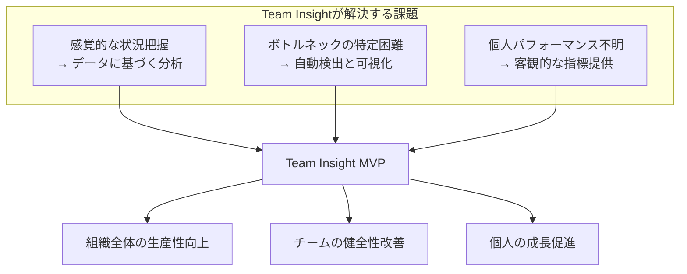

### 1.2 想定ユーザーと提供価値

| ユーザータイプ           | 主な課題                                             | Team Insight による解決策                                              |
| :----------------------- | :--------------------------------------------------- | :--------------------------------------------------------------------- |
| **開発メンバー**         | 自身の生産性が不明確<br>改善点が分からない           | 個人ダッシュボードで作業効率を可視化<br>ボトルネックを特定し改善を促進 |
| **プロジェクトリーダー** | チーム状況の把握が困難<br>問題の早期発見ができない   | リアルタイムでチーム健康度を監視<br>データに基づく適切な介入が可能     |
| **管理者・CTO**          | 組織全体の効率が不透明<br>リソース配分の最適化が困難 | 全プロジェクトを横断的に分析<br>データドリブンな経営判断を支援         |

---

## 2. 製品概要と主要機能

### 2.1 システム全体像

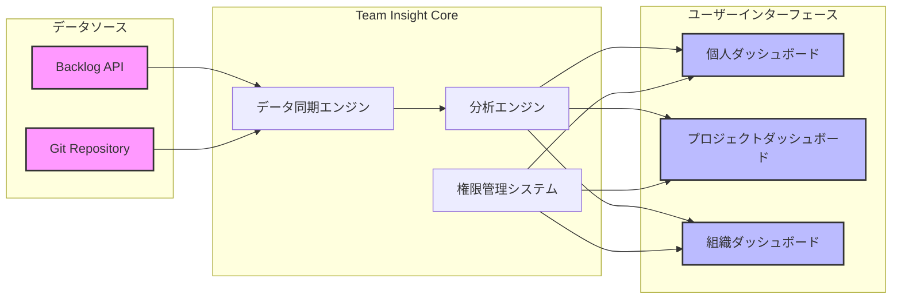

### 2.2 権限管理モデル

Team Insight は、階層的な権限管理により、適切な情報アクセスを実現します。

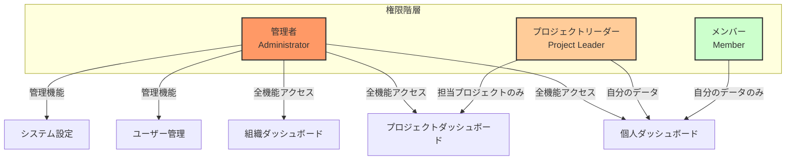

### 2.3 コア機能一覧

#### 🔐 認証・セキュリティ機能

- **Backlog OAuth 2.0 統合**: 既存の Backlog アカウントでシームレスにログイン
- **JWT 認証**: セキュアなセッション管理と API 通信
- **階層的権限管理**: ロールベースのアクセス制御（RBAC）
- **監査ログ**: すべての重要な操作を記録

#### 📊 ダッシュボード機能

##### 個人ダッシュボード

- **個人 KPI サマリー**: 完了タスク数、平均処理時間、進行中タスク数
- **作業フロー分析**: 各ステータスでの滞留時間を可視化
- **生産性トレンド**: 時系列での個人パフォーマンス推移
- **スキルマトリックス**: タスクタイプ別の処理効率

##### プロジェクトダッシュボード

- **チーム健康度スコア**: 複数の指標を統合した健全性評価
- **ボトルネック分析**: ワークフローの問題箇所を自動検出
- **ベロシティチャート**: スプリント単位の生産性推移
- **メンバー別パフォーマンス**: チーム内での貢献度分析
- **リードタイム分析**: タスクの開始から完了までの時間分析

##### 組織ダッシュボード

- **組織全体の KPI**: 総ベロシティ、平均リードタイム、リソース効率
- **プロジェクト横断分析**: 全プロジェクトの比較と評価
- **リソース配分最適化**: 人員配置の効率性分析
- **トレンド予測**: 過去データに基づく将来予測

#### 🔄 データ同期・更新機能

- **自動データ同期**: 1 時間ごとの Backlog データ取得
- **リアルタイム更新**: WebSocket による即時反映
- **手動同期オプション**: 必要時の即時データ更新
- **同期ステータス表示**: データの鮮度を常に確認可能

---

## 3. ユーザー体験フロー

### 3.1 初回利用フロー

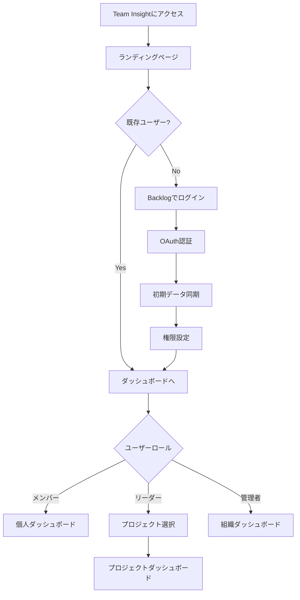

### 3.2 日常利用シナリオ

#### シナリオ 1: 開発メンバーの朝のルーティン

1. **ログイン**: Backlog アカウントで Team Insight にアクセス
2. **個人ダッシュボード確認**: 昨日の完了タスクと今日の予定を確認
3. **ボトルネック確認**: レビュー待ちが多い場合はレビュアーに連絡
4. **作業開始**: 優先度の高いタスクから着手

#### シナリオ 2: プロジェクトリーダーの週次レビュー

1. **プロジェクトダッシュボード**: チーム全体の進捗を確認
2. **ボトルネック分析**: 「コードレビュー」で滞留時間が長いことを発見
3. **メンバー別分析**: 特定メンバーに負荷が集中していることを確認
4. **アクション**: レビュー体制の見直しとタスク再配分を実施

#### シナリオ 3: CTO の月次経営会議

1. **組織ダッシュボード**: 全プロジェクトの KPI を一覧
2. **比較分析**: プロジェクト A の生産性が他より 20%低いことを発見
3. **詳細分析**: プロジェクト A のダッシュボードでボトルネックを特定
4. **意思決定**: リソースの再配分と開発プロセスの改善を決定

---

## 4. URL 構成とナビゲーション

### 4.1 システム URL 体系

Team Insight は、直感的で一貫性のある URL 構成を採用しています。URL を見るだけで、現在どの機能を使用しているか、どのレベルの情報にアクセスしているかが明確に分かる設計となっています。

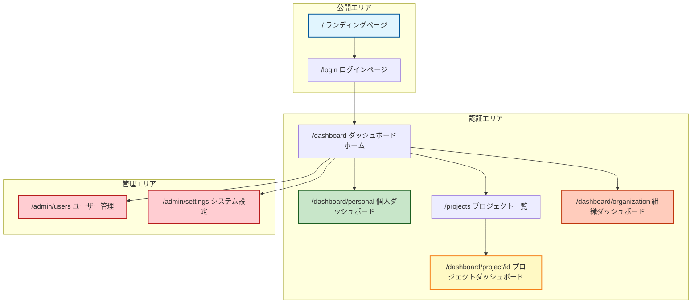

### 4.2 URL 詳細仕様

| URL                                  | 画面名                     | 説明                                                                                                    | アクセス権限               |
| :----------------------------------- | :------------------------- | :------------------------------------------------------------------------------------------------------ | :------------------------- |
| **`/`**                              | ランディングページ         | Team Insight の価値提案、主要機能の紹介、導入事例を表示。ログインへの明確な CTA（Call to Action）を配置 | 公開（誰でもアクセス可能） |
| **`/login`**                         | ログインページ             | Backlog アカウントでのシングルサインオン（SSO）を提供。セキュアな認証フローの開始点                     | 未認証ユーザー             |
| **`/auth/callback`**                 | OAuth 認証コールバック     | Backlog OAuth 2.0 認証完了後の処理。ユーザーには表示されない内部処理用 URL                              | システム内部処理           |
| **`/dashboard`**                     | ダッシュボードホーム       | ログイン後の起点。ユーザーのロールに応じて、最も関連性の高い情報へのクイックアクセスを提供              | 要ログイン（全ロール）     |
| **`/dashboard/personal`**            | 個人ダッシュボード         | 個人の生産性指標、タスク状況、パフォーマンストレンドを表示。すべてのユーザーが自身のデータを確認可能    | 要ログイン（全ロール）     |
| **`/projects`**                      | プロジェクト一覧           | アクセス可能なプロジェクトをカード形式で表示。各プロジェクトの概要情報とクイックアクセスリンクを提供    | 要ログイン（全ロール）     |
| **`/dashboard/project/{projectId}`** | プロジェクトダッシュボード | 特定プロジェクトの詳細分析。チーム健康度、ボトルネック分析、メンバー別パフォーマンスを包括的に表示      | プロジェクトリーダー以上   |
| **`/dashboard/organization`**        | 組織ダッシュボード         | 組織全体の KPI、プロジェクト横断分析、リソース最適化情報を提供。経営判断に必要な情報を集約              | 管理者のみ                 |
| **`/admin/users`**                   | ユーザー管理               | ユーザーの一覧表示、ロール設定、アクセス権限の管理。監査ログへのアクセスも提供                          | 管理者のみ                 |
| **`/admin/settings`**                | システム設定               | データ同期間隔、通知設定、組織全体のシステム設定を管理                                                  | 管理者のみ                 |
| **`/403`**                           | アクセス拒否               | 権限不足時に表示されるエラーページ。適切な権限取得方法を案内                                            | 全ユーザー（エラー時）     |

### 4.3 API エンドポイント構成

フロントエンドとバックエンドの通信に使用される REST API エンドポイントは、以下の体系に従います：

```
/api/v1/
├── auth/
│   ├── backlog/authorize    # OAuth認証開始
│   ├── backlog/callback     # OAuth認証完了
│   ├── logout               # ログアウト
│   └── me                   # 現在のユーザー情報
├── projects/
│   ├── list                 # プロジェクト一覧
│   └── {id}/
│       ├── dashboard        # プロジェクトダッシュボードデータ
│       ├── members          # プロジェクトメンバー
│       └── analytics        # 詳細分析データ
├── personal/
│   ├── dashboard            # 個人ダッシュボードデータ
│   ├── tasks                # 個人のタスク一覧
│   └── performance          # パフォーマンス指標
├── organization/
│   ├── dashboard            # 組織ダッシュボードデータ
│   ├── projects             # 全プロジェクト統計
│   └── resources            # リソース分析
└── admin/
    ├── users                # ユーザー管理
    ├── roles                # ロール管理
    └── settings             # システム設定
```

### 4.4 ナビゲーション設計

Team Insight のナビゲーションは、ユーザーの権限レベルに応じて動的に調整されます。これにより、各ユーザーは自身がアクセス可能な機能のみを確認でき、シンプルで使いやすいインターフェースを実現しています。

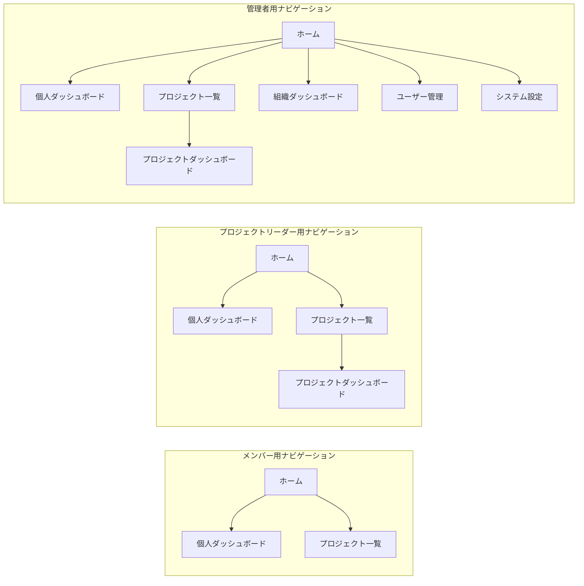

この URL 構成により、Team Insight は以下を実現します：

1. **直感的な階層構造**: URL パスが機能の階層を反映し、ユーザーが現在地を把握しやすい
2. **権限ベースのアクセス制御**: 各 URL に適切な権限チェックを実装し、セキュアなアクセスを保証
3. **RESTful な設計**: 標準的な Web 規約に従い、開発者にとっても理解しやすい構造
4. **拡張性**: 将来的な機能追加に対応できる柔軟な命名規則

---

## 5. 主要画面と機能詳細

### 4.1 個人ダッシュボード

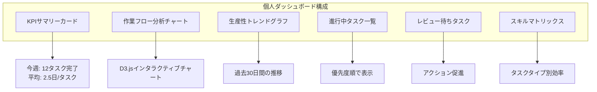

**主な機能特徴:**

- **パーソナライズされた指標**: 個人の役割に応じた関連指標を優先表示
- **アクション可能な洞察**: 「レビュー待ちが 3 日以上」など具体的な改善提案
- **目標設定と追跡**: 個人目標に対する進捗を視覚化

### 4.2 プロジェクトダッシュボード

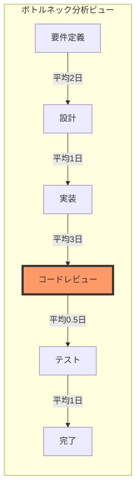

**ボトルネック分析の特徴:**

- **視覚的な問題特定**: 滞留時間が長いステータスを色とサイズで強調
- **ドリルダウン機能**: クリックで該当タスクの詳細リストを表示
- **改善提案**: AI による改善アクションの自動提案（将来機能）

### 4.3 組織ダッシュボード

**ダッシュボード構成要素:**

1. **エグゼクティブサマリー**

   - 組織全体のベロシティ（前月比）
   - アクティブプロジェクト数と進捗状況
   - リソース利用率と効率性指標

2. **プロジェクト比較マトリックス**

   - 各プロジェクトの健康度スコア
   - ベロシティ、品質、期限遵守率の比較
   - 異常値の自動ハイライト

3. **リソース最適化ビュー**
   - メンバー別の稼働率と生産性
   - スキルと需要のマッチング分析
   - 最適な人員配置の提案

---

## 5. 技術アーキテクチャ

### 5.1 システムアーキテクチャ

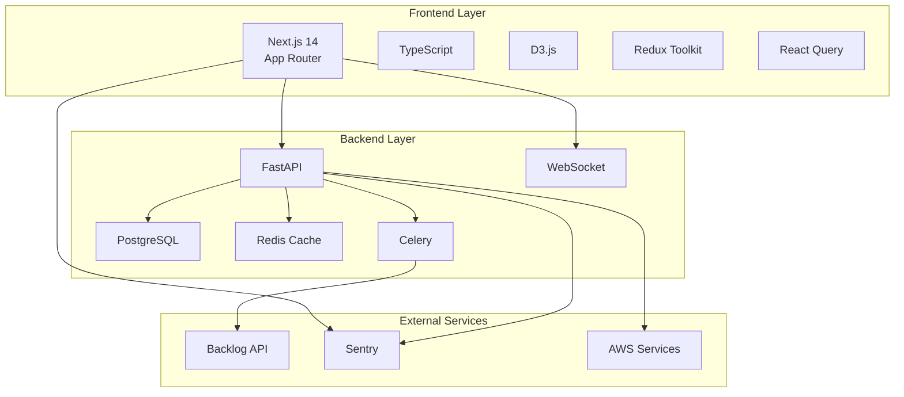

### 5.2 データフロー設計

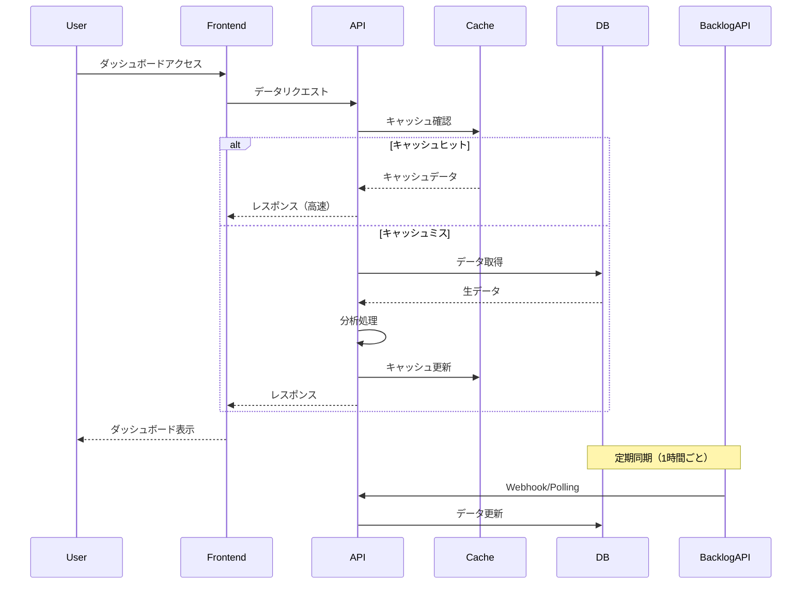

### 5.3 セキュリティアーキテクチャ

**実装されるセキュリティ機能:**

1. **認証・認可**

   - OAuth 2.0 による Backlog 統合
   - JWT（HttpOnly Cookie）によるセッション管理
   - ロールベースアクセス制御（RBAC）

2. **データ保護**

   - 全通信の HTTPS 暗号化
   - データベース暗号化（at rest）
   - 個人情報の適切なマスキング

3. **監査・コンプライアンス**
   - 全 API アクセスのロギング
   - 権限変更の監査証跡
   - GDPR 準拠のデータ管理

---

## 6. 期待される成果と ROI

### 6.1 定量的な成果

| 指標                     | 現状（推定） | MVP 導入後（目標）   | 改善率    |
| :----------------------- | :----------- | :------------------- | :-------- |
| **ボトルネック特定時間** | 2-3 日       | 即時（リアルタイム） | 90%短縮   |
| **レポート作成時間**     | 週 4 時間    | 週 30 分             | 87.5%削減 |
| **プロジェクト遅延率**   | 30%          | 15%                  | 50%改善   |
| **チーム生産性**         | ベースライン | +20%                 | 20%向上   |

### 6.2 定性的な成果

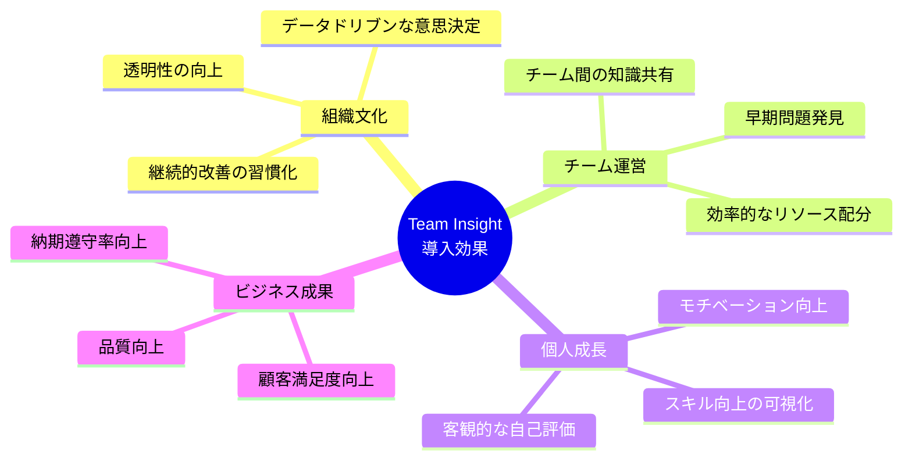

---

## 7. 導入プロセス

### 7.1 導入ステップ

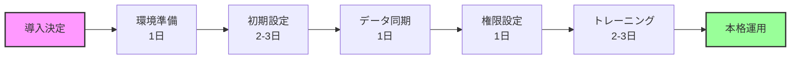

### 7.2 成功のための推奨事項

1. **段階的導入**

   - パイロットチームでの試験運用
   - フィードバックに基づく調整
   - 全社展開

2. **変更管理**

   - 経営層からの明確なメッセージ
   - データ活用文化の醸成
   - 成功事例の共有

3. **継続的改善**
   - 定期的な利用状況レビュー
   - ユーザーフィードバックの収集
   - 機能の段階的拡張

---

## 8. 今後のロードマップ

### Phase 2: 高度な分析機能（MVP 後 3-4 ヶ月）

- **予測分析**: 機械学習によるプロジェクト完了予測
- **品質メトリクス**: バグ密度、技術的負債の可視化
- **Four Keys**: デプロイ頻度、変更リードタイム等の DevOps 指標

### Phase 3: エコシステム拡張（MVP 後 5-6 ヶ月）

- **他ツール連携**: JIRA、GitHub、GitLab 対応
- **カスタムダッシュボード**: ユーザー定義の分析画面
- **API プラットフォーム**: 外部システムとの連携

### Phase 4: AI 駆動の最適化（MVP 後 7-12 ヶ月）

- **自動改善提案**: AI によるプロセス最適化提案
- **異常検知**: 通常と異なるパターンの自動検出
- **予防的アラート**: 問題発生前の警告システム

---

## 9. まとめ

Team Insight MVP は、Backlog を利用する開発チームに対して、**即座に価値を提供できる実用的なソリューション**です。階層的な権限管理により、組織の各レベルで必要な情報を適切に提供し、データに基づいた意思決定を支援します。

### 主な差別化要因

1. **Backlog 完全特化**: Backlog 固有のワークフローに最適化
2. **即時価値提供**: 導入後すぐに分析結果を確認可能
3. **包括的な可視化**: 個人からも組織まで全レベルをカバー
4. **高品質な UX**: D3.js による美しく直感的なビジュアライゼーション

Team Insight は単なる分析ツールではなく、**組織のデータドリブン文化を醸成するプラットフォーム**として、継続的な改善と成長を支援します。

---

## 付録 A: 用語集

| 用語               | 説明                                                       |
| :----------------- | :--------------------------------------------------------- |
| **ベロシティ**     | スプリント単位で完了したタスクの総量（ストーリーポイント） |
| **リードタイム**   | タスクの作成から完了までの総時間                           |
| **サイクルタイム** | タスクの開始から完了までの実作業時間                       |
| **ボトルネック**   | ワークフローの中で最も時間がかかっている工程               |
| **Four Keys**      | Google DevOPS Research 提唱の 4 つの重要指標               |

## 付録 B: FAQ

**Q: 既存の Backlog の運用を変更する必要がありますか？**
A: いいえ、Team Insight は Backlog の既存データをそのまま活用します。運用変更は不要です。

**Q: データのセキュリティはどのように確保されていますか？**
A: すべての通信は暗号化され、データはユーザーの権限に基づいてアクセス制御されます。また、Backlog の認証情報は保存せず、OAuth 2.0 による安全な認証を使用します。

**Q: どのくらいの規模のチームまで対応できますか？**
A: MVP では 100 名程度までのチームを想定していますが、アーキテクチャは水平スケーリングが可能な設計となっており、将来的により大規模な組織にも対応可能です。
