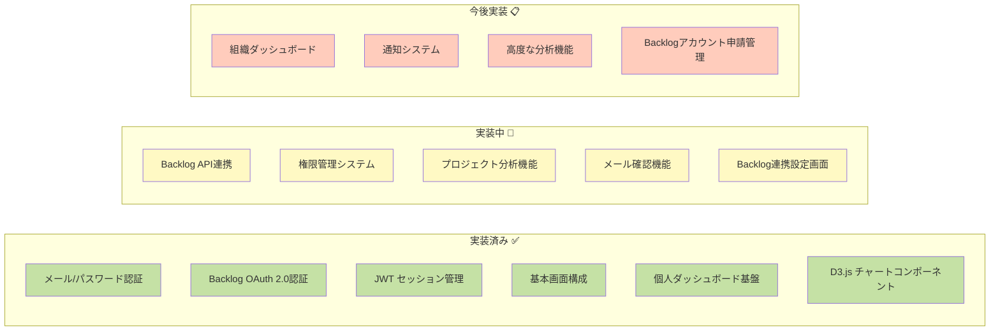
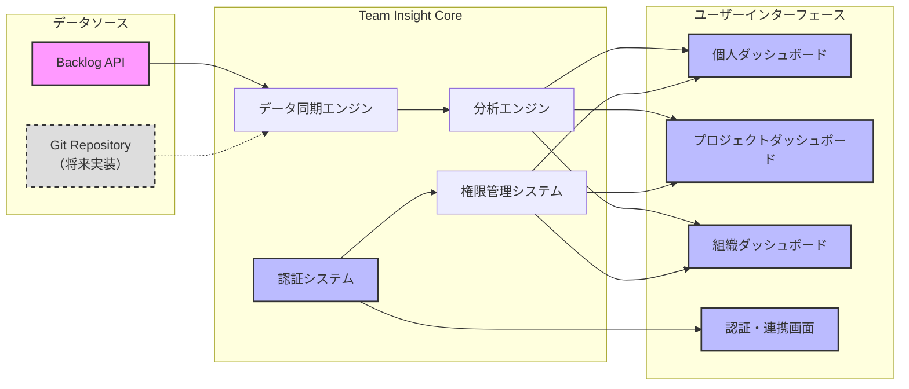
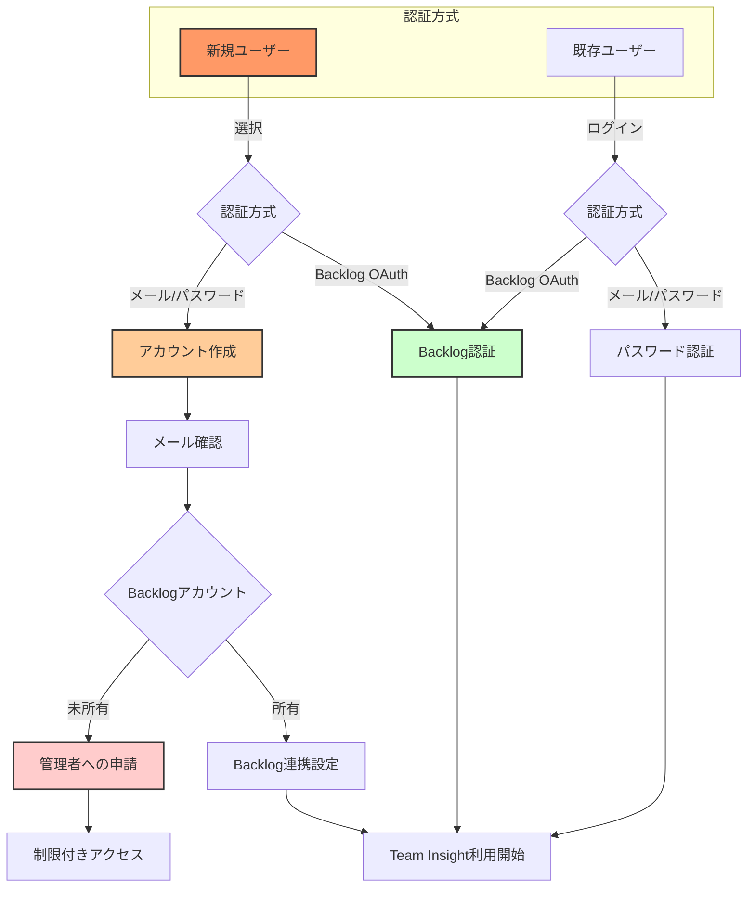
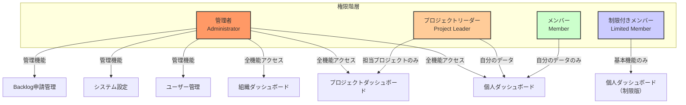
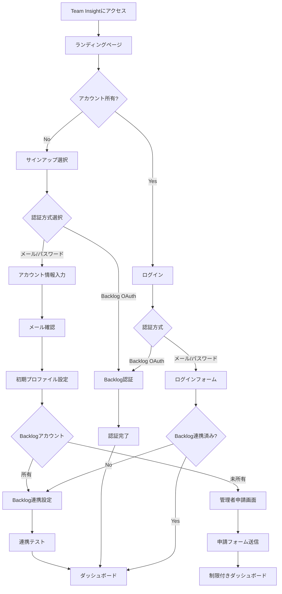
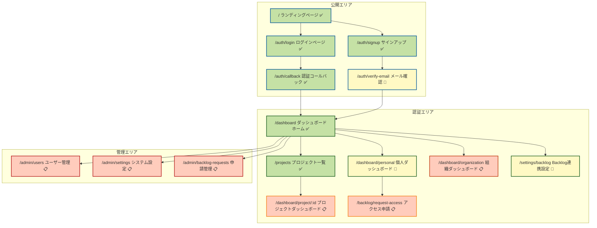
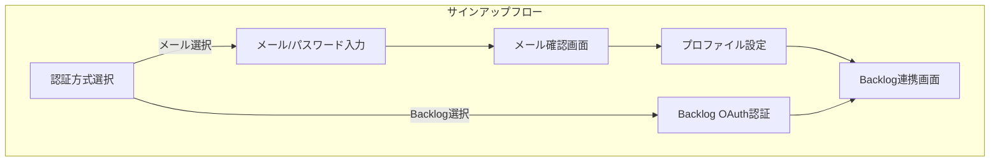
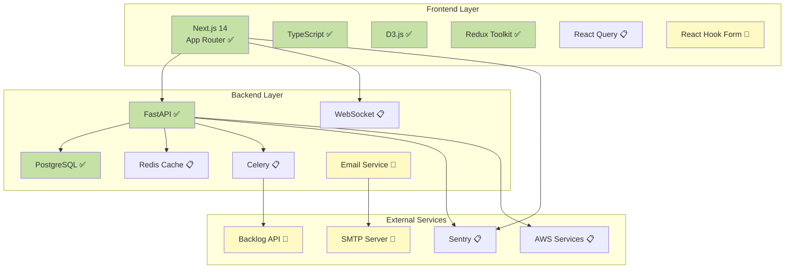
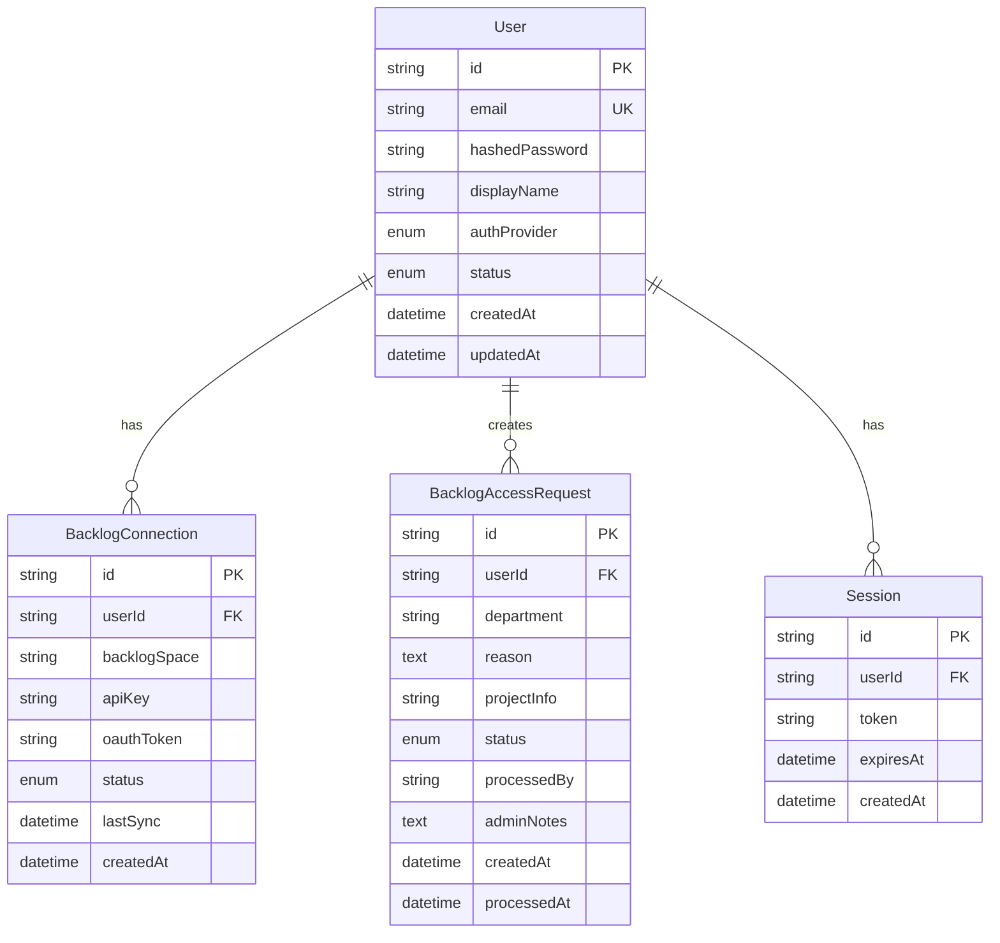

# Team Insight MVP 説明資料 v2.0

## 1. エグゼクティブサマリー

Team Insight は、Backlog を利用する開発チームのために設計された**チーム生産性可視化プラットフォーム**です。本 MVP では、個人・プロジェクト・組織の 3 つのレベルで、データドリブンな意思決定を支援する包括的なダッシュボードシステムを提供します。

### 1.1 コアバリュープロポジション


### 1.2 想定ユーザーと提供価値

| ユーザータイプ           | 主な課題                                             | Team Insight による解決策                                              |
| :----------------------- | :--------------------------------------------------- | :--------------------------------------------------------------------- |
| **開発メンバー**         | 自身の生産性が不明確<br>改善点が分からない           | 個人ダッシュボードで作業効率を可視化<br>ボトルネックを特定し改善を促進 |
| **プロジェクトリーダー** | チーム状況の把握が困難<br>問題の早期発見ができない   | リアルタイムでチーム健康度を監視<br>データに基づく適切な介入が可能     |
| **管理者・CTO**          | 組織全体の効率が不透明<br>リソース配分の最適化が困難 | 全プロジェクトを横断的に分析<br>データドリブンな経営判断を支援         |
| **新規参加者**           | Backlog アカウントがない<br>チームへの参加が困難     | 簡単なサインアップ<br>管理者への自動申請機能                           |

### 1.3 現在の実装状況（2024 年 12 月時点）



---

## 2. 製品概要と主要機能

### 2.1 システム全体像



### 2.2 認証フローモデル

Team Insight は、柔軟な認証方式により、様々なユーザーのニーズに対応します。



### 2.3 権限管理モデル



### 2.4 コア機能一覧

#### 🔐 認証・セキュリティ機能（拡張）

- **多様な認証方式**: メール/パスワード認証と Backlog OAuth 2.0 の選択可能 ✅
- **メール確認機能**: セキュアなアカウント作成プロセス 🚧
- **Backlog 連携設定**: API キーまたは OAuth による柔軟な連携 🚧
- **JWT 認証**: セキュアなセッション管理と API 通信 ✅
- **階層的権限管理**: ロールベースのアクセス制御（RBAC）🚧
- **Backlog アカウント申請**: 未所持者向けの申請・承認フロー 📋
- **監査ログ**: すべての重要な操作を記録 📋

#### 📊 ダッシュボード機能

##### 個人ダッシュボード（一部実装済み）

- **個人 KPI サマリー**: 完了タスク数、平均処理時間、進行中タスク数 🚧
- **作業フロー分析**: 各ステータスでの滞留時間を可視化 🚧
- **生産性トレンド**: 時系列での個人パフォーマンス推移 📋
- **スキルマトリックス**: タスクタイプ別の処理効率 📋
- **制限モード**: Backlog 未連携時の基本機能提供 🚧

##### プロジェクトダッシュボード（実装予定）

- **チーム健康度スコア**: 複数の指標を統合した健全性評価 📋
- **ボトルネック分析**: ワークフローの問題箇所を自動検出 🚧
- **ベロシティチャート**: スプリント単位の生産性推移 📋
- **メンバー別パフォーマンス**: チーム内での貢献度分析 📋
- **リードタイム分析**: タスクの開始から完了までの時間分析 📋

##### 組織ダッシュボード（実装予定）

- **組織全体の KPI**: 総ベロシティ、平均リードタイム、リソース効率 📋
- **プロジェクト横断分析**: 全プロジェクトの比較と評価 📋
- **リソース配分最適化**: 人員配置の効率性分析 📋
- **トレンド予測**: 過去データに基づく将来予測 📋
- **申請管理**: Backlog アカウント申請の承認・却下 📋

#### 🔄 データ同期・更新機能

- **自動データ同期**: 1 時間ごとの Backlog データ取得 🚧
- **リアルタイム更新**: WebSocket による即時反映 📋
- **手動同期オプション**: 必要時の即時データ更新 🚧
- **同期ステータス表示**: データの鮮度を常に確認可能 📋
- **連携状態管理**: Backlog 接続状態の監視と自動復旧 🚧

---

## 3. ユーザー体験フロー

### 3.1 初回利用フロー（拡張版）



### 3.2 日常利用シナリオ（拡張版）

#### シナリオ 1: 新規参加者のオンボーディング

1. **アカウント作成**: メールアドレスとパスワードで Team Insight に登録
2. **メール確認**: 確認メールのリンクをクリックしてアカウントを有効化
3. **Backlog 連携**: 既存の Backlog アカウント情報を入力して連携
4. **ダッシュボード利用**: 即座に個人の生産性データを確認開始

#### シナリオ 2: Backlog アカウント未所持者の参加

1. **アカウント作成**: Team Insight アカウントを作成
2. **申請フォーム**: 所属部署と利用目的を記入して申請
3. **管理者承認待ち**: 制限付きダッシュボードで基本機能を利用
4. **承認通知**: 管理者承認後、Backlog アカウント情報を受領
5. **フル機能解放**: Backlog 連携完了後、全機能が利用可能に

#### シナリオ 3: 開発メンバーの朝のルーティン

1. **ログイン**: 保存された認証情報で素早くアクセス
2. **個人ダッシュボード確認**: 昨日の完了タスクと今日の予定を確認
3. **ボトルネック確認**: レビュー待ちが多い場合はレビュアーに連絡
4. **作業開始**: 優先度の高いタスクから着手

#### シナリオ 4: プロジェクトリーダーの週次レビュー

1. **プロジェクトダッシュボード**: チーム全体の進捗を確認
2. **ボトルネック分析**: 「コードレビュー」で滞留時間が長いことを発見
3. **メンバー別分析**: 特定メンバーに負荷が集中していることを確認
4. **アクション**: レビュー体制の見直しとタスク再配分を実施

#### シナリオ 5: CTO の月次経営会議

1. **組織ダッシュボード**: 全プロジェクトの KPI を一覧
2. **申請管理**: 新規メンバーの Backlog アカウント申請を確認・承認
3. **比較分析**: プロジェクト A の生産性が他より 20%低いことを発見
4. **詳細分析**: プロジェクト A のダッシュボードでボトルネックを特定
5. **意思決定**: リソースの再配分と開発プロセスの改善を決定

---

## 4. URL 構成とナビゲーション

### 4.1 システム URL 体系（拡張版）



### 4.2 URL 詳細仕様（拡張版）

| URL                                  | 画面名                     | 説明                                                                                                    | アクセス権限               | 実装状況 |
| :----------------------------------- | :------------------------- | :------------------------------------------------------------------------------------------------------ | :------------------------- | :------- |
| **`/`**                              | ランディングページ         | Team Insight の価値提案、主要機能の紹介、導入事例を表示。ログインへの明確な CTA（Call to Action）を配置 | 公開（誰でもアクセス可能） | ✅       |
| **`/auth/signup`**                   | サインアップページ         | メール/パスワードまたは Backlog OAuth での新規登録。選択可能な認証方式を提供                            | 未認証ユーザー             | ✅       |
| **`/auth/login`**                    | ログインページ             | 既存ユーザーのログイン。メール/パスワードまたは Backlog OAuth 認証を選択                                | 未認証ユーザー             | ✅       |
| **`/auth/callback`**                 | OAuth 認証コールバック     | Backlog OAuth 2.0 認証完了後の処理。ユーザーには表示されない内部処理用 URL                              | システム内部処理           | ✅       |
| **`/auth/verify-email`**             | メール確認ページ           | メールアドレス確認用。トークンを検証してアカウントを有効化                                              | メール確認待ちユーザー     | 🚧       |
| **`/dashboard`**                     | ダッシュボードホーム       | ログイン後の起点。ユーザーのロールに応じて、最も関連性の高い情報へのクイックアクセスを提供              | 要ログイン（全ロール）     | ✅       |
| **`/dashboard/personal`**            | 個人ダッシュボード         | 個人の生産性指標、タスク状況、パフォーマンストレンドを表示。Backlog 未連携時は制限モード                | 要ログイン（全ロール）     | 🚧       |
| **`/projects`**                      | プロジェクト一覧           | アクセス可能なプロジェクトをカード形式で表示。各プロジェクトの概要情報とクイックアクセスリンクを提供    | 要ログイン（全ロール）     | ✅       |
| **`/dashboard/project/{projectId}`** | プロジェクトダッシュボード | 特定プロジェクトの詳細分析。チーム健康度、ボトルネック分析、メンバー別パフォーマンスを包括的に表示      | プロジェクトリーダー以上   | 📋       |
| **`/dashboard/organization`**        | 組織ダッシュボード         | 組織全体の KPI、プロジェクト横断分析、リソース最適化情報を提供。経営判断に必要な情報を集約              | 管理者のみ                 | 📋       |
| **`/settings/backlog`**              | Backlog 連携設定           | Backlog の API キー設定または OAuth 再認証。接続テスト機能を含む                                        | 要ログイン（全ロール）     | 🚧       |
| **`/backlog/request-access`**        | Backlog アクセス申請       | Backlog アカウント未所持者向けの申請フォーム。管理者への自動通知機能付き                                | Backlog 未連携ユーザー     | 📋       |
| **`/admin/users`**                   | ユーザー管理               | ユーザーの一覧表示、ロール設定、アクセス権限の管理。監査ログへのアクセスも提供                          | 管理者のみ                 | 📋       |
| **`/admin/settings`**                | システム設定               | データ同期間隔、通知設定、組織全体のシステム設定を管理                                                  | 管理者のみ                 | 📋       |
| **`/admin/backlog-requests`**        | Backlog 申請管理           | Backlog アカウント申請の一覧表示、承認・却下処理、申請者への通知                                        | 管理者のみ                 | 📋       |
| **`/403`**                           | アクセス拒否               | 権限不足時に表示されるエラーページ。適切な権限取得方法を案内                                            | 全ユーザー（エラー時）     | 📋       |

### 4.3 API エンドポイント構成（拡張版）

```
/api/v1/
├── auth/
│   ├── signup                  # メール/パスワード登録 ✅
│   ├── login                   # メール/パスワードログイン ✅
│   ├── verify-email            # メールアドレス確認 🚧
│   ├── resend-verification     # 確認メール再送信 🚧
│   ├── backlog/authorize       # OAuth認証開始 ✅
│   ├── backlog/callback        # OAuth認証完了 ✅
│   ├── logout                  # ログアウト 🚧
│   └── me                      # 現在のユーザー情報 🚧
├── backlog/
│   ├── connection              # Backlog連携設定 🚧
│   ├── test                    # 連携テスト 🚧
│   ├── disconnect              # 連携解除 📋
│   └── request-access          # アクセス申請 📋
├── projects/
│   ├── list                    # プロジェクト一覧 🚧
│   └── {id}/
│       ├── dashboard           # プロジェクトダッシュボードデータ 📋
│       ├── members             # プロジェクトメンバー 📋
│       └── analytics           # 詳細分析データ 📋
├── personal/
│   ├── dashboard               # 個人ダッシュボードデータ 🚧
│   ├── tasks                   # 個人のタスク一覧 📋
│   └── performance             # パフォーマンス指標 📋
├── organization/
│   ├── dashboard               # 組織ダッシュボードデータ 📋
│   ├── projects                # 全プロジェクト統計 📋
│   └── resources               # リソース分析 📋
└── admin/
    ├── users                   # ユーザー管理 📋
    ├── roles                   # ロール管理 📋
    ├── backlog-requests/       # Backlog申請管理 📋
    │   ├── list                # 申請一覧 📋
    │   ├── approve             # 申請承認 📋
    │   └── reject              # 申請却下 📋
    └── settings                # システム設定 📋
```

---

## 5. 主要画面と機能詳細

### 5.1 認証関連画面（新規追加）

#### サインアップ画面



**主な機能:**

- **デュアル認証**: メール/パスワードと Backlog OAuth の選択
- **強固なバリデーション**: パスワード強度チェック、メール形式検証
- **スムーズなオンボーディング**: ステップバイステップのガイド

#### Backlog 連携設定画面

**連携方式の選択:**

1. **API キー方式**

   - Backlog スペース名の入力
   - API キーの設定
   - 接続テスト機能

2. **OAuth 方式**
   - ワンクリックで Backlog 認証
   - 自動的なトークン管理
   - 定期的な自動更新

#### Backlog アクセス申請画面

**申請フォーム要素:**

- 所属部署
- 利用目的（必須・最低 10 文字）
- 参加予定プロジェクト（任意）
- 緊急度の選択

**申請後の流れ:**

- 管理者への自動通知
- 申請状況のトラッキング
- 承認/却下の通知受信

### 5.2 個人ダッシュボード（拡張版）


**Backlog 未連携時の制限モード:**

- 基本的な KPI 表示（サンプルデータ）
- Backlog 連携促進バナー
- 連携設定へのショートカット

### 5.3 管理者向け申請管理画面（新規追加）

**申請一覧ビュー:**

- 申請者情報（名前、メール、部署）
- 申請日時と経過時間
- 申請理由のプレビュー
- ワンクリック承認/却下

**申請詳細ビュー:**

- 申請者の完全な情報
- Team Insight 上のアクティビティ
- 承認/却下時のコメント入力
- Backlog アカウント作成支援ツール

---

## 6. 技術アーキテクチャ

### 6.1 システムアーキテクチャ（拡張版）



### 6.2 データモデル設計（DDD 準拠）



### 6.3 セキュリティアーキテクチャ（強化版）

**実装されるセキュリティ機能:**

1. **認証・認可**

   - 多要素認証対応（メール + Backlog OAuth）✅
   - JWT（HttpOnly Cookie）によるセッション管理 ✅
   - リフレッシュトークンによる自動更新 🚧
   - ロールベースアクセス制御（RBAC）🚧

2. **データ保護**

   - 全通信の HTTPS 暗号化 ✅
   - パスワードの bcrypt ハッシュ化 ✅
   - API キーの暗号化保存 🚧
   - データベース暗号化（at rest）📋
   - 個人情報の適切なマスキング 📋

3. **アカウント保護**

   - メールアドレス確認必須 🚧
   - パスワードポリシーの強制 🚧
   - ログイン試行回数制限 📋
   - 不審なアクセスの検知 📋

4. **監査・コンプライアンス**
   - 全 API アクセスのロギング 🚧
   - 認証イベントの記録 🚧
   - 権限変更の監査証跡 📋
   - GDPR 準拠のデータ管理 📋

---

## 7. MVP で追加考慮すべき事項

### 7.1 スケーラビリティ

1. **マルチテナント対応**

   - 組織 ID ベースのデータ分離
   - 組織ごとの設定カスタマイズ
   - 独自ドメイン対応の準備

2. **パフォーマンス最適化**
   - Backlog API 呼び出しのレート制限対策
   - キャッシュ戦略の最適化
   - バックグラウンドジョブの効率化

### 7.2 運用性

1. **モニタリング強化**

   - Backlog 連携エラーの自動検知
   - ユーザー行動分析
   - システムヘルスチェック

2. **サポート機能**
   - アプリ内ヘルプシステム
   - Backlog 連携トラブルシューティング
   - FAQ の自動生成

### 7.3 ビジネス拡張性

1. **料金プラン対応準備**

   - フリープラン（制限付き）
   - スタンダードプラン
   - エンタープライズプラン

2. **分析機能の拡張準備**
   - カスタムメトリクス API
   - レポートテンプレート機能
   - データエクスポート機能

### 7.4 国際化対応

1. **多言語サポート準備**

   - i18n フレームワークの導入
   - 日本語・英語の切り替え
   - タイムゾーン対応

2. **地域別最適化**
   - Backlog.com と Backlog.jp の両対応
   - 地域別のパフォーマンス最適化

---

## 8. 期待される成果と ROI（更新版）

### 8.1 定量的な成果

| 指標                     | 現状（推定） | MVP 導入後（目標）   | 改善率    |
| :----------------------- | :----------- | :------------------- | :-------- |
| **ボトルネック特定時間** | 2-3 日       | 即時（リアルタイム） | 90%短縮   |
| **レポート作成時間**     | 週 4 時間    | 週 30 分             | 87.5%削減 |
| **プロジェクト遅延率**   | 30%          | 15%                  | 50%改善   |
| **チーム生産性**         | ベースライン | +20%                 | 20%向上   |
| **新規メンバー参加時間** | 3-5 日       | 1 日                 | 80%短縮   |
| **Backlog 採用率**       | 60%          | 90%                  | 50%向上   |

### 8.2 定性的な成果


---

## 9. 導入プロセス（更新版）

### 9.1 導入ステップ


### 9.2 成功のための推奨事項

1. **段階的導入**

   - 認証システムの先行テスト
   - パイロットチームでの試験運用
   - フィードバックに基づく調整
   - 全社展開

2. **変更管理**

   - 経営層からの明確なメッセージ
   - 既存/新規メンバー両方への配慮
   - データ活用文化の醸成
   - 成功事例の共有

3. **サポート体制**

   - 専任のサポートチーム設置
   - Backlog 連携サポートの充実
   - 定期的なトレーニング実施
   - コミュニティの形成

4. **継続的改善**
   - 定期的な利用状況レビュー
   - ユーザーフィードバックの収集
   - 機能の段階的拡張
   - KPI に基づく効果測定

---

## 10. 今後のロードマップ

### Phase 1: MVP 完成（2024 年 12 月〜2025 年 1 月）

- ✅ 基本認証システムの実装
- 🚧 メール/パスワード認証の完成
- 🚧 Backlog 連携機能の実装
- 🚧 個人ダッシュボードの完成
- 📋 申請管理システムの実装
- 📋 プロジェクトダッシュボードの基本実装

### Phase 2: 高度な分析機能（2025 年 2 月〜3 月）

- 📋 予測分析: 機械学習によるプロジェクト完了予測
- 📋 品質メトリクス: バグ密度、技術的負債の可視化
- 📋 Four Keys: デプロイ頻度、変更リードタイム等の DevOps 指標
- 📋 チーム健康診断: 定期的なチーム状態の評価

### Phase 3: エコシステム拡張（2025 年 4 月〜5 月）

- 📋 他ツール連携: JIRA、GitHub、GitLab 対応
- 📋 Slack/Teams 統合: 通知とレポートの自動配信
- 📋 カスタムダッシュボード: ユーザー定義の分析画面
- 📋 API プラットフォーム: 外部システムとの連携

### Phase 4: AI 駆動の最適化（2025 年 6 月〜）

- 📋 自動改善提案: AI によるプロセス最適化提案
- 📋 異常検知: 通常と異なるパターンの自動検出
- 📋 予防的アラート: 問題発生前の警告システム
- 📋 スキルマッチング: 最適なタスク割り当て提案

---

## 11. まとめ

Team Insight MVP v2.0 は、Backlog を利用する開発チームに対して、**より包括的で柔軟な価値を提供するソリューション**へと進化しました。新たに追加された認証機能により、以下の価値を実現します：

### 主な強化点

1. **アクセシビリティの向上**: Backlog アカウントの有無に関わらず利用開始可能
2. **セキュリティの強化**: 多様な認証方式によるセキュアなアクセス管理
3. **オンボーディングの簡素化**: スムーズな導入プロセスによる早期価値実現
4. **組織全体への展開**: 管理者による一元的なアクセス管理

### 差別化要因

1. **Backlog 完全特化**: Backlog 固有のワークフローに最適化
2. **柔軟な認証**: 組織のニーズに合わせた認証方式の選択
3. **即時価値提供**: 段階的な機能解放による早期 ROI 実現
4. **包括的な可視化**: 個人から組織まで全レベルをカバー
5. **エンタープライズ対応**: 大規模組織でも利用可能な設計

Team Insight は単なる分析ツールではなく、**組織のデータドリブン文化を醸成し、全メンバーの参加を促進するプラットフォーム**として、継続的な改善と成長を支援します。

---

## 付録 A: 用語集（拡張版）

| 用語               | 説明                                                       |
| :----------------- | :--------------------------------------------------------- |
| **ベロシティ**     | スプリント単位で完了したタスクの総量（ストーリーポイント） |
| **リードタイム**   | タスクの作成から完了までの総時間                           |
| **サイクルタイム** | タスクの開始から完了までの実作業時間                       |
| **ボトルネック**   | ワークフローの中で最も時間がかかっている工程               |
| **Four Keys**      | Google DevOPS Research 提唱の 4 つの重要指標               |
| **OAuth 2.0**      | 安全な認可のための業界標準プロトコル                       |
| **JWT**            | JSON Web Token - セキュアなセッション管理方式              |
| **RBAC**           | Role-Based Access Control - ロールベースのアクセス制御     |
| **マルチテナント** | 単一のシステムで複数の組織をサポートする設計               |
| **レート制限**     | API 呼び出し回数の制限                                     |

## 付録 B: FAQ（拡張版）

**Q: 既存の Backlog の運用を変更する必要がありますか？**
A: いいえ、Team Insight は Backlog の既存データをそのまま活用します。運用変更は不要です。

**Q: Backlog アカウントを持っていなくても使えますか？**
A: はい、メールアドレスでサインアップ後、制限付きで利用開始できます。管理者に Backlog アカウントを申請することで、全機能が利用可能になります。

**Q: データのセキュリティはどのように確保されていますか？**
A: すべての通信は暗号化され、データはユーザーの権限に基づいてアクセス制御されます。パスワードは安全にハッシュ化され、API キーは暗号化して保存されます。

**Q: 既存の Backlog OAuth 認証から移行する必要がありますか？**
A: いいえ、既存の Backlog OAuth 認証はそのまま利用可能です。新しいメール/パスワード認証は追加オプションとして提供されます。

**Q: どのくらいの規模のチームまで対応できますか？**
A: MVP では 100 名程度までのチームを想定していますが、アーキテクチャは水平スケーリングが可能な設計となっており、将来的により大規模な組織にも対応可能です。

**Q: Backlog 連携が失敗した場合はどうなりますか？**
A: 自動リトライ機能により接続を試みます。継続的に失敗する場合は、管理者に通知され、制限モードで基本機能は利用可能です。
