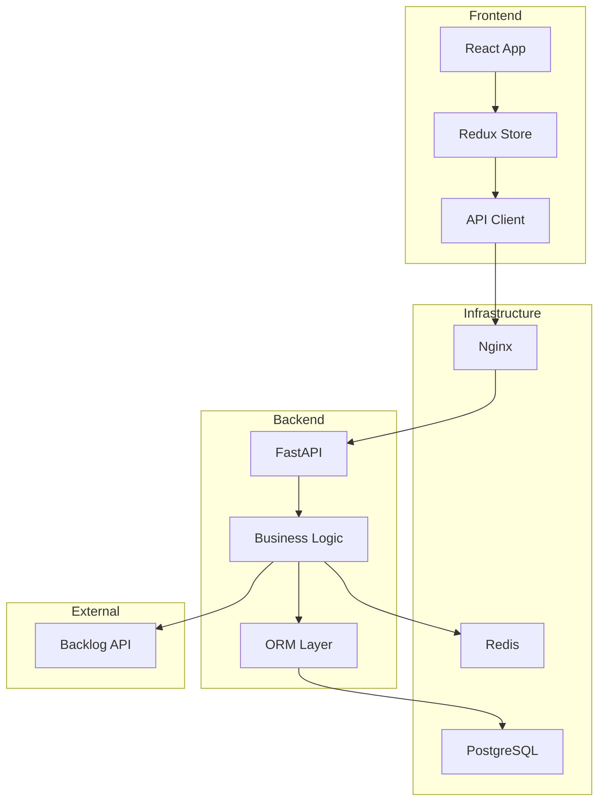

# Team Insight

> Backlog のデータを活用したチーム分析ツール。チームのパフォーマンスを可視化し、ボトルネックの特定や生産性の向上を支援します。

## ⚠️ 開発状況のお知らせ

本プロジェクトは現在開発中です。基本機能は動作しますが、一部の機能については十分な検証が完了していません。

### 検証済み機能 ✅
- Backlog OAuth認証、ユーザー管理、チーム管理
- データ同期（ユーザー・プロジェクト・タスク）
- 個人ダッシュボード、基本的な分析機能

### 検証中の機能 🔄
- **チーム生産性ダッシュボード**: 基本動作は確認済みですが、大量データでの検証が必要です
- **レポート配信**: MailHogでの動作は確認済みですが、定期実行の長期安定性は未検証です
- **自動同期スケジューラー**: 実装済みですが、エラー時のリトライ等の実環境テストが必要です

### 未実装機能 📋
- プロジェクトダッシュボード（詳細分析）
- 組織ダッシュボード
- 高度な分析機能（ボトルネック検出、サイクルタイム分析）

**フィードバックやバグ報告は大歓迎です！** 使用中に問題が発生した場合は、Issueまたは[CONTRIBUTING.md](./CONTRIBUTING.md)をご確認ください。

## 📋 目次

- [概要](#概要)
- [クイックスタートガイド](#クイックスタートガイド)
- [全機能を確認する手順ガイド](#全機能を確認する手順ガイド)
- [技術スタック](#技術スタック)
- [セットアップ](#セットアップ)
- [開発ガイド](#開発ガイド)
  - [Makefile コマンド一覧](#makefileコマンド一覧)
  - [バックエンド開発](#バックエンド開発)
  - [フロントエンド開発](#フロントエンド開発)
  - [データベース管理](#データベース管理)
  - [テスト](#テスト)
- [アーキテクチャ](#アーキテクチャ)
- [トラブルシューティング](#トラブルシューティング)
- [コントリビューション](#コントリビューション)

## 概要

Team Insight は、Backlog API と連携してチームの開発プロセスを分析・可視化する生産性向上プラットフォームです。個人、プロジェクト、組織レベルでの包括的なダッシュボードを提供し、データに基づいた意思決定を支援します。

## クイックスタートガイド

### 5分で始めるTeam Insight

1. **環境構築**（3分）
   ```bash
   git clone <repository-url>
   cd team-insight
   cp backend/.env.example backend/.env
   cp frontend/.env.example frontend/.env
   # .envファイルを編集してBacklog OAuth情報を設定
   make setup
   ```

2. **初回ログイン**（1分）
   - http://localhost にアクセス
   - 「Backlogでログイン」をクリック
   - Backlogアカウントでログイン

3. **管理者権限の設定**（1分）
   ```bash
   # RBACの初期化
   docker-compose exec backend python scripts/init_rbac.py
   # 自分のメールアドレスで管理者権限を設定
   docker-compose exec backend bash -c "INITIAL_ADMIN_EMAILS=your-email@example.com python scripts/init_admin.py"
   ```

4. **機能を試す**
   - 個人ダッシュボード: http://localhost/dashboard/personal
   - チーム管理: http://localhost/admin/teams （管理者のみ）
   - ユーザー管理: http://localhost/admin/users （管理者のみ）

## 全機能を確認する手順ガイド

初回セットアップ後、以下の手順で Team Insight の全機能をスムーズに確認できます。

### 📊 Step 1: データの準備（5分）

まずはBacklogからデータを同期して、分析に必要な情報を取得します。

#### 1-1. ユーザーデータの同期
1. **ユーザー管理画面**にアクセス: http://localhost/admin/users
2. 右上の「Backlogから同期」ボタンをクリック
3. ダイアログで「アクティブユーザーのみ」を選択して「同期開始」
4. 同期完了後、ユーザー一覧に Backlog のユーザーが表示されます

#### 1-2. プロジェクトデータの同期
1. **プロジェクト一覧**にアクセス: http://localhost/projects
2. 右上の「Backlogから同期」ボタンをクリック
3. プロジェクト一覧が更新されます
4. 各プロジェクトの「詳細」をクリックしてメンバーやタスクを確認

#### 1-3. タスクデータの同期（自動）
- プロジェクト同期時に最新のタスクも自動的に同期されます
- 個別のプロジェクトで同期する場合は、プロジェクト詳細画面から「タスクを同期」をクリック

### 👥 Step 2: チームの設定（3分）

データが準備できたら、分析用のチームを作成します。

1. **チーム管理画面**にアクセス: http://localhost/admin/teams
2. 「新規チーム作成」ボタンをクリック
3. チーム情報を入力：
   - チーム名: 例）開発チーム、デザインチーム
   - 説明: チームの役割や目的
4. 「チームを作成」ボタンをクリック
5. 作成したチームをクリックして、メンバーを追加：
   - 「メンバーを追加」ボタンをクリック
   - ユーザー一覧から追加したいメンバーを選択
   - チームロール（リーダー/メンバー）を設定

### 📈 Step 3: ダッシュボードの確認（10分）

各種ダッシュボードで分析結果を確認します。

#### 3-1. 個人ダッシュボード
**アクセス**: http://localhost/dashboard/personal

確認できる内容：
- **KPIカード**: アクティブタスク、完了率、平均サイクルタイム
- **最近の活動**: 過去7日間の完了タスク
- **ワークフロー分析**: タスクのステータス分布
- **パフォーマンス詳細**: 日別のタスク完了数グラフ

💡 **ポイント**: タスクがない場合は、Backlogで簡単なタスクを作成・完了してから再同期すると確認しやすくなります。

#### 3-2. チーム生産性ダッシュボード
**アクセス**: http://localhost/teams

確認手順：
1. ドロップダウンから作成したチームを選択
2. 以下のタブを順番に確認：
   - **メンバー別パフォーマンス**: 各メンバーの貢献度
   - **タスク分配**: 円グラフでタスクの分配状況
   - **生産性推移**: 時系列での生産性変化
   - **アクティビティ**: 最近のチーム活動

#### 3-3. プロジェクト管理
**アクセス**: http://localhost/projects

確認内容：
- プロジェクト一覧と進捗状況
- 各プロジェクトのメンバー構成
- プロジェクトごとのタスク状況

### 📧 Step 4: レポート機能の確認（5分）

定期レポートの配信設定を試します。

1. **個人設定**にアクセス: http://localhost/settings/account
2. 「通知設定」セクションで以下を設定：
   - 日次レポート: ON
   - 週次レポート: ON
   - 月次レポート: ON
3. 「設定を保存」をクリック

#### テストレポートの送信
```bash
# APIを使用してテストレポートを送信
curl -X POST http://localhost/api/v1/reports/test \
  -H "Content-Type: application/json" \
  -H "Cookie: <ブラウザからコピーしたCookie>"
```

4. **MailHog**でメールを確認: http://localhost:8025
   - 送信されたレポートメールが表示されます
   - HTMLフォーマットで見やすくまとめられた分析結果を確認

### ⚙️ Step 5: 各種設定の確認（5分）

#### 5-1. ユーザー設定
**アクセス**: http://localhost/settings

- **アカウント設定** (/settings/account)
  - 表示名、タイムゾーン、言語の変更
  - 日付フォーマットの選択
  - 通知設定のカスタマイズ

- **セキュリティ設定** (/settings/security)
  - ログイン履歴の確認
  - アクティビティログ（操作履歴）の確認
  - アクティブセッションの管理

#### 5-2. 管理者機能（管理者のみ）
- **ユーザー管理** (/admin/users)
  - ロールの変更（ADMIN/PROJECT_LEADER/MEMBER）
  - ユーザーステータスの管理
  - フィルター機能（プロジェクト別、チーム別）

- **システム設定** (/admin/settings)
  - 基本的なシステム設定画面（今後拡張予定）

### 🎯 Step 6: 実践的な使い方（オプション）

#### シナリオ1: 新しいプロジェクトの分析
1. Backlogで新しいプロジェクトを作成
2. Team Insightでプロジェクトを同期
3. チームにプロジェクトメンバーを追加
4. ダッシュボードで進捗を確認

#### シナリオ2: 週次レビューの準備
1. チーム生産性ダッシュボードで週の振り返り
2. 個人ダッシュボードで各メンバーの状況確認
3. レポート機能で週次サマリーを生成

### 🆘 困ったときは

- **データが表示されない場合**
  - Backlog同期が完了しているか確認
  - ブラウザをリロード（Ctrl+R / Cmd+R）
  - Redisキャッシュをクリア: `make redis-flush`

- **権限エラーが出る場合**
  - 管理者権限が設定されているか確認
  - ログアウトして再ログイン

- **同期エラーが発生する場合**
  - Backlog APIトークンの有効期限を確認
  - ネットワーク接続を確認
  - `make logs`でエラーログを確認

### 主な機能

#### 実装済み ✅
- **Backlog OAuth 認証**: セキュアな OAuth2.0 認証と JWT セッション管理（特定スペース専用）
- **RBAC（ロールベースアクセス制御）**: プロジェクト単位での柔軟な権限管理
- **管理画面**: ユーザー管理UI（/admin/users）でGUIによるロール管理が可能
  - ユーザー一覧表示（グローバル/プロジェクトロールの区別表示）
  - Backlogユーザー一括インポート機能
  - ユーザーステータス管理（ログイン可/不可）
- **個人ダッシュボード**: タスク情報とパフォーマンス指標の可視化（実データ連携済み）
- **プロジェクト管理**: プロジェクト情報の取得と管理
- **Backlog同期**: 
  - プロジェクトとタスクデータの自動同期
  - ユーザー一括インポート（全プロジェクトから収集）
  - 定期同期スケジューラー（日次ユーザー同期、6時間ごとのプロジェクト同期）
- **データ可視化**: D3.js によるボトルネック分析とスループット表示
- **ヘルスチェック**: システム稼働状況の監視
- **キャッシュシステム**: Redis によるAPI レスポンスのキャッシュ（有効化済み）
- **統一エラーハンドリング**: 構造化されたエラーレスポンスとロギング
- **セキュリティ強化**: レート制限、機密データマスキング、アクティビティログ記録
- **自動トークンリフレッシュ**: Backlog OAuth トークンの自動更新機能
- **レポート配信システム**: 定期的な分析レポートのメール配信（APScheduler使用）
- **チーム管理機能**: Team Insight独自のチーム概念
  - チームの作成・編集・削除（/admin/teams）
  - チームメンバー管理とロール設定（チームリーダー/メンバー）
  - チームごとの統計情報表示
  - ユーザー一覧でのチーム・プロジェクトフィルター
- **チーム生産性ダッシュボード**: チームごとの生産性分析（/teams）
  - メンバー別パフォーマンス表示
  - タスク分配の可視化
  - 生産性推移グラフ
  - チームアクティビティタイムライン
- **ユーザー設定機能**: 個人設定とセキュリティ管理（2025年7月追加）
  - アカウント設定（/settings/account）- タイムゾーン、言語、通知設定
  - セキュリティ設定（/settings/security）- ログイン履歴、アクティビティログ、セッション管理
  - ユーザープリファレンス管理
  - 操作履歴の自動記録とIPアドレス追跡

#### 開発中 🚧
- **プロジェクトダッシュボード**: プロジェクト全体の分析機能
- **組織ダッシュボード**: 組織全体の生産性分析
- **高度な分析機能**: ボトルネック検出アルゴリズム（実データとの連携）

#### 計画中 📋
- **通知システム**: ボトルネックアラートと改善提案
- **予測分析**: AI を活用した将来予測
- **WebSocket 統合**: リアルタイム更新
- **レポート生成**: PDF/Excel形式でのレポート出力

## 技術スタック

### バックエンド

- **FastAPI** (0.109.2): 高速で型安全な Web API フレームワーク
- **Python** (3.11): モダンな Python ランタイム
- **SQLAlchemy** (2.0): 最新の ORM とデータベース管理
- **PostgreSQL** (15): メインデータベース（team_insight スキーマ使用）
- **Redis** (7): キャッシュとセッション管理（パスワード認証付き）
- **Alembic**: データベースマイグレーション
- **httpx**: 非同期 HTTP クライアント（Backlog API 連携用）
- **python-jose[cryptography]**: JWT トークン処理

### フロントエンド

- **Next.js** (14): App Router を使用した React フレームワーク
- **React** (18): UI ライブラリ
- **TypeScript** (5): 型安全な開発
- **Redux Toolkit**: グローバル状態管理（ユーザー認証情報のみ）
- **TanStack Query** (v5): サーバー状態管理とデータフェッチング
- **shadcn/ui**: Radix UI ベースのコンポーネントライブラリ
- **Tailwind CSS** (v3): ユーティリティファースト CSS
- **D3.js**: データ可視化ライブラリ
- **Yarn v4 (Berry)**: パッケージ管理（Corepack 使用）
- **react-hook-form + zod**: フォーム処理とバリデーション
- **axios**: HTTP クライアント（統一されたエラーハンドリング付き）

### インフラ

- **Docker & Docker Compose**: コンテナ化と開発環境
- **Nginx**: リバースプロキシ（API ルーティング）
- **Node.js v22 LTS**: フロントエンドランタイム
- **Make**: 開発タスクの自動化

## セットアップ

### 前提条件

- Docker Desktop
- Git
- Backlog OAuth アプリケーションの登録（下記参照）

### Backlog OAuth アプリケーションの登録

Team InsightはBacklog OAuth 2.0を使用して認証を行います。以下の手順でアプリケーションを登録してください：

1. **Backlogにログイン**
   - ご利用のBacklogスペース（`https://[your-space].backlog.jp/`）にログイン

2. **アプリケーション登録画面へアクセス**
   - 右上のプロフィールアイコン → 「個人設定」をクリック
   - 左メニューの「アプリケーション」をクリック
   - 「アプリケーションを追加」ボタンをクリック

3. **アプリケーション情報の入力**
   - **アプリケーション名**: Team Insight（任意の名前でOK）
   - **アプリケーションの説明**: チーム分析ツール（任意）
   - **リダイレクトURI**: `http://localhost:8000/api/v1/auth/callback`
     - 本番環境では適切なドメインに変更してください
     - 例: `https://your-domain.com/api/v1/auth/callback`
   - **権限スコープ**: 以下を選択
     - ✅ 課題の読み取り
     - ✅ プロジェクトの読み取り
     - ✅ ユーザー情報の読み取り

4. **登録完了後の情報を保存**
   - **クライアントID**: 環境変数 `BACKLOG_CLIENT_ID` に設定
   - **クライアントシークレット**: 環境変数 `BACKLOG_CLIENT_SECRET` に設定
   - **スペースキー**: URLの `[your-space]` 部分を環境変数 `BACKLOG_SPACE_KEY` に設定

### 初回セットアップ

1. **リポジトリのクローン**

```bash
git clone https://github.com/your-org/team-insight.git
cd team-insight
```

2. **環境変数の設定**

環境変数のサンプルファイルをコピーして編集します:

```bash
# バックエンド環境変数
cp backend/.env.example backend/.env
# フロントエンド環境変数
cp frontend/.env.example frontend/.env
```

**backend/.env** の必須設定項目:
- `BACKLOG_CLIENT_ID`: Backlog OAuth アプリケーションのクライアントID（アプリケーション登録で取得）
- `BACKLOG_CLIENT_SECRET`: Backlog OAuth アプリケーションのクライアントシークレット（アプリケーション登録で取得）
- `BACKLOG_SPACE_KEY`: 使用するBacklogスペースキー（URLの `[your-space]` 部分）
  - 例: `https://example.backlog.jp/` の場合は `example`
- `BACKLOG_REDIRECT_URI`: `http://localhost:8000/api/v1/auth/callback`（本番環境では変更）
- `SECRET_KEY`: JWT署名用の秘密鍵（32文字以上のランダムな文字列）
  - 生成例: `openssl rand -hex 32`

**frontend/.env** の必須設定項目:
- `NEXT_PUBLIC_BACKLOG_CLIENT_ID`: Backlog OAuth アプリケーションのクライアントID（backend/.envと同じ値）
- `NEXT_PUBLIC_BACKLOG_SPACE_NAME`: 使用するBacklogスペース名（backend/.envのBACKLOG_SPACE_KEYと同じ値）

その他の設定項目はデフォルト値で動作します。詳細は各`.env.example`ファイルのコメントを参照してください。

3. **Docker環境のセットアップと起動**

```bash
# Makefileを使用（推奨）
make setup

# または手動で実行
docker-compose build
docker-compose up -d
docker-compose exec backend alembic upgrade head
```

4. **アプリケーションへのアクセス**

- フロントエンド: http://localhost (Nginx経由)
- バックエンド API: http://localhost/api (Nginx経由)
- API ドキュメント: http://localhost/api/v1/docs (Nginx経由)
- MailHog Web UI: http://localhost:8025 (開発環境のメール確認)

### 初回ログインと管理者権限の設定

#### ステップ1: Backlog OAuthでログイン

1. ブラウザで http://localhost にアクセス
2. 「Backlogでログイン」ボタンをクリック
3. Backlogアカウントでログイン（設定したスペースのアカウントを使用）

#### ステップ2: 管理者権限の付与

初回セットアップ後、以下の手順で管理者権限を設定します：

```bash
# 1. RBACの初期化（初回のみ必要）
docker-compose exec backend python scripts/init_rbac.py

# 2. 管理者権限の付与（メールアドレスを自分のものに変更）
docker-compose exec backend bash -c "INITIAL_ADMIN_EMAILS=your-email@example.com python scripts/init_admin.py"

# または、Makefileコマンドを使用（RBACが初期化済みの場合）
make init-admin  # .envファイルのINITIAL_ADMIN_EMAILSを使用
```

#### ステップ3: 機能の確認

管理者権限が付与されると、以下の機能にアクセスできます：

- **管理画面** (http://localhost/admin)
  - ユーザー管理: 全ユーザーの一覧表示、ロール変更
  - チーム管理: チームの作成・編集・削除、メンバー管理
- **分析ダッシュボード**
  - 個人ダッシュボード: タスクの進捗とパフォーマンス分析
  - チーム生産性: チーム別の生産性分析とKPI表示
- **レポート配信**: 定期レポートのスケジュール設定

## 機能を試してみる

### 1. 個人ダッシュボード

**アクセス方法**: http://localhost/dashboard/personal

個人の生産性とタスク管理を可視化します：

- **KPI カード**: アクティブタスク数、完了率、平均サイクルタイム
- **最近の完了タスク**: 過去7日間に完了したタスクの一覧
- **ワークフロー分析**: タスクのステータス分布
- **パフォーマンス詳細**: スループットチャート（D3.js）

### 2. チーム管理（管理者/プロジェクトリーダー）

**アクセス方法**: http://localhost/admin/teams

チームの作成と管理：

1. 「新規チーム作成」ボタンをクリック
2. チーム名と説明を入力
3. メンバーを追加（ユーザー一覧から選択）
4. チームロールを設定（チームリーダー/メンバー）

### 3. チーム生産性ダッシュボード

**アクセス方法**: http://localhost/teams

チーム別の生産性分析：

- **チーム選択**: ドロップダウンからチームを選択
- **全体統計**: 総チーム数、アクティブタスク、月間完了タスク
- **チーム詳細タブ**:
  - メンバー別パフォーマンス: 個人の貢献度を可視化
  - タスク分配: 円グラフでタスク配分を表示
  - 生産性推移: 時系列での生産性変化
  - アクティビティタイムライン: 最近の活動履歴

### 4. ユーザー管理（管理者のみ）

**アクセス方法**: http://localhost/admin/users

ユーザーとロールの管理：

- **ユーザー一覧**: 全ユーザーの表示（フィルター・ソート機能付き）
- **ロール変更**: ユーザーのロールをGUIで簡単に変更
- **ステータス管理**: ログイン可/不可の切り替え
- **Backlog同期**: 「Backlogから同期」ボタンで一括インポート

### 5. プロジェクト管理

**アクセス方法**: http://localhost/projects

Backlogプロジェクトとの連携：

- **プロジェクト一覧**: 同期されたプロジェクトの表示
- **メンバー管理**: プロジェクトメンバーの追加・削除
- **同期機能**: Backlogからの最新データ取得

### 6. レポート配信設定

**アクセス方法**: 個人設定またはAPI経由

定期レポートの設定：

```bash
# テストレポートの送信
curl -X POST http://localhost/api/v1/reports/test \
  -H "Authorization: Bearer YOUR_TOKEN"

# MailHogでメールを確認
# http://localhost:8025
```

### 7. ユーザー設定

**アクセス方法**: http://localhost/settings

個人設定の管理：

- **アカウント設定** (/settings/account)
  - 表示名、タイムゾーン、言語、日付形式
  - 通知設定（日次/週次/月次レポート）
- **セキュリティ設定** (/settings/security)
  - ログイン履歴の確認
  - アクティビティログの閲覧
  - アクティブセッションの管理

### 8. API ドキュメント

**アクセス方法**: http://localhost/api/v1/docs

FastAPIの対話的なAPIドキュメント：

- 全エンドポイントの詳細仕様
- リクエスト/レスポンスの例
- 直接APIをテスト実行可能

## 開発ガイド

### Makefile コマンド一覧

#### 基本操作

```bash
make start          # 開発サーバーを起動
make stop           # 開発サーバーを停止
make restart        # 開発サーバーを再起動
make status         # サービスの状態を確認
make logs           # 全サービスのログを表示
```

#### データベース操作

```bash
make db-shell      # PostgreSQLに接続
make db-backup     # データベースのバックアップを作成
make db-restore    # バックアップから復元
make migrate       # 最新のマイグレーションを適用
make migrate-rollback  # 最後のマイグレーションをロールバック
```

#### 開発用コマンド

```bash
make test          # バックエンドテストを実行
make test-frontend # フロントエンドテストを実行
make test-all      # 全てのテストを実行
make test-coverage # カバレッジレポート付きでテスト実行
make lint          # コードの静的解析を実行
make format        # コードをフォーマット
make clean         # コンテナとボリュームを削除
```

#### TypeScript型生成

```bash
make update-types   # OpenAPIスキーマからTypeScript型を生成
make generate-types # 型生成のみ（バックエンド起動確認なし）
make dev-sync       # マイグレーション + 型生成を一括実行
```

#### Redis操作

```bash
make redis-keys     # 全Redisキー一覧を表示
make redis-cli      # Redis CLIに接続
```

#### Nginx操作

```bash
make nginx-access-log # Nginxアクセスログを表示
make nginx-reload     # Nginx設定をリロード
```

#### コンテナ操作

```bash
make build         # 全イメージをビルド
make rebuild       # 全イメージを再ビルド
make ps            # コンテナの状態を表示
make shell         # バックエンドコンテナのシェルに入る
```

#### ロール管理

Team Insightは**独自のロールベースアクセス制御（RBAC）システム**を実装しており、Backlogのロールとは独立して動作します。

**Team Insight固有のロール**:
- **ADMIN（管理者）**: システム全体の管理権限、ユーザー管理、全プロジェクトへのアクセス
- **PROJECT_LEADER（プロジェクトリーダー）**: 担当プロジェクトの管理権限、メンバー管理
- **MEMBER（メンバー）**: 所属プロジェクトへの参照権限

**Backlogロールとの関係**:
- Team InsightのロールはBacklogのロール（管理者、一般ユーザー等）とは**完全に独立**
- Backlogでの権限に関わらず、Team Insight内で個別に権限を設定可能
- この設計により、Team Insight固有の機能（レポート配信、ダッシュボード管理等）に対する柔軟な権限制御を実現

**管理方法**:

**管理画面（GUI）**: http://localhost/admin/users でユーザー・ロール管理が可能です。

**CLIツール（並行して利用可能）**:

初回セットアップ時：
```bash
# RBACの初期化（ロールと権限の定義を作成）
docker-compose exec backend python scripts/init_rbac.py

# 環境変数から管理者を設定（.envのINITIAL_ADMIN_EMAILSを使用）
make init-admin

# または直接指定
docker-compose exec backend bash -c "INITIAL_ADMIN_EMAILS=admin@example.com python scripts/init_admin.py"
```

通常のロール管理：
```bash
make set-admin EMAIL=user@example.com       # ユーザーを管理者に設定
make set-role EMAIL=user@example.com ROLE=PROJECT_LEADER  # ロール設定
make list-users     # 全ユーザーとロールを一覧表示
make remove-role EMAIL=user@example.com ROLE=MEMBER # ロール削除
make init-admin     # 環境変数から初期管理者を設定
```

#### レポート配信機能

Team Insightは自動レポート配信機能を完備しており、個人・プロジェクト・チーム単位での定期レポートを送信できます。

**レポートの種類**:
- **個人レポート**: タスク完了率、サイクルタイム、生産性スコアなどの個人パフォーマンス指標
- **プロジェクトレポート**: プロジェクト健全度、ボトルネック分析、トップパフォーマー
- **チームレポート**: 組織全体の統計、アクティブプロジェクト数、全体的な生産性指標

**レポート頻度**:
- 日次（Daily）
- 週次（Weekly）
- 月次（Monthly）

**レポート配信のテスト方法**:

1. **MailHog Web UIを開く**:
   ```bash
   # ブラウザで以下のURLにアクセス
   open http://localhost:8025
   ```

2. **テストレポートの送信**（認証が必要）:
   ```bash
   # ブラウザでTeam Insightにログイン後、開発者ツールでCookieのauth_tokenを取得
   # または、curlコマンドで直接APIを呼び出し:
   
   curl -X POST "http://localhost/api/v1/reports/test" \
     -H "Cookie: auth_token=YOUR_AUTH_TOKEN" \
     -H "Content-Type: application/json" \
     -d '{
       "report_type": "weekly",
       "recipient_type": "personal"
     }'
   ```

3. **MailHogでレポートを確認**:
   - MailHog UI（http://localhost:8025）を開く
   - 受信トレイに「Team Insight Weekly Report」という件名のメールが表示される
   - メールをクリックしてHTMLレポートの内容を確認

**レポートに含まれる内容**:
- KPIカード（タスク完了数、平均サイクルタイム、生産性スコア、期限遵守率）
- タスクタイプ別分析（バグ、機能、タスク、その他）
- 最近完了したタスク一覧
- 視覚的な進捗バー
- モバイル対応のレスポンシブデザイン

**レポートスケジュールの管理**:

API経由でレポート配信スケジュールを設定・管理できます：

```bash
# スケジュール一覧の取得
curl -X GET "http://localhost/api/v1/reports/schedules" \
  -H "Cookie: auth_token=YOUR_AUTH_TOKEN"

# 週次レポートのスケジュール作成
curl -X POST "http://localhost/api/v1/reports/schedules" \
  -H "Cookie: auth_token=YOUR_AUTH_TOKEN" \
  -H "Content-Type: application/json" \
  -d '{
    "report_type": "weekly",
    "recipient_type": "personal",
    "is_active": true
  }'
```

**開発環境での注意事項**:
- MailHogはSMTPサーバーとして機能し、すべてのメールを捕捉します
- 実際のメールアドレスには送信されません
- 本番環境では適切なSMTPサーバーの設定が必要です

#### ユーザーステータス管理

Team Insightでは、ユーザーのログイン可否を`is_active`フラグで管理しています。

**ステータスの種類**:
- **ログイン可（is_active = true）**: ユーザーがシステムにログインできる状態
- **ログイン不可（is_active = false）**: ユーザーがシステムにログインできない状態

**使用場面**:
1. **退職・休職時**: 従業員が退職または休職した際に、一時的にアクセスを停止
2. **セキュリティ対応**: 不正アクセスの疑いがある場合の緊急アカウント停止
3. **ライセンス管理**: 利用人数に制限がある場合の調整
4. **一時的な利用停止**: プロジェクト終了後もデータ履歴は残したいが、アクセスは制限したい場合

**管理方法**:
- 管理画面（http://localhost/admin/users）から各ユーザーのステータスを変更可能
- フィルター機能で「ログイン可」「ログイン不可」のユーザーを絞り込み表示

**注意事項**:
- Backlog OAuth認証を使用しているため、Backlog側でもアカウントが有効である必要があります
- このフラグはTeam Insight側での追加的なアクセス制御として機能します

### バックエンド開発

#### ディレクトリ構造

```
backend/
├── app/
│   ├── api/          # APIエンドポイント
│   │   └── v1/       # APIバージョン1
│   ├── core/         # 設定とセキュリティ
│   ├── db/           # データベース関連
│   ├── models/       # SQLAlchemyモデル
│   ├── schemas/      # Pydanticスキーマ
│   ├── services/     # ビジネスロジック
│   └── main.py       # アプリケーションエントリーポイント
├── alembic/          # データベースマイグレーション
└── tests/            # テストコード
```

#### 新しい API エンドポイントの追加

1. **スキーマの定義** (`app/schemas/your_feature.py`):

```python
from pydantic import BaseModel, Field
from typing import Optional

class YourFeatureResponse(BaseModel):
    """レスポンススキーマ"""
    id: int = Field(..., description="ID")
    name: str = Field(..., description="名前")

    class Config:
        json_schema_extra = {
            "example": {
                "id": 1,
                "name": "サンプル"
            }
        }
```

2. **モデルの定義** (`app/models/your_feature.py`):

```python
from sqlalchemy import Column, Integer, String
from app.db.base_class import Base

class YourFeature(BaseModel):
    """データベースモデル"""
    __tablename__ = "your_features"
    __table_args__ = {"schema": "team_insight"}

    # idは BaseModel で定義済み
    name = Column(String(255), nullable=False)
    # created_at, updated_at も BaseModel で定義済み
```

3. **サービスの実装** (`app/services/your_feature_service.py`):

```python
from sqlalchemy.orm import Session
from app.models.your_feature import YourFeature

class YourFeatureService:
    """ビジネスロジック"""

    async def get_all(self, db: Session):
        """すべてのデータを取得"""
        return db.query(YourFeature).all()

your_feature_service = YourFeatureService()
```

4. **API エンドポイントの実装** (`app/api/v1/your_feature.py`):

```python
from fastapi import APIRouter, Depends
from sqlalchemy.orm import Session
from typing import List

from app.db.session import get_db
from app.schemas.your_feature import YourFeatureResponse
from app.services.your_feature_service import your_feature_service
from app.core.security import get_current_active_user

router = APIRouter(prefix="/your-feature", tags=["your-feature"])

@router.get("/", response_model=List[YourFeatureResponse])
async def get_your_features(
    db: Session = Depends(get_db),
    current_user = Depends(get_current_active_user)
):
    """データ一覧を取得"""
    return await your_feature_service.get_all(db)
```

5. **ルーターの登録** (`app/api/v1/__init__.py`):

```python
from .your_feature import router as your_feature_router
# 既存のインポートに追加

api_router.include_router(your_feature_router)
```

### フロントエンド開発

#### ディレクトリ構造

```
frontend/
├── src/
│   ├── app/              # Next.js App Router
│   │   ├── (routes)/     # ページコンポーネント
│   │   ├── api/          # APIルート
│   │   └── layout.tsx    # ルートレイアウト
│   ├── components/       # 再利用可能なコンポーネント
│   │   └── ui/          # shadcn/uiコンポーネント
│   ├── hooks/           # カスタムフック
│   ├── services/        # APIクライアント
│   ├── store/           # Redux store
│   │   └── slices/      # Redux slices
│   └── types/           # TypeScript型定義
```

#### 新しいページの追加

1. **型定義** (`src/types/your-feature.ts`):

```typescript
export interface YourFeature {
  id: number;
  name: string;
}
```

2. **API サービス** (`src/services/your-feature.service.ts`):

```typescript
import axios from "axios";
import { YourFeature } from "@/types/your-feature";

const API_BASE_URL = process.env.NEXT_PUBLIC_API_URL || "http://localhost:8000";

class YourFeatureService {
  async getAll(): Promise<YourFeature[]> {
    const response = await axios.get(`${API_BASE_URL}/api/v1/your-feature`);
    return response.data;
  }
}

export const yourFeatureService = new YourFeatureService();
```

3. **React Query Hook** (`src/hooks/queries/useYourFeature.ts`):

```typescript
import { useQuery, useMutation, useQueryClient } from '@tanstack/react-query'
import { yourFeatureService } from '@/services/your-feature.service'
import { YourFeature } from '@/types/your-feature'
import { queryKeys } from '@/lib/react-query'
import { useToast } from '@/hooks/use-toast'

export const useYourFeatures = () => {
  return useQuery({
    queryKey: queryKeys.yourFeature.all,
    queryFn: () => yourFeatureService.getAll(),
    staleTime: 5 * 60 * 1000, // 5分
  })
}

export const useCreateYourFeature = () => {
  const queryClient = useQueryClient()
  const { toast } = useToast()
  
  return useMutation({
    mutationFn: yourFeatureService.create,
    onSuccess: () => {
      queryClient.invalidateQueries({ queryKey: queryKeys.yourFeature.all })
      toast({ title: '作成しました' })
    },
    onError: (error) => {
      toast({ 
        title: 'エラー',
        description: getApiErrorMessage(error),
        variant: 'destructive'
      })
    }
  })
}
```

4. **ページコンポーネント** (`src/app/your-feature/page.tsx`):

```typescript
"use client";

import { useYourFeatures } from "@/hooks/queries/useYourFeature";
import { Card, CardContent, CardHeader, CardTitle } from "@/components/ui/card";
import { Skeleton } from "@/components/ui/skeleton";
import { Alert, AlertDescription } from "@/components/ui/alert";

export default function YourFeaturePage() {
  const { data: items, isLoading, error } = useYourFeatures();

  if (isLoading) {
    return (
      <div className="container mx-auto p-6">
        <Skeleton className="h-[200px] w-full" />
      </div>
    );
  }

  if (error) {
    return (
      <div className="container mx-auto p-6">
        <Alert variant="destructive">
          <AlertDescription>{getApiErrorMessage(error)}</AlertDescription>
        </Alert>
      </div>
    );
  }

  return (
    <div className="container mx-auto p-6">
      <h1 className="text-3xl font-bold mb-6">Your Feature</h1>
      <div className="grid gap-4">
        {items?.map((item) => (
          <Card key={item.id}>
            <CardHeader>
              <CardTitle>{item.name}</CardTitle>
            </CardHeader>
            <CardContent>{/* コンテンツ */}</CardContent>
          </Card>
        ))}
      </div>
    </div>
  );
}
```

### TypeScript型の自動生成

Team InsightではOpenAPIスキーマからTypeScript型を自動生成し、フロントエンドとバックエンド間の型の整合性を保証しています。

#### 仕組み

1. **バックエンド**: FastAPIが自動的にOpenAPIスキーマを生成（`/api/v1/openapi.json`）
2. **型生成**: `openapi-typescript`がスキーマからTypeScript型定義を生成
3. **フロントエンド**: 生成された型を使用してタイプセーフな開発

#### 使用方法

```bash
# TypeScript型を生成（バックエンドが起動している必要があります）
make update-types

# 型生成のみ（起動確認なし）
make generate-types

# 開発ワークフロー：マイグレーションと型生成を一括実行
make dev-sync
```

#### 実装例

1. **バックエンドでPydanticスキーマを定義**:

```python
# backend/app/schemas/your_feature.py
from pydantic import BaseModel, Field
from typing import Literal

class YourFeatureResponse(BaseModel):
    """レスポンススキーマ"""
    id: int = Field(..., description="ID")
    name: str = Field(..., description="名前")
    status: Literal["active", "inactive"] = Field(..., description="ステータス")
```

2. **エンドポイントでスキーマを使用**:

```python
# backend/app/api/v1/your_feature.py
@router.get("/", response_model=List[YourFeatureResponse])
async def get_your_features():
    """データ一覧を取得"""
    return await your_feature_service.get_all()
```

3. **型を生成**:

```bash
make update-types
```

4. **フロントエンドで自動生成された型を使用**:

```typescript
// frontend/src/services/your-feature.service.ts
import type { components } from "@/types/api";

// 自動生成された型を使用
type YourFeatureResponse = components["schemas"]["YourFeatureResponse"];

export async function getYourFeatures(): Promise<YourFeatureResponse[]> {
    const response = await axios.get("/api/v1/your-feature");
    return response.data;
}
```

#### メリット

- **型の一元管理**: バックエンドのPydanticモデルが唯一の真実の源
- **自動同期**: API変更時に型定義が自動的に更新
- **型安全性**: コンパイル時に型の不整合を検出
- **開発効率**: 手動での型定義が不要

#### 注意事項

- 型生成時はバックエンドが起動している必要があります
- 生成された型ファイル（`src/types/api.d.ts`）は直接編集しないでください
- APIを変更した後は必ず`make update-types`を実行してください

### データベース管理

#### マイグレーション

```bash
# 新しいマイグレーションの作成
make migration-create name="migration_name"

# マイグレーションの適用
make migrate

# マイグレーションのロールバック
make migrate-rollback

# マイグレーション履歴の確認
make migration-history
```

#### バックアップとリストア

```bash
# バックアップの作成
make db-backup

# バックアップからの復元
make db-restore

# バックアップ一覧の表示
make db-backup-list
```

### テスト

#### バックエンドテスト

1. **テストファイルの作成** (`backend/tests/test_your_feature.py`):

```python
import pytest
from fastapi.testclient import TestClient
from app.main import app

client = TestClient(app)

def test_get_your_features():
    """データ一覧取得のテスト"""
    response = client.get("/api/v1/your-feature")
    assert response.status_code == 200
    assert isinstance(response.json(), list)
```

2. **テストの実行**:

```bash
# すべてのテストを実行
make test

# 特定のテストファイルを実行
make test path="tests/test_your_feature.py"

# カバレッジレポート付きで実行
make test-coverage
```

#### フロントエンドテスト

1. **コンポーネントテスト** (`frontend/src/__tests__/YourFeature.test.tsx`):

```typescript
import { render, screen } from "@testing-library/react";
import { Provider } from "react-redux";
import { store } from "@/store";
import YourFeaturePage from "@/app/your-feature/page";

describe("YourFeaturePage", () => {
  it("renders without crashing", () => {
    render(
      <Provider store={store}>
        <YourFeaturePage />
      </Provider>
    );

    expect(screen.getByText("Your Feature")).toBeInTheDocument();
  });
});
```

2. **テストの実行**:

```bash
# フロントエンドコンテナ内でテストを実行
docker-compose exec frontend yarn test

# ローカルでテストを実行
cd frontend
yarn test

# ウォッチモードで実行
yarn test:watch

# 特定のテストファイルを実行
yarn test src/services/__tests__/health.service.test.ts

# カバレッジレポート付きで実行（設定が必要）
# yarn test:coverage
```

> 注意: プロジェクトではYarn v4 (Berry)を使用してテストを実行します。

**詳細なテストガイド**: フロントエンドテストの詳細（setupTests.ts、モックの使用方法、ベストプラクティス）については、[frontend/docs/testing.md](frontend/docs/testing.md)を参照してください。

## アーキテクチャ

### システム構成図



## トラブルシューティング

### よくある問題と解決方法

#### 初回セットアップ時の問題

##### 環境変数ファイルが見つからない
```bash
# エラー: .env file not found
# 解決方法:
cp backend/.env.example backend/.env
cp frontend/.env.example frontend/.env
# その後、必要な値を設定してください
```

##### Dockerが起動していない
```bash
# エラー: Cannot connect to the Docker daemon
# 解決方法: Docker Desktopを起動してください
```

##### make setupが失敗する
```bash
# データベース接続エラーの場合
docker-compose down -v  # 既存のボリュームを削除
make setup             # 再度セットアップを実行

# ポート競合の場合
docker-compose down    # 既存のコンテナを停止
make setup            # 再度セットアップを実行
```

#### ポート競合エラー

```bash
# 使用中のポートを確認
lsof -i :3000  # フロントエンド
lsof -i :8000  # バックエンド
lsof -i :5432  # PostgreSQL
lsof -i :6379  # Redis

# プロセスを終了
kill -9 [PID]

# または別のポートを使用（docker-compose.override.yml を作成）
```

#### データベース接続エラー

```bash
# PostgreSQLコンテナの状態を確認
docker-compose ps postgres

# ログを確認
docker-compose logs postgres

# データベースを再作成
docker-compose down -v
docker-compose up -d postgres
make migrate  # マイグレーションを再実行
```

#### 認証エラー

- **Backlog OAuth 設定を確認**
  - `BACKLOG_CLIENT_ID`と`BACKLOG_CLIENT_SECRET`が正しく設定されているか
  - `BACKLOG_SPACE_KEY`が正しいスペースキーか（URLの一部分）
  - `BACKLOG_REDIRECT_URI`が`http://localhost/auth/callback`になっているか

- **環境変数の反映**
  ```bash
  # 環境変数を変更した後は、コンテナを再起動
  make restart
  ```

#### Next.jsビルドエラー

```bash
# .nextディレクトリの問題
cd frontend
rm -rf .next
cd ..
make restart

# node_modulesの問題
cd frontend
rm -rf node_modules
docker-compose build frontend
make restart
```

### 開発のヒント

1. **API ドキュメント**: http://localhost/api/v1/docs で対話的に API をテスト（Nginx経由）
2. **Redux DevTools**: ブラウザ拡張機能で状態管理をデバッグ
3. **Docker logs**: `docker-compose logs -f [service]` でリアルタイムログ確認
4. **Hot Reload**: フロントエンド・バックエンドともに自動リロード対応
5. **型の自動生成**: API変更後は必ず`make update-types`を実行して型定義を更新

## APIアクセスとネットワーク構成

### 開発環境でのAPIアクセス

開発環境では、Nginxがリバースプロキシとして動作し、すべてのHTTPトラフィックを適切なサービスにルーティングします：

```
ブラウザ → http://localhost → Nginx → 各サービス
  └─ /         → Frontend (Next.js) :3000
  └─ /api      → Backend (FastAPI) :8000
  └─ /health   → Backend (FastAPI) :8000
  └─ /admin    → Backend (FastAPI) :8000
  └─ /graphql  → Backend (FastAPI) :8000
```

### 環境変数の設定

フロントエンドからAPIへのアクセスは環境変数で制御されます：

- **開発環境**: `NEXT_PUBLIC_API_URL=http://localhost`
- **本番環境**: `NEXT_PUBLIC_API_URL=https://your-domain.com`

### テスト環境での注意点

テストファイルでは、環境変数をモックして`http://localhost:8000`を直接使用しています：

```typescript
// テスト環境でのモック
jest.mock("@/config/env", () => ({
  env: {
    get: jest.fn().mockReturnValue("http://localhost:8000"),
  },
}));
```

これは実際のNginxを経由せずに、バックエンドAPIを直接モックするためです。

## トラブルシューティング

### 認証関連

#### 別のBacklogスペースでログイン中の場合

Team Insightは特定のBacklogスペース（設定されたスペース）専用のツールです。別のBacklogスペースのアカウントでログインしている場合、以下の手順で対処してください：

1. **エラーメッセージが表示される場合**
   - ログイン時に「このBacklogスペースへのアクセス権限がありません」というエラーが表示されます
   - これは正常な動作で、別のスペースのアカウントでログインしているためです

2. **対処方法**
   別のBacklogアカウントでログインする必要がある場合は、以下のいずれかの方法をご利用ください：
   - **プライベートブラウジング（推奨）**: 新しいプライベート/シークレットウィンドウでアクセス
   - **別のブラウザを使用**: Chrome、Firefox、Safari など異なるブラウザでアクセス
   - **Cookieをクリア**: ブラウザの設定から nulab.com のCookieを削除してからアクセス

3. **技術的な制約**
   - Backlog/Nulabの認証はドメインが異なるため、事前に別スペースでのログイン状態を検知できません
   - そのため、認証後にスペースの確認を行い、適切なエラーメッセージを表示します

#### CORSエラーについて

Nulab認証ページで以下のようなエラーが表示されることがあります：
```
Unsafe attempt to load URL https://d1lvv0q42gy9jf.cloudfront.net/...
```

これはNulab側の実装に起因するもので、Team Insightの動作には影響しません。無視して問題ありません。

## コントリビューション

1. Feature ブランチを作成: `git checkout -b feature/your-feature`
2. 変更をコミット: `git commit -m 'Add your feature'`
3. ブランチをプッシュ: `git push origin feature/your-feature`
4. プルリクエストを作成

### コーディング規約

- Python: PEP 8, Black, isort
- TypeScript: ESLint, Prettier
- コミット: Conventional Commits

## 参考資料

- [FastAPI 公式ドキュメント](https://fastapi.tiangolo.com/)
- [React 公式ドキュメント](https://react.dev/)
- [Docker Compose 公式ドキュメント](https://docs.docker.com/compose/)
- [Backlog API 仕様](https://developer.nulab.com/ja/docs/backlog/)

## ライセンス

Copyright (c) 2025 Team Insight. All Rights Reserved.

このソフトウェアは **プロプライエタリライセンス** の下で提供されています。

### 許可される使用

- ✅ **閲覧**: ソースコードの閲覧と学習
- ✅ **個人利用**: 個人的な非商用目的での使用（自己のローカル環境でのみ）
- ✅ **評価**: 製品評価目的での一時的な使用（30日間まで）

### 禁止される使用

- ❌ **商用利用**: いかなる営利目的での使用も禁止
- ❌ **再配布**: ソースコード、バイナリ、または派生物の再配布
- ❌ **改変の配布**: 改変したコードの第三者への提供
- ❌ **サービス提供**: このソフトウェアを使用したサービスの提供
- ❌ **組織での使用**: 企業、団体、教育機関での使用（評価目的を除く）

### 制限事項

1. このソフトウェアの全部または一部を、許可なく複製、改変、配布することはできません
2. このソフトウェアから派生した作品を作成し、配布することはできません
3. このソフトウェアのライセンス表示、著作権表示を削除または変更することはできません

### 免責事項

このソフトウェアは「現状のまま」提供され、明示的または暗黙的な保証はありません。

詳細については [LICENSE](./LICENSE) ファイルをご確認ください。

### ライセンスに関するお問い合わせ

商用利用、組織での使用、その他のライセンスについては、お問い合わせください。
