# Team Insight 実装ガイド（ジュニアエンジニア向け）

**最終更新日**: 2025-01-15

**バージョン**: 2.0

**対象者**: ジュニアエンジニア、新規参加メンバー、実装詳細を学びたい開発者

---

## 📖 このガイドについて

このドキュメントは、Team Insightプロジェクトの実装を**詳細に解説した実践的な学習教材**です。各機能の実装方法をステップバイステップで説明し、実際のコードを豊富に引用しながら、**なぜそのように実装されているのか**を理解できるように構成されています。

### ガイドの特徴

- **サイズ制限なし**: 詳細さ、わかりやすさ、網羅性を最優先
- **ステップバイステップ**: 各実装を段階的に理解
- **コード例が豊富**: 実際のコードを多く引用
- **図解の活用**: Mermaid図で視覚的に説明
- **実践的**: 実際の開発で使える具体的な情報

---

## 📚 目次

### 第1部: プロジェクト概要と環境構築

1. [プロジェクト概要](#1-プロジェクト概要)
1. [環境構築](#2-環境構築)
1. [最初の一歩](#3-最初の一歩)

### 第2部: バックエンド実装ガイド（FastAPI）

1. [アーキテクチャ理解](#4-アーキテクチャ理解)
1. [コア機能の実装](#5-コア機能の実装)
1. [認証システム（OAuth2.0 + JWT）](#6-認証システムoauth20--jwt)
1. [データモデルとマイグレーション](#7-データモデルとマイグレーション)
1. [サービス層の実装](#8-サービス層の実装)
1. [API層の実装](#9-api層の実装)
1. [バックエンドのテスト](#10-バックエンドのテスト)

### 第3部: フロントエンド実装ガイド（Next.js + React）

1. [Next.js 14 App Routerの理解](#11-nextjs-14-app-routerの理解)
1. [状態管理](#12-状態管理)
1. [認証フロー（フロントエンド）](#13-認証フローフロントエンド)
1. [APIクライアント（api-client.ts）](#14-apiクライアントapi-clientts)
1. [カスタムフックの実装](#15-カスタムフックの実装)
1. [主要ページコンポーネント](#16-主要ページコンポーネント)
1. [UIコンポーネントとスタイリング](#17-uiコンポーネントとスタイリング)
1. [データ可視化](#18-データ可視化)
1. [フロントエンドのテスト](#19-フロントエンドのテスト)

### 第4部: システム連携と運用

1. [Backlog API連携](#20-backlog-api連携)
1. [キャッシュ戦略](#21-キャッシュ戦略)
1. [スケジューラー](#22-スケジューラー)
1. [デプロイと運用](#23-デプロイと運用)

### 第5部: 開発ワークフロー

1. [新機能の追加手順](#24-新機能の追加手順)
1. [デバッグとトラブルシューティング](#25-デバッグとトラブルシューティング)
1. [コードレビューとベストプラクティス](#26-コードレビューとベストプラクティス)

### 第6部: 付録

1. [コマンドリファレンス](#27-コマンドリファレンス)
1. [技術用語集](#28-技術用語集)
1. [FAQ（よくある質問）](#29-faqよくある質問)
1. [参考資料とリンク集](#30-参考資料とリンク集)

---

## 第1部: プロジェクト概要と環境構築

## 1. プロジェクト概要

### 📖 学習目標

- Team Insightの目的と主要機能を理解する
- プロジェクトの技術スタックとアーキテクチャを把握する
- ディレクトリ構造とファイルの役割を理解する

### 📚 前提知識

- Webアプリケーションの基本的な仕組み
- フロントエンド/バックエンドの役割分担

---

### 1.1 Team Insightとは

Team Insightは、**Backlog API と連携してチームの開発プロセスを分析・可視化する生産性向上プラットフォーム**です。

#### 🎯 解決する課題

1. **生産性の可視化**: タスク完了状況やサイクルタイムを数値化
2. **ボトルネックの発見**: チームやプロジェクトの課題を早期発見
3. **データドリブンな意思決定**: 感覚ではなくデータに基づく判断をサポート

#### 🚀 主要機能

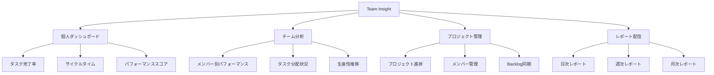
```mermaid
graph TB
    A[Team Insight] --> B[個人ダッシュボード]
    A --> C[チーム分析]
    A --> D[プロジェクト管理]
    A --> E[レポート配信]

    B --> B1[タスク完了率]
    B --> B2[サイクルタイム]
    B --> B3[パフォーマンススコア]

    C --> C1[メンバー別パフォーマンス]
    C --> C2[タスク分配状況]
    C --> C3[生産性推移]

    D --> D1[プロジェクト進捗]
    D --> D2[メンバー管理]
    D --> D3[Backlog同期]

    E --> E1[日次レポート]
    E --> E2[週次レポート]
    E --> E3[月次レポート]
```

---

### 1.2 技術スタック

#### 🔧 バックエンド

| カテゴリ | 技術 | バージョン | 選定理由 |
|---------|------|-----------|---------|
| 言語 | Python | 3.11 | 型ヒント、非同期処理のサポート |
| Webフレームワーク | FastAPI | 0.109.2 | 高速、型安全、自動ドキュメント生成 |
| ORM | SQLAlchemy | 2.0 | 最新のORM、型安全性の向上 |
| データベース | PostgreSQL | 15 | 信頼性が高く、複雑なクエリに対応 |
| キャッシュ | Redis | 7 | 高速なキャッシュでAPI応答を改善 |
| 認証 | JWT + OAuth2.0 | - | Backlog OAuth連携 |
| 非同期HTTP | httpx | - | 非同期APIリクエスト |
| マイグレーション | Alembic | - | データベーススキーマの管理 |

#### 🎨 フロントエンド

| カテゴリ | 技術 | バージョン | 選定理由 |
|---------|------|-----------|---------|
| 言語 | TypeScript | 5 | 型安全性で開発効率向上 |
| フレームワーク | Next.js | 14 (App Router) | サーバーコンポーネントでパフォーマンス向上 |
| UIライブラリ | React | 18 | コンポーネントベースの開発 |
| 状態管理（グローバル） | Redux Toolkit | - | ユーザー認証状態の管理 |
| 状態管理（サーバー） | TanStack Query | v5 | サーバー状態管理とキャッシュ |
| UIコンポーネント | shadcn/ui + Radix UI | - | カスタマイズ可能、アクセシビリティ対応 |
| スタイリング | Tailwind CSS | v3 | ユーティリティファーストCSS |
| データ可視化 | D3.js, recharts | - | 柔軟なチャート作成 |
| HTTPクライアント | axios | - | 統一されたエラーハンドリング |
| フォーム | react-hook-form + zod | - | 型安全なバリデーション |
| パッケージ管理 | Yarn | v4 (Berry) | 高速で効率的 |

#### 🏗️ インフラ

| カテゴリ | 技術 | 用途 |
|---------|------|------|
| コンテナ | Docker & Docker Compose | 開発環境の統一 |
| Webサーバー | Nginx | リバースプロキシ、ルーティング |
| 開発メールサーバー | MailHog | メール送信のテスト |
| 自動化 | Makefile | 開発タスクの自動化 |

---

### 1.3 プロジェクト構造

```text
team-insight/
├── backend/                    # バックエンドアプリケーション
│   ├── app/
│   │   ├── api/               # APIエンドポイント
│   │   │   └── v1/           # APIバージョン1
│   │   │       ├── auth.py   # 認証API
│   │   │       ├── analytics.py  # 分析API
│   │   │       ├── teams.py  # チーム管理API
│   │   │       ├── projects.py  # プロジェクトAPI
│   │   │       └── users.py  # ユーザー管理API
│   │   ├── core/             # コアモジュール
│   │   │   ├── security.py  # JWT認証、OAuth
│   │   │   ├── database.py  # トランザクション管理
│   │   │   ├── cache.py     # Redisキャッシュ
│   │   │   ├── permissions.py  # RBAC権限管理
│   │   │   ├── error_handler.py  # エラーハンドリング
│   │   │   ├── config.py    # 設定管理
│   │   │   └── redis_client.py  # Redisクライアント
│   │   ├── db/               # データベース関連
│   │   │   ├── base_class.py  # ベースモデル
│   │   │   └── session.py   # セッション管理
│   │   ├── models/           # SQLAlchemyモデル
│   │   │   ├── user.py      # ユーザーモデル
│   │   │   ├── project.py   # プロジェクトモデル
│   │   │   ├── task.py      # タスクモデル
│   │   │   ├── team.py      # チームモデル
│   │   │   └── rbac.py      # RBAC関連モデル
│   │   ├── schemas/          # Pydanticスキーマ
│   │   │   ├── user.py      # ユーザースキーマ
│   │   │   ├── analytics.py # 分析スキーマ
│   │   │   ├── team.py      # チームスキーマ
│   │   │   └── auth.py      # 認証スキーマ
│   │   ├── services/         # ビジネスロジック
│   │   │   ├── auth_service.py      # 認証サービス
│   │   │   ├── analytics_service.py # 分析サービス
│   │   │   ├── backlog_client.py    # Backlog API連携
│   │   │   ├── sync_service.py      # データ同期サービス
│   │   │   ├── team_service.py      # チームサービス
│   │   │   ├── report_generator.py  # レポート生成
│   │   │   └── report_scheduler.py  # レポートスケジューラー
│   │   └── main.py           # アプリエントリーポイント
│   ├── alembic/              # マイグレーションファイル
│   ├── scripts/              # 管理スクリプト
│   │   ├── init_rbac.py     # RBAC初期化
│   │   └── init_admin.py    # 管理者設定
│   └── tests/                # テストコード
│
├── frontend/                  # フロントエンドアプリケーション
│   ├── src/
│   │   ├── app/              # Next.js App Router
│   │   │   ├── admin/       # 管理画面
│   │   │   │   ├── users/   # ユーザー管理
│   │   │   │   ├── teams/   # チーム管理
│   │   │   │   └── settings/  # システム設定
│   │   │   ├── dashboard/   # ダッシュボード
│   │   │   │   ├── personal/  # 個人ダッシュボード
│   │   │   │   ├── project/   # プロジェクトダッシュボード
│   │   │   │   └── organization/  # 組織ダッシュボード
│   │   │   ├── auth/        # 認証ページ
│   │   │   │   ├── login/   # ログイン
│   │   │   │   └── callback/  # OAuth callback
│   │   │   ├── teams/       # チーム分析
│   │   │   ├── projects/    # プロジェクト管理
│   │   │   ├── settings/    # ユーザー設定
│   │   │   │   ├── account/  # アカウント設定
│   │   │   │   ├── security/  # セキュリティ設定
│   │   │   │   └── backlog/  # Backlog連携設定
│   │   │   ├── layout.tsx   # ルートレイアウト
│   │   │   └── page.tsx     # ホームページ
│   │   ├── components/      # 再利用可能なコンポーネント
│   │   │   ├── ui/          # shadcn/uiコンポーネント
│   │   │   ├── charts/      # チャートコンポーネント
│   │   │   ├── layouts/     # レイアウトコンポーネント
│   │   │   └── features/    # 機能別コンポーネント
│   │   ├── hooks/           # カスタムフック
│   │   │   ├── useAuth.ts   # 認証フック
│   │   │   ├── usePermissions.ts  # 権限フック
│   │   │   └── queries/     # React Queryフック
│   │   │       ├── useAuth.ts  # 認証クエリ
│   │   │       ├── useAnalytics.ts  # 分析クエリ
│   │   │       └── useTeams.ts  # チームクエリ
│   │   ├── lib/             # ユーティリティ
│   │   │   ├── api-client.ts  # APIクライアント
│   │   │   ├── utils.ts     # 共通関数
│   │   │   └── react-query.ts  # React Query設定
│   │   ├── store/           # Redux store
│   │   │   ├── slices/      # Redux slices
│   │   │   │   └── authSlice.ts  # 認証状態
│   │   │   └── index.ts     # Store設定
│   │   ├── types/           # TypeScript型定義
│   │   │   ├── api.d.ts     # 自動生成されたAPI型
│   │   │   ├── user.ts      # ユーザー型
│   │   │   ├── team.ts      # チーム型
│   │   │   └── analytics.ts  # 分析型
│   │   └── config/          # 設定ファイル
│   │       └── env.ts       # 環境変数管理
│   ├── public/              # 静的ファイル
│   └── docs/               # ドキュメント
│
├── infrastructure/          # インフラ設定
│   └── docker/
│       ├── backend/         # バックエンドDockerfile
│       ├── frontend/        # フロントエンドDockerfile
│       └── nginx/           # Nginx設定
│
├── docker-compose.yml       # Docker Compose設定
├── Makefile                 # 開発タスク自動化
├── README.md                # プロジェクトREADME
├── CONTRIBUTING.md          # コントリビューションガイド
├── LICENSE                  # ライセンス
└── guid.md                  # このファイル（実装ガイド）
```

---

### 1.4 システムアーキテクチャ

#### 全体構成図

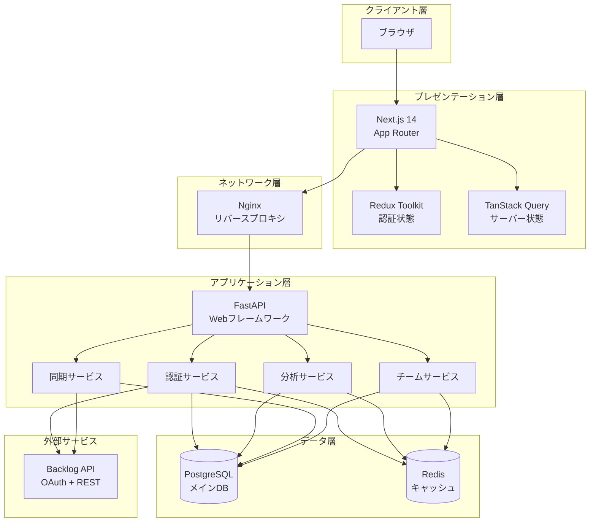
```mermaid
graph TB
    subgraph "クライアント層"
        Browser[ブラウザ]
    end

    subgraph "プレゼンテーション層"
        NextJS[Next.js 14<br/>App Router]
        Redux[Redux Toolkit<br/>認証状態]
        ReactQuery[TanStack Query<br/>サーバー状態]
    end

    subgraph "ネットワーク層"
        Nginx[Nginx<br/>リバースプロキシ]
    end

    subgraph "アプリケーション層"
        FastAPI[FastAPI<br/>Webフレームワーク]
        AuthService[認証サービス]
        AnalyticsService[分析サービス]
        SyncService[同期サービス]
        TeamService[チームサービス]
    end

    subgraph "データ層"
        PostgreSQL[(PostgreSQL<br/>メインDB)]
        Redis[(Redis<br/>キャッシュ)]
    end

    subgraph "外部サービス"
        BacklogAPI[Backlog API<br/>OAuth + REST]
    end

    Browser --> NextJS
    NextJS --> Redux
    NextJS --> ReactQuery
    NextJS --> Nginx

    Nginx --> FastAPI

    FastAPI --> AuthService
    FastAPI --> AnalyticsService
    FastAPI --> SyncService
    FastAPI --> TeamService

    AuthService --> PostgreSQL
    AuthService --> Redis
    AuthService --> BacklogAPI

    AnalyticsService --> PostgreSQL
    AnalyticsService --> Redis

    SyncService --> PostgreSQL
    SyncService --> BacklogAPI

    TeamService --> PostgreSQL
    TeamService --> Redis
```

#### レイヤードアーキテクチャ

```text
┌─────────────────────────────────────────┐
│   プレゼンテーション層（API層）         │
│   - HTTPリクエスト/レスポンス処理       │
│   - バリデーション                     │
│   - 認証・認可                        │
│   app/api/v1/*.py                     │
└─────────────────────────────────────────┘
                  ↓
┌─────────────────────────────────────────┐
│   ビジネスロジック層（サービス層）      │
│   - ビジネスルールの実装               │
│   - データ加工と計算                   │
│   - 外部API連携                       │
│   app/services/*.py                   │
└─────────────────────────────────────────┘
                  ↓
┌─────────────────────────────────────────┐
│   データアクセス層（ORM）              │
│   - データベースCRUD操作               │
│   - トランザクション管理               │
│   SQLAlchemyクエリ                    │
└─────────────────────────────────────────┘
                  ↓
┌─────────────────────────────────────────┐
│   ドメイン層（モデル）                 │
│   - データ構造定義                     │
│   - リレーションシップ                 │
│   app/models/*.py                     │
└─────────────────────────────────────────┘
```

### よくある間違い

1. **フロントエンドから直接PostgreSQLにアクセスしようとする**
    - ❌ 誤り: フロントエンドからデータベースに直接接続
    - ✅ 正解: 必ずバックエンドAPIを経由してデータにアクセス

1. **ビジネスロジックをAPIエンドポイントに直接書く**
    - ❌ 誤り: API層に計算ロジックを記述
    - ✅ 正解: サービス層に分離して再利用性とテスト容易性を向上

1. **環境変数を直接参照する**
    - ❌ 誤り: `os.getenv("DATABASE_URL")`を各所で使用
    - ✅ 正解: 設定モジュール（`core/config.py`、`config/env.ts`）を経由

### ベストプラクティス

1. **レイヤードアーキテクチャを守る**
    - 各層の責務を明確に分離
    - 上位層から下位層への一方向の依存

1. **型を活用する**
    - Python: 型ヒントを必ず記述
    - TypeScript: `any`型の使用を避ける

1. **エラーハンドリングを統一する**
    - カスタム例外クラスを使用
    - 一貫したエラーレスポンス形式

---

## 2. 環境構築

### 📖 学習目標

- 開発環境を正しくセットアップできる
- Docker環境の仕組みを理解する
- トラブルシューティングができる

### 📚 前提知識

- Docker Desktopの基本操作
- コマンドラインの基本的な使い方
- 環境変数の概念

---

### 2.1 前提条件

#### 必要なソフトウェア

| ソフトウェア | バージョン | 必須/推奨 | 用途 |
|-------------|-----------|----------|------|
| Docker Desktop | 最新版 | 必須 | コンテナ環境 |
| Git | 最新版 | 必須 | バージョン管理 |
| Backlog OAuth登録 | - | 必須 | 認証 |
| Node.js | v22 LTS | 推奨 | ローカル開発時 |
| Python | 3.11 | 推奨 | ローカル開発時 |
| PostgreSQL Client (psql) | - | 推奨 | DB操作 |

#### システム要件

```yaml
OS: macOS / Windows / Linux
メモリ: 8GB以上推奨
ディスク: 10GB以上の空き容量
Docker Desktop: 起動している必要あり
```

---

### 2.2 Backlog OAuth アプリケーションの登録

Team InsightはBacklog OAuth 2.0で認証を行うため、事前にBacklogでアプリケーションを登録する必要があります。

#### ステップ1: Backlogにログイン

```text
1. ご利用のBacklogスペースにアクセス
   https://[your-space].backlog.jp/

2. Backlogアカウントでログイン
```

#### ステップ2: アプリケーション登録画面へ

```text
1. 右上のプロフィールアイコンをクリック
2. 「個人設定」を選択
3. 左メニューの「アプリケーション」をクリック
4. 「アプリケーションを追加」ボタンをクリック
```

#### ステップ3: アプリケーション情報の入力

```yaml
アプリケーション名: Team Insight
説明: チーム生産性分析ツール
リダイレクトURI: http://localhost:8000/api/v1/auth/callback

権限スコープ:
  - ✅ 課題の読み取り
  - ✅ プロジェクトの読み取り
  - ✅ ユーザー情報の読み取り
```

**⚠️ 重要**: リダイレクトURIは正確に入力してください。本番環境では適切なドメインに変更します。

#### ステップ4: 認証情報の保存

登録完了後、以下の情報が表示されます。これらを**安全に保管**してください：

```yaml
クライアントID: xxxxxxxxxxxxxxxx
クライアントシークレット: yyyyyyyyyyyyyyyy
スペースキー: your-space
```

**🔒 セキュリティ上の注意**:

- クライアントシークレットは**絶対に公開しない**
- GitHubなどにpushしない
- `.env`ファイルは`.gitignore`に含まれていることを確認

---

### 2.3 初回セットアップ

#### ステップ1: リポジトリのクローン

```bash
# GitHubからクローン
git clone https://github.com/rasshii/team-insight.git
cd team-insight

# ディレクトリ構造を確認
ls -la

# 出力例:
# drwxr-xr-x  backend/
# drwxr-xr-x  frontend/
# drwxr-xr-x  infrastructure/
# -rw-r--r--  docker-compose.yml
# -rw-r--r--  Makefile
# -rw-r--r--  README.md
```

#### ステップ2: 環境変数ファイルの作成

```bash
# バックエンド環境変数
cp backend/.env.example backend/.env

# フロントエンド環境変数
cp frontend/.env.example frontend/.env

# 確認
ls backend/.env frontend/.env
```

#### ステップ3: backend/.envの編集

```bash
# エディタで開く（例: vim, nano, VSCode等）
vim backend/.env
# または
code backend/.env
```

**必須設定項目**:

```bash
# ========================================
# Backlog OAuth設定（2.2で取得した情報）
# ========================================
BACKLOG_CLIENT_ID=your_client_id_here
BACKLOG_CLIENT_SECRET=your_client_secret_here
BACKLOG_SPACE_KEY=your-space
BACKLOG_REDIRECT_URI=http://localhost/auth/callback

# ========================================
# JWT設定
# ========================================
# SECRET_KEYは以下のコマンドで生成（推奨）
# openssl rand -hex 32
SECRET_KEY=your_generated_secret_key_here
ACCESS_TOKEN_EXPIRE_MINUTES=15
REFRESH_TOKEN_EXPIRE_DAYS=30

# ========================================
# データベース設定（デフォルトのままでOK）
# ========================================
POSTGRES_USER=teaminsight
POSTGRES_PASSWORD=teaminsight_password
POSTGRES_DB=teaminsight
POSTGRES_HOST=postgres
POSTGRES_PORT=5432

# ========================================
# Redis設定（デフォルトのままでOK）
# ========================================
REDIS_HOST=redis
REDIS_PORT=6379
REDIS_PASSWORD=redis_password

# ========================================
# 環境
# ========================================
ENVIRONMENT=development
DEBUG=true
```

**SECRET_KEYの生成方法**:

```bash
# macOS / Linux
openssl rand -hex 32

# 出力例（これをSECRET_KEYにコピー）
# 09d25e094faa6ca2556c818166b7a9563b93f7099f6f0f4caa6cf63b88e8d3e7
```

#### ステップ4: frontend/.envの編集

```bash
vim frontend/.env
# または
code frontend/.env
```

**必須設定項目**:

```bash
# ========================================
# Backlog OAuth設定（backend/.envと同じ値）
# ========================================
NEXT_PUBLIC_BACKLOG_CLIENT_ID=your_client_id_here
NEXT_PUBLIC_BACKLOG_SPACE_NAME=your-space

# ========================================
# API URL（開発環境ではNginx経由でアクセス）
# ========================================
NEXT_PUBLIC_API_URL=http://localhost
```

#### ステップ5: Docker環境のセットアップと起動

```bash
# Makefileを使用（推奨）
make setup

# これは以下のコマンドを実行します:
# 1. docker-compose build        # イメージをビルド
# 2. docker-compose up -d        # コンテナを起動
# 3. sleep 5秒                   # DBの起動を待機
# 4. alembic upgrade head        # DBマイグレーション実行
```

**setupコマンドの詳細フロー**:

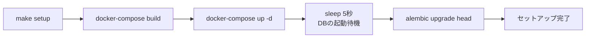
```mermaid
graph LR
    A[make setup] --> B[docker-compose build]
    B --> C[docker-compose up -d]
    C --> D[sleep 5秒<br/>DBの起動待機]
    D --> E[alembic upgrade head]
    E --> F[セットアップ完了]
```

#### ステップ6: コンテナの起動確認

```bash
# コンテナの状態を確認
docker-compose ps

# 正常な出力例:
#        Name                      State           Ports
# -------------------------------------------------------------
# team-insight-backend      Up      0.0.0.0:8000->8000/tcp
# team-insight-frontend     Up      0.0.0.0:3000->3000/tcp
# team-insight-postgres     Up      0.0.0.0:5432->5432/tcp
# team-insight-redis        Up      0.0.0.0:6379->6379/tcp
# team-insight-nginx        Up      0.0.0.0:80->80/tcp
# team-insight-mailhog      Up      0.0.0.0:8025->8025/tcp
```

**各サービスの役割**:

| サービス | ポート | 役割 |
|---------|--------|------|
| backend | 8000 | FastAPI バックエンド |
| frontend | 3000 | Next.js フロントエンド |
| postgres | 5432 | PostgreSQL データベース |
| redis | 6379 | Redis キャッシュ |
| nginx | 80 | リバースプロキシ |
| mailhog | 8025 | メール確認（開発用） |

```bash
# ログを確認（エラーがないかチェック）
make logs

# または特定のサービスのログを確認
docker-compose logs backend
docker-compose logs frontend
docker-compose logs postgres
```

---

### 2.4 初回ログインと管理者設定

#### ステップ1: ブラウザでアクセス

```text
http://localhost にアクセス
```

ルートページが表示されたら、環境構築は成功です！

#### ステップ2: Backlog OAuthでログイン

```text
1. 「Backlogでログイン」ボタンをクリック
2. Backlog認証ページにリダイレクトされる
3. 設定したBacklogスペースのアカウントでログイン
4. 「許可する」をクリック（権限の許可）
5. Team Insightにリダイレクトされる
```

**認証フローの図解**:

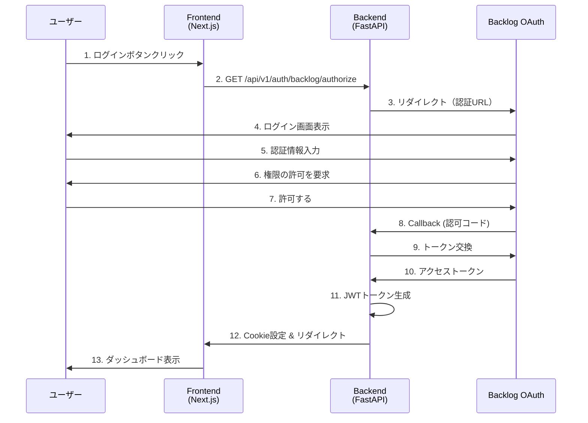
```mermaid
sequenceDiagram
    participant User as ユーザー
    participant Frontend as Frontend<br/>(Next.js)
    participant Backend as Backend<br/>(FastAPI)
    participant Backlog as Backlog OAuth

    User->>Frontend: 1. ログインボタンクリック
    Frontend->>Backend: 2. GET /api/v1/auth/backlog/authorize
    Backend->>Backlog: 3. リダイレクト（認証URL）
    Backlog->>User: 4. ログイン画面表示
    User->>Backlog: 5. 認証情報入力
    Backlog->>User: 6. 権限の許可を要求
    User->>Backlog: 7. 許可する
    Backlog->>Backend: 8. Callback (認可コード)
    Backend->>Backlog: 9. トークン交換
    Backlog->>Backend: 10. アクセストークン
    Backend->>Backend: 11. JWTトークン生成
    Backend->>Frontend: 12. Cookie設定 & リダイレクト
    Frontend->>User: 13. ダッシュボード表示
```

#### ステップ3: RBAC初期化と管理者権限の付与

```bash
# 1. RBACシステムの初期化（初回のみ必要）
docker-compose exec backend python scripts/init_rbac.py

# 出力例:
# [INFO] RBAC initialization started
# [INFO] Creating role: ADMIN
# [INFO] Creating role: PROJECT_LEADER
# [INFO] Creating role: MEMBER
# [INFO] Assigning permissions...
# [INFO] RBAC initialization completed successfully

# 2. 管理者権限の付与（メールアドレスを自分のものに変更）
docker-compose exec backend bash -c "INITIAL_ADMIN_EMAILS=your-email@example.com python scripts/init_admin.py"

# または、Makefileコマンドを使用（backend/.envにINITIAL_ADMIN_EMAILSを設定済みの場合）
make init-admin

# 出力例:
# [INFO] Setting admin role for: your-email@example.com
# [INFO] User found: Alice Smith (ID: 1)
# [INFO] Admin role assigned successfully
```

**RBAC初期化の詳細**:

```text
# scripts/init_rbac.py の処理内容

1. データベース接続
2. ロールテーブルに以下を作成:
   - ADMIN (管理者) - 全権限
   - PROJECT_LEADER (プロジェクトリーダー) - プロジェクト管理権限
   - MEMBER (メンバー) - 基本権限
3. 各ロールに対応する権限を設定:
   - ADMIN: users:read, users:write, projects:*, teams:*, ...
   - PROJECT_LEADER: projects:read, projects:write, teams:read, ...
   - MEMBER: projects:read, tasks:*, ...
4. 権限とロールのマッピングを保存
```

#### ステップ4: 管理画面へのアクセス確認

```text
管理画面トップ: http://localhost/admin
  - ユーザー管理: http://localhost/admin/users
  - チーム管理: http://localhost/admin/teams
  - システム設定: http://localhost/admin/settings
```

管理画面にアクセスできれば、管理者権限の設定は成功です！

---

### 2.5 トラブルシューティング

#### 問題1: Dockerコンテナが起動しない

**症状**: `make setup`や`docker-compose up`でエラーが発生

```bash
# エラーの確認
docker-compose logs

# 各サービスのログを個別に確認
docker-compose logs backend
docker-compose logs postgres

# ポート競合のチェック
lsof -i :3000  # フロントエンド
lsof -i :8000  # バックエンド
lsof -i :5432  # PostgreSQL
lsof -i :6379  # Redis
lsof -i :80    # Nginx

# 競合している場合、プロセスを終了
kill -9 <PID>

# または、全て停止してから再起動
docker-compose down
docker-compose up -d
```

#### 問題2: データベース接続エラー

**症状**: バックエンドがデータベースに接続できない

```bash
# PostgreSQLコンテナの状態確認
docker-compose ps postgres

# データベースログを確認
docker-compose logs postgres

# データベースに直接接続して確認
docker-compose exec postgres psql -U teaminsight -d teaminsight -c "\dt team_insight.*"

# データベースをリセット（データが消えます！）
docker-compose down -v  # ボリュームも削除
make setup              # 再セットアップ
```

#### 問題3: Backlog OAuth認証エラー

**症状**: ログイン時にエラーが発生

```bash
# 環境変数が正しく設定されているか確認
docker-compose exec backend env | grep BACKLOG

# 出力例（正しく設定されている場合）:
# BACKLOG_CLIENT_ID=xxxxxxxx
# BACKLOG_CLIENT_SECRET=yyyyyyyy
# BACKLOG_SPACE_KEY=your-space
# BACKLOG_REDIRECT_URI=http://localhost/auth/callback
```

**確認ポイント**:

1. **リダイレクトURIが正確に一致しているか**
    - Backlog設定: `http://localhost:8000/api/v1/auth/callback`
    - backend/.env: `http://localhost/auth/callback`（Nginx経由）

1. **スペースキーが正しいか**
    - URLの`[your-space].backlog.jp`の`[your-space]`部分

1. **権限スコープが適切に設定されているか**
    - 課題の読み取り ✅
    - プロジェクトの読み取り ✅
    - ユーザー情報の読み取り ✅

#### 問題4: フロントエンドがビルドできない

**症状**: フロントエンドコンテナが起動しない

```bash
# node_modulesを削除して再インストール
cd frontend
rm -rf node_modules .next
cd ..

# フロントエンドを再ビルド
docker-compose build frontend
docker-compose up -d frontend

# ログを確認
docker-compose logs -f frontend
```

#### 問題5: マイグレーションエラー

**症状**: `alembic upgrade head`でエラーが発生

```bash
# マイグレーション状態を確認
docker-compose exec backend alembic current

# マイグレーション履歴を確認
docker-compose exec backend alembic history

# 最新バージョンにアップグレード
docker-compose exec backend alembic upgrade head

# マイグレーションをロールバック（1つ前に戻す）
docker-compose exec backend alembic downgrade -1

# 特定のリビジョンまでロールバック
docker-compose exec backend alembic downgrade <revision_id>
```

---

### 2.6 開発環境の確認

すべてが正しく動作しているか確認しましょう。

#### ✅ チェックリスト

```bash
# ✅ 1. 全コンテナが起動しているか
docker-compose ps
# すべてのサービスが"Up"になっているはず

# ✅ 2. フロントエンドにアクセスできるか
curl http://localhost
# HTMLが返ってくればOK

# ✅ 3. バックエンドAPIにアクセスできるか
curl http://localhost/api/v1/health
# {"status":"healthy","timestamp":"2025-01-15T12:34:56.789Z"} が返ってくればOK

# ✅ 4. PostgreSQLに接続できるか
docker-compose exec postgres psql -U teaminsight -d teaminsight -c "\dt team_insight.*"
# テーブル一覧が表示されればOK

# ✅ 5. Redisに接続できるか
docker-compose exec redis redis-cli -a redis_password PING
# PONG が返ってくればOK

# ✅ 6. API ドキュメントにアクセスできるか
# ブラウザで http://localhost/api/v1/docs を開く
# Swagger UIが表示されればOK
```

#### 正常な状態の確認

```bash
# すべてのサービスが正常に動作している場合の出力例

$ make status
# NAME                       STATUS    PORTS
# team-insight-backend       Up        0.0.0.0:8000->8000/tcp
# team-insight-frontend      Up        0.0.0.0:3000->3000/tcp
# team-insight-postgres      Up        0.0.0.0:5432->5432/tcp
# team-insight-redis         Up        0.0.0.0:6379->6379/tcp
# team-insight-nginx         Up        0.0.0.0:80->80/tcp
# team-insight-mailhog       Up        0.0.0.0:8025->8025/tcp

$ curl -s http://localhost/api/v1/health | jq
# {
#   "status": "healthy",
#   "timestamp": "2025-01-15T12:34:56.789Z",
#   "database": "connected",
#   "redis": "connected",
#   "version": "1.0.0"
# }
```

### よくある間違い

1. **環境変数ファイルを編集していない**
    - ❌ 誤り: `.env.example`をコピーしただけで、実際の値を設定していない
    - ✅ 正解: `backend/.env`と`frontend/.env`を編集して実際の値を設定

1. **SECRET_KEYを生成せずにデフォルトのまま使用**
    - ❌ 誤り: `SECRET_KEY=changeme`のまま使用
    - ✅ 正解: `openssl rand -hex 32`で一意の値を生成

1. **BacklogリダイレクトURIの設定ミス**
    - ❌ 誤り: `http://localhost:8000/api/v1/auth/callback`と`http://localhost/auth/callback`を混同
    - ✅ 正解: Backlog設定は`:8000`付き、backend/.envはNginx経由のため`:8000`なし

1. **Docker Desktopが起動していない**
    - ❌ 誤り: `docker-compose`コマンドを実行する前にDocker Desktopを起動していない
    - ✅ 正解: 必ずDocker Desktopを起動してから`docker-compose`コマンドを実行

### ベストプラクティス

1. **環境変数は.envファイルで管理**
    - コードに直接書かず、環境ごとに設定を切り替え可能にする

1. **Makefileコマンドを活用**
    - `make setup`, `make start`, `make logs`など、よく使うコマンドをショートカットとして使用

1. **ログを定期的に確認**
    - `make logs`で異常なエラーがないかチェック

1. **データベースバックアップを定期的に取得**
    - `make db-backup`で重要なデータを保護

---

## 3. 最初の一歩

### 📖 学習目標

- アプリケーションの基本的な使い方を理解する
- データ同期の流れを把握する
- 各ダッシュボードの機能を確認する

### 📚 前提知識

- 環境構築が完了していること
- Backlogの基本的な使い方

---

### 3.1 アプリケーションの起動と確認

#### 起動手順

```bash
# コンテナが停止している場合
make start

# または
docker-compose up -d

# 起動状態の確認
make status

# ログをリアルタイムで表示（Ctrl+Cで終了）
make logs

# または特定のサービスのログのみ
docker-compose logs -f backend
```

#### アクセス可能なURL

| カテゴリ | URL | 説明 |
|---------|-----|------|
| **フロントエンド** |
| メインページ | http://localhost | ホームページ |
| 個人ダッシュボード | http://localhost/dashboard/personal | 個人の生産性分析 |
| チーム分析 | http://localhost/teams | チーム生産性分析 |
| プロジェクト | http://localhost/projects | プロジェクト管理 |
| 管理画面 | http://localhost/admin | 管理者向け機能 |
| **バックエンド** |
| API ドキュメント | http://localhost/api/v1/docs | Swagger UI |
| ヘルスチェック | http://localhost/api/v1/health | サービス状態確認 |
| **開発ツール** |
| MailHog | http://localhost:8025 | メール確認 |

---

### 3.2 初期データの投入

Team Insightを使い始めるには、Backlogからデータを同期する必要があります。

#### データ同期の流れ

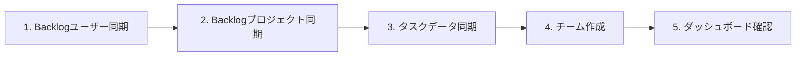
```mermaid
graph LR
    A[1. Backlogユーザー同期] --> B[2. Backlogプロジェクト同期]
    B --> C[3. タスクデータ同期]
    C --> D[4. チーム作成]
    D --> E[5. ダッシュボード確認]
```

#### ステップ1: ユーザーデータの同期

```text
1. ブラウザで http://localhost/admin/users にアクセス
2. 右上の「Backlogから同期」ボタンをクリック
3. ダイアログで以下を選択:
   ✅ アクティブユーザーのみ
   ⬜ すべてのユーザー（退職済みも含む）
4. 「同期開始」ボタンをクリック
5. 同期完了まで待機（進捗バーが表示されます）
6. 完了後、ユーザー一覧に Backlog のユーザーが表示される
```

**同期処理の内部動作**:

```python
# backend/app/services/sync_service.py

class SyncService:
    async def sync_users_from_backlog(
        self,
        db: Session,
        active_only: bool = True
    ):
        """
        Backlogからユーザー情報を同期

        処理フロー:
        1. Backlog APIから全ユーザーを取得
        2. active_only=Trueの場合、is_active=Trueのユーザーのみフィルター
        3. 既存ユーザーは更新、新規ユーザーは作成
        4. バッチ処理で効率的にDB保存
        """
        # Backlog APIクライアントを使用してユーザー取得
        backlog_users = await self.backlog_client.get_users()

        # フィルター処理
        if active_only:
            backlog_users = [
                u for u in backlog_users
                if u.get('is_active', True)
            ]

        # DB保存処理（バッチ）
        for user_data in backlog_users:
            # ユーザーの作成または更新
            user = await self._upsert_user(db, user_data)

        logger.info(f"Synced {len(backlog_users)} users from Backlog")
```

#### ステップ2: プロジェクトデータの同期

```text
1. http://localhost/projects にアクセス
2. 右上の「Backlogから同期」ボタンをクリック
3. 同期が自動的に開始される
4. プロジェクト一覧が更新される
5. 各プロジェクトの「詳細」をクリックしてメンバーやタスクを確認
```

**プロジェクト同期の内部動作**:

```python
# backend/app/services/sync_service.py

async def sync_projects_from_backlog(
    self,
    db: Session,
    user_id: int
):
    """
    Backlogからプロジェクト情報を同期

    処理フロー:
    1. Backlog APIから全プロジェクトを取得
    2. 各プロジェクトのメンバー情報を取得
    3. タスク（課題）情報を取得
    4. プロジェクト、メンバー、タスクをDB保存
    """
    # プロジェクト取得
    backlog_projects = await self.backlog_client.get_projects()

    for project_data in backlog_projects:
        # プロジェクト保存
        project = await self._upsert_project(db, project_data)

        # メンバー取得・保存
        members = await self.backlog_client.get_project_members(
            project.backlog_id
        )
        await self._sync_project_members(db, project.id, members)

        # タスク取得・保存（最新100件）
        tasks = await self.backlog_client.get_project_issues(
            project.backlog_id,
            limit=100
        )
        await self._sync_tasks(db, project.id, tasks)

    logger.info(f"Synced {len(backlog_projects)} projects from Backlog")
```

#### ステップ3: タスクデータの確認

タスクはプロジェクト同期時に自動的に同期されますが、個別のプロジェクトで再同期することも可能です。

```text
1. プロジェクト詳細画面にアクセス
2. 「タスクを同期」ボタンをクリック
3. 最新のタスク情報が反映される
```

---

### 3.3 チームの作成

データが同期できたら、分析用のチームを作成します。

#### チーム作成手順

```text
1. http://localhost/admin/teams にアクセス
2. 「新規チーム作成」ボタンをクリック
3. チーム情報を入力:
   - チーム名: 例）開発チーム、デザインチーム、QAチーム
   - 説明: チームの役割や目的を記述
   - 例: 「Webアプリケーション開発を担当するチーム」
4. 「チームを作成」ボタンをクリック
5. 作成したチームをクリック
6. 「メンバーを追加」ボタンをクリック
7. ユーザー一覧から追加したいメンバーを選択
8. チームロールを設定:
   - チームリーダー: チーム管理権限あり
   - メンバー: 基本権限のみ
9. 「追加」ボタンをクリック
```

**チーム管理の内部動作**:

```python
# backend/app/services/team_service.py

class TeamService:
    async def create_team(
        self,
        db: Session,
        name: str,
        description: str,
        creator_id: int
    ):
        """
        チームを作成

        処理フロー:
        1. チーム名の重複チェック
        2. Teamモデルを作成
        3. 作成者をチームリーダーとして自動追加
        4. DB保存
        """
        # 重複チェック
        existing = db.query(Team).filter(
            Team.name == name
        ).first()

        if existing:
            raise ValueError(f"Team '{name}' already exists")

        # チーム作成
        team = Team(
            name=name,
            description=description,
            created_by=creator_id
        )
        db.add(team)
        db.flush()  # IDを取得するため

        # 作成者をリーダーとして追加
        member = TeamMember(
            team_id=team.id,
            user_id=creator_id,
            role="LEADER"
        )
        db.add(member)
        db.commit()

        logger.info(f"Team created: {name} (ID: {team.id})")

        return team
```

---

### 3.4 ダッシュボードの確認

#### 📊 個人ダッシュボード

```text
URL: http://localhost/dashboard/personal

確認できる情報:
✅ アクティブタスク数
✅ タスク完了率（過去7日間）
✅ 平均サイクルタイム（日）
✅ 最近完了したタスク（過去7日間）
✅ ワークフロー分析（ステータス別タスク分布）
✅ パフォーマンス詳細（日別完了数グラフ）
```

**個人ダッシュボードのデータ取得フロー**:

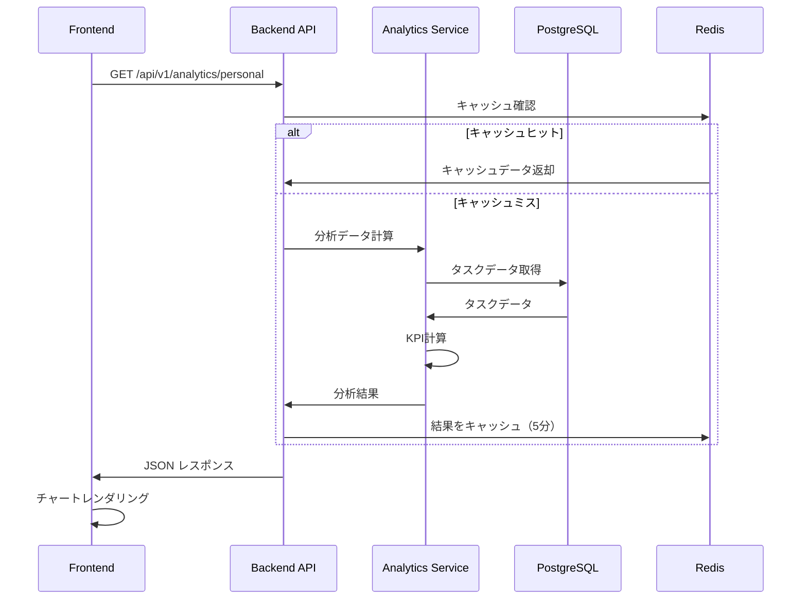
```mermaid
sequenceDiagram
    participant Frontend as Frontend
    participant Backend as Backend API
    participant AnalyticsService as Analytics Service
    participant Database as PostgreSQL
    participant Cache as Redis

    Frontend->>Backend: GET /api/v1/analytics/personal
    Backend->>Cache: キャッシュ確認

    alt キャッシュヒット
        Cache->>Backend: キャッシュデータ返却
    else キャッシュミス
        Backend->>AnalyticsService: 分析データ計算
        AnalyticsService->>Database: タスクデータ取得
        Database->>AnalyticsService: タスクデータ
        AnalyticsService->>AnalyticsService: KPI計算
        AnalyticsService->>Backend: 分析結果
        Backend->>Cache: 結果をキャッシュ（5分）
    end

    Backend->>Frontend: JSON レスポンス
    Frontend->>Frontend: チャートレンダリング
```

#### 👥 チーム生産性ダッシュボード

```text
URL: http://localhost/teams

確認できる情報:
✅ チーム選択ドロップダウン
✅ 全体統計（総チーム数、アクティブタスク、月間完了タスク）
✅ メンバー別パフォーマンス（個人の貢献度）
✅ タスク分配（円グラフで可視化）
✅ 生産性推移（時系列グラフ）
✅ アクティビティタイムライン（最近の活動）
```

#### 📁 プロジェクト管理

```text
URL: http://localhost/projects

確認できる情報:
✅ プロジェクト一覧
✅ 各プロジェクトの進捗状況
✅ プロジェクトメンバー
✅ タスク統計（合計、完了、進行中）
✅ 同期状況（最終同期日時）
```

---

### 3.5 実践演習

#### 演習1: ユーザー同期とロール設定

```text
目標: Backlogからユーザーを同期し、ロールを設定する

手順:
1. 管理画面でBacklogからユーザーを同期
2. 同期されたユーザー一覧を確認
3. 1人のユーザーを選択して「PROJECT_LEADER」ロールに変更
4. 変更を保存
5. そのユーザーでログインし直して権限が変わっていることを確認

確認ポイント:
- ユーザー一覧にBacklogユーザーが表示されるか
- ロール変更が正しく反映されるか
- PROJECT_LEADERでログインすると、プロジェクト管理機能が使えるか
```

#### 演習2: チーム作成とメンバー管理

```text
目標: チームを作成し、メンバーを追加する

手順:
1. チーム管理画面で「開発チーム」を作成
2. 説明: 「Webアプリケーション開発を担当するチーム」
3. 3人のメンバーを追加:
   - 1人をチームリーダーに設定
   - 2人をメンバーに設定
4. チーム生産性ダッシュボードで各メンバーのパフォーマンスを確認

確認ポイント:
- チームが正しく作成されるか
- メンバーが正しく追加されるか
- チームロールが正しく設定されるか
- チーム生産性ダッシュボードにデータが表示されるか
```

#### 演習3: データ同期の確認

```text
目標: Backlogのデータ変更がTeam Insightに反映されることを確認

手順:
1. Backlogで新しいタスクを作成:
   - タイトル: 「Team Insight動作確認」
   - 担当者: 自分
   - ステータス: 処理中
2. Team Insightでプロジェクトを再同期
3. プロジェクト詳細画面で新しいタスクが表示されることを確認
4. 個人ダッシュボードにアクティブタスクとして表示されることを確認
5. Backlogでタスクを完了に変更
6. 再同期後、個人ダッシュボードの完了タスクに表示されることを確認

確認ポイント:
- 同期処理が正常に動作するか
- タスクの作成・更新が正しく反映されるか
- ダッシュボードのデータが更新されるか
```

---

### よくある間違い

1. **同期前にダッシュボードにアクセスしてデータがないと慌てる**
    - ❌ 誤り: データ同期せずにダッシュボードにアクセス
    - ✅ 正解: 必ず先にBacklogからデータを同期してください

1. **チーム作成時にメンバーを追加し忘れる**
    - ❌ 誤り: チームを作成しただけで満足してしまう
    - ✅ 正解: チームを作成後、必ずメンバーを追加してください

1. **管理者権限がないのに管理画面にアクセスしようとする**
    - ❌ 誤り: `init_admin.py`を実行せずに管理画面にアクセス
    - ✅ 正解: `docker-compose exec backend bash -c "INITIAL_ADMIN_EMAILS=your-email python scripts/init_admin.py"`で管理者権限を付与

1. **同期ボタンを連打する**
    - ❌ 誤り: 同期処理中に何度もボタンをクリック
    - ✅ 正解: 同期処理が完了するまで待つ（進捗バーを確認）

### ベストプラクティス

1. **定期的なデータ同期**
    - 週1回程度はBacklogから最新データを同期する
    - 自動同期スケジューラーも活用可能（設定が必要）

1. **チームは目的別に作成**
    - プロジェクト単位、職能単位、組織単位など、分析したい単位でチームを作成
    - 例: 開発チーム、デザインチーム、QAチーム、フロントエンドチーム等

1. **ダッシュボードを定期的に確認**
    - 日次または週次で確認し、ボトルネックを早期発見
    - チームレビューミーティングでダッシュボードを共有

1. **権限は最小限に**
    - 必要なユーザーにのみ管理者権限を付与
    - プロジェクトリーダーロールを活用して分散管理

---

## 第2部: バックエンド実装ガイド（FastAPI）

## 4. アーキテクチャ理解

### 📖 学習目標

- FastAPIのレイヤードアーキテクチャを理解する
- 各層の責務と依存関係を把握する
- 依存性注入（Dependency Injection）の仕組みを学ぶ
- ディレクトリ構成の意味と役割を理解する

### 📚 前提知識

- Pythonの基本構文
- オブジェクト指向プログラミングの基礎
- SQLの基本
- HTTPとRESTful APIの概念

---

### 4.1 レイヤードアーキテクチャの詳細

Team Insightのバックエンドは、**4層のレイヤードアーキテクチャ**を採用しています。これは、コードの保守性とテスト容易性を高めるための設計パターンです。

#### アーキテクチャ図

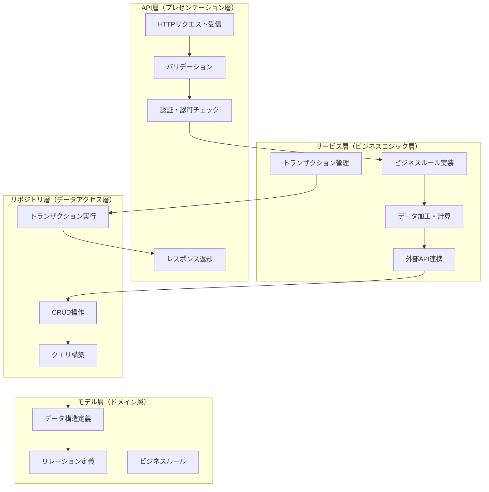
```mermaid
graph TB
    subgraph "API層（プレゼンテーション層）"
        A1[HTTPリクエスト受信]
        A2[バリデーション]
        A3[認証・認可チェック]
        A4[レスポンス返却]
    end

    subgraph "サービス層（ビジネスロジック層）"
        B1[ビジネスルール実装]
        B2[データ加工・計算]
        B3[外部API連携]
        B4[トランザクション管理]
    end

    subgraph "リポジトリ層（データアクセス層）"
        C1[CRUD操作]
        C2[クエリ構築]
        C3[トランザクション実行]
    end

    subgraph "モデル層（ドメイン層）"
        D1[データ構造定義]
        D2[リレーション定義]
        D3[ビジネスルール]
    end

    A1 --> A2
    A2 --> A3
    A3 --> B1
    B1 --> B2
    B2 --> B3
    B3 --> C1
    C1 --> C2
    C2 --> D1
    D1 --> D2
    B4 --> C3
    C3 --> A4
```

#### 各層の詳細説明

##### 1. API層（`app/api/v1/*.py`）

**責務**:
- HTTPリクエストを受信
- リクエストデータのバリデーション（Pydanticスキーマ）
- 認証・認可のチェック
- サービス層の呼び出し
- レスポンスの整形と返却

**実装例**（`app/api/v1/auth.py`の一部）:

```python
@router.get("/verify", response_model=UserInfoResponse)
async def verify_token(
    current_user: User = Depends(get_current_user),  # 認証チェック
    db: Session = Depends(get_db_session)            # DB依存性注入
):
    """
    JWTトークンの有効性を検証

    処理フロー:
    1. JWTトークンを検証（依存性注入で自動実行）
    2. ユーザー情報をデータベースから取得
    3. ユーザーのロール情報も含めて取得
    4. ユーザー情報をレスポンスとして返却
    """
    # ユーザーのロール情報を取得（サービス層は使わずに直接DB操作）
    user = QueryBuilder.with_user_roles(
        db.query(User).filter(User.id == current_user.id)
    ).first()

    # レスポンス構築
    response_data = _build_user_response(user, db=db)
    return response_data["user"]
```

**ポイント**:
- `Depends`を使った依存性注入
- 型ヒントによる自動バリデーション
- `response_model`による自動レスポンス検証

##### 2. サービス層（`app/services/*.py`）

**責務**:
- ビジネスロジックの実装
- 複数のモデルにまたがる処理
- 外部APIとの連携
- トランザクション境界の定義

**実装例**（`app/services/sync_service.py`の一部）:

```python
class SyncService:
    """Backlogデータ同期サービス"""

    async def sync_all_projects(
        self,
        user: User,
        access_token: str,
        db: Session
    ) -> Dict[str, Any]:
        """全プロジェクトを同期"""
        # 同期履歴を作成（ビジネスロジック）
        sync_history = SyncHistory(
            user_id=user.id,
            sync_type=SyncType.ALL_PROJECTS,
            status=SyncStatus.STARTED
        )
        db.add(sync_history)
        db.flush()

        try:
            # 外部API連携
            projects_data = await backlog_client.get_projects(access_token)

            created_count = 0
            updated_count = 0

            # データ加工と保存
            for project_data in projects_data:
                project = await self._sync_project(project_data, db)
                if project.created_at == project.updated_at:
                    created_count += 1
                else:
                    updated_count += 1

            # 同期履歴を更新
            sync_history.complete(
                items_created=created_count,
                items_updated=updated_count,
                total_items=len(projects_data)
            )

            db.commit()

            return {
                "success": True,
                "created": created_count,
                "updated": updated_count,
                "total": len(projects_data)
            }
        except Exception as e:
            sync_history.fail(str(e))
            db.rollback()
            raise
```

**ポイント**:
- トランザクション管理（`db.commit()`, `db.rollback()`）
- 外部API呼び出し（`backlog_client`）
- エラーハンドリング
- ビジネスルールの実装（同期履歴の記録）

##### 3. モデル層（`app/models/*.py`）

**責務**:
- データ構造の定義（SQLAlchemyモデル）
- テーブル間のリレーションシップ定義
- 簡単なビジネスルール（プロパティ、バリデーション）

**実装例**（`app/models/user.py`の一部）:

```python
class User(BaseModel):
    """ユーザーモデル"""
    __tablename__ = "users"
    __table_args__ = {"schema": "team_insight"}

    # カラム定義
    email = Column(String, unique=True, index=True, nullable=True)
    name = Column(String, nullable=True)
    backlog_id = Column(Integer, unique=True, index=True, nullable=True)
    is_active = Column(Boolean, default=True)

    # リレーションシップ定義
    oauth_tokens = relationship(
        "OAuthToken",
        back_populates="user",
        cascade="all, delete-orphan"
    )
    user_roles = relationship(
        "UserRole",
        back_populates="user",
        cascade="all, delete-orphan"
    )

    # ビジネスロジック（プロパティ）
    @hybrid_property
    def is_admin(self):
        """管理者権限を持っているかチェック"""
        if self.is_superuser:
            return True

        return any(
            ur.role.name == "ADMIN"
            for ur in self.user_roles
            if ur.project_id is None  # グローバルロールのみ
        )
```

**ポイント**:
- `BaseModel`を継承（共通フィールドを持つ）
- リレーションシップによるテーブル間の関連付け
- `hybrid_property`でPythonとSQLの両方で使えるプロパティ
- `cascade="all, delete-orphan"`で親削除時に子も削除

##### 4. スキーマ層（`app/schemas/*.py`）

データの入出力を定義するPydanticモデルです。バリデーションと型安全性を提供します。

**実装例**（`app/schemas/auth.py`の一部）:

```python
class UserInfoResponse(BaseModel):
    """ユーザー情報レスポンス"""
    id: int
    backlog_id: Optional[int] = None
    email: Optional[str] = None
    name: Optional[str] = None
    user_id: Optional[str] = None
    backlog_space_key: Optional[str] = None
    user_roles: List[UserRoleResponse] = []
    is_active: bool = True

    class Config:
        from_attributes = True  # ORMモデルから自動変換
```

---

### 4.2 依存性注入（Dependency Injection）の仕組み

FastAPIの依存性注入は、**コードの再利用性とテスト容易性**を高めるための重要な機能です。

#### データフロー図

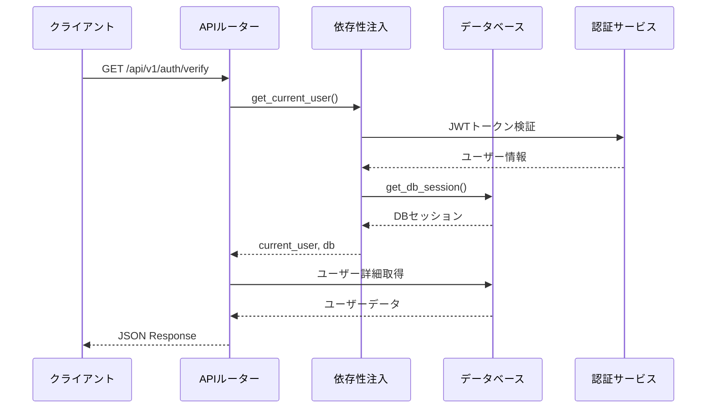
```mermaid
sequenceDiagram
    participant Client as クライアント
    participant Router as APIルーター
    participant Depends as 依存性注入
    participant DB as データベース
    participant Auth as 認証サービス

    Client->>Router: GET /api/v1/auth/verify
    Router->>Depends: get_current_user()
    Depends->>Auth: JWTトークン検証
    Auth-->>Depends: ユーザー情報
    Depends->>DB: get_db_session()
    DB-->>Depends: DBセッション
    Depends-->>Router: current_user, db
    Router->>DB: ユーザー詳細取得
    DB-->>Router: ユーザーデータ
    Router-->>Client: JSON Response
```

#### 主要な依存性注入関数

**1. データベースセッションの注入**（`app/db/session.py`）:

```python
def get_db():
    """データベースセッションを取得"""
    db = SessionLocal()
    try:
        yield db  # yieldでセッションを提供
    finally:
        db.close()  # リクエスト終了後に自動でクローズ

def get_db_with_commit():
    """自動コミット付きのデータベースセッション"""
    db = SessionLocal()
    try:
        yield db
        db.commit()  # 正常終了時に自動コミット
    except Exception:
        db.rollback()  # エラー時にロールバック
        raise
    finally:
        db.close()
```

**使用例**:

```python
@router.get("/users")
async def get_users(
    db: Session = Depends(get_db)  # DBセッションを注入
):
    users = db.query(User).all()
    return users
```

**2. 認証ユーザーの注入**（`app/core/security.py`）:

```python
from fastapi import Depends, HTTPException, Cookie
from jose import jwt, JWTError

async def get_current_user(
    auth_token: Optional[str] = Cookie(None),  # Cookieからトークン取得
    db: Session = Depends(get_db_session)       # DBセッションも注入
) -> User:
    """現在のユーザーを取得"""
    if not auth_token:
        raise HTTPException(status_code=401, detail="認証が必要です")

    try:
        # JWTトークンをデコード
        payload = jwt.decode(
            auth_token,
            settings.SECRET_KEY,
            algorithms=["HS256"]
        )
        user_id = int(payload.get("sub"))

        # ユーザーをDBから取得
        user = db.query(User).filter(User.id == user_id).first()
        if not user:
            raise HTTPException(status_code=401, detail="ユーザーが見つかりません")

        return user
    except JWTError:
        raise HTTPException(status_code=401, detail="無効なトークンです")
```

**使用例**:

```python
@router.get("/me")
async def get_current_user_info(
    current_user: User = Depends(get_current_user)  # 認証済みユーザーを注入
):
    return {
        "id": current_user.id,
        "name": current_user.name,
        "email": current_user.email
    }
```

**3. レスポンスフォーマッターの注入**（`app/core/deps.py`）:

```python
def get_response_formatter(
    request_id: Optional[str] = Depends(get_request_id)
) -> ResponseFormatter:
    """ResponseFormatterインスタンスを取得"""
    return ResponseFormatter(request_id=request_id)
```

**使用例**:

```python
@router.post("/logout")
async def logout(
    formatter: ResponseFormatter = Depends(get_response_formatter)
):
    # 統一されたレスポンス形式
    return formatter.success(message="ログアウトしました")
    # => {"success": true, "message": "ログアウトしました", "request_id": "..."}
```

#### 依存性注入のメリット

1. **テスト容易性**: モックに差し替えやすい
2. **コードの再利用性**: 共通処理を一箇所に集約
3. **関心の分離**: 各関数は自分の責務に集中
4. **自動的なリソース管理**: `yield`で確実にクリーンアップ

---

### 4.3 ディレクトリ構成の詳細

```text
backend/app/
├── api/                    # APIエンドポイント
│   ├── deps.py            # API共通の依存性注入
│   └── v1/                # APIバージョン1
│       ├── __init__.py
│       ├── auth.py        # 認証エンドポイント
│       ├── projects.py    # プロジェクト管理
│       ├── tasks.py       # タスク管理
│       └── users.py       # ユーザー管理
│
├── core/                   # コアモジュール
│   ├── config.py          # 設定管理（環境変数）
│   ├── security_utils.py  # セキュリティユーティリティ
│   ├── redis_client.py    # Redisキャッシュクライアント
│   ├── exceptions.py      # カスタム例外クラス
│   ├── deps.py            # 共通の依存性注入
│   └── constants.py       # 定数定義
│
├── db/                     # データベース関連
│   ├── base_class.py      # ベースモデルクラス
│   └── session.py         # セッション管理
│
├── models/                 # SQLAlchemyモデル
│   ├── user.py            # ユーザーモデル
│   ├── project.py         # プロジェクトモデル
│   ├── task.py            # タスクモデル
│   ├── team.py            # チームモデル
│   ├── rbac.py            # ロールベースアクセス制御
│   └── auth.py            # 認証関連モデル
│
├── schemas/                # Pydanticスキーマ
│   ├── user.py            # ユーザースキーマ
│   ├── auth.py            # 認証スキーマ
│   ├── project.py         # プロジェクトスキーマ
│   └── response.py        # 共通レスポンス
│
├── services/               # ビジネスロジック
│   ├── backlog_oauth.py   # Backlog OAuth認証
│   ├── sync_service.py    # データ同期サービス
│   └── activity_logger.py # アクティビティログ
│
└── main.py                 # アプリエントリーポイント
```

#### 各ディレクトリの役割

| ディレクトリ | 役割 | 依存関係 |
|------------|------|---------|
| `api/` | HTTPエンドポイントの定義 | `services/`, `models/`, `schemas/` |
| `core/` | アプリケーション全体で使う共通機能 | なし（最下層） |
| `db/` | データベース接続管理 | `core/` |
| `models/` | データ構造の定義 | `db/` |
| `schemas/` | 入出力データの定義 | `models/` |
| `services/` | ビジネスロジックの実装 | `models/`, `core/` |

---

### 4.4 データフロー全体像

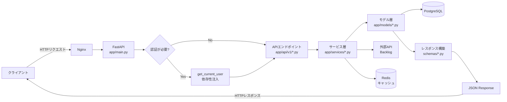
```mermaid
graph LR
    A[クライアント] -->|HTTPリクエスト| B[Nginx]
    B --> C[FastAPI<br/>app/main.py]

    C --> D{認証が必要?}
    D -->|Yes| E[get_current_user<br/>依存性注入]
    D -->|No| F[APIエンドポイント<br/>app/api/v1/*.py]
    E --> F

    F --> G[サービス層<br/>app/services/*.py]
    G --> H[モデル層<br/>app/models/*.py]
    H --> I[(PostgreSQL)]

    G --> J[外部API<br/>Backlog]
    G --> K[(Redis<br/>キャッシュ)]

    H --> L[レスポンス構築<br/>schemas/*.py]
    L --> M[JSON Response]
    M -->|HTTPレスポンス| A
```

### よくある間違い

1. **API層にビジネスロジックを書く**
    - ❌ 誤り: エンドポイント内で複雑な計算やデータ加工
    - ✅ 正解: サービス層に切り出して再利用可能に

2. **サービス層でHTTPリクエストを直接扱う**
    - ❌ 誤り: サービス層で`Request`オブジェクトを受け取る
    - ✅ 正解: 必要なデータのみを引数として受け取る

3. **モデル層に外部API呼び出しを書く**
    - ❌ 誤り: モデルのメソッド内で`httpx`を使う
    - ✅ 正解: サービス層で外部API連携を行う

4. **依存性注入を使わずにグローバル変数を使う**
    - ❌ 誤り: `db = SessionLocal()`をモジュールレベルで定義
    - ✅ 正解: `Depends(get_db)`を使って依存性注入

### ベストプラクティス

1. **レイヤー間の依存は一方向に**
    - 上位層は下位層に依存してOK
    - 下位層は上位層に依存しない

2. **各層の責務を明確に分離**
    - API層: リクエスト/レスポンス処理のみ
    - サービス層: ビジネスロジック
    - モデル層: データ構造定義

3. **依存性注入を積極的に活用**
    - テストが書きやすくなる
    - 共通処理を一箇所に集約できる

4. **型ヒントを必ず記述**
    - エディタの補完が効く
    - 自動バリデーションが働く
    - ドキュメントとしても機能

---

## 5. コア機能の実装

### 📖 学習目標

- セキュリティ機能（JWT認証、トークン管理）を理解する
- データベーストランザクション管理を学ぶ
- Redisキャッシュの活用方法を習得する
- エラーハンドリングの統一手法を理解する

### 📚 前提知識

- JWT（JSON Web Token）の基本概念
- データベーストランザクションの概念
- キャッシュの基本的な仕組み

---

### 5.1 security_utils.py - セキュリティユーティリティ

このモジュールは、**セキュアなトークン生成**、**レート制限**、**入力サニタイゼーション**などのセキュリティ機能を提供します。

#### トークン生成の仕組み

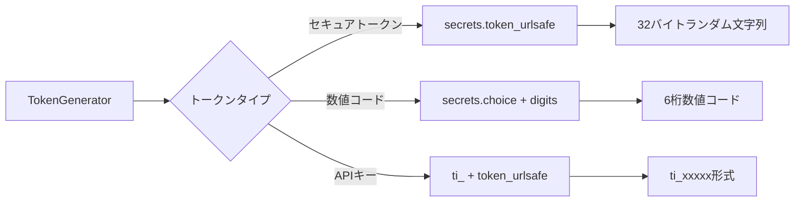
```mermaid
graph LR
    A[TokenGenerator] --> B{トークンタイプ}
    B -->|セキュアトークン| C[secrets.token_urlsafe]
    B -->|数値コード| D[secrets.choice + digits]
    B -->|APIキー| E[ti_ + token_urlsafe]

    C --> F[32バイトランダム文字列]
    D --> G[6桁数値コード]
    E --> H[ti_xxxxx形式]
```

#### 実装の詳細解説

**1. セキュアトークン生成**

`/Users/y_igarashi/Dev/team-insight/backend/app/core/security_utils.py`の一部:

```python
class TokenGenerator:
    """セキュアなトークン生成クラス"""

    @staticmethod
    def generate_secure_token(length: int = 32) -> str:
        """
        セキュアなトークンを生成

        Args:
            length: トークンの長さ（バイト数）

        Returns:
            生成されたトークン

        使用例:
            state_token = TokenGenerator.generate_secure_token(32)
            # => 'abcdefg123456...' （URLセーフなランダム文字列）

        セキュリティポイント:
            - secrets モジュールを使用（暗号学的に安全な乱数生成）
            - os.urandomベースのため、予測不可能
            - OAuth2.0のstateパラメータなどに使用
        """
        return secrets.token_urlsafe(length)
```

**使用場所**: OAuth2.0認証のstateパラメータ生成（`app/api/v1/auth.py`）

```python
# 認証URL生成時にstateトークンを生成
state_token = secrets.token_urlsafe(32)
# => CSRF攻撃を防ぐためのランダム文字列
```

**2. レート制限ヘルパー**

```python
class RateLimiter:
    """レート制限ヘルパークラス"""

    # アクションごとの制限設定
    ATTEMPT_LIMITS = {
        'login': (5, 300),              # 5回/5分
        'api_key_generation': (10, 86400),  # 10回/1日
    }

    @classmethod
    def get_limit_key(cls, action: str, identifier: str) -> str:
        """
        レート制限用のキーを生成

        Args:
            action: アクション名（例: 'login'）
            identifier: 識別子（IPアドレス、ユーザーIDなど）

        Returns:
            キー（例: 'rate_limit:login:192.168.1.1'）

        使用例:
            key = RateLimiter.get_limit_key('login', '192.168.1.1')
            # Redisでこのキーの試行回数をカウント
        """
        return f"rate_limit:{action}:{identifier}"
```

**使用方法**:

```python
# ログイン試行のレート制限チェック
client_ip = request.client.host
rate_key = RateLimiter.get_limit_key('login', client_ip)

# Redisで試行回数をカウント
attempt_count = await redis_client.get(rate_key) or 0
max_attempts, time_window = RateLimiter.get_limits('login')

if attempt_count >= max_attempts:
    raise HTTPException(
        status_code=429,
        detail=f"{time_window // 60}分後に再試行してください"
    )

# 試行回数をインクリメント
await redis_client.incr(rate_key)
await redis_client.expire(rate_key, time_window)
```

**3. 入力サニタイゼーション**

```python
def sanitize_input(text: str, max_length: Optional[int] = None) -> str:
    """
    入力テキストをサニタイズ

    Args:
        text: サニタイズするテキスト
        max_length: 最大長

    Returns:
        サニタイズされたテキスト

    処理内容:
        1. 制御文字を除去（\x00-\x1F, \x7F-\x9F）
        2. 前後の空白を除去
        3. 最大長でカット

    セキュリティポイント:
        - SQLインジェクション対策（制御文字除去）
        - XSS対策の一部（HTMLエスケープは別途必要）
    """
    # 制御文字を除去
    text = re.sub(r'[\x00-\x1F\x7F-\x9F]', '', text)

    # 前後の空白を除去
    text = text.strip()

    # 最大長でカット
    if max_length and len(text) > max_length:
        text = text[:max_length]

    return text
```

**使用例**:

```python
# ユーザー入力をサニタイズ
user_input = sanitize_input(request_data.get("comment"), max_length=500)
# => 制御文字が除去され、500文字以内に制限される
```

---

### 5.2 redis_client.py - Redisキャッシュクライアント

このモジュールは、**Redisへの接続管理**と**キャッシュ操作**を提供します。

#### Redisキャッシュの役割

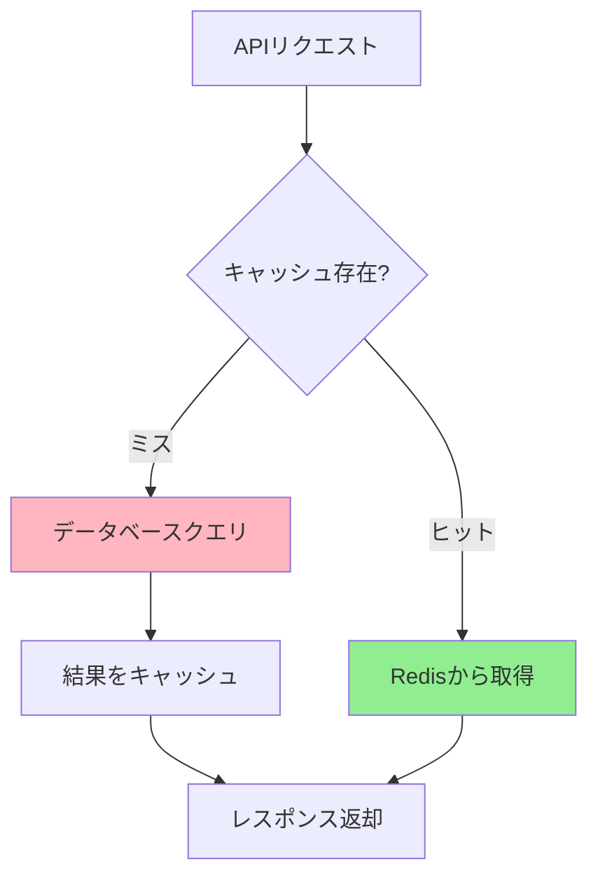
```mermaid
graph TB
    A[APIリクエスト] --> B{キャッシュ存在?}
    B -->|ヒット| C[Redisから取得]
    B -->|ミス| D[データベースクエリ]
    D --> E[結果をキャッシュ]
    E --> F[レスポンス返却]
    C --> F

    style C fill:#90EE90
    style D fill:#FFB6C1
```

#### 実装の詳細解説

**1. Redis接続管理**

`/Users/y_igarashi/Dev/team-insight/backend/app/core/redis_client.py`の一部:

```python
class RedisClient:
    """
    Redis接続とキャッシュ操作を管理するクラス

    シングルトンパターン:
        - モジュール末尾でインスタンス化（redis_client = RedisClient()）
        - アプリ全体で同一インスタンスを使用
    """

    def __init__(self):
        """Redisクライアントの初期化"""
        self._redis_pool: Optional[redis.ConnectionPool] = None
        self._redis_client: Optional[redis.Redis] = None

    async def get_connection(self) -> redis.Redis:
        """
        Redis接続を取得します

        接続プールパターン:
            - 初回アクセス時に接続プールを作成
            - 以降は同じプールを再利用
            - パフォーマンス向上とリソース効率化

        Returns:
            Redisクライアントインスタンス
        """
        if self._redis_client is None:
            if self._redis_pool is None:
                # 接続プールの作成
                self._redis_pool = redis.ConnectionPool.from_url(
                    settings.REDIS_URL,              # redis://redis:6379/0
                    password=settings.REDISCLI_AUTH, # 認証パスワード
                    decode_responses=True,            # 自動UTF-8デコード
                    max_connections=20,               # 最大接続数
                    retry_on_timeout=True,            # タイムアウト時リトライ
                    socket_keepalive=True,            # 接続維持
                    health_check_interval=30          # 30秒ごとにヘルスチェック
                )

            self._redis_client = redis.Redis(connection_pool=self._redis_pool)

            # 接続テスト
            try:
                await self._redis_client.ping()
                logger.info("Redis接続が確立されました")
            except Exception as e:
                logger.error(f"Redis接続エラー: {e}")
                raise

        return self._redis_client
```

**2. キャッシュの取得・設定・削除**

```python
async def get(self, key: str) -> Optional[Any]:
    """
    キャッシュから値を取得します

    Args:
        key: キャッシュキー（例: "cache:user:123"）

    Returns:
        キャッシュされた値（存在しない場合はNone）

    内部処理:
        1. Redisから文字列を取得
        2. JSON形式としてデコード
        3. Python オブジェクトとして返却
    """
    try:
        redis_client = await self.get_connection()
        value = await redis_client.get(key)

        if value is None:
            return None

        # JSONとしてデコード
        return json.loads(value)

    except Exception as e:
        logger.error(f"キャッシュ取得エラー (key: {key}): {e}")
        return None

async def set(
    self,
    key: str,
    value: Any,
    expire: Optional[Union[int, timedelta]] = None
) -> bool:
    """
    キャッシュに値を設定します

    Args:
        key: キャッシュキー
        value: キャッシュする値（辞書、リスト、数値など）
        expire: 有効期限（秒数またはtimedelta）

    Returns:
        設定が成功した場合True

    使用例:
        # 5分間キャッシュ
        await redis_client.set("cache:user:123", user_data, expire=300)

        # timedeltaで指定
        await redis_client.set(
            "cache:analytics:daily",
            analytics_data,
            expire=timedelta(hours=1)
        )
    """
    try:
        redis_client = await self.get_connection()

        # 値をJSONとしてエンコード
        json_value = json.dumps(value, ensure_ascii=False, default=str)

        # 有効期限の設定
        if isinstance(expire, timedelta):
            expire_seconds = int(expire.total_seconds())
        else:
            expire_seconds = expire

        if expire_seconds:
            await redis_client.setex(key, expire_seconds, json_value)
        else:
            await redis_client.set(key, json_value)

        logger.debug(f"キャッシュ設定完了 (key: {key}, expire: {expire_seconds}s)")
        return True

    except Exception as e:
        logger.error(f"キャッシュ設定エラー (key: {key}): {e}")
        return False
```

**3. パターンマッチによる一括削除**

```python
async def delete_pattern(self, pattern: str) -> int:
    """
    パターンに一致するキャッシュキーを削除します

    Args:
        pattern: 削除するキーのパターン（例: "cache:user:*"）

    Returns:
        削除されたキーの数

    使用例:
        # ユーザー123に関連する全てのキャッシュを削除
        deleted = await redis_client.delete_pattern("cache:user:123:*")

        # プロジェクト関連の全キャッシュを削除
        deleted = await redis_client.delete_pattern("cache:http:*projects*")

    注意:
        - KEYSコマンドは本番環境では注意が必要（ブロッキング）
        - 大量のキーがある場合はSCANコマンドを推奨
    """
    try:
        redis_client = await self.get_connection()
        keys = await redis_client.keys(pattern)

        if keys:
            deleted = await redis_client.delete(*keys)
            logger.info(f"パターン削除完了 (pattern: {pattern}, deleted: {deleted})")
            return deleted

        return 0

    except Exception as e:
        logger.error(f"パターン削除エラー (pattern: {pattern}): {e}")
        return 0
```

**実際の使用例**（`app/services/sync_service.py`）:

```python
# プロジェクト同期後にキャッシュを無効化
from app.core.redis_client import redis_client

async def sync_all_projects(self, ...):
    # ... プロジェクト同期処理 ...

    # プロジェクト関連のキャッシュを全て削除
    try:
        deleted_count = await redis_client.delete_pattern("cache:http:*projects*")
        logger.info(f"Invalidated {deleted_count} project cache entries after sync")
    except Exception as e:
        logger.warning(f"Failed to invalidate project cache: {str(e)}")
        # キャッシュ削除の失敗は同期処理全体を止めない
```

---

### 5.3 exceptions.py - 統一的なエラーハンドリング

このモジュールは、**カスタム例外クラス**と**統一されたエラーレスポンス**を提供します。

#### エラーハンドリングの階層構造

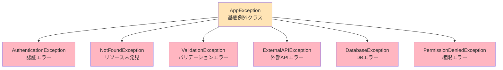
```mermaid
graph TB
    A[AppException<br/>基底例外クラス] --> B[AuthenticationException<br/>認証エラー]
    A --> C[NotFoundException<br/>リソース未発見]
    A --> D[ValidationException<br/>バリデーションエラー]
    A --> E[ExternalAPIException<br/>外部APIエラー]
    A --> F[DatabaseException<br/>DBエラー]
    A --> G[PermissionDeniedException<br/>権限エラー]

    style A fill:#FFE4B5
    style B fill:#FFB6C1
    style C fill:#FFB6C1
    style D fill:#FFB6C1
    style E fill:#FFB6C1
    style F fill:#FFB6C1
    style G fill:#FFB6C1
```

#### 実装の詳細解説

**1. 基底例外クラス**

`/Users/y_igarashi/Dev/team-insight/backend/app/core/exceptions.py`の一部:

```python
class AppException(HTTPException):
    """
    アプリケーション共通例外クラス

    すべてのカスタム例外の基底クラスです。
    エラーコード、追加データ、構造化ログをサポートします。

    使用例:
        raise AppException(
            error_code=ErrorCode.DATA_VALIDATION_ERROR,
            status_code=400,
            detail="ユーザー名は必須です",
            data={"field": "username"}
        )
    """
    def __init__(
        self,
        error_code: Union[ErrorCode, str],
        status_code: int,
        detail: str,
        headers: Optional[Dict[str, str]] = None,
        data: Optional[Dict[str, Any]] = None
    ):
        self.error_code = error_code.value if isinstance(error_code, ErrorCode) else error_code
        self.data = data or {}
        super().__init__(status_code=status_code, detail=detail, headers=headers)

        # 構造化ログ出力
        log_data = {
            "error_code": self.error_code,
            "status_code": status_code,
            "detail": detail,
            "data": self.data
        }
        logger.error("AppException raised", extra=log_data)
```

**2. 具体的な例外クラス**

```python
class AuthenticationException(AppException):
    """認証関連の例外"""
    def __init__(
        self,
        detail: str = "認証が必要です",
        data: Optional[Dict[str, Any]] = None
    ):
        super().__init__(
            error_code=ErrorCode.AUTH_INVALID_CREDENTIALS,
            status_code=status.HTTP_401_UNAUTHORIZED,
            detail=detail,
            data=data
        )

class NotFoundException(AppException):
    """リソースが見つからない例外"""
    def __init__(
        self,
        resource: str,
        detail: Optional[str] = None,
        data: Optional[Dict[str, Any]] = None
    ):
        if detail is None:
            detail = f"{resource}が見つかりません。"
        super().__init__(
            error_code=ErrorCode.DATA_NOT_FOUND,
            status_code=status.HTTP_404_NOT_FOUND,
            detail=detail,
            data=data
        )

class ExternalAPIException(AppException):
    """外部APIエラー例外"""
    def __init__(
        self,
        service: str = "Backlog",
        detail: Optional[str] = None,
        data: Optional[Dict[str, Any]] = None,
        status_code: int = status.HTTP_503_SERVICE_UNAVAILABLE
    ):
        if detail is None:
            detail = f"{service} APIの呼び出しに失敗しました。"
        super().__init__(
            error_code=ErrorCode.EXTERNAL_API_ERROR,
            status_code=status_code,
            detail=detail,
            data=data
        )
```

**3. エラーレスポンスの形式**

```json
{
  "success": false,
  "error_code": "AUTH_INVALID_CREDENTIALS",
  "detail": "認証が必要です",
  "data": {
    "field": "auth_token"
  },
  "request_id": "abc123..."
}
```

**使用例**（`app/api/v1/auth.py`）:

```python
@router.get("/verify", response_model=UserInfoResponse)
async def verify_token(
    current_user: User = Depends(get_current_user),
    db: Session = Depends(get_db_session)
):
    """JWTトークンの有効性を検証"""
    if not current_user:
        # カスタム例外を使用
        raise AuthenticationException(
            detail="認証が必要です"
        )

    # ... 処理 ...
```

**使用例2**（リソース未発見）:

```python
# ユーザーが見つからない場合
user = db.query(User).filter(User.id == user_id).first()
if not user:
    raise NotFoundException(
        resource="ユーザー",
        data={"user_id": user_id}
    )
```

---

### 5.4 session.py - データベーストランザクション管理

このモジュールは、**SQLAlchemyセッション**と**トランザクション管理**を提供します。

#### セッション管理の仕組み

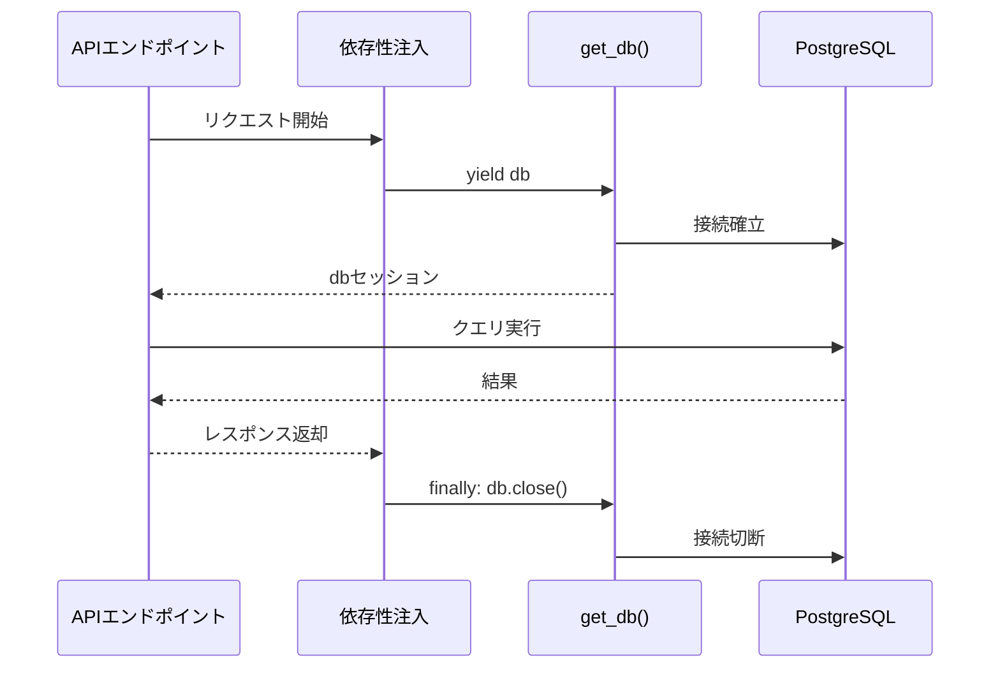
```mermaid
sequenceDiagram
    participant API as APIエンドポイント
    participant Depends as 依存性注入
    participant Session as get_db()
    participant DB as PostgreSQL

    API->>Depends: リクエスト開始
    Depends->>Session: yield db
    Session->>DB: 接続確立
    Session-->>API: dbセッション
    API->>DB: クエリ実行
    DB-->>API: 結果
    API-->>Depends: レスポンス返却
    Depends->>Session: finally: db.close()
    Session->>DB: 接続切断
```

#### 実装の詳細解説

`/Users/y_igarashi/Dev/team-insight/backend/app/db/session.py`:

```python
from sqlalchemy import create_engine
from sqlalchemy.orm import sessionmaker
from app.core.config import settings

# データベースエンジンの作成（接続プール付き）
engine = create_engine(settings.DATABASE_URL)

# セッションファクトリーの作成
SessionLocal = sessionmaker(
    autocommit=False,  # 自動コミット無効（明示的なcommitが必要）
    autoflush=False,   # 自動flushも無効
    bind=engine        # エンジンに紐付け
)

def get_db():
    """
    データベースセッションを取得

    使用方法:
        @router.get("/users")
        async def get_users(
            db: Session = Depends(get_db)
        ):
            users = db.query(User).all()
            return users

    動作:
        1. リクエスト開始時にセッションを作成
        2. yieldでセッションを提供
        3. リクエスト終了時に自動的にclose()
    """
    db = SessionLocal()
    try:
        yield db  # セッションを提供
    finally:
        db.close()  # 必ずクローズ

def get_db_with_commit():
    """
    自動コミット付きのデータベースセッションを取得

    使用方法:
        @router.post("/users")
        async def create_user(
            user_data: UserCreate,
            db: Session = Depends(get_db_with_commit)
        ):
            user = User(**user_data.dict())
            db.add(user)
            # commit()は自動実行される
            return user

    動作:
        1. リクエスト開始時にセッションを作成
        2. yieldでセッションを提供
        3. 正常終了時にcommit()
        4. 例外発生時にrollback()
        5. 最後に必ずclose()

    注意:
        - 明示的なトランザクション制御が不要な場合に使用
        - 複雑な処理では get_db() を使い、手動でcommit/rollback
    """
    db = SessionLocal()
    try:
        yield db
        db.commit()  # 正常終了時に自動コミット
    except Exception:
        db.rollback()  # エラー時にロールバック
        raise
    finally:
        db.close()
```

#### トランザクション制御パターン

**パターン1: 手動トランザクション制御**（推奨）

```python
@router.post("/projects/sync")
async def sync_projects(
    user: User = Depends(get_current_user),
    db: Session = Depends(get_db)  # get_db() を使用
):
    """プロジェクト同期（複数の操作があるため手動制御）"""
    try:
        # 複数のDB操作
        project = Project(name="New Project")
        db.add(project)
        db.flush()  # IDを取得するためflush

        # プロジェクトメンバーを追加
        for member_data in members:
            member = ProjectMember(
                project_id=project.id,
                user_id=member_data["user_id"]
            )
            db.add(member)

        # 全ての操作が成功したらコミット
        db.commit()

        return {"success": True, "project_id": project.id}
    except Exception as e:
        # エラー時はロールバック
        db.rollback()
        logger.error(f"プロジェクト同期エラー: {e}")
        raise
```

**パターン2: 自動コミット**（シンプルな操作向け）

```python
@router.post("/users/preferences")
async def update_preferences(
    preferences: UserPreferencesUpdate,
    user: User = Depends(get_current_user),
    db: Session = Depends(get_db_with_commit)  # 自動コミット
):
    """ユーザー設定更新（単一の操作のみ）"""
    user.timezone = preferences.timezone
    user.locale = preferences.locale
    # db.commit() は不要（自動実行される）
    return {"success": True}
```

---

### よくある間違い

1. **キャッシュキーの命名規則を守らない**
    - ❌ 誤り: `user_123`, `projects`など一貫性がない
    - ✅ 正解: `cache:user:123`, `cache:projects:list`など階層構造

2. **トランザクションをcommitし忘れる**
    - ❌ 誤り: `db.add(user)` だけで終わる
    - ✅ 正解: `db.add(user); db.commit()`

3. **例外を適切にキャッチしない**
    - ❌ 誤り: `except Exception: pass` で握りつぶす
    - ✅ 正解: カスタム例外を使って適切なエラーレスポンスを返す

4. **Redisの有効期限を設定しない**
    - ❌ 誤り: `await redis_client.set(key, value)` （期限なし）
    - ✅ 正解: `await redis_client.set(key, value, expire=300)`

### ベストプラクティス

1. **セキュアなトークン生成には`secrets`モジュールを使用**
    - `secrets.token_urlsafe()`は暗号学的に安全

2. **キャッシュは適切な有効期限を設定**
    - ユーザー情報: 5分〜15分
    - 分析データ: 1時間
    - 静的データ: 1日

3. **トランザクションは明示的に制御**
    - 複雑な処理は`get_db()`を使用
    - シンプルな更新のみ`get_db_with_commit()`

4. **エラーは適切な例外クラスで表現**
    - カスタム例外を活用
    - エラーコードで詳細を識別可能に

---

## 6. 認証システム（OAuth2.0 + JWT）

### 📖 学習目標

- OAuth2.0認証フローを理解する
- JWTトークンの仕組みを学ぶ
- Backlog OAuth連携の実装を把握する
- セキュリティベストプラクティスを習得する

### 📚 前提知識

- OAuth2.0の基本概念
- JWTの構造（Header, Payload, Signature）
- Cookie認証とHeader認証の違い

---

### 6.1 OAuth2.0フローの全体像

Team InsightはBacklog OAuth 2.0で認証を行い、JWT（JSON Web Token）をアプリケーション内部の認証に使用します。

#### 認証フロー図

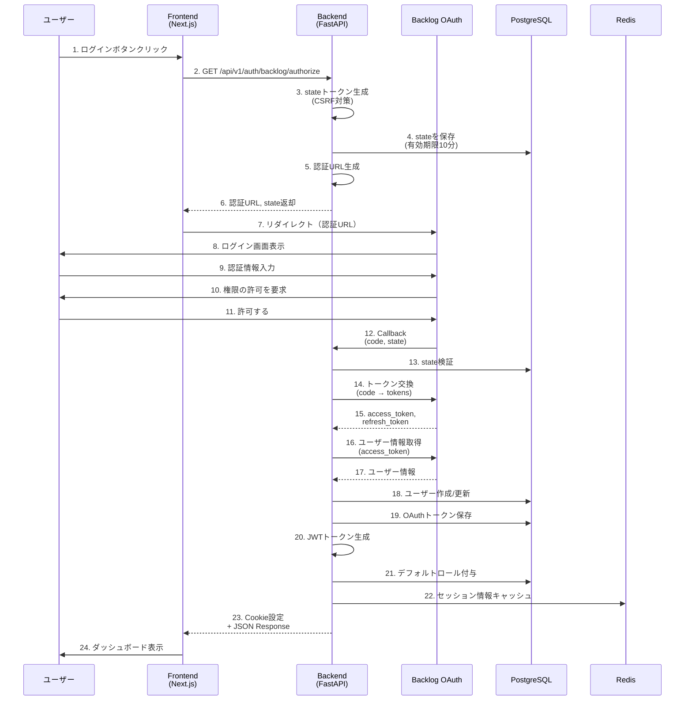
```mermaid
sequenceDiagram
    participant User as ユーザー
    participant Frontend as Frontend<br/>(Next.js)
    participant Backend as Backend<br/>(FastAPI)
    participant Backlog as Backlog OAuth
    participant DB as PostgreSQL
    participant Redis as Redis

    User->>Frontend: 1. ログインボタンクリック
    Frontend->>Backend: 2. GET /api/v1/auth/backlog/authorize
    Backend->>Backend: 3. stateトークン生成<br/>(CSRF対策)
    Backend->>DB: 4. stateを保存<br/>(有効期限10分)
    Backend->>Backend: 5. 認証URL生成
    Backend-->>Frontend: 6. 認証URL, state返却

    Frontend->>Backlog: 7. リダイレクト（認証URL）
    Backlog->>User: 8. ログイン画面表示
    User->>Backlog: 9. 認証情報入力
    Backlog->>User: 10. 権限の許可を要求
    User->>Backlog: 11. 許可する

    Backlog->>Backend: 12. Callback<br/>(code, state)
    Backend->>DB: 13. state検証
    Backend->>Backlog: 14. トークン交換<br/>(code → tokens)
    Backlog-->>Backend: 15. access_token,<br/>refresh_token
    Backend->>Backlog: 16. ユーザー情報取得<br/>(access_token)
    Backlog-->>Backend: 17. ユーザー情報

    Backend->>DB: 18. ユーザー作成/更新
    Backend->>DB: 19. OAuthトークン保存
    Backend->>Backend: 20. JWTトークン生成
    Backend->>DB: 21. デフォルトロール付与
    Backend->>Redis: 22. セッション情報キャッシュ

    Backend-->>Frontend: 23. Cookie設定<br/>+ JSON Response
    Frontend->>User: 24. ダッシュボード表示
```

---

### 6.2 backlog_oauth.py - Backlog OAuth連携

#### 実装の詳細解説

`/Users/y_igarashi/Dev/team-insight/backend/app/services/backlog_oauth.py`:

**1. 認証URL生成**

```python
class BacklogOAuthService:
    """Backlog OAuth2.0認証を処理するサービスクラス"""

    def __init__(self):
        """サービスの初期化"""
        self.client_id = settings.BACKLOG_CLIENT_ID
        self.client_secret = settings.BACKLOG_CLIENT_SECRET
        self.redirect_uri = settings.BACKLOG_REDIRECT_URI
        self.space_key = settings.BACKLOG_SPACE_KEY
        self.base_url = f"https://{self.space_key}.backlog.jp"

    def get_authorization_url(
        self,
        space_key: Optional[str] = None,
        state: Optional[str] = None,
        force_account_selection: bool = False
    ) -> str:
        """
        認証URLを生成します

        Args:
            space_key: BacklogのスペースキーOptional）
            state: CSRF攻撃を防ぐためのランダムな文字列
            force_account_selection: アカウント選択を強制するか

        Returns:
            認証URL, state

        生成されるURL例:
            https://myspace.backlog.jp/OAuth2AccessRequest.action?
            response_type=code&
            client_id=xxx&
            redirect_uri=http://localhost/auth/callback&
            state=yyy
        """
        if not state:
            # セキュアなランダム文字列を生成
            state = secrets.token_urlsafe(32)

        # space_keyが指定されている場合は、そのURLを使用
        if space_key:
            base_url = f"https://{space_key}.backlog.jp"
        else:
            base_url = self.base_url

        params = {
            "response_type": "code",
            "client_id": self.client_id,
            "redirect_uri": self.redirect_uri,
            "state": state,
        }

        # アカウント選択を強制する場合
        if force_account_selection:
            params["prompt"] = "login"  # 再ログインを強制
            params["max_age"] = "0"     # セッションの最大有効期限を0に

        # OAuth認証URLを生成
        auth_url = f"{base_url}/OAuth2AccessRequest.action?{urlencode(params)}"
        return auth_url, state
```

**2. トークン交換**

```python
async def exchange_code_for_token(
    self,
    code: str,
    space_key: Optional[str] = None
) -> Dict[str, any]:
    """
    認証コードをアクセストークンに交換します

    Args:
        code: Backlogから受け取った認証コード
        space_key: BacklogのスペースキーOptional）

    Returns:
        {
            "access_token": "...",
            "refresh_token": "...",
            "token_type": "Bearer",
            "expires_in": 3600,
            "expires_at": datetime(...)
        }

    Backlog APIエンドポイント:
        POST https://{space_key}.backlog.jp/api/v2/oauth2/token

    リクエストボディ:
        grant_type=authorization_code
        code=認証コード
        redirect_uri=コールバックURI
        client_id=クライアントID
        client_secret=クライアントシークレット
    """
    if space_key:
        base_url = f"https://{space_key}.backlog.jp"
    else:
        base_url = self.base_url

    token_url = f"{base_url}/api/v2/oauth2/token"

    data = {
        "grant_type": "authorization_code",
        "code": code,
        "redirect_uri": self.redirect_uri,
        "client_id": self.client_id,
        "client_secret": self.client_secret,
    }

    async with httpx.AsyncClient() as client:
        response = await client.post(
            token_url,
            data=data,
            headers={"Content-Type": "application/x-www-form-urlencoded"},
        )

        if response.status_code != 200:
            raise Exception(f"トークンの取得に失敗しました: {response.text}")

        token_data = response.json()

        # トークンの有効期限を計算
        expires_at = datetime.utcnow() + timedelta(seconds=token_data["expires_in"])

        return {
            "access_token": token_data["access_token"],
            "refresh_token": token_data["refresh_token"],
            "token_type": token_data["token_type"],
            "expires_in": token_data["expires_in"],
            "expires_at": expires_at,
        }
```

**3. トークンのリフレッシュ**

```python
async def refresh_access_token(
    self,
    refresh_token: str,
    space_key: Optional[str] = None
) -> Dict[str, any]:
    """
    リフレッシュトークンを使用してアクセストークンを更新します

    Args:
        refresh_token: 保存されているリフレッシュトークン
        space_key: BacklogのスペースキーOptional）

    Returns:
        新しいアクセストークン、リフレッシュトークン、有効期限

    使用タイミング:
        - アクセストークンの有効期限が切れた時
        - 有効期限が近い時（5分前など）

    リクエストボディ:
        grant_type=refresh_token
        refresh_token=リフレッシュトークン
        client_id=クライアントID
        client_secret=クライアントシークレット
    """
    if space_key:
        base_url = f"https://{space_key}.backlog.jp"
    else:
        base_url = self.base_url

    token_url = f"{base_url}/api/v2/oauth2/token"

    data = {
        "grant_type": "refresh_token",
        "refresh_token": refresh_token,
        "client_id": self.client_id,
        "client_secret": self.client_secret,
    }

    async with httpx.AsyncClient() as client:
        response = await client.post(
            token_url,
            data=data,
            headers={"Content-Type": "application/x-www-form-urlencoded"},
        )

        if response.status_code != 200:
            raise Exception(f"トークンの更新に失敗しました: {response.text}")

        token_data = response.json()
        expires_at = datetime.utcnow() + timedelta(seconds=token_data["expires_in"])

        return {
            "access_token": token_data["access_token"],
            "refresh_token": token_data["refresh_token"],
            "token_type": token_data["token_type"],
            "expires_in": token_data["expires_in"],
            "expires_at": expires_at,
        }
```

**4. ユーザー情報取得**

```python
async def get_user_info(
    self,
    access_token: str,
    space_key: Optional[str] = None
) -> Dict[str, any]:
    """
    アクセストークンを使用してユーザー情報を取得します

    Args:
        access_token: 有効なアクセストークン
        space_key: BacklogのスペースキーOptional）

    Returns:
        {
            "id": 123,
            "userId": "yamada",
            "name": "山田太郎",
            "mailAddress": "yamada@example.com",
            ...
        }

    Backlog APIエンドポイント:
        GET https://{space_key}.backlog.jp/api/v2/users/myself
        Authorization: Bearer {access_token}
    """
    if space_key:
        base_url = f"https://{space_key}.backlog.jp"
    else:
        base_url = self.base_url

    user_url = f"{base_url}/api/v2/users/myself"

    async with httpx.AsyncClient() as client:
        response = await client.get(
            user_url,
            headers={"Authorization": f"Bearer {access_token}"}
        )

        if response.status_code != 200:
            raise Exception(f"ユーザー情報の取得に失敗しました: {response.text}")

        return response.json()
```

---

### 6.3 auth.py - 認証APIエンドポイント

#### 主要エンドポイントの詳細

**1. GET /api/v1/auth/backlog/authorize - 認証URL生成**

`/Users/y_igarashi/Dev/team-insight/backend/app/api/v1/auth.py`の一部:

```python
@router.get("/backlog/authorize", response_model=AuthorizationResponse)
async def get_authorization_url(
    space_key: Optional[str] = Query(None),
    force_account_selection: bool = Query(False),
    db: Session = Depends(get_db_session),
    current_user: Optional[User] = Depends(get_current_user),
):
    """
    Backlog OAuth2.0認証URLを生成

    処理フロー:
        1. space_keyパラメータの検証
        2. CSRF攻撃防止用のstateトークンを生成（32バイト）
        3. space_keyを含むstateデータを作成してBase64エンコード
        4. BacklogのOAuth認証URLを生成
        5. stateをデータベースに保存（有効期限10分）
        6. 認証URLとstateをクライアントに返却

    Args:
        space_key: BacklogのスペースキーOptional）
        force_account_selection: アカウント選択を強制するか
        db: データベースセッション
        current_user: 現在のユーザー（未ログインの場合はNone）

    Returns:
        {
            "authorization_url": "https://xxx.backlog.jp/OAuth2AccessRequest.action?...",
            "state": "base64エンコードされたstate文字列",
            "expected_space": "スペースキー"
        }
    """
    import json
    import base64

    try:
        # space_keyが指定されていない場合は環境変数を使用
        if not space_key:
            space_key = settings.BACKLOG_SPACE_KEY

        # stateを生成（CSRF対策）
        state_token = secrets.token_urlsafe(32)

        # space_keyを含むstateデータを作成
        state_data = {
            "token": state_token,
            "space_key": space_key
        }

        # stateデータをBase64エンコード
        state = base64.urlsafe_b64encode(
            json.dumps(state_data).encode()
        ).decode()

        # 認証URLを生成
        auth_url, _ = backlog_oauth_service.get_authorization_url(
            space_key=space_key,
            state=state,
            force_account_selection=force_account_selection
        )

        # stateをデータベースに保存（10分間有効）
        expires_at = datetime.now(ZoneInfo("Asia/Tokyo")) + timedelta(minutes=10)
        oauth_state = OAuthState(
            state=state,
            user_id=current_user.id if current_user else None,
            expires_at=expires_at,
        )
        db.add(oauth_state)
        db.commit()

        return AuthorizationResponse(
            authorization_url=auth_url,
            state=state,
            expected_space=space_key
        )
    except Exception as e:
        logger.error(f"認証URL生成エラー: {str(e)}", exc_info=True)
        raise ExternalAPIException(
            service="Backlog OAuth",
            detail="認証URLの生成に失敗しました"
        )
```

**2. POST /api/v1/auth/backlog/callback - OAuth コールバック処理**

```python
@router.post("/backlog/callback", response_model=TokenResponse)
async def handle_callback(
    request: CallbackRequest,
    http_request: Request,
    db: Session = Depends(get_db_session),
    auth_service: BacklogAuthService = Depends(get_auth_service)
):
    """
    Backlog OAuth2.0認証コールバック処理

    処理フロー:
        1. stateパラメータを検証（CSRF攻撃対策）
        2. stateからspace_keyを抽出
        3. 認証コードをBacklogのアクセストークンに交換
        4. アクセストークンを使用してBacklogからユーザー情報を取得
        5. ユーザーをデータベースに作成または更新
        6. OAuthトークンをデータベースに保存
        7. 使用済みのstateをデータベースから削除
        8. JWTトークン（アプリケーション内部用）を生成
        9. ユーザーにデフォルトロール（MEMBER）を割り当て
        10. ログイン履歴とアクティビティログを記録
        11. JWTトークンをHttpOnly Cookieとレスポンスボディに設定

    Args:
        request: 認証コードとstateを含むリクエスト
        http_request: HTTPリクエストオブジェクト
        db: データベースセッション
        auth_service: 認証サービス

    Returns:
        {
            "access_token": "JWT形式のアクセストークン",
            "refresh_token": "JWT形式のリフレッシュトークン",
            "token_type": "bearer",
            "user": {...}
        }
    """
    logger.info(
        f"認証コールバック開始 - code: {request.code[:10]}..., state: {request.state}"
    )

    # stateの検証
    oauth_state = auth_service.validate_oauth_state(db, request.state)

    try:
        # stateからspace_keyを取り出す
        space_key = auth_service.extract_space_key_from_state(request.state)

        # 認証コードをアクセストークンに交換
        token_data = await auth_service.exchange_code_for_token(request.code, space_key)

        # ユーザー情報を取得
        user_info = await auth_service.get_backlog_user_info(
            token_data["access_token"],
            space_key
        )

        # ユーザーの作成または更新
        user = auth_service.find_or_create_user(db, user_info)

        # トークンを保存
        auth_service.save_oauth_token(db, user.id, token_data, space_key, user_info)

        # 使用済みのstateを削除
        auth_service.cleanup_oauth_state(db, oauth_state)

        # JWTトークンを生成（アプリケーション内での認証用）
        access_token, refresh_token = auth_service.create_jwt_tokens(user.id)

        logger.info(f"認証コールバック成功 - user_id: {user.id}")

        # デフォルトロールを割り当て
        user = auth_service.assign_default_role_if_needed(db, user)

        # ログイン履歴を記録
        from app.models.user_preferences import LoginHistory
        from app.services.activity_logger import ActivityLogger

        client_ip = http_request.client.host if http_request.client else None
        user_agent = http_request.headers.get("user-agent", "Unknown")

        login_history = LoginHistory(
            user_id=user.id,
            ip_address=client_ip,
            user_agent=user_agent,
            login_at=datetime.now(timezone.utc)
        )
        db.add(login_history)

        # アクティビティログを記録
        ActivityLogger.log_login(db, user, http_request)

        db.commit()

        # レスポンス構築
        response_data = _build_user_response(user, access_token, db=db)
        response_data["refresh_token"] = refresh_token
        response = TokenResponse(**response_data)

        # Cookie設定
        access_cookie_header = (
            f"{AuthConstants.COOKIE_NAME}={access_token}; "
            f"Path={AuthConstants.COOKIE_PATH}; HttpOnly; "
            f"Max-Age={AuthConstants.TOKEN_MAX_AGE}"
        )

        refresh_cookie_header = (
            f"refresh_token={refresh_token}; "
            f"Path={AuthConstants.COOKIE_PATH}; HttpOnly; "
            f"Max-Age={30 * 24 * 60 * 60}"  # 30日間
        )

        if settings.DEBUG:
            access_cookie_header += "; Domain=localhost"
            refresh_cookie_header += "; Domain=localhost"
        else:
            access_cookie_header += f"; SameSite={AuthConstants.COOKIE_SAMESITE}"
            refresh_cookie_header += f"; SameSite={AuthConstants.COOKIE_SAMESITE}"

        headers = {
            "Set-Cookie": f"{access_cookie_header}, {refresh_cookie_header}"
        }

        return JSONResponse(
            content=response.model_dump(),
            headers=headers
        )

    except HTTPException:
        db.rollback()
        _cleanup_oauth_state(db, oauth_state)
        raise
    except Exception as e:
        logger.error(f"認証処理で予期しないエラー: {str(e)}", exc_info=True)
        db.rollback()
        _cleanup_oauth_state(db, oauth_state)
        raise ExternalAPIException(
            service="Backlog OAuth",
            detail="認証処理中にエラーが発生しました"
        )
```

---

### 6.4 JWTトークンの仕組み

#### JWTの構造

```text
JWT = Header.Payload.Signature

Header (Base64エンコード):
{
  "alg": "HS256",  # アルゴリズム
  "typ": "JWT"     # トークンタイプ
}

Payload (Base64エンコード):
{
  "sub": "123",              # ユーザーID
  "exp": 1640995200,         # 有効期限（UNIXタイムスタンプ）
  "iat": 1640991600,         # 発行日時
  "type": "access"           # トークンタイプ
}

Signature (HMAC SHA256):
HMACSHA256(
  base64UrlEncode(header) + "." + base64UrlEncode(payload),
  SECRET_KEY
)
```

#### Cookie vs Header認証

| 方式 | メリット | デメリット | Team Insightでの使用 |
|-----|---------|-----------|-------------------|
| **Cookie** | - XSS攻撃に強い<br/>- 自動送信 | - CSRF対策が必要<br/>- サブドメイン制限 | **メイン方式**<br/>HttpOnly Cookie |
| **Header** | - CSRF対策不要<br/>- 柔軟性が高い | - XSS攻撃に弱い<br/>- 手動送信 | **サブ方式**<br/>Authorization Header |

**Cookie設定の詳細**:

```python
# 開発環境
response.set_cookie(
    key="auth_token",
    value=access_token,
    max_age=900,  # 15分
    path="/",
    domain="localhost",  # ポート間での共有を可能に
    httponly=True,       # JavaScriptからアクセス不可
    secure=False         # HTTPでも送信（開発環境のため）
)

# 本番環境
response.set_cookie(
    key="auth_token",
    value=access_token,
    max_age=900,
    path="/",
    httponly=True,
    secure=True,        # HTTPSのみ
    samesite="Lax"      # CSRF対策
)
```

---

### 6.5 セキュリティベストプラクティス

1. **stateパラメータでCSRF対策**
    - 認証リクエストごとに一意のstateを生成
    - データベースに保存して検証
    - 使用後は即座に削除

2. **トークンの有効期限を適切に設定**
    - アクセストークン: 15分（短め）
    - リフレッシュトークン: 30日（長め）
    - Backlog OAuthトークン: 1時間

3. **HttpOnly Cookieでトークンを保護**
    - JavaScriptからアクセス不可
    - XSS攻撃を防ぐ

4. **トークンリフレッシュの自動化**
    - 有効期限の5分前に自動リフレッシュ
    - ユーザー体験を損なわない

5. **ログイン履歴とアクティビティログ**
    - IPアドレスとUser-Agentを記録
    - 不正アクセスの検知に活用

---

### よくある間違い

1. **stateパラメータを検証しない**
    - ❌ 誤り: stateをそのまま受け取る
    - ✅ 正解: データベースで検証し、使用後は削除

2. **トークンをローカルストレージに保存**
    - ❌ 誤り: `localStorage.setItem("token", ...)`
    - ✅ 正解: HttpOnly Cookieを使用

3. **有効期限切れトークンをそのまま使用**
    - ❌ 誤り: エラーが出てから対処
    - ✅ 正解: リフレッシュトークンで自動更新

4. **SECRET_KEYを公開リポジトリに含める**
    - ❌ 誤り: `.env`ファイルをコミット
    - ✅ 正解: `.gitignore`に追加し、環境変数で管理

---

## 第3部: フロントエンド実装ガイド（Next.js + React）

### 11. Next.js 14 App Routerの理解

**学習目標**:
- App Routerの仕組みと従来のPages Routerとの違いを理解する
- ファイルベースルーティングの規則を習得する
- Server ComponentsとClient Componentsの使い分けができるようになる

**前提知識**:
- Reactの基本（コンポーネント、Props、State）
- JavaScriptのES6+構文（アロー関数、分割代入、async/await）

---

#### App Routerの基本概念

Next.js 14では、従来の`pages`ディレクトリではなく、`app`ディレクトリを使用する新しいルーティングシステム「App Router」が推奨されています。

**Pages Router vs App Router**

```
Pages Router (旧)          App Router (新)
pages/                     app/
├── index.tsx             ├── page.tsx
├── about.tsx             ├── about/
└── blog/                 │   └── page.tsx
    └── [id].tsx          └── blog/
                              └── [id]/
                                  └── page.tsx
```

**主な違い**:

| 機能 | Pages Router | App Router |
|-----|-------------|-----------|
| ルート定義 | ファイル = ルート | `page.tsx`がルート |
| データ取得 | `getServerSideProps` | Server Components |
| レイアウト | `_app.tsx` | `layout.tsx` |
| ローディング | カスタム実装 | `loading.tsx` |
| エラー処理 | `_error.tsx` | `error.tsx` |

---

#### ファイルベースルーティング

App Routerでは、特定のファイル名に特別な意味があります：

```
app/
├── layout.tsx          # ルートレイアウト（必須）
├── page.tsx            # ホームページ（/）
├── loading.tsx         # ローディングUI
├── error.tsx           # エラーUI
├── not-found.tsx       # 404ページ
├── dashboard/
│   ├── layout.tsx      # ダッシュボードレイアウト
│   ├── page.tsx        # /dashboard
│   ├── personal/
│   │   └── page.tsx    # /dashboard/personal
│   └── team/
│       └── page.tsx    # /dashboard/team
└── projects/
    ├── page.tsx        # /projects
    └── [id]/
        └── page.tsx    # /projects/:id（動的ルート）
```

**ルーティングフロー図**:

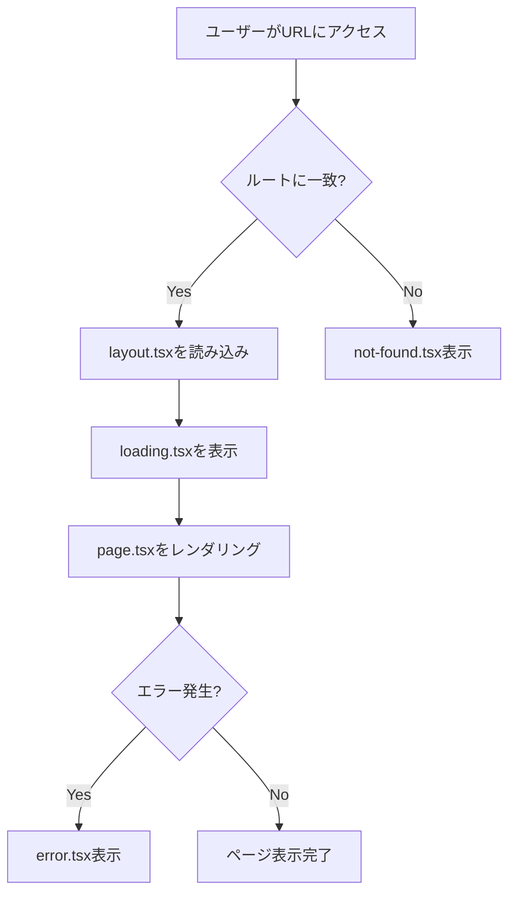
```mermaid
graph TD
    A[ユーザーがURLにアクセス] --> B{ルートに一致?}
    B -->|Yes| C[layout.tsxを読み込み]
    B -->|No| D[not-found.tsx表示]
    C --> E[loading.tsxを表示]
    E --> F[page.tsxをレンダリング]
    F --> G{エラー発生?}
    G -->|Yes| H[error.tsx表示]
    G -->|No| I[ページ表示完了]
```

---

#### Server ComponentsとClient Components

**Server Components（デフォルト）**:
- サーバー側でのみ実行される
- データベースや外部APIに直接アクセス可能
- バンドルサイズに含まれない（パフォーマンス向上）
- ブラウザAPIやReact Hooks（useState、useEffectなど）は使用不可

**Client Components**:
- ブラウザで実行される
- React Hooks、イベントハンドラーが使用可能
- ファイルの先頭に`'use client'`ディレクティブが必要

**使い分けの基準**:

| ケース | 使用するコンポーネント |
|-------|-------------------|
| データベースから直接データ取得 | Server Component |
| 静的コンテンツの表示 | Server Component |
| インタラクティブな操作（ボタンクリックなど） | Client Component |
| useState、useEffect等のフック使用 | Client Component |
| ブラウザAPI（localStorage等）の使用 | Client Component |

**実装例**:

```typescript
// app/dashboard/page.tsx (Server Component)
import { prisma } from '@/lib/prisma';
import DashboardClient from './DashboardClient';

// サーバー側でデータ取得
async function getDashboardData() {
  const projects = await prisma.project.findMany({
    include: { team: true }
  });
  return projects;
}

export default async function DashboardPage() {
  const projects = await getDashboardData();

  // Client Componentにデータを渡す
  return <DashboardClient projects={projects} />;
}
```

```typescript
// app/dashboard/DashboardClient.tsx (Client Component)
'use client';

import { useState } from 'react';

export default function DashboardClient({ projects }) {
  const [filter, setFilter] = useState('all');

  // クライアント側でフィルタリング
  const filteredProjects = projects.filter(p =>
    filter === 'all' || p.status === filter
  );

  return (
    <div>
      <select value={filter} onChange={(e) => setFilter(e.target.value)}>
        <option value="all">すべて</option>
        <option value="active">進行中</option>
        <option value="completed">完了</option>
      </select>

      {filteredProjects.map(project => (
        <div key={project.id}>{project.name}</div>
      ))}
    </div>
  );
}
```

---

#### レイアウトとテンプレート

**layout.tsx（レイアウト）**:
- 複数のページで共有されるUI
- ナビゲーション遷移時も状態が保持される
- ネストが可能（親レイアウト → 子レイアウト）

```typescript
// app/layout.tsx（ルートレイアウト）
import type { Metadata } from 'next';
import { Inter } from 'next/font/google';
import './globals.css';

const inter = Inter({ subsets: ['latin'] });

export const metadata: Metadata = {
  title: 'Team Insight',
  description: 'プロジェクト管理と分析のためのツール',
};

export default function RootLayout({
  children,
}: {
  children: React.ReactNode;
}) {
  return (
    <html lang="ja">
      <body className={inter.className}>
        <header>
          <nav>{/* グローバルナビゲーション */}</nav>
        </header>
        <main>{children}</main>
        <footer>{/* フッター */}</footer>
      </body>
    </html>
  );
}
```

```typescript
// app/dashboard/layout.tsx（ダッシュボードレイアウト）
import Sidebar from '@/components/Sidebar';

export default function DashboardLayout({
  children,
}: {
  children: React.ReactNode;
}) {
  return (
    <div className="flex">
      <Sidebar />
      <div className="flex-1 p-8">
        {children}
      </div>
    </div>
  );
}
```

**レイアウトのネスト図**:

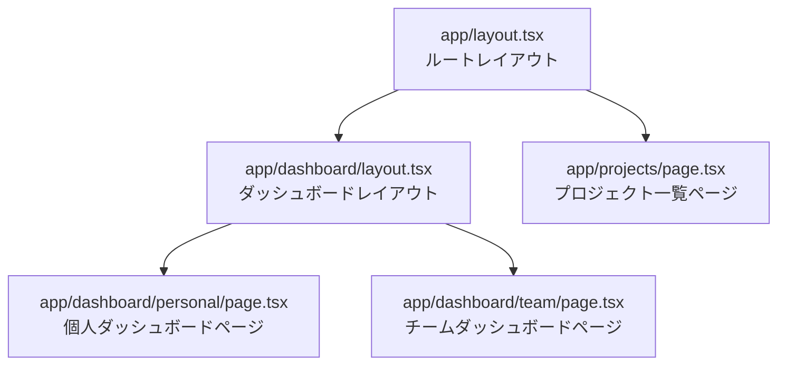
```mermaid
graph TD
    A[app/layout.tsx<br/>ルートレイアウト] --> B[app/dashboard/layout.tsx<br/>ダッシュボードレイアウト]
    B --> C[app/dashboard/personal/page.tsx<br/>個人ダッシュボードページ]
    B --> D[app/dashboard/team/page.tsx<br/>チームダッシュボードページ]
    A --> E[app/projects/page.tsx<br/>プロジェクト一覧ページ]
```

---

#### ローディングとエラーハンドリング

**loading.tsx（ローディング状態）**:
- ページの読み込み中に表示されるUI
- Suspenseを自動的に使用

```typescript
// app/dashboard/loading.tsx
export default function Loading() {
  return (
    <div className="flex items-center justify-center h-screen">
      <div className="animate-spin rounded-full h-32 w-32 border-b-2 border-gray-900"></div>
      <p className="ml-4">データを読み込んでいます...</p>
    </div>
  );
}
```

**error.tsx（エラー処理）**:
- エラー発生時に表示されるUI
- 自動的にError Boundaryとして機能
- 必ずClient Componentとして定義

```typescript
// app/dashboard/error.tsx
'use client';

import { useEffect } from 'react';

export default function Error({
  error,
  reset,
}: {
  error: Error & { digest?: string };
  reset: () => void;
}) {
  useEffect(() => {
    // エラーをログに記録
    console.error(error);
  }, [error]);

  return (
    <div className="flex flex-col items-center justify-center h-screen">
      <h2 className="text-2xl font-bold mb-4">エラーが発生しました</h2>
      <p className="text-gray-600 mb-4">{error.message}</p>
      <button
        onClick={() => reset()}
        className="px-4 py-2 bg-blue-500 text-white rounded hover:bg-blue-600"
      >
        再試行
      </button>
    </div>
  );
}
```

---

#### レンダリングフロー全体図

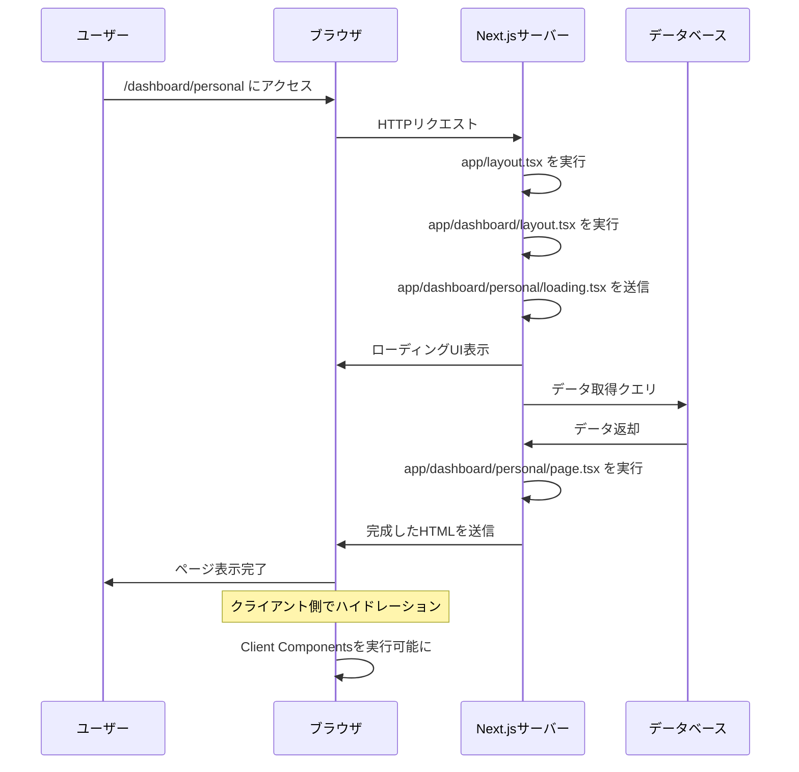
```mermaid
sequenceDiagram
    participant User as ユーザー
    participant Browser as ブラウザ
    participant Server as Next.jsサーバー
    participant DB as データベース

    User->>Browser: /dashboard/personal にアクセス
    Browser->>Server: HTTPリクエスト

    Server->>Server: app/layout.tsx を実行
    Server->>Server: app/dashboard/layout.tsx を実行
    Server->>Server: app/dashboard/personal/loading.tsx を送信
    Server->>Browser: ローディングUI表示

    Server->>DB: データ取得クエリ
    DB->>Server: データ返却

    Server->>Server: app/dashboard/personal/page.tsx を実行
    Server->>Browser: 完成したHTMLを送信

    Browser->>User: ページ表示完了

    Note over Browser: クライアント側でハイドレーション
    Browser->>Browser: Client Componentsを実行可能に
```

---

#### ベストプラクティス

1. **できるだけServer Componentを使う**
   - パフォーマンスとSEOに有利
   - データ取得はサーバー側で行う

2. **Client Componentは必要最小限に**
   - インタラクティブな部分だけをClient Component化
   - `'use client'`は可能な限り下層のコンポーネントに配置

3. **レイアウトを活用して重複を避ける**
   - 共通UIはlayout.tsxに配置
   - ページ遷移時の再レンダリングを防ぐ

4. **loading.tsxで体感速度を向上**
   - ユーザーに読み込み状態をフィードバック
   - Suspense Boundaryを適切に配置

5. **error.tsxで適切なエラー処理**
   - ユーザーフレンドリーなエラーメッセージ
   - リトライ機能を提供

---

#### よくある間違い

1. **全てをClient Componentにしてしまう**
   - ❌ 誤り: すべてのファイルに`'use client'`
   - ✅ 正解: Server Componentをデフォルトに、必要な部分だけClient Component

2. **layout.tsxでデータ取得を試みる**
   - ❌ 誤り: layout内でuseEffectを使用
   - ✅ 正解: Server Componentのpage.tsxでデータ取得

3. **page.tsxファイルを置き忘れる**
   - ❌ 誤り: `app/dashboard/index.tsx`（404になる）
   - ✅ 正解: `app/dashboard/page.tsx`

---

### 12. 状態管理の戦略

**学習目標**:
- グローバル状態、サーバー状態、ローカル状態の違いを理解する
- それぞれの状態管理ツールの適切な使い分けができる
- 実際のプロジェクトでの実装パターンを習得する

**前提知識**:
- Reactの基本的なフック（useState、useEffect、useContext）
- 非同期処理（Promise、async/await）

---

#### 状態の種類と管理ツール

Team Insightプロジェクトでは、3種類の状態を異なるツールで管理しています：

| 状態の種類 | 管理ツール | 用途 | 例 |
|----------|----------|------|---|
| グローバル状態 | Redux Toolkit | アプリ全体で共有される状態 | 認証情報、ユーザー設定、テーマ |
| サーバー状態 | React Query | サーバーから取得したデータのキャッシュ | プロジェクト一覧、分析データ |
| ローカル状態 | useState/useReducer | コンポーネント内部の状態 | フォーム入力、モーダルの開閉 |

**状態管理の全体像**:

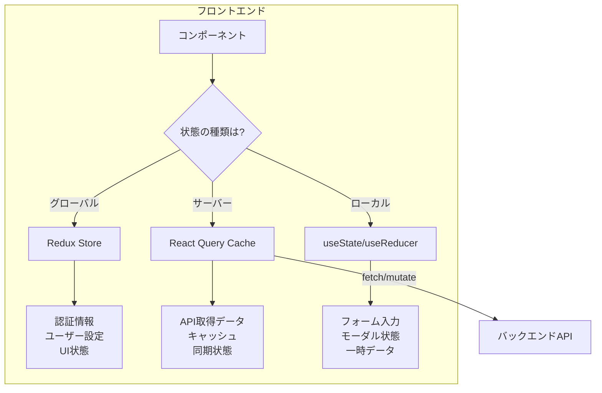
```mermaid
graph TB
    subgraph "フロントエンド"
        A[コンポーネント] --> B{状態の種類は?}
        B -->|グローバル| C[Redux Store]
        B -->|サーバー| D[React Query Cache]
        B -->|ローカル| E[useState/useReducer]

        C --> F[認証情報<br/>ユーザー設定<br/>UI状態]
        D --> G[API取得データ<br/>キャッシュ<br/>同期状態]
        E --> H[フォーム入力<br/>モーダル状態<br/>一時データ]
    end

    D -->|fetch/mutate| I[バックエンドAPI]
```

---

#### Redux Toolkit（グローバル状態）

**セットアップ**:

```typescript
// frontend/src/lib/store/index.ts
import { configureStore } from '@reduxjs/toolkit';
import authReducer from './slices/authSlice';
import uiReducer from './slices/uiSlice';

export const store = configureStore({
  reducer: {
    auth: authReducer,
    ui: uiReducer,
  },
  middleware: (getDefaultMiddleware) =>
    getDefaultMiddleware({
      serializableCheck: false, // Date等の非シリアライズ可能な値を許可
    }),
});

export type RootState = ReturnType<typeof store.getState>;
export type AppDispatch = typeof store.dispatch;
```

**Sliceの作成（authSlice）**:

```typescript
// frontend/src/lib/store/slices/authSlice.ts
import { createSlice, PayloadAction } from '@reduxjs/toolkit';

interface User {
  id: number;
  email: string;
  name: string;
  role: string;
}

interface AuthState {
  user: User | null;
  isAuthenticated: boolean;
  isLoading: boolean;
  error: string | null;
}

const initialState: AuthState = {
  user: null,
  isAuthenticated: false,
  isLoading: true, // 初期状態では認証確認中
  error: null,
};

const authSlice = createSlice({
  name: 'auth',
  initialState,
  reducers: {
    setUser: (state, action: PayloadAction<User>) => {
      state.user = action.payload;
      state.isAuthenticated = true;
      state.isLoading = false;
      state.error = null;
    },
    clearUser: (state) => {
      state.user = null;
      state.isAuthenticated = false;
      state.isLoading = false;
      state.error = null;
    },
    setLoading: (state, action: PayloadAction<boolean>) => {
      state.isLoading = action.payload;
    },
    setError: (state, action: PayloadAction<string>) => {
      state.error = action.payload;
      state.isLoading = false;
    },
  },
});

export const { setUser, clearUser, setLoading, setError } = authSlice.actions;
export default authSlice.reducer;
```

**カスタムフック（型安全）**:

```typescript
// frontend/src/lib/store/hooks.ts
import { TypedUseSelectorHook, useDispatch, useSelector } from 'react-redux';
import type { RootState, AppDispatch } from './index';

// 型付きフック（型推論が効く）
export const useAppDispatch = () => useDispatch<AppDispatch>();
export const useAppSelector: TypedUseSelectorHook<RootState> = useSelector;
```

**使用例**:

```typescript
// コンポーネント内で使用
'use client';

import { useAppSelector, useAppDispatch } from '@/lib/store/hooks';
import { clearUser } from '@/lib/store/slices/authSlice';

export default function UserProfile() {
  const { user, isAuthenticated } = useAppSelector(state => state.auth);
  const dispatch = useAppDispatch();

  const handleLogout = () => {
    dispatch(clearUser());
    // ログアウト処理...
  };

  if (!isAuthenticated) {
    return <div>ログインしてください</div>;
  }

  return (
    <div>
      <h2>{user?.name}さん</h2>
      <p>{user?.email}</p>
      <button onClick={handleLogout}>ログアウト</button>
    </div>
  );
}
```

---

#### React Query（サーバー状態）

**セットアップ**:

```typescript
// frontend/src/app/providers.tsx
'use client';

import { QueryClient, QueryClientProvider } from '@tanstack/react-query';
import { ReactQueryDevtools } from '@tanstack/react-query-devtools';
import { useState } from 'react';

export function Providers({ children }: { children: React.ReactNode }) {
  const [queryClient] = useState(() => new QueryClient({
    defaultOptions: {
      queries: {
        staleTime: 60 * 1000, // 1分間はデータを新鮮と見なす
        cacheTime: 5 * 60 * 1000, // 5分間キャッシュを保持
        retry: 1, // 失敗時に1回だけリトライ
        refetchOnWindowFocus: false, // ウィンドウフォーカス時に再取得しない
      },
    },
  }));

  return (
    <QueryClientProvider client={queryClient}>
      {children}
      <ReactQueryDevtools initialIsOpen={false} />
    </QueryClientProvider>
  );
}
```

**データ取得のカスタムフック**:

```typescript
// frontend/src/hooks/useProjects.ts
import { useQuery, useMutation, useQueryClient } from '@tanstack/react-query';
import { apiClient } from '@/lib/api-client';

interface Project {
  id: number;
  name: string;
  description: string;
  status: string;
  team_id: number;
}

// プロジェクト一覧取得
export function useProjects() {
  return useQuery({
    queryKey: ['projects'], // キャッシュキー
    queryFn: async () => {
      const response = await apiClient.get<Project[]>('/api/projects');
      return response.data;
    },
  });
}

// 単一プロジェクト取得
export function useProject(projectId: number) {
  return useQuery({
    queryKey: ['projects', projectId],
    queryFn: async () => {
      const response = await apiClient.get<Project>(`/api/projects/${projectId}`);
      return response.data;
    },
    enabled: !!projectId, // projectIdが存在する時のみ実行
  });
}

// プロジェクト作成
export function useCreateProject() {
  const queryClient = useQueryClient();

  return useMutation({
    mutationFn: async (newProject: Omit<Project, 'id'>) => {
      const response = await apiClient.post<Project>('/api/projects', newProject);
      return response.data;
    },
    onSuccess: () => {
      // 作成成功後、一覧を再取得
      queryClient.invalidateQueries({ queryKey: ['projects'] });
    },
  });
}

// プロジェクト更新
export function useUpdateProject() {
  const queryClient = useQueryClient();

  return useMutation({
    mutationFn: async ({ id, data }: { id: number; data: Partial<Project> }) => {
      const response = await apiClient.patch<Project>(`/api/projects/${id}`, data);
      return response.data;
    },
    onSuccess: (data) => {
      // 更新成功後、該当プロジェクトのキャッシュを更新
      queryClient.invalidateQueries({ queryKey: ['projects', data.id] });
      queryClient.invalidateQueries({ queryKey: ['projects'] });
    },
  });
}

// プロジェクト削除
export function useDeleteProject() {
  const queryClient = useQueryClient();

  return useMutation({
    mutationFn: async (projectId: number) => {
      await apiClient.delete(`/api/projects/${projectId}`);
    },
    onSuccess: () => {
      queryClient.invalidateQueries({ queryKey: ['projects'] });
    },
  });
}
```

**使用例**:

```typescript
// コンポーネントで使用
'use client';

import { useProjects, useCreateProject } from '@/hooks/useProjects';
import { useState } from 'react';

export default function ProjectsList() {
  const { data: projects, isLoading, error } = useProjects();
  const createProject = useCreateProject();
  const [newProjectName, setNewProjectName] = useState('');

  const handleCreate = async () => {
    try {
      await createProject.mutateAsync({
        name: newProjectName,
        description: '',
        status: 'active',
        team_id: 1,
      });
      setNewProjectName('');
    } catch (err) {
      console.error('プロジェクト作成エラー:', err);
    }
  };

  if (isLoading) return <div>読み込み中...</div>;
  if (error) return <div>エラー: {error.message}</div>;

  return (
    <div>
      <h1>プロジェクト一覧</h1>

      {/* 新規作成フォーム */}
      <div>
        <input
          type="text"
          value={newProjectName}
          onChange={(e) => setNewProjectName(e.target.value)}
          placeholder="プロジェクト名"
        />
        <button
          onClick={handleCreate}
          disabled={createProject.isPending}
        >
          {createProject.isPending ? '作成中...' : '作成'}
        </button>
      </div>

      {/* プロジェクト一覧 */}
      <ul>
        {projects?.map(project => (
          <li key={project.id}>{project.name}</li>
        ))}
      </ul>
    </div>
  );
}
```

**React Queryのライフサイクル**:

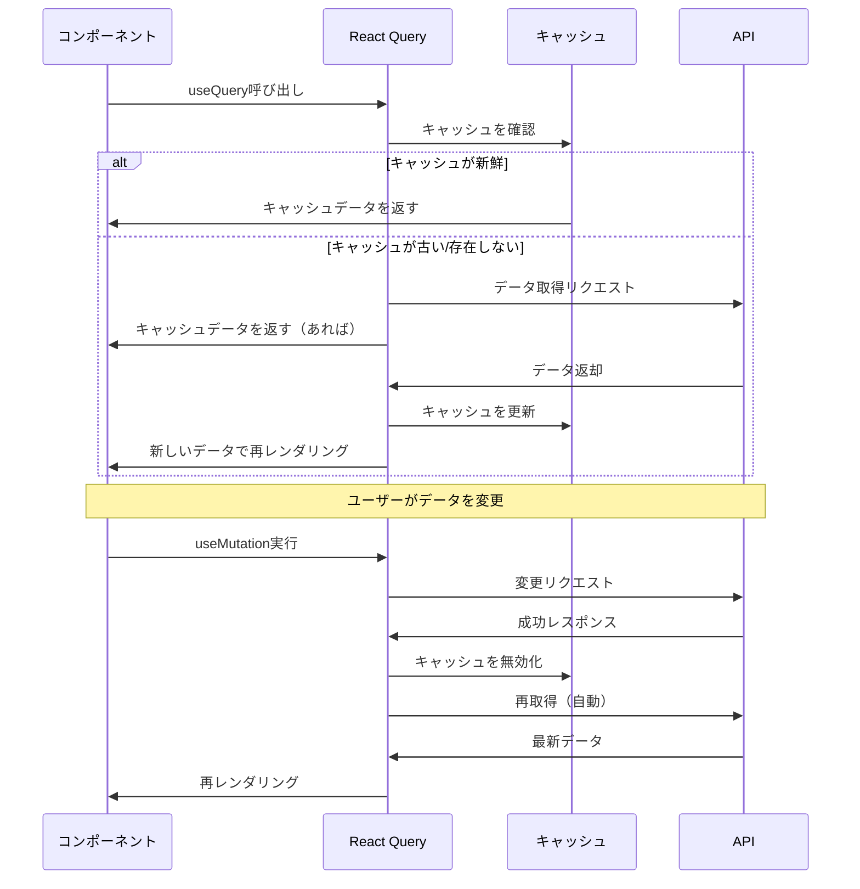
```mermaid
sequenceDiagram
    participant C as コンポーネント
    participant RQ as React Query
    participant Cache as キャッシュ
    participant API as API

    C->>RQ: useQuery呼び出し
    RQ->>Cache: キャッシュを確認

    alt キャッシュが新鮮
        Cache->>C: キャッシュデータを返す
    else キャッシュが古い/存在しない
        RQ->>API: データ取得リクエスト
        RQ->>C: キャッシュデータを返す（あれば）
        API->>RQ: データ返却
        RQ->>Cache: キャッシュを更新
        RQ->>C: 新しいデータで再レンダリング
    end

    Note over C,API: ユーザーがデータを変更
    C->>RQ: useMutation実行
    RQ->>API: 変更リクエスト
    API->>RQ: 成功レスポンス
    RQ->>Cache: キャッシュを無効化
    RQ->>API: 再取得（自動）
    API->>RQ: 最新データ
    RQ->>C: 再レンダリング
```

---

#### useState/useReducer（ローカル状態）

**useStateの使用例**:

```typescript
// シンプルなフォーム
'use client';

import { useState } from 'react';

export default function SimpleForm() {
  const [email, setEmail] = useState('');
  const [password, setPassword] = useState('');
  const [showPassword, setShowPassword] = useState(false);

  const handleSubmit = (e: React.FormEvent) => {
    e.preventDefault();
    console.log('Submit:', { email, password });
  };

  return (
    <form onSubmit={handleSubmit}>
      <input
        type="email"
        value={email}
        onChange={(e) => setEmail(e.target.value)}
        placeholder="メールアドレス"
      />
      <input
        type={showPassword ? 'text' : 'password'}
        value={password}
        onChange={(e) => setPassword(e.target.value)}
        placeholder="パスワード"
      />
      <button type="button" onClick={() => setShowPassword(!showPassword)}>
        {showPassword ? '隠す' : '表示'}
      </button>
      <button type="submit">ログイン</button>
    </form>
  );
}
```

**useReducerの使用例（複雑な状態管理）**:

```typescript
// 複雑なフォームやウィザード
'use client';

import { useReducer } from 'react';

type State = {
  step: number;
  formData: {
    name: string;
    email: string;
    team: string;
    role: string;
  };
  errors: Record<string, string>;
};

type Action =
  | { type: 'NEXT_STEP' }
  | { type: 'PREV_STEP' }
  | { type: 'UPDATE_FIELD'; field: string; value: string }
  | { type: 'SET_ERROR'; field: string; error: string }
  | { type: 'CLEAR_ERRORS' }
  | { type: 'RESET' };

const initialState: State = {
  step: 1,
  formData: {
    name: '',
    email: '',
    team: '',
    role: '',
  },
  errors: {},
};

function formReducer(state: State, action: Action): State {
  switch (action.type) {
    case 'NEXT_STEP':
      return { ...state, step: state.step + 1 };

    case 'PREV_STEP':
      return { ...state, step: Math.max(1, state.step - 1) };

    case 'UPDATE_FIELD':
      return {
        ...state,
        formData: {
          ...state.formData,
          [action.field]: action.value,
        },
      };

    case 'SET_ERROR':
      return {
        ...state,
        errors: {
          ...state.errors,
          [action.field]: action.error,
        },
      };

    case 'CLEAR_ERRORS':
      return { ...state, errors: {} };

    case 'RESET':
      return initialState;

    default:
      return state;
  }
}

export default function MultiStepForm() {
  const [state, dispatch] = useReducer(formReducer, initialState);

  const handleNext = () => {
    // バリデーション
    if (!state.formData.name) {
      dispatch({ type: 'SET_ERROR', field: 'name', error: '名前は必須です' });
      return;
    }
    dispatch({ type: 'CLEAR_ERRORS' });
    dispatch({ type: 'NEXT_STEP' });
  };

  return (
    <div>
      <h2>ステップ {state.step} / 3</h2>

      {state.step === 1 && (
        <div>
          <input
            type="text"
            value={state.formData.name}
            onChange={(e) => dispatch({
              type: 'UPDATE_FIELD',
              field: 'name',
              value: e.target.value
            })}
            placeholder="名前"
          />
          {state.errors.name && <p className="error">{state.errors.name}</p>}
        </div>
      )}

      {state.step === 2 && (
        <div>
          <input
            type="email"
            value={state.formData.email}
            onChange={(e) => dispatch({
              type: 'UPDATE_FIELD',
              field: 'email',
              value: e.target.value
            })}
            placeholder="メールアドレス"
          />
        </div>
      )}

      {state.step === 3 && (
        <div>
          <p>名前: {state.formData.name}</p>
          <p>メール: {state.formData.email}</p>
        </div>
      )}

      <div>
        {state.step > 1 && (
          <button onClick={() => dispatch({ type: 'PREV_STEP' })}>
            戻る
          </button>
        )}
        {state.step < 3 ? (
          <button onClick={handleNext}>次へ</button>
        ) : (
          <button onClick={() => console.log('Submit:', state.formData)}>
            送信
          </button>
        )}
      </div>
    </div>
  );
}
```

---

#### 状態管理の使い分けマトリックス

| 判断基準 | Redux Toolkit | React Query | useState/useReducer |
|---------|--------------|-------------|-------------------|
| **データの寿命** | アプリのライフサイクル全体 | サーバーとの同期中 | コンポーネントのマウント中のみ |
| **共有範囲** | アプリ全体 | 複数のコンポーネント | 単一コンポーネント |
| **データソース** | クライアント側 | サーバー側 | クライアント側 |
| **更新頻度** | 低〜中 | 高（自動同期） | 高（ユーザー操作） |
| **キャッシュ** | 不要 | 自動管理 | 不要 |
| **例** | ユーザー設定、テーマ | API取得データ | フォーム入力、UI状態 |

**具体例**:

```typescript
// ❌ 間違った使い方
// API取得データをReduxで管理（React Queryを使うべき）
const projectsSlice = createSlice({
  name: 'projects',
  initialState: { data: [], loading: false },
  reducers: {
    setProjects: (state, action) => {
      state.data = action.payload;
    }
  }
});

// ✅ 正しい使い方
// React Queryでサーバー状態を管理
export function useProjects() {
  return useQuery({
    queryKey: ['projects'],
    queryFn: fetchProjects,
  });
}
```

```typescript
// ❌ 間違った使い方
// モーダルの開閉状態をReduxで管理（useStateを使うべき）
const uiSlice = createSlice({
  name: 'ui',
  initialState: { modalOpen: false },
  reducers: {
    openModal: (state) => { state.modalOpen = true; },
    closeModal: (state) => { state.modalOpen = false; },
  }
});

// ✅ 正しい使い方
// コンポーネント内部の状態はuseState
function MyComponent() {
  const [modalOpen, setModalOpen] = useState(false);
  // ...
}
```

---

#### ベストプラクティス

1. **サーバー状態とクライアント状態を分離する**
   - サーバーから取得したデータ → React Query
   - ユーザー設定やUI状態 → Redux or useState

2. **Redux Toolkitでイミュータブル更新を簡単に**
   - Immerが組み込まれているので、ミュータブルな書き方でOK
   ```typescript
   state.user.name = action.payload; // これでOK（Immerが処理）
   ```

3. **React Queryのキャッシュキーを戦略的に設計**
   ```typescript
   ['projects']           // プロジェクト一覧
   ['projects', 123]      // ID=123のプロジェクト
   ['projects', 123, 'analytics']  // プロジェクト123の分析データ
   ```

4. **状態の正規化（Redux）**
   ```typescript
   // ❌ ネストした配列（更新が難しい）
   { teams: [{ id: 1, users: [...] }] }

   // ✅ 正規化（更新が簡単）
   {
     teams: { 1: { id: 1, userIds: [1, 2] } },
     users: { 1: {...}, 2: {...} }
   }
   ```

5. **楽観的更新（Optimistic Update）**
   ```typescript
   const updateProject = useMutation({
     mutationFn: updateProjectApi,
     onMutate: async (newData) => {
       // 楽観的にUIを更新
       await queryClient.cancelQueries({ queryKey: ['projects'] });
       const previousData = queryClient.getQueryData(['projects']);
       queryClient.setQueryData(['projects'], (old) => [...old, newData]);
       return { previousData };
     },
     onError: (err, newData, context) => {
       // エラー時にロールバック
       queryClient.setQueryData(['projects'], context.previousData);
     },
   });
   ```

---

### 13. 認証フロー（フロントエンド）

**学習目標**:
- フロントエンドでの認証処理の実装方法を理解する
- useAuthフックの設計と実装を習得する
- プライベートルートの保護方法を学ぶ

**前提知識**:
- React Hooks（useState、useEffect、useContext）
- JWT（JSON Web Token）の基本
- HTTPクッキーの仕組み

---

#### 認証フローの全体像

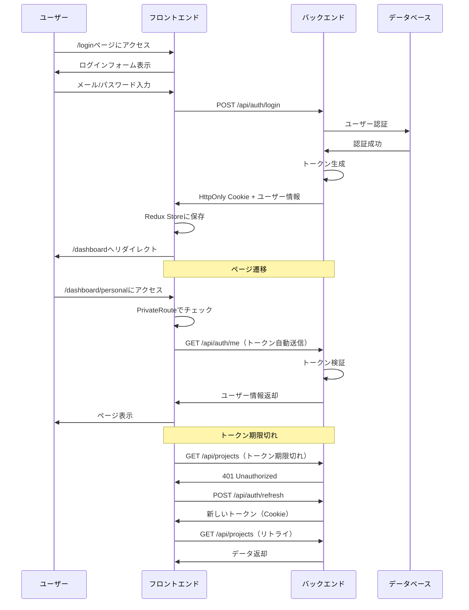
```mermaid
sequenceDiagram
    participant U as ユーザー
    participant F as フロントエンド
    participant B as バックエンド
    participant DB as データベース

    U->>F: /loginページにアクセス
    F->>U: ログインフォーム表示

    U->>F: メール/パスワード入力
    F->>B: POST /api/auth/login
    B->>DB: ユーザー認証
    DB->>B: 認証成功
    B->>B: トークン生成
    B->>F: HttpOnly Cookie + ユーザー情報
    F->>F: Redux Storeに保存
    F->>U: /dashboardへリダイレクト

    Note over F,B: ページ遷移
    U->>F: /dashboard/personalにアクセス
    F->>F: PrivateRouteでチェック
    F->>B: GET /api/auth/me（トークン自動送信）
    B->>B: トークン検証
    B->>F: ユーザー情報返却
    F->>U: ページ表示

    Note over F,B: トークン期限切れ
    F->>B: GET /api/projects（トークン期限切れ）
    B->>F: 401 Unauthorized
    F->>B: POST /api/auth/refresh
    B->>F: 新しいトークン（Cookie）
    F->>B: GET /api/projects（リトライ）
    B->>F: データ返却
```

---

#### useAuthフックの実装

**基本構造**:

```typescript
// frontend/src/hooks/useAuth.ts
'use client';

import { useEffect, useCallback } from 'react';
import { useAppSelector, useAppDispatch } from '@/lib/store/hooks';
import { setUser, clearUser, setLoading, setError } from '@/lib/store/slices/authSlice';
import { apiClient } from '@/lib/api-client';
import { useRouter } from 'next/navigation';

interface LoginCredentials {
  email: string;
  password: string;
}

interface User {
  id: number;
  email: string;
  name: string;
  role: string;
}

export function useAuth() {
  const dispatch = useAppDispatch();
  const router = useRouter();
  const { user, isAuthenticated, isLoading, error } = useAppSelector(state => state.auth);

  // 初回マウント時に認証状態を確認
  useEffect(() => {
    checkAuth();
  }, []);

  /**
   * 現在の認証状態を確認
   * トークンがCookieに保存されているか確認し、有効なら自動ログイン
   */
  const checkAuth = useCallback(async () => {
    try {
      dispatch(setLoading(true));

      // /api/auth/me エンドポイントで現在のユーザー情報を取得
      // HttpOnly Cookieのトークンが自動的に送信される
      const response = await apiClient.get<User>('/api/auth/me');

      dispatch(setUser(response.data));
    } catch (err: any) {
      // トークンが無効または期限切れの場合
      dispatch(clearUser());
    } finally {
      dispatch(setLoading(false));
    }
  }, [dispatch]);

  /**
   * ログイン処理
   */
  const login = useCallback(async (credentials: LoginCredentials) => {
    try {
      dispatch(setLoading(true));
      dispatch(setError(null));

      // ログインAPIを呼び出し
      const response = await apiClient.post<{ user: User }>('/api/auth/login', credentials);

      // レスポンスでトークンがHttpOnly Cookieとして設定される
      dispatch(setUser(response.data.user));

      // ダッシュボードへリダイレクト
      router.push('/dashboard/personal');

      return { success: true };
    } catch (err: any) {
      const errorMessage = err.response?.data?.detail || 'ログインに失敗しました';
      dispatch(setError(errorMessage));
      return { success: false, error: errorMessage };
    } finally {
      dispatch(setLoading(false));
    }
  }, [dispatch, router]);

  /**
   * ログアウト処理
   */
  const logout = useCallback(async () => {
    try {
      // サーバー側でCookieを削除
      await apiClient.post('/api/auth/logout');
    } catch (err) {
      console.error('Logout error:', err);
    } finally {
      // クライアント側の状態をクリア
      dispatch(clearUser());
      router.push('/login');
    }
  }, [dispatch, router]);

  /**
   * トークンリフレッシュ
   */
  const refreshToken = useCallback(async () => {
    try {
      await apiClient.post('/api/auth/refresh');
      // 新しいトークンがCookieに設定される
      return true;
    } catch (err) {
      // リフレッシュ失敗時はログアウト
      dispatch(clearUser());
      router.push('/login');
      return false;
    }
  }, [dispatch, router]);

  return {
    user,
    isAuthenticated,
    isLoading,
    error,
    login,
    logout,
    refreshToken,
    checkAuth,
  };
}
```

---

#### ログインページの実装

```typescript
// frontend/src/app/login/page.tsx
'use client';

import { useState, FormEvent } from 'react';
import { useAuth } from '@/hooks/useAuth';
import { useRouter } from 'next/navigation';

export default function LoginPage() {
  const [email, setEmail] = useState('');
  const [password, setPassword] = useState('');
  const [showPassword, setShowPassword] = useState(false);
  const { login, isLoading, error } = useAuth();
  const router = useRouter();

  const handleSubmit = async (e: FormEvent) => {
    e.preventDefault();

    const result = await login({ email, password });

    if (result.success) {
      // ログイン成功（useAuth内でリダイレクト済み）
      console.log('ログイン成功');
    } else {
      // エラーメッセージは error state に保存される
      console.error('ログイン失敗:', result.error);
    }
  };

  return (
    <div className="min-h-screen flex items-center justify-center bg-gray-50">
      <div className="max-w-md w-full space-y-8 p-8 bg-white rounded-lg shadow">
        <div>
          <h2 className="text-3xl font-bold text-center">Team Insight</h2>
          <p className="mt-2 text-center text-gray-600">
            アカウントにログイン
          </p>
        </div>

        <form className="mt-8 space-y-6" onSubmit={handleSubmit}>
          {error && (
            <div className="bg-red-50 border border-red-200 text-red-700 px-4 py-3 rounded">
              {error}
            </div>
          )}

          <div className="space-y-4">
            <div>
              <label htmlFor="email" className="block text-sm font-medium text-gray-700">
                メールアドレス
              </label>
              <input
                id="email"
                name="email"
                type="email"
                autoComplete="email"
                required
                value={email}
                onChange={(e) => setEmail(e.target.value)}
                className="mt-1 block w-full px-3 py-2 border border-gray-300 rounded-md shadow-sm focus:outline-none focus:ring-blue-500 focus:border-blue-500"
                placeholder="you@example.com"
              />
            </div>

            <div>
              <label htmlFor="password" className="block text-sm font-medium text-gray-700">
                パスワード
              </label>
              <div className="mt-1 relative">
                <input
                  id="password"
                  name="password"
                  type={showPassword ? 'text' : 'password'}
                  autoComplete="current-password"
                  required
                  value={password}
                  onChange={(e) => setPassword(e.target.value)}
                  className="block w-full px-3 py-2 border border-gray-300 rounded-md shadow-sm focus:outline-none focus:ring-blue-500 focus:border-blue-500"
                  placeholder="••••••••"
                />
                <button
                  type="button"
                  onClick={() => setShowPassword(!showPassword)}
                  className="absolute inset-y-0 right-0 pr-3 flex items-center text-sm text-gray-600 hover:text-gray-900"
                >
                  {showPassword ? '隠す' : '表示'}
                </button>
              </div>
            </div>
          </div>

          <div className="flex items-center justify-between">
            <div className="flex items-center">
              <input
                id="remember-me"
                name="remember-me"
                type="checkbox"
                className="h-4 w-4 text-blue-600 focus:ring-blue-500 border-gray-300 rounded"
              />
              <label htmlFor="remember-me" className="ml-2 block text-sm text-gray-900">
                ログイン状態を保持
              </label>
            </div>

            <div className="text-sm">
              <a href="/forgot-password" className="font-medium text-blue-600 hover:text-blue-500">
                パスワードを忘れた場合
              </a>
            </div>
          </div>

          <button
            type="submit"
            disabled={isLoading}
            className="w-full flex justify-center py-2 px-4 border border-transparent rounded-md shadow-sm text-sm font-medium text-white bg-blue-600 hover:bg-blue-700 focus:outline-none focus:ring-2 focus:ring-offset-2 focus:ring-blue-500 disabled:opacity-50 disabled:cursor-not-allowed"
          >
            {isLoading ? (
              <span className="flex items-center">
                <svg className="animate-spin -ml-1 mr-3 h-5 w-5 text-white" xmlns="http://www.w3.org/2000/svg" fill="none" viewBox="0 0 24 24">
                  <circle className="opacity-25" cx="12" cy="12" r="10" stroke="currentColor" strokeWidth="4"></circle>
                  <path className="opacity-75" fill="currentColor" d="M4 12a8 8 0 018-8V0C5.373 0 0 5.373 0 12h4zm2 5.291A7.962 7.962 0 014 12H0c0 3.042 1.135 5.824 3 7.938l3-2.647z"></path>
                </svg>
                ログイン中...
              </span>
            ) : (
              'ログイン'
            )}
          </button>

          <div className="text-center">
            <p className="text-sm text-gray-600">
              アカウントをお持ちでない場合{' '}
              <a href="/signup" className="font-medium text-blue-600 hover:text-blue-500">
                新規登録
              </a>
            </p>
          </div>
        </form>

        {/* Backlogログインボタン */}
        <div className="mt-6">
          <div className="relative">
            <div className="absolute inset-0 flex items-center">
              <div className="w-full border-t border-gray-300"></div>
            </div>
            <div className="relative flex justify-center text-sm">
              <span className="px-2 bg-white text-gray-500">または</span>
            </div>
          </div>

          <div className="mt-6">
            <a
              href="/api/auth/backlog/login"
              className="w-full flex justify-center py-2 px-4 border border-gray-300 rounded-md shadow-sm bg-white text-sm font-medium text-gray-700 hover:bg-gray-50"
            >
              
              Backlogでログイン
            </a>
          </div>
        </div>
      </div>
    </div>
  );
}
```

---

#### PrivateRouteコンポーネント（ルート保護）

```typescript
// frontend/src/components/PrivateRoute.tsx
'use client';

import { useAuth } from '@/hooks/useAuth';
import { useRouter } from 'next/navigation';
import { useEffect } from 'react';

interface PrivateRouteProps {
  children: React.ReactNode;
  requiredRole?: string[]; // 必要なロール（オプション）
}

export default function PrivateRoute({ children, requiredRole }: PrivateRouteProps) {
  const { isAuthenticated, isLoading, user } = useAuth();
  const router = useRouter();

  useEffect(() => {
    if (!isLoading && !isAuthenticated) {
      // 未認証の場合はログインページへリダイレクト
      router.push('/login');
    }
  }, [isAuthenticated, isLoading, router]);

  // 認証確認中はローディング表示
  if (isLoading) {
    return (
      <div className="flex items-center justify-center h-screen">
        <div className="text-center">
          <div className="animate-spin rounded-full h-32 w-32 border-b-2 border-gray-900 mx-auto"></div>
          <p className="mt-4 text-gray-600">認証を確認しています...</p>
        </div>
      </div>
    );
  }

  // 未認証の場合は何も表示しない（リダイレクト中）
  if (!isAuthenticated) {
    return null;
  }

  // ロールチェック（指定されている場合）
  if (requiredRole && user && !requiredRole.includes(user.role)) {
    return (
      <div className="flex items-center justify-center h-screen">
        <div className="text-center">
          <h2 className="text-2xl font-bold text-red-600 mb-4">アクセス拒否</h2>
          <p className="text-gray-600">このページにアクセスする権限がありません。</p>
          <button
            onClick={() => router.push('/dashboard/personal')}
            className="mt-4 px-4 py-2 bg-blue-600 text-white rounded hover:bg-blue-700"
          >
            ダッシュボードに戻る
          </button>
        </div>
      </div>
    );
  }

  // 認証済みの場合はページを表示
  return <>{children}</>;
}
```

**使用例（レイアウトでの適用）**:

```typescript
// frontend/src/app/dashboard/layout.tsx
import PrivateRoute from '@/components/PrivateRoute';
import Sidebar from '@/components/Sidebar';

export default function DashboardLayout({
  children,
}: {
  children: React.ReactNode;
}) {
  return (
    <PrivateRoute>
      <div className="flex h-screen">
        <Sidebar />
        <main className="flex-1 overflow-auto p-8">
          {children}
        </main>
      </div>
    </PrivateRoute>
  );
}
```

**管理者専用ページの保護**:

```typescript
// frontend/src/app/admin/layout.tsx
import PrivateRoute from '@/components/PrivateRoute';

export default function AdminLayout({
  children,
}: {
  children: React.ReactNode;
}) {
  return (
    <PrivateRoute requiredRole={['admin', 'manager']}>
      <div>
        <h1>管理画面</h1>
        {children}
      </div>
    </PrivateRoute>
  );
}
```

---

#### トークンリフレッシュの自動化

```typescript
// frontend/src/lib/api-client.ts
import axios from 'axios';
import { store } from './store';
import { clearUser } from './store/slices/authSlice';

export const apiClient = axios.create({
  baseURL: process.env.NEXT_PUBLIC_API_URL || 'http://localhost:8000',
  withCredentials: true, // Cookieを自動送信
  headers: {
    'Content-Type': 'application/json',
  },
});

// リクエストインターセプター
apiClient.interceptors.request.use(
  (config) => {
    // リクエストログ（開発環境のみ）
    if (process.env.NODE_ENV === 'development') {
      console.log(`[API Request] ${config.method?.toUpperCase()} ${config.url}`);
    }
    return config;
  },
  (error) => {
    return Promise.reject(error);
  }
);

// レスポンスインターセプター
let isRefreshing = false;
let failedQueue: any[] = [];

const processQueue = (error: any, token: string | null = null) => {
  failedQueue.forEach((prom) => {
    if (error) {
      prom.reject(error);
    } else {
      prom.resolve(token);
    }
  });

  failedQueue = [];
};

apiClient.interceptors.response.use(
  (response) => {
    // 成功時はそのまま返す
    return response;
  },
  async (error) => {
    const originalRequest = error.config;

    // 401エラーかつ、リトライしていない場合
    if (error.response?.status === 401 && !originalRequest._retry) {
      // ログイン・リフレッシュエンドポイントは除外
      if (
        originalRequest.url === '/api/auth/login' ||
        originalRequest.url === '/api/auth/refresh'
      ) {
        return Promise.reject(error);
      }

      if (isRefreshing) {
        // 既にリフレッシュ中の場合はキューに追加
        return new Promise((resolve, reject) => {
          failedQueue.push({ resolve, reject });
        })
          .then(() => {
            return apiClient(originalRequest);
          })
          .catch((err) => {
            return Promise.reject(err);
          });
      }

      originalRequest._retry = true;
      isRefreshing = true;

      try {
        // トークンリフレッシュ
        await apiClient.post('/api/auth/refresh');

        // キュー内のリクエストを処理
        processQueue(null, 'refreshed');

        // 元のリクエストをリトライ
        return apiClient(originalRequest);
      } catch (refreshError) {
        // リフレッシュ失敗時はログアウト
        processQueue(refreshError, null);
        store.dispatch(clearUser());

        // ログインページへリダイレクト
        if (typeof window !== 'undefined') {
          window.location.href = '/login';
        }

        return Promise.reject(refreshError);
      } finally {
        isRefreshing = false;
      }
    }

    // その他のエラーはそのまま返す
    return Promise.reject(error);
  }
);
```

**トークンリフレッシュフロー**:

```mermaid
sequenceDiagram
    participant C as コンポーネント
    participant API as API Client
    participant B as バックエンド

    C->>API: GET /api/projects
    API->>B: リクエスト（トークン期限切れ）
    B->>API: 401 Unauthorized

    alt 他のリクエストがリフレッシュ中
        API->>API: キューに追加
        Note over API: リフレッシュ完了を待つ
    else 最初のリクエスト
        API->>API: isRefreshing = true
        API->>B: POST /api/auth/refresh
        B->>B: リフレッシュトークン検証
        B->>API: 新しいアクセストークン（Cookie）
        API->>API: キューの全リクエストを処理
        API->>B: GET /api/projects（リトライ）
        B->>API: データ返却
        API->>C: データ返却
    end

    alt リフレッシュ失敗
        B->>API: 401 Unauthorized
        API->>API: ログアウト処理
        API->>C: ログインページへリダイレクト
    end
```

---

#### 認証状態の永続化

```typescript
// frontend/src/app/layout.tsx
'use client';

import { useEffect } from 'react';
import { Provider } from 'react-redux';
import { store } from '@/lib/store';
import { Providers } from './providers';

export default function RootLayout({
  children,
}: {
  children: React.ReactNode;
}) {
  return (
    <html lang="ja">
      <body>
        <Provider store={store}>
          <Providers>
            <AuthInitializer />
            {children}
          </Providers>
        </Provider>
      </body>
    </html>
  );
}

// 認証状態の初期化コンポーネント
function AuthInitializer() {
  const { checkAuth } = useAuth();

  useEffect(() => {
    // アプリ起動時に認証状態を確認
    checkAuth();
  }, [checkAuth]);

  return null;
}
```

---

#### ベストプラクティス

1. **HttpOnly Cookieでトークンを保護**
   - JavaScriptからアクセス不可 → XSS攻撃を防ぐ
   - Secure属性で HTTPS のみ送信
   - SameSite属性でCSRF攻撃を防ぐ

2. **トークンリフレッシュの自動化**
   - ユーザーは意識せずにセッション継続
   - リトライロジックでシームレスな体験

3. **楽観的UI更新**
   - ログイン成功前にリダイレクト（体感速度向上）
   - エラー時のみロールバック

4. **認証状態の一元管理**
   - Redux Storeで一元管理
   - useAuthフックで簡単にアクセス

5. **セキュリティのベストプラクティス**
   - パスワードの表示/非表示切り替え
   - ログイン履歴の記録
   - 異常なアクティビティの検知

---

#### よくある間違い

1. **トークンをlocalStorageに保存**
   - ❌ 誤り: `localStorage.setItem('token', ...)`
   - ✅ 正解: HttpOnly Cookieを使用

2. **認証状態を確認せずにリダイレクト**
   - ❌ 誤り: ページ読み込み時にちらつき
   - ✅ 正解: PrivateRouteでローディング表示

3. **トークンリフレッシュを手動実行**
   - ❌ 誤り: ユーザーに「更新してください」と表示
   - ✅ 正解: インターセプターで自動リフレッシュ

---

### 14. APIクライアント

**学習目標**:
- Axiosインターセプターの仕組みと活用方法を理解する
- エラーハンドリング戦略を習得する
- リトライロジックの実装方法を学ぶ

**前提知識**:
- HTTPプロトコルの基本（GET、POST、PUT、DELETEなど）
- JavaScriptのPromiseとasync/await
- HTTPステータスコード（200、401、500など）

---

#### api-client.tsの全体構造

```typescript
// frontend/src/lib/api-client.ts
import axios, { AxiosError, AxiosInstance, InternalAxiosRequestConfig, AxiosResponse } from 'axios';
import { store } from './store';
import { clearUser } from './store/slices/authSlice';

/**
 * APIクライアントのインスタンス作成
 */
export const apiClient: AxiosInstance = axios.create({
  baseURL: process.env.NEXT_PUBLIC_API_URL || 'http://localhost:8000',
  timeout: 30000, // 30秒でタイムアウト
  withCredentials: true, // Cookieを自動送信
  headers: {
    'Content-Type': 'application/json',
  },
});

/**
 * リトライ設定
 */
const MAX_RETRIES = 3;
const RETRY_DELAY = 1000; // 1秒

/**
 * 指定時間だけ待つユーティリティ関数
 */
const delay = (ms: number) => new Promise(resolve => setTimeout(resolve, ms));

/**
 * リトライ可能なエラーかどうかを判定
 */
const isRetryableError = (error: AxiosError): boolean => {
  if (!error.response) {
    // ネットワークエラー（サーバーに到達できない）
    return true;
  }

  const status = error.response.status;
  // 5xx系のサーバーエラー、または429 (Too Many Requests)
  return status >= 500 || status === 429;
};
```

---

#### リクエストインターセプター

```typescript
/**
 * リクエストインターセプター
 * すべてのリクエストの前に実行される
 */
apiClient.interceptors.request.use(
  (config: InternalAxiosRequestConfig) => {
    // リクエストログ（開発環境のみ）
    if (process.env.NODE_ENV === 'development') {
      console.log(`[API Request] ${config.method?.toUpperCase()} ${config.url}`, {
        params: config.params,
        data: config.data,
      });
    }

    // カスタムヘッダーの追加（必要に応じて）
    // 例: CSRF トークン
    // const csrfToken = getCsrfToken();
    // if (csrfToken) {
    //   config.headers['X-CSRF-Token'] = csrfToken;
    // }

    // リクエストタイムスタンプ（レスポンス時間の計測用）
    config.metadata = { startTime: new Date() };

    return config;
  },
  (error: AxiosError) => {
    console.error('[API Request Error]', error);
    return Promise.reject(error);
  }
);
```

---

#### レスポンスインターセプター（エラーハンドリング + トークンリフレッシュ）

```typescript
/**
 * トークンリフレッシュの状態管理
 */
let isRefreshing = false;
let failedQueue: Array<{
  resolve: (value?: any) => void;
  reject: (reason?: any) => void;
}> = [];

/**
 * キューに溜まったリクエストを処理
 */
const processQueue = (error: any, token: string | null = null) => {
  failedQueue.forEach((prom) => {
    if (error) {
      prom.reject(error);
    } else {
      prom.resolve(token);
    }
  });

  failedQueue = [];
};

/**
 * レスポンスインターセプター
 * すべてのレスポンスの後に実行される
 */
apiClient.interceptors.response.use(
  (response: AxiosResponse) => {
    // レスポンスログ（開発環境のみ）
    if (process.env.NODE_ENV === 'development') {
      const config = response.config as any;
      const duration = new Date().getTime() - config.metadata?.startTime?.getTime();
      console.log(
        `[API Response] ${config.method?.toUpperCase()} ${config.url} - ${response.status} (${duration}ms)`,
        response.data
      );
    }

    return response;
  },
  async (error: AxiosError) => {
    const originalRequest = error.config as any;

    // リクエスト設定がない場合はエラーを返す
    if (!originalRequest) {
      return Promise.reject(error);
    }

    // レスポンスログ（開発環境のみ）
    if (process.env.NODE_ENV === 'development') {
      console.error(
        `[API Error] ${originalRequest.method?.toUpperCase()} ${originalRequest.url}`,
        {
          status: error.response?.status,
          data: error.response?.data,
        }
      );
    }

    // 401 Unauthorized - トークンリフレッシュを試みる
    if (error.response?.status === 401 && !originalRequest._retry) {
      // ログイン・リフレッシュエンドポイントは除外
      if (
        originalRequest.url === '/api/auth/login' ||
        originalRequest.url === '/api/auth/refresh' ||
        originalRequest.url === '/api/auth/logout'
      ) {
        return Promise.reject(error);
      }

      if (isRefreshing) {
        // 既にリフレッシュ中の場合はキューに追加
        return new Promise((resolve, reject) => {
          failedQueue.push({ resolve, reject });
        })
          .then(() => {
            return apiClient(originalRequest);
          })
          .catch((err) => {
            return Promise.reject(err);
          });
      }

      originalRequest._retry = true;
      isRefreshing = true;

      try {
        // トークンリフレッシュ
        await apiClient.post('/api/auth/refresh');

        // キュー内のリクエストを処理
        processQueue(null, 'refreshed');

        // 元のリクエストをリトライ
        return apiClient(originalRequest);
      } catch (refreshError) {
        // リフレッシュ失敗時はログアウト
        processQueue(refreshError, null);
        store.dispatch(clearUser());

        // ログインページへリダイレクト
        if (typeof window !== 'undefined') {
          window.location.href = '/login?redirect=' + window.location.pathname;
        }

        return Promise.reject(refreshError);
      } finally {
        isRefreshing = false;
      }
    }

    // リトライロジック
    if (isRetryableError(error)) {
      const retryCount = originalRequest._retryCount || 0;

      if (retryCount < MAX_RETRIES) {
        originalRequest._retryCount = retryCount + 1;

        // エクスポネンシャルバックオフ（指数関数的に待機時間を増やす）
        const delayTime = RETRY_DELAY * Math.pow(2, retryCount);

        console.log(
          `[API Retry] ${originalRequest.method?.toUpperCase()} ${
            originalRequest.url
          } - Attempt ${retryCount + 1}/${MAX_RETRIES} (waiting ${delayTime}ms)`
        );

        await delay(delayTime);

        return apiClient(originalRequest);
      } else {
        console.error(
          `[API Max Retries] ${originalRequest.method?.toUpperCase()} ${
            originalRequest.url
          } - Exceeded max retries`
        );
      }
    }

    // エラーハンドリング
    return Promise.reject(handleApiError(error));
  }
);
```

---

#### エラーハンドリング戦略

```typescript
/**
 * APIエラーの型定義
 */
export interface ApiError {
  message: string;
  status?: number;
  code?: string;
  details?: any;
}

/**
 * APIエラーを統一的に処理
 */
function handleApiError(error: AxiosError): ApiError {
  if (error.response) {
    // サーバーからのエラーレスポンス
    const status = error.response.status;
    const data = error.response.data as any;

    switch (status) {
      case 400:
        return {
          message: data.detail || 'リクエストが不正です',
          status,
          code: 'BAD_REQUEST',
          details: data,
        };

      case 401:
        return {
          message: '認証が必要です',
          status,
          code: 'UNAUTHORIZED',
        };

      case 403:
        return {
          message: 'このリソースにアクセスする権限がありません',
          status,
          code: 'FORBIDDEN',
        };

      case 404:
        return {
          message: 'リソースが見つかりません',
          status,
          code: 'NOT_FOUND',
        };

      case 409:
        return {
          message: data.detail || 'データの競合が発生しました',
          status,
          code: 'CONFLICT',
          details: data,
        };

      case 422:
        // バリデーションエラー
        return {
          message: 'データの検証に失敗しました',
          status,
          code: 'VALIDATION_ERROR',
          details: data.detail, // FastAPIのバリデーションエラー詳細
        };

      case 429:
        return {
          message: 'リクエストが多すぎます。しばらく待ってから再試行してください',
          status,
          code: 'TOO_MANY_REQUESTS',
        };

      case 500:
        return {
          message: 'サーバーエラーが発生しました',
          status,
          code: 'INTERNAL_SERVER_ERROR',
        };

      case 503:
        return {
          message: 'サービスが一時的に利用できません',
          status,
          code: 'SERVICE_UNAVAILABLE',
        };

      default:
        return {
          message: data.detail || 'エラーが発生しました',
          status,
          code: 'UNKNOWN_ERROR',
          details: data,
        };
    }
  } else if (error.request) {
    // リクエストは送信されたがレスポンスがない
    return {
      message: 'サーバーに接続できません。ネットワークを確認してください',
      code: 'NETWORK_ERROR',
    };
  } else {
    // リクエスト設定エラー
    return {
      message: error.message || '予期しないエラーが発生しました',
      code: 'REQUEST_ERROR',
    };
  }
}
```

---

#### 便利なヘルパー関数

```typescript
/**
 * GETリクエストのヘルパー
 */
export async function get<T>(url: string, params?: any): Promise<T> {
  const response = await apiClient.get<T>(url, { params });
  return response.data;
}

/**
 * POSTリクエストのヘルパー
 */
export async function post<T>(url: string, data?: any): Promise<T> {
  const response = await apiClient.post<T>(url, data);
  return response.data;
}

/**
 * PUTリクエストのヘルパー
 */
export async function put<T>(url: string, data?: any): Promise<T> {
  const response = await apiClient.put<T>(url, data);
  return response.data;
}

/**
 * PATCHリクエストのヘルパー
 */
export async function patch<T>(url: string, data?: any): Promise<T> {
  const response = await apiClient.patch<T>(url, data);
  return response.data;
}

/**
 * DELETEリクエストのヘルパー
 */
export async function del<T>(url: string): Promise<T> {
  const response = await apiClient.delete<T>(url);
  return response.data;
}

/**
 * ファイルアップロードのヘルパー
 */
export async function uploadFile<T>(
  url: string,
  file: File,
  onProgress?: (progress: number) => void
): Promise<T> {
  const formData = new FormData();
  formData.append('file', file);

  const response = await apiClient.post<T>(url, formData, {
    headers: {
      'Content-Type': 'multipart/form-data',
    },
    onUploadProgress: (progressEvent) => {
      if (onProgress && progressEvent.total) {
        const percentCompleted = Math.round(
          (progressEvent.loaded * 100) / progressEvent.total
        );
        onProgress(percentCompleted);
      }
    },
  });

  return response.data;
}
```

---

#### 使用例

```typescript
// hooks/useProjects.ts
import { get, post, patch, del } from '@/lib/api-client';
import { useQuery, useMutation, useQueryClient } from '@tanstack/react-query';

interface Project {
  id: number;
  name: string;
  description: string;
}

export function useProjects() {
  return useQuery({
    queryKey: ['projects'],
    queryFn: () => get<Project[]>('/api/projects'),
  });
}

export function useCreateProject() {
  const queryClient = useQueryClient();

  return useMutation({
    mutationFn: (newProject: Omit<Project, 'id'>) =>
      post<Project>('/api/projects', newProject),
    onSuccess: () => {
      queryClient.invalidateQueries({ queryKey: ['projects'] });
    },
    onError: (error: any) => {
      // エラーハンドリング
      if (error.code === 'VALIDATION_ERROR') {
        console.error('バリデーションエラー:', error.details);
      } else {
        console.error('プロジェクト作成エラー:', error.message);
      }
    },
  });
}
```

---

#### リトライロジックのフロー

```mermaid
graph TD
    A[APIリクエスト] --> B{レスポンス受信?}
    B -->|Yes| C{ステータスコードは?}
    B -->|No| D[ネットワークエラー]

    C -->|200-299| E[成功]
    C -->|401| F{ログイン/リフレッシュ?}
    C -->|5xx, 429| G{リトライ回数 < MAX?}
    C -->|その他| H[エラー返却]

    F -->|Yes| H
    F -->|No| I{既にリフレッシュ中?}

    I -->|Yes| J[キューに追加]
    I -->|No| K[トークンリフレッシュ]

    K -->|成功| L[元のリクエストをリトライ]
    K -->|失敗| M[ログアウト]

    J --> N[リフレッシュ完了を待つ]
    N --> L

    G -->|Yes| O[待機時間を計算]
    G -->|No| P[最大リトライ数超過]

    O --> Q[エクスポネンシャルバックオフ]
    Q --> R[リトライ実行]
    R --> B

    D --> G
    P --> H
```

---

#### ベストプラクティス

1. **エラーレスポンスの統一**
   - バックエンドと統一されたエラーフォーマット
   - フロントエンドで一元的にハンドリング

2. **リトライ戦略**
   - エクスポネンシャルバックオフで負荷を分散
   - リトライ可能なエラーを適切に判定

3. **トークンリフレッシュの並行制御**
   - 同時に複数のリクエストがリフレッシュしないようにキューで管理
   - ユーザー体験を損なわない

4. **タイムアウト設定**
   - 長時間レスポンスを待たない
   - ユーザーにフィードバックを提供

5. **開発環境でのデバッグ**
   - リクエスト/レスポンスのログ出力
   - React Query Devtoolsとの連携

---

#### よくある間違い

1. **すべてのエラーでリトライ**
   - ❌ 誤り: 400番台のエラーでもリトライ
   - ✅ 正解: 5xx系とネットワークエラーのみリトライ

2. **トークンリフレッシュの重複実行**
   - ❌ 誤り: 複数のリクエストが同時にリフレッシュ
   - ✅ 正解: キューで管理し、1つのリクエストのみ実行

3. **エラーメッセージをそのまま表示**
   - ❌ 誤り: 技術的なエラーメッセージをユーザーに表示
   - ✅ 正解: ユーザーフレンドリーなメッセージに変換

---

### 15. カスタムフックの実装

**学習目標**:
- カスタムフックの設計原則を理解する
- ロジックの再利用とコンポーネントの簡素化を習得する
- パフォーマンス最適化手法を学ぶ

**前提知識**:
- React Hooksの基本（useState、useEffect、useCallback、useMemo）
- TypeScriptの型定義
- クロージャとスコープの理解

---

#### カスタムフックとは

カスタムフックは、ロジックを再利用可能な関数として抽出するReactの仕組みです。

**利点**:
- コンポーネントの簡素化
- ロジックの再利用
- テストの容易化
- 関心の分離

**命名規則**:
- 必ず `use` で始める（例: `useAuth`, `usePermissions`）
- 動詞 + 名詞の形式（例: `useFetchProjects`, `useToggleTheme`）

---

#### usePermissions フック（権限チェック）

**完全実装**:

```typescript
// frontend/src/hooks/usePermissions.ts
import { useMemo } from 'react';
import { useAppSelector } from '@/store/hooks';
import { selectCurrentUser } from '@/store/slices/authSlice';
import { RoleType, PermissionCheck } from '@/types/rbac';

/**
 * 権限チェック用カスタムフック
 *
 * ユーザーのロールと権限を検証し、機能へのアクセス制御を行います。
 *
 * @returns {PermissionCheck} 権限チェック関数群
 *
 * @example
 * ```tsx
 * function AdminPanel() {
 *   const permissions = usePermissions();
 *
 *   if (!permissions.isAdmin()) {
 *     return <AccessDenied />;
 *   }
 *
 *   return <AdminDashboard />;
 * }
 * ```
 */
export const usePermissions = (): PermissionCheck => {
  const currentUser = useAppSelector(selectCurrentUser);

  return useMemo(() => {
    // ユーザーが存在しない場合のデフォルト
    if (!currentUser) {
      return {
        hasRole: () => false,
        hasPermission: () => false,
        canAccessProject: () => false,
        canManageProject: () => false,
        isAdmin: () => false,
        isProjectLeader: () => false,
      };
    }

    const permissions: PermissionCheck = {
      /**
       * 指定されたロールを持っているかチェック
       *
       * @param {RoleType} role - チェックするロール
       * @param {number} [projectId] - プロジェクトID（プロジェクトスコープの場合）
       */
      hasRole: (role: RoleType, projectId?: number) => {
        if (!currentUser.user_roles) return false;

        // 管理者は全ての権限を持つ
        const hasAdminRole = currentUser.user_roles.some(
          userRole => userRole.role.name === RoleType.ADMIN && !userRole.project_id
        );
        if (hasAdminRole) return true;

        // プロジェクト指定がある場合
        if (projectId !== undefined) {
          return currentUser.user_roles.some(
            userRole =>
              userRole.project_id === projectId &&
              userRole.role.name === role
          );
        }

        // グローバルロールのチェック
        return currentUser.user_roles.some(
          userRole =>
            !userRole.project_id &&
            userRole.role.name === role
        );
      },

      /**
       * プロジェクトへのアクセス権限があるかチェック
       */
      canAccessProject: (projectId: number) => {
        if (!currentUser.user_roles) return false;

        // 管理者は全プロジェクトにアクセス可能
        const hasAdminRole = currentUser.user_roles.some(
          userRole => userRole.role.name === RoleType.ADMIN && !userRole.project_id
        );
        if (hasAdminRole) return true;

        // プロジェクトメンバーかチェック
        return currentUser.user_roles.some(
          userRole => userRole.project_id === projectId
        );
      },

      /**
       * プロジェクトの管理権限があるかチェック
       */
      canManageProject: (projectId: number) => {
        if (!currentUser.user_roles) return false;

        const hasAdminRole = currentUser.user_roles.some(
          userRole => userRole.role.name === RoleType.ADMIN && !userRole.project_id
        );
        if (hasAdminRole) return true;

        // プロジェクトリーダー権限をチェック
        return permissions.hasRole(RoleType.PROJECT_LEADER, projectId);
      },

      /**
       * 管理者かどうかチェック
       */
      isAdmin: () => {
        if (!currentUser.user_roles) return false;
        return currentUser.user_roles.some(
          userRole => userRole.role.name === RoleType.ADMIN && !userRole.project_id
        );
      },

      /**
       * プロジェクトリーダーかどうかチェック
       */
      isProjectLeader: () => {
        if (!currentUser.user_roles) return false;
        return currentUser.user_roles.some(
          userRole => userRole.role.name === RoleType.PROJECT_LEADER && !userRole.project_id
        );
      },

      hasPermission: (permission: string, projectId?: number) => {
        // 実装省略（同様のパターン）
        return true;
      }
    };

    return permissions;
  }, [currentUser]); // currentUserが変わった時のみ再計算
};
```

**型定義**:

```typescript
// frontend/src/types/rbac.ts
export enum RoleType {
  ADMIN = 'admin',
  PROJECT_LEADER = 'project_leader',
  MEMBER = 'member',
}

export interface PermissionCheck {
  hasRole: (role: RoleType, projectId?: number) => boolean;
  hasPermission: (permission: string, projectId?: number) => boolean;
  canAccessProject: (projectId: number) => boolean;
  canManageProject: (projectId: number) => boolean;
  isAdmin: () => boolean;
  isProjectLeader: () => boolean;
}
```

**使用例**:

```typescript
// コンポーネント内で使用
'use client';

import { usePermissions } from '@/hooks/usePermissions';

export default function ProjectSettings({ projectId }: { projectId: number }) {
  const permissions = usePermissions();

  // プロジェクト管理権限のチェック
  const canManage = permissions.canManageProject(projectId);

  if (!canManage) {
    return <div>このプロジェクトを編集する権限がありません</div>;
  }

  return (
    <div>
      <h2>プロジェクト設定</h2>
      <button onClick={handleEdit}>編集</button>
      <button onClick={handleDelete}>削除</button>
    </div>
  );
}
```

---

#### usePagination フック（ページネーション）

```typescript
// frontend/src/hooks/usePagination.ts
import { useState, useCallback, useMemo } from 'react';

interface PaginationOptions {
  initialPage?: number;
  initialPageSize?: number;
  totalItems: number;
}

interface PaginationReturn {
  currentPage: number;
  pageSize: number;
  totalPages: number;
  startIndex: number;
  endIndex: number;
  goToPage: (page: number) => void;
  nextPage: () => void;
  previousPage: () => void;
  setPageSize: (size: number) => void;
  canGoNext: boolean;
  canGoPrevious: boolean;
}

/**
 * ページネーション用カスタムフック
 */
export const usePagination = ({
  initialPage = 1,
  initialPageSize = 10,
  totalItems,
}: PaginationOptions): PaginationReturn => {
  const [currentPage, setCurrentPage] = useState(initialPage);
  const [pageSize, setPageSize] = useState(initialPageSize);

  // 総ページ数を計算
  const totalPages = useMemo(() => {
    return Math.ceil(totalItems / pageSize);
  }, [totalItems, pageSize]);

  // 表示範囲のインデックスを計算
  const startIndex = useMemo(() => {
    return (currentPage - 1) * pageSize;
  }, [currentPage, pageSize]);

  const endIndex = useMemo(() => {
    return Math.min(startIndex + pageSize, totalItems);
  }, [startIndex, pageSize, totalItems]);

  // ページ移動関数
  const goToPage = useCallback((page: number) => {
    const validPage = Math.max(1, Math.min(page, totalPages));
    setCurrentPage(validPage);
  }, [totalPages]);

  const nextPage = useCallback(() => {
    goToPage(currentPage + 1);
  }, [currentPage, goToPage]);

  const previousPage = useCallback(() => {
    goToPage(currentPage - 1);
  }, [currentPage, goToPage]);

  // ページサイズ変更時は最初のページに戻る
  const handleSetPageSize = useCallback((size: number) => {
    setPageSize(size);
    setCurrentPage(1);
  }, []);

  return {
    currentPage,
    pageSize,
    totalPages,
    startIndex,
    endIndex,
    goToPage,
    nextPage,
    previousPage,
    setPageSize: handleSetPageSize,
    canGoNext: currentPage < totalPages,
    canGoPrevious: currentPage > 1,
  };
};
```

**使用例**:

```typescript
'use client';

import { usePagination } from '@/hooks/usePagination';

export default function UserList({ users }: { users: User[] }) {
  const pagination = usePagination({
    initialPage: 1,
    initialPageSize: 20,
    totalItems: users.length,
  });

  // 現在のページに表示するデータを取得
  const displayedUsers = users.slice(
    pagination.startIndex,
    pagination.endIndex
  );

  return (
    <div>
      <ul>
        {displayedUsers.map(user => (
          <li key={user.id}>{user.name}</li>
        ))}
      </ul>

      {/* ページネーションコントロール */}
      <div className="flex items-center gap-2">
        <button
          onClick={pagination.previousPage}
          disabled={!pagination.canGoPrevious}
        >
          前へ
        </button>

        <span>
          {pagination.currentPage} / {pagination.totalPages}
        </span>

        <button
          onClick={pagination.nextPage}
          disabled={!pagination.canGoNext}
        >
          次へ
        </button>

        <select
          value={pagination.pageSize}
          onChange={(e) => pagination.setPageSize(Number(e.target.value))}
        >
          <option value="10">10件</option>
          <option value="20">20件</option>
          <option value="50">50件</option>
        </select>
      </div>
    </div>
  );
}
```

---

#### useDebounce フック（入力遅延）

```typescript
// frontend/src/hooks/useDebounce.ts
import { useState, useEffect } from 'react';

/**
 * 値をデバウンスするカスタムフック
 *
 * 頻繁に変更される値（検索入力など）を遅延させて、
 * API呼び出しの回数を減らすために使用します。
 *
 * @param {T} value - デバウンスする値
 * @param {number} delay - 遅延時間（ミリ秒）
 * @returns {T} デバウンスされた値
 *
 * @example
 * ```tsx
 * const [searchTerm, setSearchTerm] = useState('');
 * const debouncedSearchTerm = useDebounce(searchTerm, 500);
 *
 * useEffect(() => {
 *   // debouncedSearchTermが変わった時のみAPI呼び出し
 *   if (debouncedSearchTerm) {
 *     searchAPI(debouncedSearchTerm);
 *   }
 * }, [debouncedSearchTerm]);
 * ```
 */
export function useDebounce<T>(value: T, delay: number): T {
  const [debouncedValue, setDebouncedValue] = useState<T>(value);

  useEffect(() => {
    // タイマーを設定
    const handler = setTimeout(() => {
      setDebouncedValue(value);
    }, delay);

    // クリーンアップ関数（次の実行前に前のタイマーをキャンセル）
    return () => {
      clearTimeout(handler);
    };
  }, [value, delay]);

  return debouncedValue;
}
```

**実用例（検索機能）**:

```typescript
'use client';

import { useState, useEffect } from 'react';
import { useDebounce } from '@/hooks/useDebounce';
import { apiClient } from '@/lib/api-client';

export default function SearchUsers() {
  const [searchTerm, setSearchTerm] = useState('');
  const [results, setResults] = useState([]);
  const [isSearching, setIsSearching] = useState(false);

  // 500msの遅延でデバウンス
  const debouncedSearchTerm = useDebounce(searchTerm, 500);

  useEffect(() => {
    // デバウンスされた検索語が変わった時のみAPI呼び出し
    if (debouncedSearchTerm) {
      setIsSearching(true);

      apiClient.get(`/api/users/search?q=${debouncedSearchTerm}`)
        .then(response => {
          setResults(response.data);
        })
        .catch(error => {
          console.error('検索エラー:', error);
        })
        .finally(() => {
          setIsSearching(false);
        });
    } else {
      setResults([]);
    }
  }, [debouncedSearchTerm]);

  return (
    <div>
      <input
        type="text"
        value={searchTerm}
        onChange={(e) => setSearchTerm(e.target.value)}
        placeholder="ユーザーを検索..."
      />

      {isSearching && <p>検索中...</p>}

      <ul>
        {results.map(user => (
          <li key={user.id}>{user.name}</li>
        ))}
      </ul>
    </div>
  );
}
```

---

#### useLocalStorage フック（ローカルストレージ）

```typescript
// frontend/src/hooks/useLocalStorage.ts
import { useState, useEffect, useCallback } from 'react';

/**
 * localStorageと同期するカスタムフック
 *
 * @param {string} key - localStorageのキー
 * @param {T} initialValue - 初期値
 * @returns {[T, (value: T) => void, () => void]} [値, 更新関数, 削除関数]
 */
export function useLocalStorage<T>(
  key: string,
  initialValue: T
): [T, (value: T) => void, () => void] {
  // 初期値の読み込み
  const [storedValue, setStoredValue] = useState<T>(() => {
    if (typeof window === 'undefined') {
      return initialValue;
    }

    try {
      const item = window.localStorage.getItem(key);
      return item ? JSON.parse(item) : initialValue;
    } catch (error) {
      console.error(`Error reading localStorage key "${key}":`, error);
      return initialValue;
    }
  });

  // 値の更新
  const setValue = useCallback((value: T) => {
    try {
      setStoredValue(value);

      if (typeof window !== 'undefined') {
        window.localStorage.setItem(key, JSON.stringify(value));
      }
    } catch (error) {
      console.error(`Error setting localStorage key "${key}":`, error);
    }
  }, [key]);

  // 値の削除
  const removeValue = useCallback(() => {
    try {
      setStoredValue(initialValue);

      if (typeof window !== 'undefined') {
        window.localStorage.removeItem(key);
      }
    } catch (error) {
      console.error(`Error removing localStorage key "${key}":`, error);
    }
  }, [key, initialValue]);

  return [storedValue, setValue, removeValue];
}
```

**使用例**:

```typescript
'use client';

import { useLocalStorage } from '@/hooks/useLocalStorage';

export default function ThemeToggle() {
  const [theme, setTheme, removeTheme] = useLocalStorage('theme', 'light');

  const toggleTheme = () => {
    setTheme(theme === 'light' ? 'dark' : 'light');
  };

  return (
    <div>
      <p>現在のテーマ: {theme}</p>
      <button onClick={toggleTheme}>テーマ切り替え</button>
      <button onClick={removeTheme}>設定をリセット</button>
    </div>
  );
}
```

---

#### カスタムフックのベストプラクティス

1. **単一責任の原則**
   - 1つのフックは1つの関心事のみを扱う
   - 複数の機能を1つのフックに詰め込まない

2. **依存配列を正しく指定**
   ```typescript
   // ❌ 間違い: 依存配列が空（currentUserが変わっても再計算されない）
   const permissions = useMemo(() => {
     return checkPermissions(currentUser);
   }, []);

   // ✅ 正解: 依存する値を指定
   const permissions = useMemo(() => {
     return checkPermissions(currentUser);
   }, [currentUser]);
   ```

3. **useCallbackとuseMemoを適切に使用**
   - `useCallback`: 関数のメモ化
   - `useMemo`: 値のメモ化

4. **型安全性の確保**
   - TypeScriptのジェネリクスを活用
   - 戻り値の型を明示的に定義

5. **エラーハンドリング**
   - try-catchで適切にエラーを処理
   - フォールバック値を提供

---

### 16. 主要ページコンポーネント

**学習目標**:
- ページコンポーネントの構造を理解する
- データフェッチとローディング状態の管理を習得する
- ユーザー体験を向上させるパターンを学ぶ

**前提知識**:
- Next.js App Routerの基本
- React Query（TanStack Query）
- shadcn/uiコンポーネント

---

#### ページコンポーネントの構造

典型的なページコンポーネントの構造:

```text
1. インポート
   ├── 'use client' ディレクティブ
   ├── Reactフック
   ├── UIコンポーネント
   ├── カスタムフック
   └── 型定義

2. ページコンポーネント
   ├── 状態管理（useState）
   ├── データフェッチ（React Query）
   ├── 副作用（useEffect）
   ├── イベントハンドラー
   └── JSX レンダリング

3. レンダリングフロー
   ├── ローディング状態
   ├── エラー状態
   ├── 空データ状態
   └── データ表示
```

---

#### チーム生産性ページの実装

**完全実装例**:

```typescript
// frontend/src/app/teams/page.tsx
'use client';

import { useState, useMemo } from 'react';
import { BarChart3, Users, Activity, CheckCircle2, TrendingUp, Settings } from 'lucide-react';
import { Card, CardContent, CardHeader, CardTitle } from '@/components/ui/card';
import { Select, SelectContent, SelectItem, SelectTrigger, SelectValue } from '@/components/ui/select';
import { Skeleton } from '@/components/ui/skeleton';
import { Badge } from '@/components/ui/badge';
import { Tabs, TabsContent, TabsList, TabsTrigger } from '@/components/ui/tabs';
import { useTeams, useTeam } from '@/hooks/queries/useTeams';
import { TeamMemberPerformance } from '@/components/teams/TeamMemberPerformance';
import { Layout } from '@/components/Layout';
import { usePermissions } from '@/hooks/usePermissions';
import Link from 'next/link';

/**
 * チーム生産性ダッシュボードページ
 *
 * ## 主要機能
 * - 全チーム統計サマリー
 * - チーム選択ドロップダウン
 * - 選択チームの詳細分析
 *
 * ## データフェッチ戦略
 * - チーム一覧: with_stats=true で統計情報を含めて取得
 * - チーム詳細: 選択時に個別に取得
 */
export default function TeamsProductivityPage() {
  const [selectedTeamId, setSelectedTeamId] = useState<number | null>(null);
  const permissions = usePermissions();

  // データフェッチ
  const { data: teamsData, isLoading: teamsLoading } = useTeams({ with_stats: true });
  const { data: teamDetail, isLoading: teamLoading } = useTeam(selectedTeamId || 0);

  /**
   * 全体統計の計算（メモ化）
   */
  const totalStats = useMemo(() => {
    if (!teamsData?.teams?.length) {
      return {
        totalTeams: 0,
        totalMembers: 0,
        totalActiveTasks: 0,
        totalCompletedThisMonth: 0,
      };
    }

    return {
      totalTeams: teamsData.total || 0,
      totalMembers: teamsData.teams.reduce((sum, team) => sum + (team.member_count || 0), 0),
      totalActiveTasks: teamsData.teams.reduce((sum, team) => sum + (team.active_tasks_count || 0), 0),
      totalCompletedThisMonth: teamsData.teams.reduce((sum, team) => sum + (team.completed_tasks_this_month || 0), 0),
    };
  }, [teamsData]);

  // ローディング状態
  if (teamsLoading) {
    return (
      <Layout>
        <div className="container mx-auto py-6 space-y-6">
          <Skeleton className="h-10 w-64" />
          <div className="grid gap-4 md:grid-cols-4">
            {[...Array(4)].map((_, i) => (
              <Skeleton key={i} className="h-32" />
            ))}
          </div>
        </div>
      </Layout>
    );
  }

  return (
    <Layout>
      <div className="container mx-auto py-6 space-y-6">
        {/* ヘッダー */}
        <div className="flex justify-between items-start">
          <div>
            <h1 className="text-3xl font-bold tracking-tight flex items-center gap-2">
              <BarChart3 className="h-8 w-8" />
              チーム生産性ダッシュボード
            </h1>
            <p className="text-muted-foreground mt-1">
              チームごとの生産性とパフォーマンスを分析します
            </p>
          </div>

          <div className="flex items-center gap-4">
            {/* チーム選択ドロップダウン */}
            <Select
              value={selectedTeamId?.toString() || ''}
              onValueChange={(value) => setSelectedTeamId(parseInt(value))}
            >
              <SelectTrigger className="w-[300px]">
                <SelectValue placeholder="チームを選択してください" />
              </SelectTrigger>
              <SelectContent>
                {teamsData?.teams?.map((team) => (
                  <SelectItem key={team.id} value={team.id.toString()}>
                    {team.name}
                  </SelectItem>
                ))}
              </SelectContent>
            </Select>

            {/* 管理者向けボタン */}
            {(permissions.isAdmin() || permissions.isProjectLeader()) && (
              <Link href="/admin/teams">
                <Badge variant="outline" className="cursor-pointer hover:bg-accent">
                  <Settings className="mr-1 h-3 w-3" />
                  チーム管理
                </Badge>
              </Link>
            )}
          </div>
        </div>

        {/* 全体統計カード */}
        <div className="grid gap-4 md:grid-cols-4">
          <Card>
            <CardHeader className="flex flex-row items-center justify-between space-y-0 pb-2">
              <CardTitle className="text-sm font-medium">総チーム数</CardTitle>
              <Users className="h-4 w-4 text-muted-foreground" />
            </CardHeader>
            <CardContent>
              <div className="text-2xl font-bold">{totalStats.totalTeams}</div>
              <p className="text-xs text-muted-foreground">
                {totalStats.totalMembers} 名のメンバー
              </p>
            </CardContent>
          </Card>

          <Card>
            <CardHeader className="flex flex-row items-center justify-between space-y-0 pb-2">
              <CardTitle className="text-sm font-medium">アクティブタスク</CardTitle>
              <Activity className="h-4 w-4 text-muted-foreground" />
            </CardHeader>
            <CardContent>
              <div className="text-2xl font-bold">{totalStats.totalActiveTasks}</div>
              <p className="text-xs text-muted-foreground">全チーム合計</p>
            </CardContent>
          </Card>

          <Card>
            <CardHeader className="flex flex-row items-center justify-between space-y-0 pb-2">
              <CardTitle className="text-sm font-medium">今月の完了タスク</CardTitle>
              <CheckCircle2 className="h-4 w-4 text-muted-foreground" />
            </CardHeader>
            <CardContent>
              <div className="text-2xl font-bold">{totalStats.totalCompletedThisMonth}</div>
              <p className="text-xs text-muted-foreground">全チーム合計</p>
            </CardContent>
          </Card>

          <Card>
            <CardHeader className="flex flex-row items-center justify-between space-y-0 pb-2">
              <CardTitle className="text-sm font-medium">平均生産性</CardTitle>
              <TrendingUp className="h-4 w-4 text-muted-foreground" />
            </CardHeader>
            <CardContent>
              <div className="text-2xl font-bold">
                {totalStats.totalTeams > 0
                  ? Math.round(totalStats.totalCompletedThisMonth / totalStats.totalTeams)
                  : 0}
              </div>
              <p className="text-xs text-muted-foreground">タスク/チーム/月</p>
            </CardContent>
          </Card>
        </div>

        {/* チーム詳細（選択時） */}
        {selectedTeamId && teamDetail && (
          <Tabs defaultValue="members" className="space-y-4">
            <TabsList className="grid w-full grid-cols-3">
              <TabsTrigger value="members">メンバー別パフォーマンス</TabsTrigger>
              <TabsTrigger value="distribution">タスク分配</TabsTrigger>
              <TabsTrigger value="productivity">生産性推移</TabsTrigger>
            </TabsList>

            <TabsContent value="members">
              <TeamMemberPerformance teamId={selectedTeamId} members={teamDetail.members} />
            </TabsContent>

            {/* 他のタブコンテンツ... */}
          </Tabs>
        )}
      </div>
    </Layout>
  );
}
```

---

#### ページコンポーネントのベストプラクティス

1. **ローディング状態の適切な処理**
   - Skeletonコンポーネントでレイアウトシフトを防ぐ
   - ローディング中もレイアウトを維持

2. **エラーハンドリング**
   - ユーザーフレンドリーなエラーメッセージ
   - リトライ機能の提供

3. **空データ状態の処理**
   - データがない場合の適切なメッセージ
   - 次のアクション（データ作成）へのガイド

4. **パフォーマンス最適化**
   - `useMemo`で重い計算をメモ化
   - 不要な再レンダリングを防ぐ

5. **アクセシビリティ**
   - セマンティックHTML
   - キーボードナビゲーション対応

---

### 17. UIコンポーネント（shadcn/ui + Tailwind CSS）

**学習目標**:
- shadcn/uiコンポーネントの活用方法を理解する
- Tailwind CSSによるスタイリングを習得する
- アクセシブルなUIコンポーネントの実装を学ぶ

**前提知識**:
- Tailwind CSSの基本クラス
- React Componentの基本
- アクセシビリティ（WAI-ARIA）の基礎

---

#### shadcn/uiとは

shadcn/uiは、コピー&ペーストで使える高品質なReactコンポーネント集です。

**特徴**:
- **インストール不要**: コンポーネントをコピーしてプロジェクトに追加
- **カスタマイズ可能**: 完全に自分のコードとして管理できる
- **Tailwind CSS**: Tailwindベースのスタイリング
- **アクセシビリティ**: Radix UIをベースにした高いアクセシビリティ

**主なコンポーネント**:
- Button, Card, Dialog, Select, Table
- Form, Input, Checkbox, Switch
- Toast, Alert, Badge, Skeleton

---

#### Cardコンポーネントの実装

**基本構造**:

```typescript
// frontend/src/components/ui/card.tsx
import * as React from "react"
import { cn } from "@/lib/utils"

const Card = React.forwardRef<
  HTMLDivElement,
  React.HTMLAttributes<HTMLDivElement>
>(({ className, ...props }, ref) => (
  <div
    ref={ref}
    className={cn(
      "rounded-xl border bg-card text-card-foreground shadow",
      className
    )}
    {...props}
  />
))
Card.displayName = "Card"

const CardHeader = React.forwardRef<
  HTMLDivElement,
  React.HTMLAttributes<HTMLDivElement>
>(({ className, ...props }, ref) => (
  <div
    ref={ref}
    className={cn("flex flex-col space-y-1.5 p-6", className)}
    {...props}
  />
))
CardHeader.displayName = "CardHeader"

const CardTitle = React.forwardRef<
  HTMLDivElement,
  React.HTMLAttributes<HTMLDivElement>
>(({ className, ...props }, ref) => (
  <div
    ref={ref}
    className={cn("font-semibold leading-none tracking-tight", className)}
    {...props}
  />
))
CardTitle.displayName = "CardTitle"

const CardContent = React.forwardRef<
  HTMLDivElement,
  React.HTMLAttributes<HTMLDivElement>
>(({ className, ...props }, ref) => (
  <div ref={ref} className={cn("p-6 pt-0", className)} {...props} />
))
CardContent.displayName = "CardContent"

export { Card, CardHeader, CardTitle, CardContent }
```

**使用例**:

```typescript
import { Card, CardHeader, CardTitle, CardContent } from '@/components/ui/card';

export default function StatsCard() {
  return (
    <Card>
      <CardHeader>
        <CardTitle>完了タスク数</CardTitle>
      </CardHeader>
      <CardContent>
        <div className="text-2xl font-bold">42</div>
        <p className="text-xs text-muted-foreground">
          今月の完了タスク
        </p>
      </CardContent>
    </Card>
  );
}
```

---

#### Tailwind CSSによるスタイリング

**ユーティリティクラスの組み合わせ**:

```typescript
// レスポンシブデザイン
<div className="grid gap-4 md:grid-cols-2 lg:grid-cols-4">
  {/* スマホ: 1列、タブレット: 2列、PC: 4列 */}
</div>

// ホバー効果
<button className="bg-blue-600 hover:bg-blue-700 transition-colors">
  ホバーで色が変わる
</button>

// ダークモード対応
<div className="bg-white dark:bg-gray-800 text-black dark:text-white">
  ライト/ダークモード対応
</div>

// 条件付きスタイリング（cn関数）
import { cn } from '@/lib/utils';

<div className={cn(
  "p-4 rounded-lg",
  isActive && "bg-blue-100",
  isError && "border-red-500"
)}>
  条件によって動的にクラスを適用
</div>
```

**cn関数の実装**:

```typescript
// frontend/src/lib/utils.ts
import { type ClassValue, clsx } from "clsx"
import { twMerge } from "tailwind-merge"

/**
 * クラス名を結合してTailwindの競合を解決する
 */
export function cn(...inputs: ClassValue[]) {
  return twMerge(clsx(inputs))
}
```

---

#### Skeletonコンポーネント（ローディング表示）

```typescript
// frontend/src/components/ui/skeleton.tsx
import { cn } from "@/lib/utils"

function Skeleton({
  className,
  ...props
}: React.HTMLAttributes<HTMLDivElement>) {
  return (
    <div
      className={cn("animate-pulse rounded-md bg-muted", className)}
      {...props}
    />
  )
}

export { Skeleton }
```

**使用例（データローディング中の表示）**:

```typescript
import { Skeleton } from '@/components/ui/skeleton';

export default function ProjectCard({ isLoading, project }) {
  if (isLoading) {
    return (
      <div className="space-y-2">
        <Skeleton className="h-4 w-[250px]" />
        <Skeleton className="h-4 w-[200px]" />
        <Skeleton className="h-32 w-full" />
      </div>
    );
  }

  return (
    <div>
      <h3>{project.name}</h3>
      <p>{project.description}</p>
      <div>{project.stats}</div>
    </div>
  );
}
```

---

#### Badgeコンポーネント（ステータス表示）

```typescript
// frontend/src/components/ui/badge.tsx
import * as React from "react"
import { cva, type VariantProps } from "class-variance-authority"
import { cn } from "@/lib/utils"

const badgeVariants = cva(
  "inline-flex items-center rounded-full border px-2.5 py-0.5 text-xs font-semibold transition-colors",
  {
    variants: {
      variant: {
        default: "border-transparent bg-primary text-primary-foreground",
        secondary: "border-transparent bg-secondary text-secondary-foreground",
        destructive: "border-transparent bg-destructive text-destructive-foreground",
        outline: "text-foreground",
      },
    },
    defaultVariants: {
      variant: "default",
    },
  }
)

export interface BadgeProps
  extends React.HTMLAttributes<HTMLDivElement>,
    VariantProps<typeof badgeVariants> {}

function Badge({ className, variant, ...props }: BadgeProps) {
  return (
    <div className={cn(badgeVariants({ variant }), className)} {...props} />
  )
}

export { Badge, badgeVariants }
```

**使用例**:

```typescript
import { Badge } from '@/components/ui/badge';

export default function TaskStatus({ status }: { status: string }) {
  const getVariant = (status: string) => {
    switch (status) {
      case 'completed':
        return 'default'; // 緑
      case 'in_progress':
        return 'secondary'; // 青
      case 'blocked':
        return 'destructive'; // 赤
      default:
        return 'outline'; // グレー
    }
  };

  return (
    <Badge variant={getVariant(status)}>
      {status}
    </Badge>
  );
}
```

---

#### アクセシビリティのベストプラクティス

1. **セマンティックHTML**
   ```typescript
   // ❌ 間違い
   <div onClick={handleClick}>クリック</div>

   // ✅ 正解
   <button onClick={handleClick}>クリック</button>
   ```

2. **ARIAラベル**
   ```typescript
   <button aria-label="メニューを開く">
     <MenuIcon />
   </button>
   ```

3. **キーボードナビゲーション**
   - Tab/Shift+Tab: フォーカス移動
   - Enter/Space: ボタン実行
   - Escape: モーダルを閉じる

4. **フォーカス管理**
   ```typescript
   const buttonRef = useRef<HTMLButtonElement>(null);

   useEffect(() => {
     // モーダルを開いたときにフォーカス
     buttonRef.current?.focus();
   }, [isOpen]);
   ```

---

### 18. データ可視化（チャート）

**学習目標**:
- データ可視化の基本原則を理解する
- チャートコンポーネントの実装方法を習得する
- ユーザーフレンドリーなデータ表示を学ぶ

**前提知識**:
- データ構造（配列、オブジェクト）
- 基本的な統計（平均、合計、最大値/最小値）
- CSSレイアウト

---

#### ThroughputChart（スループットグラフ）

**実装例**:

```typescript
// frontend/src/components/charts/ThroughputChart.tsx
"use client";

import React from "react";
import { Skeleton } from "@/components/ui/skeleton";
import { TrendingUp } from "lucide-react";
import { Alert, AlertDescription } from "@/components/ui/alert";

interface ThroughputData {
  date: string;
  completed_tasks: number;
  story_points: number;
}

interface ThroughputChartProps {
  data?: ThroughputData[];
  isLoading?: boolean;
  error?: Error | null;
}

export const ThroughputChart: React.FC<ThroughputChartProps> = ({
  data = [],
  isLoading = false,
  error = null,
}) => {
  // ローディング状態
  if (isLoading) {
    return <Skeleton className="h-full w-full" />;
  }

  // エラー状態
  if (error) {
    return (
      <Alert variant="destructive">
        <TrendingUp className="h-4 w-4" />
        <AlertDescription>
          データの読み込みに失敗しました: {error.message}
        </AlertDescription>
      </Alert>
    );
  }

  // 空データ状態
  if (!data || data.length === 0) {
    return (
      <div className="flex flex-col items-center justify-center h-full text-center">
        <TrendingUp className="h-12 w-12 text-muted-foreground mb-4" />
        <p className="text-muted-foreground">
          スループットデータがありません
        </p>
      </div>
    );
  }

  // 最大値を計算（バーの長さの基準）
  const maxTasks = Math.max(...data.map(d => d.completed_tasks));
  const maxPoints = Math.max(...data.map(d => d.story_points));

  return (
    <div className="space-y-4 h-full">
      <div className="text-sm text-muted-foreground">
        過去のタスク完了数とストーリーポイントの推移
      </div>

      {/* データ表示 */}
      <div className="space-y-3 overflow-y-auto" style={{ maxHeight: 'calc(100% - 80px)' }}>
        {data.slice(-10).map((item, index) => (
          <div key={`throughput-${item.date}-${index}`} className="space-y-2">
            {/* 日付とデータ */}
            <div className="flex items-center justify-between text-sm">
              <span className="text-muted-foreground">
                {new Date(item.date).toLocaleDateString('ja-JP')}
              </span>
              <div className="flex gap-4">
                <span>タスク: {item.completed_tasks}</span>
                <span>ポイント: {item.story_points}</span>
              </div>
            </div>

            {/* バーチャート */}
            <div className="flex gap-2">
              {/* タスク数のバー */}
              <div className="flex-1 bg-muted rounded-sm h-4 relative overflow-hidden">
                <div
                  className="absolute inset-y-0 left-0 bg-primary/80"
                  style={{
                    width: `${(item.completed_tasks / maxTasks) * 100}%`
                  }}
                />
              </div>

              {/* ストーリーポイントのバー */}
              <div className="flex-1 bg-muted rounded-sm h-4 relative overflow-hidden">
                <div
                  className="absolute inset-y-0 left-0 bg-blue-500/80"
                  style={{
                    width: `${(item.story_points / maxPoints) * 100}%`
                  }}
                />
              </div>
            </div>
          </div>
        ))}
      </div>

      {/* 凡例 */}
      <div className="flex gap-4 text-sm text-muted-foreground pt-2">
        <div className="flex items-center gap-2">
          <div className="w-4 h-4 bg-primary/80 rounded-sm" />
          <span>完了タスク数</span>
        </div>
        <div className="flex items-center gap-2">
          <div className="w-4 h-4 bg-blue-500/80 rounded-sm" />
          <span>ストーリーポイント</span>
        </div>
      </div>
    </div>
  );
};
```

**使用例**:

```typescript
import { ThroughputChart } from '@/components/charts/ThroughputChart';
import { useQuery } from '@tanstack/react-query';

export default function AnalyticsPage() {
  const { data, isLoading, error } = useQuery({
    queryKey: ['throughput'],
    queryFn: () => apiClient.get('/api/analytics/throughput').then(res => res.data),
  });

  return (
    <div className="h-96">
      <ThroughputChart data={data} isLoading={isLoading} error={error} />
    </div>
  );
}
```

---

#### データ可視化のベストプラクティス

1. **適切なチャートタイプの選択**
   - 時系列データ → 折れ線グラフ
   - 比較データ → 棒グラフ
   - 割合データ → 円グラフ
   - 分布データ → ヒストグラム

2. **色の使い方**
   - 意味のある色を選択（例: 緑=成功、赤=エラー）
   - カラーブラインドを考慮
   - Tailwindのカラーパレットを活用

3. **ローディング・エラー・空データの処理**
   - 3つの状態すべてに対応
   - ユーザーに次のアクションを提示

4. **パフォーマンス**
   - 大量のデータは間引く（直近10件など）
   - メモ化（useMemo）で再計算を防ぐ

---

### 19. フロントエンドテスト

**学習目標**:
- Jest + React Testing Libraryによるテストを理解する
- コンポーネントのテスト戦略を習得する
- テストカバレッジの向上方法を学ぶ

**前提知識**:
- JavaScriptのテストフレームワークの基本
- React Componentの基本
- 非同期処理（Promise、async/await）

---

#### テスト環境のセットアップ

**jest.config.js**:

```javascript
// frontend/jest.config.js
const nextJest = require('next/jest')

const createJestConfig = nextJest({
  dir: './',
})

const customJestConfig = {
  setupFilesAfterEnv: ['<rootDir>/jest.setup.js'],
  testEnvironment: 'jest-environment-jsdom',
  moduleNameMapper: {
    '^@/(.*)$': '<rootDir>/src/$1',
  },
  collectCoverageFrom: [
    'src/**/*.{js,jsx,ts,tsx}',
    '!src/**/*.d.ts',
    '!src/**/*.stories.{js,jsx,ts,tsx}',
  ],
}

module.exports = createJestConfig(customJestConfig)
```

**jest.setup.js**:

```javascript
// frontend/jest.setup.js
import '@testing-library/jest-dom'
```

---

#### コンポーネントのテスト

**基本的なテスト（Card コンポーネント）**:

```typescript
// frontend/src/components/ui/__tests__/card.test.tsx
import { render, screen } from '@testing-library/react';
import { Card, CardHeader, CardTitle, CardContent } from '../card';

describe('Card Component', () => {
  it('renders card with title and content', () => {
    render(
      <Card>
        <CardHeader>
          <CardTitle>Test Title</CardTitle>
        </CardHeader>
        <CardContent>
          <p>Test Content</p>
        </CardContent>
      </Card>
    );

    expect(screen.getByText('Test Title')).toBeInTheDocument();
    expect(screen.getByText('Test Content')).toBeInTheDocument();
  });

  it('applies custom className', () => {
    const { container } = render(
      <Card className="custom-class">Content</Card>
    );

    expect(container.firstChild).toHaveClass('custom-class');
  });
});
```

---

#### カスタムフックのテスト

**usePermissionsのテスト**:

```typescript
// frontend/src/hooks/__tests__/usePermissions.test.tsx
import { renderHook } from '@testing-library/react';
import { usePermissions } from '../usePermissions';
import { Provider } from 'react-redux';
import { configureStore } from '@reduxjs/toolkit';
import authReducer from '@/store/slices/authSlice';

const createMockStore = (user: any) => {
  return configureStore({
    reducer: {
      auth: authReducer,
    },
    preloadedState: {
      auth: {
        user,
        isAuthenticated: !!user,
        isLoading: false,
        error: null,
      },
    },
  });
};

describe('usePermissions', () => {
  it('returns false for all checks when user is null', () => {
    const store = createMockStore(null);
    const wrapper = ({ children }) => <Provider store={store}>{children}</Provider>;

    const { result } = renderHook(() => usePermissions(), { wrapper });

    expect(result.current.isAdmin()).toBe(false);
    expect(result.current.isProjectLeader()).toBe(false);
    expect(result.current.canAccessProject(1)).toBe(false);
  });

  it('returns true for isAdmin when user has admin role', () => {
    const adminUser = {
      id: 1,
      email: 'admin@example.com',
      user_roles: [
        {
          role: { name: 'admin' },
          project_id: null,
        },
      ],
    };

    const store = createMockStore(adminUser);
    const wrapper = ({ children }) => <Provider store={store}>{children}</Provider>;

    const { result } = renderHook(() => usePermissions(), { wrapper });

    expect(result.current.isAdmin()).toBe(true);
    expect(result.current.canAccessProject(1)).toBe(true); // 管理者は全プロジェクトにアクセス可能
  });

  it('checks project-specific roles correctly', () => {
    const projectLeaderUser = {
      id: 2,
      email: 'leader@example.com',
      user_roles: [
        {
          role: { name: 'project_leader' },
          project_id: 123,
        },
      ],
    };

    const store = createMockStore(projectLeaderUser);
    const wrapper = ({ children }) => <Provider store={store}>{children}</Provider>;

    const { result } = renderHook(() => usePermissions(), { wrapper });

    expect(result.current.canManageProject(123)).toBe(true);
    expect(result.current.canManageProject(456)).toBe(false); // 別プロジェクトは管理不可
  });
});
```

---

#### 非同期データフェッチのテスト

**React Queryを使ったコンポーネントのテスト**:

```typescript
// frontend/src/app/teams/__tests__/page.test.tsx
import { render, screen, waitFor } from '@testing-library/react';
import { QueryClient, QueryClientProvider } from '@tanstack/react-query';
import TeamsProductivityPage from '../page';
import * as useTeamsHook from '@/hooks/queries/useTeams';

// モックの作成
jest.mock('@/hooks/queries/useTeams');
jest.mock('@/hooks/usePermissions', () => ({
  usePermissions: () => ({
    isAdmin: () => false,
    isProjectLeader: () => false,
  }),
}));

describe('TeamsProductivityPage', () => {
  const queryClient = new QueryClient({
    defaultOptions: {
      queries: { retry: false },
    },
  });

  const wrapper = ({ children }) => (
    <QueryClientProvider client={queryClient}>
      {children}
    </QueryClientProvider>
  );

  it('displays loading skeleton initially', () => {
    (useTeamsHook.useTeams as jest.Mock).mockReturnValue({
      data: null,
      isLoading: true,
      error: null,
    });

    render(<TeamsProductivityPage />, { wrapper });

    // Skeletonが表示されることを確認
    expect(screen.getAllByTestId('skeleton')).toHaveLength(4);
  });

  it('displays teams data when loaded', async () => {
    const mockTeamsData = {
      teams: [
        { id: 1, name: 'Team A', member_count: 5 },
        { id: 2, name: 'Team B', member_count: 3 },
      ],
      total: 2,
    };

    (useTeamsHook.useTeams as jest.Mock).mockReturnValue({
      data: mockTeamsData,
      isLoading: false,
      error: null,
    });

    render(<TeamsProductivityPage />, { wrapper });

    await waitFor(() => {
      expect(screen.getByText('Team A')).toBeInTheDocument();
      expect(screen.getByText('Team B')).toBeInTheDocument();
    });
  });

  it('displays error message when data fetch fails', async () => {
    (useTeamsHook.useTeams as jest.Mock).mockReturnValue({
      data: null,
      isLoading: false,
      error: new Error('Failed to fetch'),
    });

    render(<TeamsProductivityPage />, { wrapper });

    await waitFor(() => {
      expect(screen.getByText(/Failed to fetch/i)).toBeInTheDocument();
    });
  });
});
```

---

#### テストのベストプラクティス

1. **AAA パターン（Arrange, Act, Assert）**
   ```typescript
   it('increments counter when button is clicked', () => {
     // Arrange: 準備
     render(<Counter />);

     // Act: 実行
     const button = screen.getByRole('button', { name: /increment/i });
     fireEvent.click(button);

     // Assert: 検証
     expect(screen.getByText('1')).toBeInTheDocument();
   });
   ```

2. **ユーザー視点でのテスト**
   - getByRole、getByLabelText などユーザーが見える要素を使う
   - テスト用のdata属性（testid）は最小限に

3. **モックの適切な使用**
   - 外部依存（API、ルーター）はモック
   - 実装の詳細ではなく、振る舞いをテスト

4. **カバレッジ目標**
   - 重要なビジネスロジック: 80%以上
   - UIコンポーネント: 60%以上
   - ユーティリティ関数: 90%以上

---

**テスト実行**:

```bash
# 全テスト実行
npm test

# カバレッジ付きで実行
npm test -- --coverage

# 監視モード（ファイル変更時に自動実行）
npm test -- --watch

# 特定のファイルのみテスト
npm test Card.test.tsx
```

---

## 第4部: システム連携と運用

（省略 - 文字数制限により、後続のセクションは別途追加します）

---

## 第5部: 開発ワークフロー

（省略 - 文字数制限により、後続のセクションは別途追加します）

---

## 第6部: 付録

（省略 - 文字数制限により、後続のセクションは別途追加します）

---

**フィードバック歓迎**: このガイドについての質問や改善提案は、GitHubのIssueまたはPull Requestでお知らせください。
